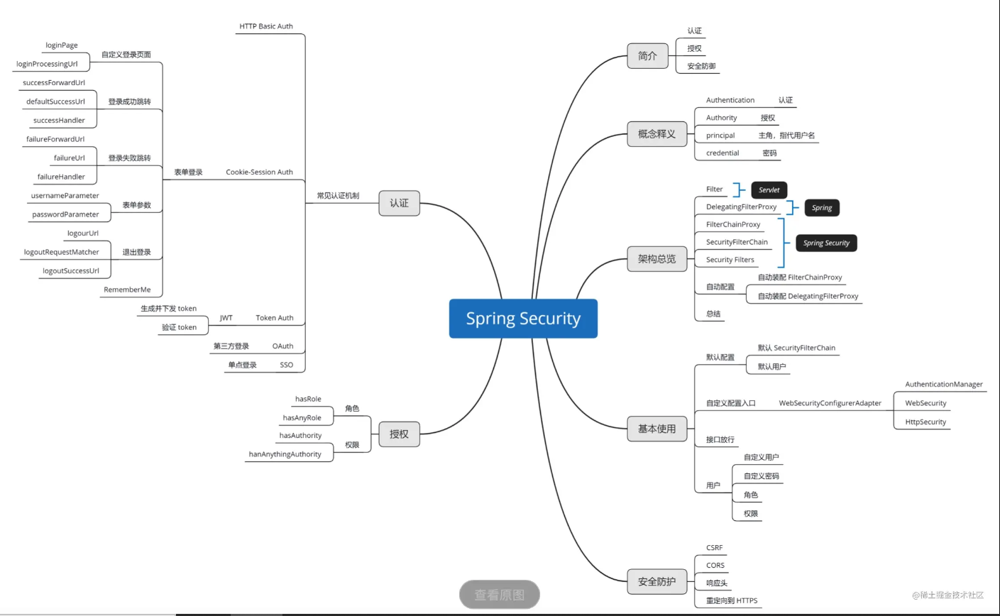
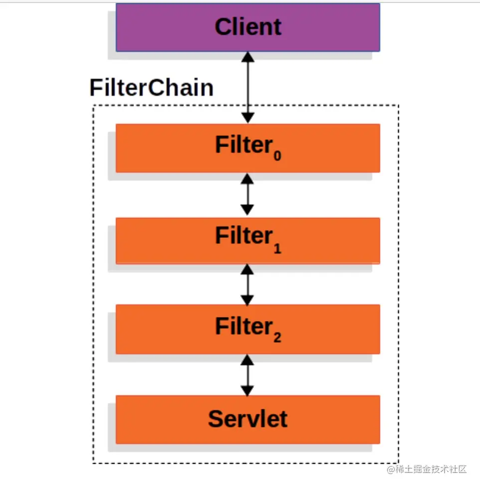
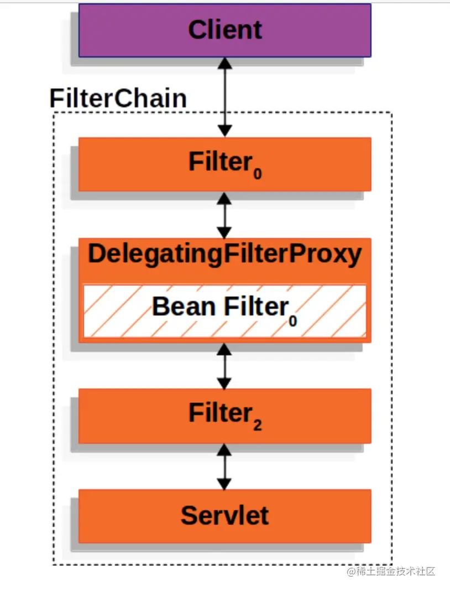
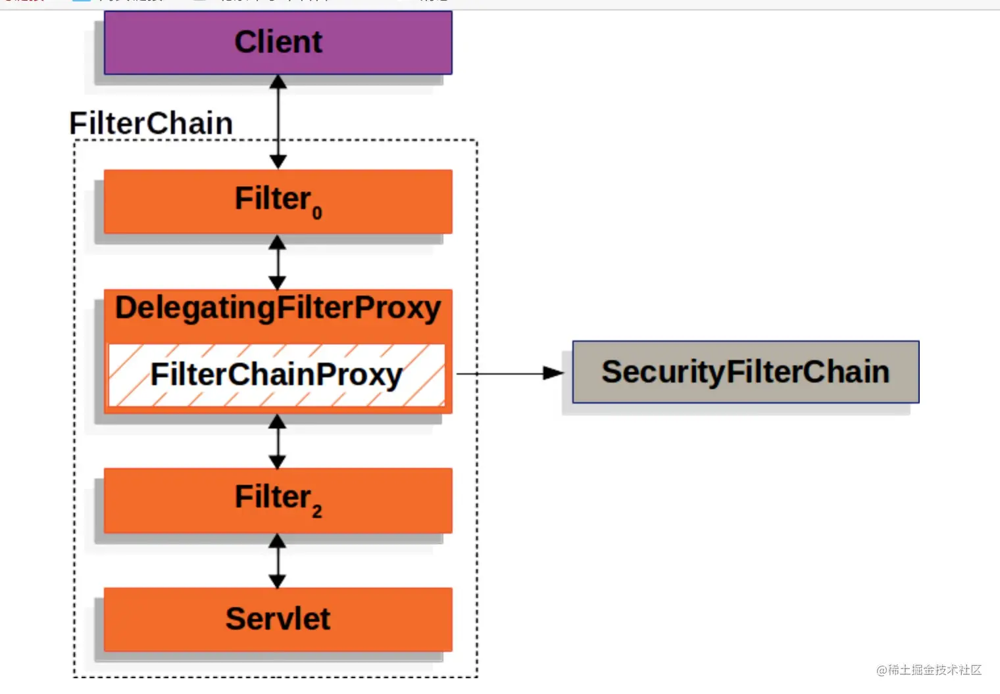
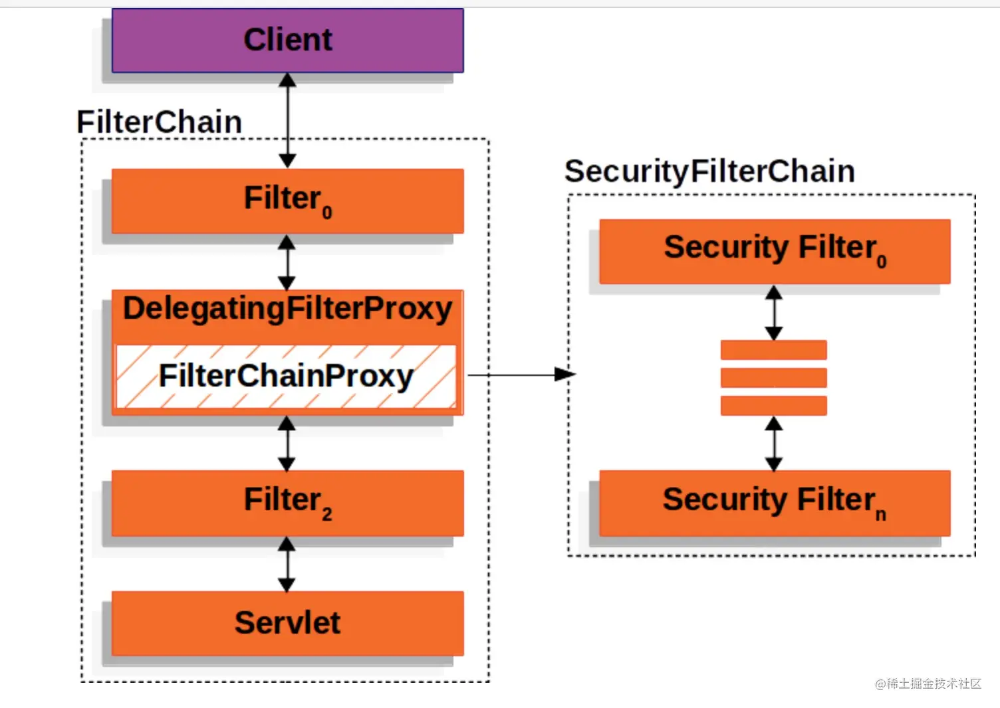
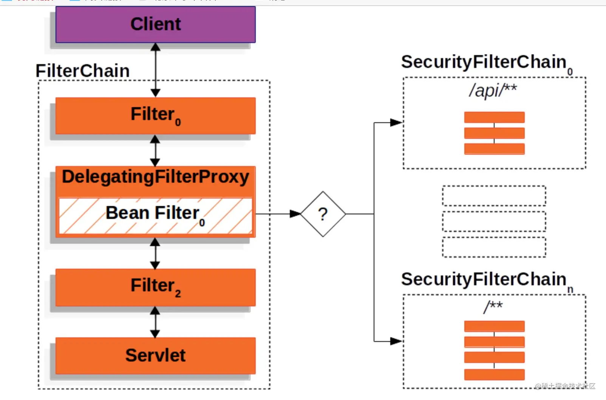
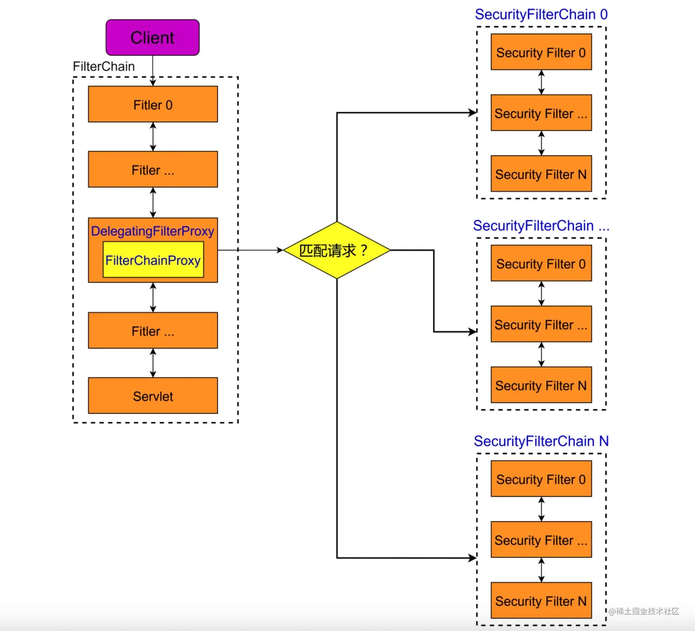

# 第二节 Spring Security核心功能和加载运行流程的原理分析

## 1、Spring Security 核心功能思维导图
> 
> 

## 2、Spring Security的简介说明
> Spring Security对认证、授权和常见漏洞保护提供了全方位支持。使用的版本为：Spring Security 5.5.2。

### 2.1 概念释义

> - **认证（Authentication）**：认证就是对试图访问资源的用户进行验证。
>>  认证的场景就是 登录 流程，常见的方式就是要求提供用户名和密码，当验证通过的时候，就可以执行授权操作。
> 
> - **授权（Authorization）**：授权就是对资源进行权限设置，只有用户具备相应权限才能访问。

### 2.2 技术原理
> Spring Security 在基于 **Servlet应用** 中，其底层是采用了 **Filter机制** 实现了对请求的认证、授权和漏洞防御等功能。
>
> 简单来说，可以理解为给Servlet设置一些Filters，这些 **Filters就构成了一个FilterChain**。

#### 2.2.1请求拦截处理
> 每次当请求进来时，首先会被FilterChain中的Filters 依次捕获得到，
> 每个Filter可以对请求进行一些预处理或对响应进行一些后置处理，最后才会到达Servlet。具体流程如下图所示：
> 

#### 2.2.1.1 FilterChain的实例对象
> FilterChain中的Filter主要有两方面作用：
> - 修改HttpServletRequest或HttpServletResponse，这样FilterChain后续的Filters 或Servlet得到的就是被修改后的请求和响应内容。
>
> - Filter可以拦截请求，自己作出响应，相当于断开了FilterChain，导致后续的Filters和Servlet无法接收到该请求。

##### 2.2.1.2 DelegatingFilterProxy
> 基于**Servlet规范**，我们可以为 **Servlet容器** 注入一些自定义Filters，
> 但是在 Spring 应用中，实现了Filter接口的Bean无法被 Servlet容器 感知到，
> 没有调用 **ServletContext#addFilter方法** 注册到FilterChain中。
> 
> Spring 提供了一个 **DelegatingFilterProxy代理类**，**DelegatingFilterProxy实现了Filter**，
> 因此 它可以被注入到FilterChain中，同时，当请求到来时，它会把请求转发到Spring容器中实现了Filter接口的Bean实体，
> 所以 DelegatingFilterProxy **桥接** 了 Servlet容器 和 Spring容器。
>
> DelegatingFilterProxy作用示意图大致如下所示：
> 
>
> 当请求到来时，**DelegatingFilterProxy会从 ApplicationContext 中获取 FilterBean 实体**，
> 然后将请求转发给到它，伪代码如下所示：
```
public void doFilter(ServletRequest request, ServletResponse response, FilterChain chain) {
    // Lazily get Filter that was registered as a Spring Bean
    // For the example in DelegatingFilterProxy delegate is an instance of Bean Filter0
    Filter delegate = getFilterBean(someBeanName);
    // delegate work to the Spring Bean
    delegate.doFilter(request, response);
}
```

##### 2.2.1.3 FilterChainProxy
> Spring容器中的Filters Bean实体可以注入到Servlet容器中的FilterChain功能，
> 基于此，**Spring Security** 向Spring容器提供了一个 **FilterChainProxy** Bean 实体，
> 该FilterChainProxy实现了Filter接口，因此，请求就会被FilterChainProxy捕获到，
> 这样 Spring Security 就可以开始工作了。

> 默认情况下，DelegatingFilterProxy从Spring容器中获取得到的就是FilterChainProxy实体，
> 而FilterChainProxy也是一个代理类，它最终会将请求转发到 Spring Security 提供的SecurityFilterChain中，
> 流程示意图如下所示：

> 注：FilterChainProxy就是 Spring Security 真正的入口起始点，调式代码时，将断点设置在FilterChainProxy#doFilter就可以追踪 Spring Security 完整调用流程。

##### 2.2.1.4 SecurityFilterChain
> SecurityFilterChain作用其实跟Servlet的FilterChain一样，同样维护了很多Filters，
> 这些Filters 是由Spring Security提供的，每个 Security Filter 都有不同的职能，
> 比如登录认证、CSRF防御...如下图所示：
> 
>
> 同时，**Spring Security 支持添加多个SecurityFilterChain**，
> 每个SecurityFilterChain负责不同的请求（比如依据请求地址进行区分），这样可以为不同的请求设置不同的认证规则。
> 其源码如下所示：
```java
public interface SecurityFilterChain {
    // 匹配请求
    boolean matches(HttpServletRequest request);
    // 获取该 SecurityFilterChain 中的所有 Filter
    List<Filter> getFilters();
}
```

> 具体来说，当请求到达FilterChainProxy时，其内部会根据当前请求匹配得到对应的SecurityFilterChain，
> 然后将请求依次转发给到该SecurityFilterChain中的所有 Security Filters。如下图所示：
> 

##### 2.2.1.5 Security Filters
> Spring Security 最终对请求进行处理的就是某个SecurityFilterChain中的 Security Filters，
> 这些Filter都设置为 Bean 注入到 Spring容器中，且这些Filters 的先后顺序很重要。
> 以下是 Spring Security 内置的完整 Security Filter 顺序列表：
```text
ChannelProcessingFilter：确保请求投递到要求渠道。
    最常见的使用场景就是指定哪些请求必须使用HTTPS 协议，哪些请求必须使用 HTTP 协议，哪些请求随便使用哪种协议均可。

WebAsyncManagerIntegrationFilter：集成SecurityContext到 Spring Web 异步请求机制中的WebAsyncManager。
    注：SecurityContext就是 安全上下文，主要职能就是用于存储用户认证的一些信息。

SecurityContextPersistenceFilter：在每次请求处理之前，从 Session
    （默认使用HttpSessionSecurityContextRepository）中获取SecurityContext，
    然后将其设置给到SecurityContextHolder；
    在请求结束后，就会将SecurityContextHolder中存储的SecurityContext重新保存到 Session 中，
    并且清除SecurityContextHolder中的SecurityContext。
    
    SecurityContextPersistenceFilter可以通过HttpSecurity#securityContext()及相关方法引入其配置对象SecurityContextConfigurer来进行配置。

HeaderWriterFilter：该过滤器可为响应添加一些响应头，
    比如添加X-Frame-Options，X-XSS-Protection和X-Content-Type-Options等响应头，让浏览器开启保护功能。
    HeaderWriterFilter可以通过HttpSecurity#headers()来定制。

CorsFilter：处理跨域资源共享（CORS）。
    CorsFilter可以通过HttpSecurity#cors()来定制。

CsrfFilter：处理跨站请求伪造(CSRF)。
    CsrfFilter可以通过HttpSecurity#csrf()来开启或关闭。在前后端分离项目中，不需要使用 CSRF。

LogoutFilter：处理退出登录请求。
    LogoutFilter可以通过HttpSecurity#logout()来定制退出逻辑。

OAuth2AuthorizationRequestRedirectFilter：用于构建 OAuth 2.0 认证请求，将用户请求重定向到该认证请求接口。
    注：该过滤器需要添加spring-security-oauth2等相关模块。

Saml2WebSsoAuthenticationRequestFilter：基于 SAML 的 SSO 单点登录认证请求过滤器。
    注：Saml2WebSsoAuthenticationRequestFilter需要添加 Spring Security SAML 模块。

X509AuthenticationFilter：X509 认证过滤器。
    X509AuthenticationFilter可以通过SecurityContext#X509()来启用和配置相关功能。

AbstractPreAuthenticatedProcessingFilter：认证预处理请求过滤器基类，
    其中认证主体已经由外部系统进行了身份验证。目的只是从传入请求中提取主体上的必要信息，而不是对它们进行身份验证。
    可以继承该类进行具体实现并通过HttpSecurity#addFilter方法
    来添加个性化的AbstractPreAuthenticatedProcessingFilter。

CasAuthenticationFilter：用于处理 CAS 单点登录认证。
    注： CasAuthenticationFilter需要添加 Spring Security CAS 模块。

OAuth2LoginAuthenticationFilter：OAuth2.0 登录认证过滤器。
    注： OAuth2LoginAuthenticationFilter需要添加spring-security-oauth2等相关模块。

Saml2WebSsoAuthenticationFilter：基于 SAML 的 SSO 单点登录认证过滤器。
    注：Saml2WebSsoAuthenticationFilter需要添加 Spring Security SAML 模块。

UsernamePasswordAuthenticationFilter：用于处理表单登录认证。
    默认处理接口为/login，表单必须提供两个参数：用户名 和 密码，默认的参数名(key)为username和password，
    可以通过usernameParameter和passwordParameter方法进行修改。
    
    UsernamePasswordAuthenticationFilter可以通过HttpSecurity#formLogin()及相关方法引入其配置对象FormLoginConfigurer来进行配置。

OpenIDAuthenticationFilter：基于 OpenID 认证协议的认证过滤器。

DefaultLoginPageGeneratingFilter：如果没有配置登录页面，那么就会默认采用该过滤器生成一个登录表单页面。
    注：默认的登录页面接口为/login
    DefaultLogoutPageGeneratingFilter：生成默认退出登录页面。
    注：默认的退出登录页面接口为/logout
    
ConcurrentSessionFilter：主要用来判断 Session 是否过期以及更新最新访问时间。该过滤器可能会被多次执行。

DigestAuthenticationFilter：用于处理 HTTP 头部显示的摘要式身份验证凭据。
    DigestAuthenticationFilter可以通过HttpSecurity#addFilter()来启用和配置相关功能。

BearerTokenAuthenticationFilter：处理 Token 认证。

BasicAuthenticationFilter：用于检测和处理 Http Baisc 认证。
    BasicAuthenticationFilter可以通过HttpSecurity#httpBasic()及相关方法引入其配置对象HttpBaiscConfigurer来进行配置。

RequestCacheAwareFilter：用于用户认证成功后，重新恢复因为登录被打断的请求。
    当匿名访问一个需要授权的资源时。会跳转到认证处理逻辑，此时请求被缓存。
    在认证逻辑处理完毕后，从缓存中获取最开始的资源请求进行再次请求。
    RequestCacheAwareFilter可以通过HttpSecurity#requestCache()及相关方法引入其配置对象RequestCacheConfigurer来进行配置。

SecurityContextHolderAwareRequestFilter：对请求对象进行包装，增加了一些安全相关方法。
    SecurityContextHolderAwareRequestFilter可以通过HttpSecurity#servletApi()及相关方法引入其配置对象ServletApiConfigurer来进行配置。

JaasApiIntegrationFilter：适用于 JAAS （Java 认证授权服务）。
    如果SecurityContextHolder中拥有的Authentication是一个JaasAuthenticationToken，
    那么该JaasApiIntegrationFilter将使用包含在JaasAuthenticationToken中的Subject继续执行FilterChain。

RememberMeAuthenticationFilter：当用户没有登录而直接访问资源时，从 cookie 里找出用户的信息，
    如果 Spring Security 能够识别出用户提供的 remember me cookie，
    用户将不必填写用户名和密码，而是直接登录进入系统。
    它先分析 SecurityContext 里有没有Authentication对象，如果有，则不做任何操作，直接跳到下一个过滤器；
    如果没有，则检查请求里有没有包含 remember-me 的 cookie 信息。
    如果有，则解析出 cookie 里的验证信息，判断是否有权限。

    RememberMeAuthenticationFilter可以通过HttpSecurity#rememberMe()及相关方法引入其配置对象RememberMeConfigurer来进行配置。

AnonymousAuthenticationFilter：匿名认证过滤器，检测SecurityContextHolder中是否存在Authentication对象，
    如果不存在，就生成一个匿名Authentication对象。
    AnonymousAuthenticationFilter可以通过HttpSecurity#anonymous()及相关方法引入其配置对象AnonymousConfigurer来进行配置。

OAuth2AuthorizationCodeGrantFilter：OAuth 2.0 授权码模式，用于处理 OAuth 2.0 授权码响应。

SessionManagementFilter：检测用户是否通过认证，如果已认证，就通过SessionAuthenticationStrategy进行 Session 相关管理操作。
    SessionManagementFilter可以通过HttpSecurity#sessionManagement()及相关方法引入其配置对象SessionManagementConfigurer来进行配置。

ExceptionTranslationFilter：可以用于捕获FilterChain上所有的异常，但只处理AccessDeniedException和AuthenticationException异常。

FilterSecurityInterceptor：对 web资源 进行一些安全保护操作。

SwitchUserFilter：主要用来作用户切换。
```


## 3、自动配置
> 
> 依据 Spring Boot 自动配置原理，其会自动加载spring-boot-autoconfigure.jar中
> /META-INF/spring.factories内键值org.springframework.boot.autoconfigure.EnableAutoConfiguration
> 指定的自动配置类。查看该文件，可以看到，与 Spring Security 相关的自动配置类有如下几个：
```
org.springframework.boot.autoconfigure.security.servlet.SecurityAutoConfiguration,                                      \
org.springframework.boot.autoconfigure.security.servlet.UserDetailsServiceAutoConfiguration,                            \
org.springframework.boot.autoconfigure.security.servlet.SecurityFilterAutoConfiguration,                                \
org.springframework.boot.autoconfigure.security.reactive.ReactiveSecurityAutoConfiguration,                             \
org.springframework.boot.autoconfigure.security.reactive.ReactiveUserDetailsServiceAutoConfiguration,                   \
org.springframework.boot.autoconfigure.security.rsocket.RSocketSecurityAutoConfiguration,                               \
org.springframework.boot.autoconfigure.security.saml2.Saml2RelyingPartyAutoConfiguration,                               \
org.springframework.boot.autoconfigure.security.oauth2.client.servlet.OAuth2ClientAutoConfiguration,                    \
org.springframework.boot.autoconfigure.security.oauth2.client.reactive.ReactiveOAuth2ClientAutoConfiguration,           \
org.springframework.boot.autoconfigure.security.oauth2.resource.servlet.OAuth2ResourceServerAutoConfiguration,          \
org.springframework.boot.autoconfigure.security.oauth2.resource.reactive.ReactiveOAuth2ResourceServerAutoConfiguration, \
```
> 每个配置类都为 Spring Security 注入不同的 Bean 到 Spring容器中。
>
> 这里我们着重介绍一下 **SecurityFilterAutoConfiguration** 和 **SecurityAutoConfiguration** 配置类，
因为这两个配置类会自动装配DelegatingFilterProxy和FilterChain到 Spring容器 中。

### 3.1 自动装配FilterChainProxy

> 下面介绍下 **配置类SecurityAutoConfiguration**，具体如下：
```
@Configuration(proxyBeanMethods = false)
@ConditionalOnClass(DefaultAuthenticationEventPublisher.class)
@EnableConfigurationProperties(SecurityProperties.class)
@Import({ SpringBootWebSecurityConfiguration.class, WebSecurityEnablerConfiguration.class,
        SecurityDataConfiguration.class })
public class SecurityAutoConfiguration {
    @Bean
    @ConditionalOnMissingBean(AuthenticationEventPublisher.class)
    public DefaultAuthenticationEventPublisher authenticationEventPublisher(ApplicationEventPublisher publisher) {
        return new DefaultAuthenticationEventPublisher(publisher);
    }
}
```
> SecurityAutoConfiguration导入了3个配置类，注重看 **WebSecurityEnablerConfiguration**。
> 查看WebSecurityEnablerConfiguration配置类，其源码如下：
```
@Configuration(proxyBeanMethods = false)
@ConditionalOnMissingBean(name = "springSecurityFilterChain")
@ConditionalOnClass(EnableWebSecurity.class)
@ConditionalOnWebApplication(type = ConditionalOnWebApplication.Type.SERVLET)
@EnableWebSecurity
class WebSecurityEnablerConfiguration {
}
```
> 当 Spring容器 中没有名称为 **springSecurityFilterChain** 的 Bean 等条件时，就会加载该配置类，
> 此时 **@EnableWebSecurity注解生效**：
```
@Retention(RetentionPolicy.RUNTIME)
@Target(ElementType.TYPE)
@Documented
@Import({ WebSecurityConfiguration.class, SpringWebMvcImportSelector.class, OAuth2ImportSelector.class,
        HttpSecurityConfiguration.class })
@EnableGlobalAuthentication
@Configuration
public @interface EnableWebSecurity {
    boolean debug() default false;
}
```
> 注解@EnableWebSecurity又导入了4个配置类，这里着重看下 **WebSecurityConfiguration**：
```
@Configuration(proxyBeanMethods = false)
public class WebSecurityConfiguration implements ImportAware, BeanClassLoaderAware {
    ...
    /**
     * Creates the Spring Security Filter Chain
     * @return the {@link Filter} that represents the security filter chain
     * @throws Exception
     */
    @Bean(name = "springSecurityFilterChain")
    public Filter springSecurityFilterChain() throws Exception {
        ...
        return this.webSecurity.build();
    }
    ...
}
```
> 可以看到，WebSecurityConfiguration#springSecurityFilterChain()最终生成了一个名称为
> **springSecurityFilterChain**的 Bean 实体，该 Bean 的实际类型其实为**FilterChainProxy**，是由WebSecurity#build()方法创建的。
>
> **综上，SecurityAutoConfiguration配置类生成了很多 Bean 实体，
> 其中最重要的一个是名称为springSecurityFilterChain的FilterChainProxy对象。**

### 3.2 自动装配DelegatingFilterProxy

> 下面介绍下 **配置类SecurityFilterAutoConfiguration**，其源码如下所示：
```
@Configuration(proxyBeanMethods = false)
@ConditionalOnWebApplication(type = Type.SERVLET)
@EnableConfigurationProperties(SecurityProperties.class)
@ConditionalOnClass({ AbstractSecurityWebApplicationInitializer.class, SessionCreationPolicy.class })
@AutoConfigureAfter(SecurityAutoConfiguration.class) // 须先加载 SecurityAutoConfiguration
public class SecurityFilterAutoConfiguration {
    ...
    @Bean
    @ConditionalOnBean(name = “springSecurityFilterChain”)
    public DelegatingFilterProxyRegistrationBean securityFilterChainRegistration(
            SecurityProperties securityProperties) {
            ...
    }
    ...
}
```
> 可以看到，**要加载SecurityFilterAutoConfiguration前，必须先加载配置类SecurityAutoConfiguration**，
> 该配置类前面已经详细介绍了，主要功能就是注入了一个名称为springSecurityFilterChain的 Bean，
> 因此，此时SecurityFilterAutoConfiguration#securityFilterChainRegistration就会生效，
> 最终生成一个DelegatingFilterProxyRegistrationBean实体。

> DelegatingFilterProxyRegistrationBean实现了ServletContextInitializer接口，
> 当系统执行ServletWebServerApplicationContext.selfInitialize()进行初始化时，
> 会依次调用到：
>   RegistrationBean.onStartup() --> DynamicRegistrationBean.register() --> AbstractFilterRegistrationBean.addRegistration()，
> 其中，AbstractFilterRegistrationBean#addRegistration()源码如下：
```
protected Dynamic addRegistration(String description, ServletContext servletContext) {
    Filter filter = this.getFilter();
    return servletContext.addFilter(this.getOrDeduceName(filter), filter);
}
```
> this.getFilter()实际调用的是DelegatingFilterProxyRegistrationBean#getFilter()方法，
> 其内部会创建一个DelegatingFilterProxy实例并返回，源码如下：
```
public DelegatingFilterProxy getFilter() {
    return new DelegatingFilterProxy(this.targetBeanName, this.getWebApplicationContext()) {
        protected void initFilterBean() throws ServletException {
        }
    };
}
```
> 因此，AbstractFilterRegistrationBean#addRegistration()最终就是: 
> 通过ServletContext#addFilter将一个DelegatingFilterProxy实例注入到 Servlet 的FilterChain中。

> 以上，就是 Spring Boot 中自动装配 Spring Security 相关配置源码分析，更加详细内容，可参考：

## 4、总结
> Spring Security 作用机制大致如下：
>
> - 注册标准Filter：
>>  首先，Spring 会自动注入一个DelegatingFilterProxy到 Servlet 的FilterChain中。
> - 请求转发到 Spring Security：
>>  当请求到来时，DelegatingFilterProxy就会自动在 Spring容器 中搜索名称为springSecurityFilterChain的Filter实体，其实际类型为FilterChainProxy。DelegatingFilterProxy最终会将请求转发给到FilterChainProxy。
> - 找到匹配请求处理的SecurityFilterChain：
>>  FilterChainProxy内部维护了一系列SecurityFilterChains，他会依据请求内容找到对应处理该请求的SecurityFilterChain。
> - 请求处理：
>>  找到能处理请求的第一个SecurityFilterChain后，就会遍历该SecurityFilterChain内部维护的一系列Filters，依次让这些 Security Filter 处理该请求，完成认证、授权等功能。

### Spring Security 架构简单示意图
> 
> 

版权声明：本文为CSDN博主「Java小海.」的原创文章，遵循CC 4.0 BY-SA版权协议，转载请附上原文出处链接及本声明。
原文链接：https://blog.csdn.net/q1472750149/article/details/122179388