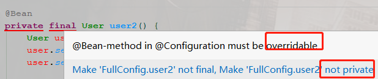

# 第01节 Spring的@Configuration配置类-Full和Lite模式

## 分析原由
> 官方称这两种模式分别叫：Full @Configuration和lite @Bean mode，
> 口语上我习惯把它称为Spring配置的Full模式和Lite模式更易沟通。
>
> 的确，我很简单的“调研”了一下，知晓Spring配置中Lite模式和Full模式的几乎没有（或者说真的很少吧）。
> 按照我之前的理论，大多人都不知道的技术（知识点）那肯定是不流行的。
> 但是：不流行不代表不重要，不流行不代表不值钱，毕竟高薪往往只有少数人才能拥有。
>
> **版本约定**
> 本文内容若没做特殊说明，均基于以下版本：
> 
> - JDK：1.8
> - Spring Framework：5.2.2.RELEASE

## 正文
> 最初的Spring只支持xml方式配置Bean，
> 从Spring 3.0起支持了一种更优的方式：基于Java类的配置方式，这一下子让我们Javaer可以从标签语法里解放了出来。
> 毕竟作为Java程序员，我们擅长的是写Java类，而非用标签语言去写xml文件。
>
> 我对Spring配置的Full/Lite模式的关注和记忆深刻，
> 源自于一个小小故事：某一年我在看公司的项目时发现，数据源配置类里有如下一段配置代码：
```
@Configuration
public class DataSourceConfig {

	...
	@Bean
    public DataSource dataSource() {
    	...
        return dataSource;
    }
    @Bean(name = "transactionManager")
    public DataSourceTransactionManager transactionManager() {
        return new DataSourceTransactionManager(dataSource());
    }
	...
}
```

> 作为当时还是Java萌新的我，非常的费解。
> 自然的对此段代码产生了较大的好奇（其实是质疑）：
> 在准备DataSourceTransactionManager这个Bean时调用了dataSource()方法，
> 根据我“非常扎实”的JavaSE基础知识，它肯定会重新走一遍dataSource()方法，从而产生一个新的数据源实例，
> 那么你的事务管理器管理的不就是一个“全新数据源”麽？谈何事务呢？

> 为了验证我的猜想，我把断点打到dataSource()方法内部开始调试，但让我“失望”的是：此方法并没有执行两次。
> 这在当时是震惊了我的，甚至一度怀疑自己引以为豪的Java基础了。
> 所以我四处询问，希望得到一个“解释”，但奈何，问了好几圈，那会没有一人能给我一个合理的说法，只知道那么用是没有问题的。

> 很明显，现在再回头来看当时的这个质疑是显得有些“无知”的，这个“难题”困扰了我很久，
> 直到我前2年开始深度研究Spring源码才让此难题迎刃而解，当时那种豁然开朗的感觉真好呀。

## 基本概念
> 关于配置类的核心概念，在这里先予以解释。
>
> **@Configuration**和**@Bean**
>
> Spring新的配置体系中最为重要的构件是：@Configuration标注的类，@Bean标注的方法。
```java
// @since 3.0
@Target(ElementType.TYPE)
@Retention(RetentionPolicy.RUNTIME)
@Documented
@Component
public @interface Configuration {

	@AliasFor(annotation = Component.class)
	String value() default "";
	// @since 5.2
	boolean proxyBeanMethods() default true;

}
```
> 用@Configuration注解标注的类表明其主要目的是作为bean定义的源。
>
> 此外，@Configuration类允许通过调用同一类中的其他@Bean method方法来定义bean之间的依赖关系（下有详解）。
```
// @since 3.0
@Target({ElementType.METHOD, ElementType.ANNOTATION_TYPE})
@Retention(RetentionPolicy.RUNTIME)
@Documented
public @interface Bean {

	@AliasFor("name")
	String[] value() default {};
	@AliasFor("value")
	String[] name() default {};
	@Deprecated
	Autowire autowire() default Autowire.NO;
	// @since 5.1
	boolean autowireCandidate() default true;
	String initMethod() default "";
	String destroyMethod() default AbstractBeanDefinition.INFER_METHOD;

}
```
> @Bean注解标注在方法上，用于指示方法实例化、配置和初始化要由Spring IoC容器管理的新对象。
> 
> 对于熟悉Spring的<beans/>XML配置的人来说，@Bean注解的作用与<bean/>元素相同。
> 您可以对任何Spring的@Component组件使用@Bean注释的方法代替（注意：这是理论上，实际上比如使用@Controller标注的组件就不能直接使用它代替）。
>
> 需要注意的是，通常来说，我们均会把@Bean标注的方法写在@Configuration标注的类里面来配合使用。
```
简单粗暴理解：@Configuration标注的类等同于一个xml文件，@Bean标注的方法等同于xml文件里的一个<bean/>标签
```

使用举例
```java
@Configuration
public class AppConfig {

    @Bean
    public User user(){
        User user = new User();
        user.setName("A哥");
        user.setAge(18);
        return user;
    }

}
public class Application {

    public static void main(String[] args) {
        ApplicationContext context = new AnnotationConfigApplicationContext(AppConfig.class);
 
        User user = context.getBean(User.class);
        System.out.println(user.getClass());
        System.out.println(user);
    }
}
```
输出：
```text
class com.yourbatman.fullliteconfig.User
User{name='A哥', age=18}
```

## Full模式和Lite模式
> Full模式和Lite模式均是针对于Spring配置类而言的，和xml配置文件无关。
> 值得注意的是：判断是Full模式 or Lite模式的前提是，首先你得是个容器组件。
> 至于一个实例是如何“晋升”成为容器组件的，可以用注解也可以没有注解，本文就不展开讨论了，这属于Spring的基础知识。

### Lite模式
> 当@Bean方法在没有使用@Configuration注释的类中声明时，它们被称为在Lite模式下处理。
> 它包括：在@Component中声明的@Bean方法，甚至只是在一个非常普通的类中声明的Bean方法，都被认为是Lite版的配置类。
> @Bean方法是一种通用的工厂方法（factory-method）机制。
>
> 和Full模式的@Configuration不同，Lite模式的@Bean方法不能声明Bean之间的依赖关系。
> 因此，这样的@Bean方法不应该调用其他@Bean方法。
> 每个这样的方法实际上只是一个特定Bean引用的工厂方法(factory-method)，没有任何特殊的运行时语义。

#### 何时为Lite模式
> 官方定义为：在**没有标注@Configuration的类里面有@Bean方法**就称为Lite模式的配置。
> 透过源码再看这个定义是不完全正确的，而应该是有如下case均认为是Lite模式的配置类：
>> 1) 类上标注有@Component注解
>> 2) 类上标注有@ComponentScan注解
>> 3) 类上标注有@Import注解
>> 4) 类上标注有@ImportResource注解
>> 5) 若类上没有任何注解，但类内存在@Bean方法
>
> 以上case的前提均是类上没有被标注@Configuration，在Spring 5.2之后新增了一种case也算作Lite模式：
>> 标注有@Configuration(proxyBeanMethods = false)，注意：此值默认是true哦，需要显示改为false才算是Lite模式
>
> 细心的你会发现，自Spring5.2（对应Spring Boot 2.2.0）开始，内置的几乎所有的@Configuration配置类都被修改为了@Configuration(proxyBeanMethods = false)，目的何为？
> 答：以此来降低启动时间，为Cloud Native继续做准备。

#### 优缺点
> **优点：**
>> - 运行时不再需要给对应类生成CGLIB子类，提高了运行性能，降低了启动时间
>> - 可以该配置类当作一个普通类使用喽：也就是说@Bean方法 可以是private、可以是final
>
> **缺点：**
>> - 不能声明@Bean之间的依赖，也就是说不能通过方法调用来依赖其它Bean
>> （其实这个缺点还好，很容易用其它方式“弥补”，比如：把依赖Bean放进方法入参里即可）
>

**代码示例**

主配置类：
```java
@ComponentScan("com.yourbatman.fullliteconfig.liteconfig")
@Configuration
public class AppConfig {
}
```
准备一个Lite模式的配置：
```java
@Component
// @Configuration(proxyBeanMethods = false) // 这样也是Lite模式
public class LiteConfig {

    @Bean
    public User user() {
        User user = new User();
        user.setName("A哥-lite");
        user.setAge(18);
        return user;
    }
    
    @Bean
    private final User user2() {
        User user = new User();
        user.setName("A哥-lite2");
        user.setAge(18);
 
        // 模拟依赖于user实例  看看是否是同一实例
        System.out.println(System.identityHashCode(user()));
        System.out.println(System.identityHashCode(user()));
 
        return user;
    }
 
    public static class InnerConfig {
 
        @Bean
        // private final User userInner() { // 只在lite模式下才好使
        public User userInner() {
            User user = new User();
            user.setName("A哥-lite-inner");
            user.setAge(18);
            return user;
        }
    }
}
```
> 测试用例：
```java
public class Application {

    public static void main(String[] args) {
        ApplicationContext context = new AnnotationConfigApplicationContext(AppConfig.class);
 
        // 配置类情况
        System.out.println(context.getBean(LiteConfig.class).getClass());
        System.out.println(context.getBean(LiteConfig.InnerConfig.class).getClass());
 
        String[] beanNames = context.getBeanNamesForType(User.class);
        for (String beanName : beanNames) {
            User user = context.getBean(beanName, User.class);
            System.out.println("beanName:" + beanName);
            System.out.println(user.getClass());
            System.out.println(user);
            System.out.println("------------------------");
        }
    }
}
```
结果输出：
```text
1100767002
313540687
class com.yourbatman.fullliteconfig.liteconfig.LiteConfig
class com.yourbatman.fullliteconfig.liteconfig.LiteConfig$InnerConfig
beanName:userInner
class com.yourbatman.fullliteconfig.User
User{name='A哥-lite-inner', age=18}
------------------------
beanName:user
class com.yourbatman.fullliteconfig.User
User{name='A哥-lite', age=18}
------------------------
beanName:user2
class com.yourbatman.fullliteconfig.User
User{name='A哥-lite2', age=18}
------------------------
```

#### 小总结
> - 该模式下，配置类本身不会被CGLIB增强，放进IoC容器内的就是本尊
> - 该模式下，对于内部类是没有限制的：可以是Full模式或者Lite模式
> - 该模式下，配置类内部不能通过方法调用来处理依赖，否则每次生成的都是一个新实例而并非IoC容器内的单例
> - 该模式下，配置类就是一普通类嘛，所以@Bean方法可以使用private/final等进行修饰（static自然也是阔仪的）

### Full模式
> 在常见的场景中，@Bean方法都会在标注有@Configuration的类中声明，以确保总是使用“Full模式”，
> 这么一来，交叉方法引用会被重定向到容器的生命周期管理，所以就可以更方便的管理Bean依赖。
>
#### 何时为Full模式
> 标注有@Configuration注解的类被称为full模式的配置类。自Spring5.2后这句话改为下面这样我觉得更为精确些：
>> - 标注有@Configuration或者@Configuration(proxyBeanMethods = true)的类被称为Full模式的配置类
>> （当然喽，proxyBeanMethods属性的默认值是true，所以一般需要Full模式我们只需要标个注解即可）

#### 优缺点
> **优点：**
>> 可以支持通过常规Java调用相同类的@Bean方法而保证是容器内的Bean，
>> 这有效规避了在“Lite模式”下操作时难以跟踪的细微错误。特别对于萌新程序员，这个特点很有意义
> **缺点：**
>> 运行时会给该类生成一个CGLIB子类放进容器，有一定的性能、时间开销
>> （这个开销在Spring Boot这种拥有大量配置类的情况下是不容忽视的，
>> 这也是为何Spring 5.2新增了proxyBeanMethods属性的最直接原因）
>> 正因为被代理了，所以@Bean方法 不可以是private、不可以是final
> 代码示例
> 主配置：
```java
@ComponentScan("com.yourbatman.fullliteconfig.fullconfig")
@Configuration
public class AppConfig {
}
```
准备一个Full模式的配置：
```java
@Configuration
public class FullConfig {

    @Bean
    public User user() {
        User user = new User();
        user.setName("A哥-lite");
        user.setAge(18);
        return user;
    }
    
    @Bean
    protected User user2() {
        User user = new User();
        user.setName("A哥-lite2");
        user.setAge(18);
 
        // 模拟依赖于user实例  看看是否是同一实例
        System.out.println(System.identityHashCode(user()));
        System.out.println(System.identityHashCode(user()));
 
        return user;
    }
 
    public static class InnerConfig {
 
        @Bean
        // private final User userInner() { // 只在lite模式下才好使
        public User userInner() {
            User user = new User();
            user.setName("A哥-lite-inner");
            user.setAge(18);
            return user;
        }
    }
}
```
测试用例：
```java
public class Application {

    public static void main(String[] args) {
        ApplicationContext context = new AnnotationConfigApplicationContext(AppConfig.class);
 
        // 配置类情况
        System.out.println(context.getBean(FullConfig.class).getClass());
        System.out.println(context.getBean(FullConfig.InnerConfig.class).getClass());
 
        String[] beanNames = context.getBeanNamesForType(User.class);
        for (String beanName : beanNames) {
            User user = context.getBean(beanName, User.class);
            System.out.println("beanName:" + beanName);
            System.out.println(user.getClass());
            System.out.println(user);
            System.out.println("------------------------");
        }
    }
}
```
结果输出：
```text
550668305
550668305
class com.yourbatman.fullliteconfig.fullconfig.FullConfig$$EnhancerBySpringCGLIB$$70a94a63
class com.yourbatman.fullliteconfig.fullconfig.FullConfig$InnerConfig
beanName:userInner
class com.yourbatman.fullliteconfig.User
User{name='A哥-lite-inner', age=18}
------------------------
beanName:user
class com.yourbatman.fullliteconfig.User
User{name='A哥-lite', age=18}
------------------------
beanName:user2
class com.yourbatman.fullliteconfig.User
User{name='A哥-lite2', age=18}
------------------------
```
#### 小总结
> - 该模式下，配置类会被CGLIB增强(生成代理对象)，放进IoC容器内的是代理
> - 该模式下，对于内部类是没有限制的：可以是Full模式或者Lite模式
> - 该模式下，配置类内部可以通过方法调用来处理依赖，并且能够保证是同一个实例，都指向IoC内的那个单例
> - 该模式下，@Bean方法不能被private/final等进行修饰（很简单，因为方法需要被复写嘛，所以不能私有和final。defualt/protected/public都可以哦），否则启动报错（其实IDEA编译器在编译器就提示可以提示你了）：
>
> 在这里插入图片描述
> 
> 
```text
Exception in thread "main" org.springframework.beans.factory.parsing.BeanDefinitionParsingException: Configuration problem: @Bean method 'user2' must not be private or final; change the method's modifiers to continue
Offending resource: class path resource [com/yourbatman/fullliteconfig/fullconfig/FullConfig.class]
at org.springframework.beans.factory.parsing.FailFastProblemReporter.error(FailFastProblemReporter.java:72)
at org.springframework.context.annotation.BeanMethod.validate(BeanMethod.java:50)
at org.springframework.context.annotation.ConfigurationClass.validate(ConfigurationClass.java:220)
at org.springframework.context.annotation.ConfigurationClassParser.validate(ConfigurationClassParser.java:211)
at org.springframework.context.annotation.ConfigurationClassPostProcessor.processConfigBeanDefinitions(ConfigurationClassPostProcessor.java:326)
at org.springframework.context.annotation.ConfigurationClassPostProcessor.postProcessBeanDefinitionRegistry(ConfigurationClassPostProcessor.java:242)
at org.springframework.context.support.PostProcessorRegistrationDelegate.invokeBeanDefinitionRegistryPostProcessors(PostProcessorRegistrationDelegate.java:275)
at org.springframework.context.support.PostProcessorRegistrationDelegate.invokeBeanFactoryPostProcessors(PostProcessorRegistrationDelegate.java:95)
at org.springframework.context.support.AbstractApplicationContext.invokeBeanFactoryPostProcessors(AbstractApplicationContext.java:706)
at org.springframework.context.support.AbstractApplicationContext.refresh(AbstractApplicationContext.java:532)
at org.springframework.context.annotation.AnnotationConfigApplicationContext.<init>(AnnotationConfigApplicationContext.java:89)
at com.yourbatman.fullliteconfig.Application.main(Application.java:11)
```

## 使用建议
> 了解了Spring配置类的Full模式和Lite模式，那么在工作中我该如何使用呢？这里A哥给出使用建议，仅供参考：
> 
> 如果是在公司的业务功能/服务上做开发，使用Full模式
> 
> 如果你是个容器开发者，或者你在开发中间件、通用组件等，那么使用Lite模式是一种更被推荐的方式，它对Cloud Native更为友好

## 思考题？
> 通过new AnnotationConfigApplicationContext(AppConfig.class)直接放进去的类，它会成为一个IoC的组件吗？
> 若会，那么它是Full模式 or Lite模式呢？是个固定的结果还是也和其标注的注解有关呢？
>
> 本思考题不难，自己试验一把便知，建议多动手~

## 总结
> 本文结合代码示例阐述了Spring配置中Full模式和Lite模式，以及各自的定义和优缺点。
> 对于一般的小伙伴，掌握本文就够用了，并且足够你面试中吹x。
> 但A哥系列文章一般不止于“表面”嘛，下篇文章将从原理层面告诉你Spring是如何来巧妙的处理这两种模式的，
> 特别是会结合Spring 5.2.0新特性，以及对比Spring 5.2.0的实现和之前版本有何不同，你课订阅我的公众号保持关注。