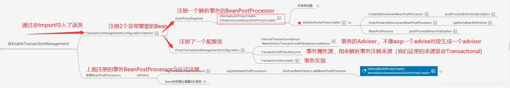

# 第02节 spring事务的原理

## 流程简介

Spring的事务 和 Spring的Aop，他们之间的套路非常相似，都是由以下三步组成：

> 1：Spring boot 项目启动，进行事务自动注册时，
>  通过@Import注册一个创建动态代理的bean的后置处理器 和 BeanFactoryTransactionAttributeSourceAdvisor、
>  TransactionAttributeSource、TransactionInterceptor等处理事务相关的bean;
>
> 2：在创建bean时，通过bean后置处理器的postProcessBeforeInstantistion方法找到@Trantional注解标注的方法，
>  并存入缓存，这点与AOP逻辑类似;
> 
> 3：创建动态代理，在bean后置处理器的postProcessAfterInstantistion方法中与当前正在创建的bean进行匹配，
> 如果bean中的方法或者类上有@Trantional注解，则为其创建动态代理！
> 
> 4：当调用带有 @Transactional注解 的方法或类时， 会进入TransactionInterceptor中，触发代理逻辑。
> 会先开启事务，然后分别处理嵌套事务和单一事务，以及两种事务的各种传播行为！如果抛异常则回滚方法，无异常则提交事务！
>

下面就一一介绍这三步操作，在Spring事务中的实现。

## 开启事务

从配置类查看事务源码，配置类如下：
```java
@EnableTransactionManagement //开启事务
@EnableAspectJAutoProxy(exposeProxy = true) //开启Aop
@ComponentScan(basePackages = {"com.**"})  //包扫描
public class MainConfig {

	//使用@EnableTransactionManagement注解前，
	//请务必保证你已经配置了至少一个PlatformTransactionManager的Bean，否则会报错。
    @Bean
    public PlatformTransactionManager transactionManager(DataSource dataSource) {
        return new DataSourceTransactionManager(dataSource);
    }

}
```

## 注册bean的后置处理器和相关bean对象,封装Advisor

由 @EnableTransactionManagement 进入源码，
通过 @Import注解 帮我们导入了 事务组件TransactionManagementConfigurationSelector，在容器初始化的时候注册。
```
  /**
   * @Import注解可以为我们容器中导入组件--->TransactionManagementConfigurationSelector
   */
  @Import(TransactionManagementConfigurationSelector.class)
```

@Import导入的组件会在Spring应用启动时，在**refresh()方法**中的invokeBeanFactoryPostProcessors中注册，如下：
```
  // 调用我们的bean工厂的后置处理器.
  invokeBeanFactoryPostProcessors(beanFactory);
```

TransactionManagementConfigurationSelector 代码如下：
```
public class TransactionManagementConfigurationSelector 
    extends AdviceModeImportSelector<EnableTransactionManagement> {

	/**
	 * 在springioc容器中加载bean定义的时候会回调我们的selectImports方法
	 * 方法的返回值是我们需要导入类的全类名路径.然后这个类就会被加载到容器中
	 */
	@Override
	protected String[] selectImports(AdviceMode adviceMode) {
		switch (adviceMode) {
			/*
			 * PROXY：jdk代理默认使用这个
			 * 为我们的容器中导入了二个组件 一个是AutoProxyRegistrar
			 * 一个是ProxyTransactionManagementConfiguration
			 */
			case PROXY:
				return new String[] {
				        AutoProxyRegistrar.class.getName(),
						ProxyTransactionManagementConfiguration.class.getName()
					};
						
			// ASPECTJ：这个需要使用AspectJ的编译器，麻烦，一般不使用
			case ASPECTJ:
				return new String[] {
						TransactionManagementConfigUtils.TRANSACTION_ASPECT_CONFIGURATION_CLASS_NAME
					};
			default:
				return null;
		}
	}
}
```

在TransactionManagementConfigurationSelector组件中，默认case的是PROXY，
它给我们容器注册了两个组件，
    一个是AutoProxyRegistrar，
    另一个是ProxyTransactionManagementConfiguration，
这两个组件非常重要，下面一一来介绍：

1)：**AutoProxyRegistrar**：作用就是向Spring容器注入了一个创建动态代理的bean的后置处理器 （这个事务的bean的后置处理器只针对内部的类起作用），
我们已经知道，Aop也会帮我们创建动态代理的bean的后置处理器。
那么问题来了，如果一个系统同时用到了 事务 和 Aop，这样是不是就会注册两个bean的后置处理器？创建两套动态代理？ 
答案肯定是不会的！带着这个问题，我们看一下事务的源码是怎么处理的。
类图如下：

```
	//事务调用这个方法注册bean的后置处理器（由AutoProxyRegistrar进入）
	@Nullable
	public static BeanDefinition registerAutoProxyCreatorIfNecessary(
			BeanDefinitionRegistry registry, @Nullable Object source) {
		return registerOrEscalateApcAsRequired(InfrastructureAdvisorAutoProxyCreator.class, registry, source);
	}

	//Aop调用这个方法注册bean的后置处理器
	@Nullable
	public static BeanDefinition registerAspectJAutoProxyCreatorIfNecessary(
			BeanDefinitionRegistry registry, @Nullable Object source) {
		return registerOrEscalateApcAsRequired(AspectJAwareAdvisorAutoProxyCreator.class, registry, source);
	}
```

可以看到，两个方法都调用了**registerOrEscalateApcAsRequired**方法，
进去一探究竟，如何避免事务和Aop同时存在从而对一个bean创建多个动态代理呢？
答案就是优先级覆盖，事务的优先级低于Aop，如果同时存在，Aop会覆盖事务注册的bean的后置处理器.
```
	private static BeanDefinition registerOrEscalateApcAsRequired(
			Class<?> cls, BeanDefinitionRegistry registry, @Nullable Object source) {

		Assert.notNull(registry, "BeanDefinitionRegistry must not be null");

		//因为事务和Aop都是一样的名字，所以内部会根据优先级覆盖beanClass
		if (registry.containsBeanDefinition(AUTO_PROXY_CREATOR_BEAN_NAME)) {
			BeanDefinition apcDefinition = registry.getBeanDefinition(AUTO_PROXY_CREATOR_BEAN_NAME);
			if (!cls.getName().equals(apcDefinition.getBeanClassName())) {
				//当同时有事务和Aop，两者都会创建bean的后置处理器
				//为了防止创建两个，在内部进行了优先级覆盖
				//事务优先级为 1, Aop的优先级为 3
				int currentPriority = findPriorityForClass(apcDefinition.getBeanClassName());
				int requiredPriority = findPriorityForClass(cls);
				//比较优先级，此时Aop会覆盖事务
				if (currentPriority < requiredPriority) {
					apcDefinition.setBeanClassName(cls.getName());
				}
			}
			return null;
		}

		RootBeanDefinition beanDefinition = new RootBeanDefinition(cls);
		beanDefinition.setSource(source);
		beanDefinition.getPropertyValues().add("order", Ordered.HIGHEST_PRECEDENCE);
		beanDefinition.setRole(BeanDefinition.ROLE_INFRASTRUCTURE);
		registry.registerBeanDefinition(AUTO_PROXY_CREATOR_BEAN_NAME, beanDefinition);
		return beanDefinition;
	}
```

2)：**ProxyTransactionManagementConfiguration**: 它是一个@Configuration，给容器中注册了三个bean对象

I) BeanFactoryTransactionAttributeSourceAdvisor：事务的Advisor，封装了事务的切面信息，
与Aop不同的是，Aop需要自定义切面逻辑，然后调用AspectJ来解析切面封装成Advisor。
而事务不同，Spring内部帮我们封装好事务的逻辑，连Advisor在这里都直接帮我们设置好了。
```
@Bean(name = TransactionManagementConfigUtils.TRANSACTION_ADVISOR_BEAN_NAME)
@Role(BeanDefinition.ROLE_INFRASTRUCTURE)
public BeanFactoryTransactionAttributeSourceAdvisor transactionAdvisor() {
    BeanFactoryTransactionAttributeSourceAdvisor advisor = 
        new BeanFactoryTransactionAttributeSourceAdvisor();

	//设置事务的事务属性源AttributeSource，解析@Transactional注解，类似于切点
	advisor.setTransactionAttributeSource(transactionAttributeSource());
	//设置事务的通知逻辑
	advisor.setAdvice(transactionInterceptor());
	
	if (this.enableTx != null) {
		advisor.setOrder(this.enableTx.<Integer>getNumber("order"));
	}
	return advisor;
}
```

II) TransactionAttributeSource：获取事务属性对象，解析@Transactional注解。
只有带有@Transactional的类才会被创建动态代理。
```
@Bean
@Role(BeanDefinition.ROLE_INFRASTRUCTURE)
public TransactionAttributeSource transactionAttributeSource() {
    return new AnnotationTransactionAttributeSource();
}
```

III) TransactionInterceptor：里边有Spring事务的逻辑，拦截事务方法，执行事务逻辑！
```
@Bean
@Role(BeanDefinition.ROLE_INFRASTRUCTURE)
public TransactionInterceptor transactionInterceptor() {
    TransactionInterceptor interceptor = new TransactionInterceptor();
    interceptor.setTransactionAttributeSource(transactionAttributeSource());
    if (this.txManager != null) {
        interceptor.setTransactionManager(this.txManager);
    }
    return interceptor;
}
```

## 匹配并创建动态代理

因为事务和Aop不一样，Aop根据不同的切点和Advice会有多个Advisor，而事务只有一个Advisor。
也就是上一步开启事务时，已经放入容器的**BeanFactoryTransactionAttributeSourceAdvisor**类。

接下来只需要拿当前创建的bean与事务的Advisor匹配，匹配成功则创建动态代理即可。这个过程与Aop达成了代码复用。

如何判断当前类具备事务，具有创建动态代理的资格？

答：从当前正在初始化的bean的所有的方法中，找到带有@Transactional的方法，
根据方法优先原则，由 本类方法 ==> 接口方法 ==> 父类方法 的顺序去找，如果找到，就表示有创建动态代理的资格。
如果方法上都没有，则去类上面找，由 本类上 ==> 接口上 ==> 父类上 的顺序去找，如果找到，就表示有创建动态代理的资格。

如果具备创建动态代理的资格，就会为当前bean创建动态代理，这个过程与Aop一样，在此不多说，详情请看 **Spring的Aop源码逻辑*

## 调用事务的代理逻辑

如果启动事务，在容器启动时，Spring会在容器中注入TransactionInterceptor这个bean对象。
这个bean里边有Spring事务的逻辑，作用是拦截事务方法，执行事务逻辑！

当为某个类创建了**事务的动态代理**后，就会执行TransactionInterceptor中处理Spring事务的逻辑。具体代码如下：
```
	@Nullable
	protected Object invokeWithinTransaction(Method method, @Nullable Class<?> targetClass,
			final InvocationCallback invocation) throws Throwable {

		// 获取 事务属性源
		TransactionAttributeSource tas = getTransactionAttributeSource();
		// 通过 事务属性源 获取 事务属性信息
		final TransactionAttribute txAttr = (tas != null ? tas.getTransactionAttribute(method, targetClass) : null);
		// 获取我们配置的事务管理器
		final PlatformTransactionManager tm = determineTransactionManager(txAttr);
		// 从txAttr事务属性对象 中获取出标注了@Transactionl的方法名
		final String joinpointIdentification = methodIdentification(method, targetClass, txAttr);

		// 1、处理声明式事务
		if (txAttr == null || !(tm instanceof CallbackPreferringPlatformTransactionManager)) {
			// 如果有必要，则创建事务（开启事务）
			TransactionInfo txInfo = createTransactionIfNecessary(tm, txAttr, joinpointIdentification);

			Object retVal;
			try {
				// 调用钩子函数进行回调目标方法，事务也会责任链调用，不过责任链中只有一个
				retVal = invocation.proceedWithInvocation();
			}
			catch (Throwable ex) {
				// 抛出异常进行回滚处理
				completeTransactionAfterThrowing(txInfo, ex);
				throw ex;
			}
			finally {
				// 清空我们的线程变量中transactionInfo的值
				cleanupTransactionInfo(txInfo);
			}
			// 提交事务
			commitTransactionAfterReturning(txInfo);
			return retVal;
		}
		
		// 2、处理编程式事务
		.......
	}
```

其中最主要的就是**createTransactionIfNecessary**这个方法，它内部封装了开启事务的操作，
单事务和嵌套事务分别有不同的操作，大致流程如下图

Spring针对不同的传播行为有不同的处理，下面来了解一下事务的传播行为

事务的传播行为:
PROPAGATION_REQUIRED ： 如果当前正要执行的事务不在另外一个事务里，那么就起一个新的事务。
比如说，ServiceB.methodB的事务级别定义为PROPAGATION_REQUIRED, 
那么由于执行ServiceA.methodA的时候，ServiceA.methodA已经起了事务，
这时调用ServiceB.methodB，ServiceB.methodB看到自己已经运行在ServiceA.methodA 的事务内部，就不再起新的事务。
而假如ServiceA.methodA运行的时候发现自己没有在事务中，他就会为自己分配一个事务。 
这样，在ServiceA.methodA或者在ServiceB.methodB内的任何地方出现异常，事务都会被回滚。
即使ServiceB.methodB的事务已经被 提交，但是ServiceA.methodA在接下来fail要回滚，ServiceB.methodB也要回滚。

PROPAGATION_SUPPORTS ： 如果当前在事务中，即以事务的形式运行，如果当前不再一个事务中，那么就以非事务的形式运行。
这就跟平常用的普通非事务的代码只有一点点区别了。不理这个，因为我也没有觉得有什么区别。

PROPAGATION_REQUIRES_NEW ：
假如设计ServiceA.methodA的事务级别为PROPAGATION_REQUIRED，
ServiceB.methodB的事务级别为PROPAGATION_REQUIRES_NEW， 
那么当执行到ServiceB.methodB的时候，ServiceA.methodA所在的事务就会挂起，ServiceB.methodB会起一个新的事务，
等待ServiceB.methodB的事务完成以后， 他才继续执行。
他与PROPAGATION_REQUIRED 的事务区别在于事务的回滚程度了。
因为ServiceB.methodB是新起一个事务，那么就是存在两个不同的事务。
如果ServiceB.methodB已经提交，那么ServiceA.methodA失败回滚，ServiceB.methodB是不会回滚的。
如果ServiceB.methodB失败回滚，如果他抛出的异常被ServiceA.methodA捕获，ServiceA.methodA事务仍然可能提交。

PROPAGATION_NOT_SUPPORTED ： 当前不支持事务。
比如ServiceA.methodA的事务级别是PROPAGATION_REQUIRED ，
而ServiceB.methodB的事务级别是PROPAGATION_NOT_SUPPORTED，
那么当执行到ServiceB.methodB时，ServiceA.methodA的事务挂起，而他以非事务的状态运行完，
再继续ServiceA.methodA的事务。

PROPAGATION_NEVER ： 不能在事务中运行。
假设ServiceA.methodA的事务级别是PROPAGATION_REQUIRED， 而ServiceB.methodB的事务级别是PROPAGATION_NEVER，
那么ServiceB.methodB就要抛出异常了。

PROPAGATION_MANDATORY ： 必须在一个事务中运行。也就是说，他只能被一个父事务调用。否则，他就要抛出异常。

PROPAGATION_NESTED ：
他与PROPAGATION_REQUIRES_NEW的区别是，
PROPAGATION_REQUIRES_NEW另起一个事务，将会与他的父事务相互独立，而 PROPAGATION_NESTED 则是外部事务的子事务。
也就是说，如果父事务最后回滚，他也要回滚的，父事务最后commit，他也跟着commit。
如果子事务ServiceB.methodB失败回滚，那么ServiceA.methodA也会回滚到savepoint点上，
ServiceA.methodA可以选择另外一个分支，比如ServiceC.methodC，继续执行，来尝试完成自己的事务。

接下来继续源码，看一下单事务与嵌套事务的区别！

单事务逻辑比较简单，如果是嵌套事务，比如以下操作
```
	@Transactional(rollbackFor = Exception.class) //事务方法
    public void pay(String accountId, double money) {
        // 查询余额
        double blance = accountInfoDao.qryBlanceByUserId(accountId);
		// 嵌套事务，更新库存
		this.updateProductStore(1);
    }

    @Transactional(propagation = Propagation.REQUIRES_NEW) //事务方法
    public void updateProductStore(Integer productId) {
		。。。。。。省略代码
    }
```
下面来讲一下嵌套事务的流程，以上面伪代码为例，
pay方法内部调用了updateProductStore方法，会开启一个新事务，
首先pay方法会开启一个事务，获取一个数据库连接Connection，封装到ConnectionHolder，开启事务，
绑定 数据源 和 ConnectionHolder 到 事务管理器TransactionSynchronizationManager上！

逻辑封装在doBegin方法中：
```
	protected void doBegin(Object transaction, TransactionDefinition definition) {
		// 强制转化事物对象
		DataSourceTransactionObject txObject = (DataSourceTransactionObject) transaction;
		Connection con = null;

		try {
			// 判断事务对象没有数据库连接持有器
			if (!txObject.hasConnectionHolder() ||
					txObject.getConnectionHolder().isSynchronizedWithTransaction()) {
				// 通过数据源获取一个数据库连接对象，这个链接是我们自己设置的
				Connection newCon = obtainDataSource().getConnection();
				if (logger.isDebugEnabled()) {
					logger.debug("Acquired Connection [" + newCon + "] for JDBC transaction");
				}
				// 把我们的数据库连接包装成一个ConnectionHolder对象 然后设置到我们的txObject对象中去
				txObject.setConnectionHolder(new ConnectionHolder(newCon), true);
			}

			// 标记当前的连接是一个同步事务
			txObject.getConnectionHolder().setSynchronizedWithTransaction(true);
			con = txObject.getConnectionHolder().getConnection();

			// 为当前的事务设置隔离级别
			Integer previousIsolationLevel = DataSourceUtils.prepareConnectionForTransaction(con, definition);
			txObject.setPreviousIsolationLevel(previousIsolationLevel);

			// 关闭自动提交
			if (con.getAutoCommit()) {
				txObject.setMustRestoreAutoCommit(true);
				if (logger.isDebugEnabled()) {
					logger.debug("Switching JDBC Connection [" + con + "] to manual commit");
				}
				con.setAutoCommit(false);
			}

			// 判断事务为只读事务
			prepareTransactionalConnection(con, definition);
			// 设置事务激活
			txObject.getConnectionHolder().setTransactionActive(true);

			// 设置事务超时时间
			int timeout = determineTimeout(definition);
			if (timeout != TransactionDefinition.TIMEOUT_DEFAULT) {
				txObject.getConnectionHolder().setTimeoutInSeconds(timeout);
			}

			// 绑定我们的数据源和连接到我们的同步管理器上 把数据源作为key,数据库连接作为value 设置到线程变量中
			if (txObject.isNewConnectionHolder()) {
				TransactionSynchronizationManager.bindResource(obtainDataSource(), txObject.getConnectionHolder());
			}
		}
```

然后再次补充事务管理器信息，把当前 事务的信息 绑定到 事务管理器TransactionSynchronizationManager上
```
	protected void prepareSynchronization(DefaultTransactionStatus status, 
	                                        TransactionDefinition definition) {
		if (status.isNewSynchronization()) {
			// 绑定事务激活
			TransactionSynchronizationManager.setActualTransactionActive(status.hasTransaction());
			// 当前事务的隔离级别
			TransactionSynchronizationManager.setCurrentTransactionIsolationLevel(
					definition.getIsolationLevel() != TransactionDefinition.ISOLATION_DEFAULT ?
							definition.getIsolationLevel() : null);
			// 是否为只读事务
			TransactionSynchronizationManager.setCurrentTransactionReadOnly(definition.isReadOnly());
			// 事务的名称
			TransactionSynchronizationManager.setCurrentTransactionName(definition.getName());
			TransactionSynchronizationManager.initSynchronization();
		}
	}
```

然后回调目标方法，启动责任链调用，链上有 pay 和updateProductStore两个节点，此时进入pay节点
```
	//调用钩子函数进行回调目标方法，事务也会责任链调用
	retVal = invocation.proceedWithInvocation();
```

因为pay方法内部还有updateProductStore事务方法，所以pay方法执行一半会暂停，
通过递归的方式进入updateProductStore方法，updateProductStore方法属于内部事务，会走嵌套事务逻辑。
此时内部事务（updateProductStore）会挂起外部事务（pay），
把外部事务（pay）的属性从TransactionSynchronizationManager中取出来，
再封装到SuspendedResourcesHolder做一个临时存储。

然后在开启事务时把内部事务（updateProductStore）的属性填充到已经为空的事务管理器TransactionSynchronizationManager中，
等内部事务方法（updateProductStore）处理完毕并提交后，
再把SuspendedResourcesHolder中临时存储的外部事务pay的事务信息取出，
放入事务管理器TransactionSynchronizationManager中，覆盖掉。
再执行外部方法pay，如果抛出异常，会进行回滚，最后清空我们的线程变量中transactionInfo的值，提交事务。
这才是嵌套事务的整个流程。

注意： 异常回滚 和 内部事务提交 都会清空事务同步管理器TransactionSynchronizationManager的信息，
意义在于：内部事务执行完毕，开始执行外部事务！
