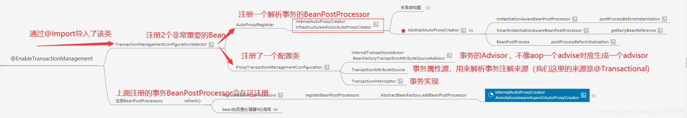
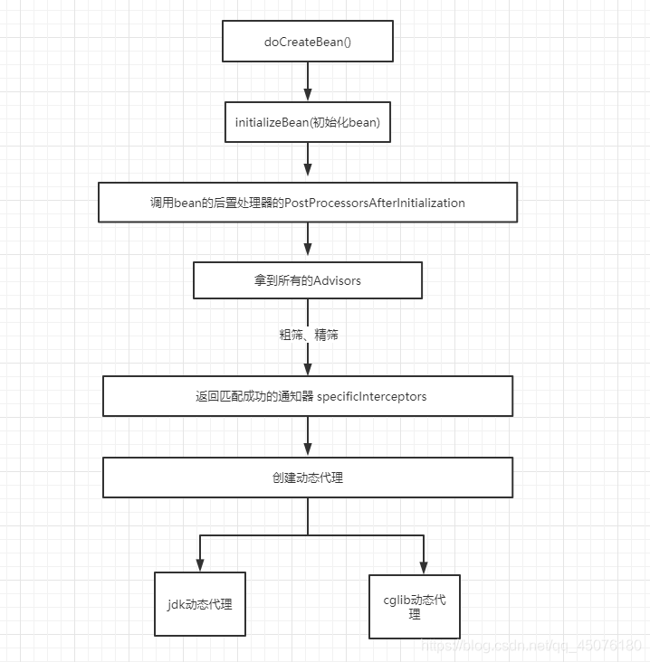
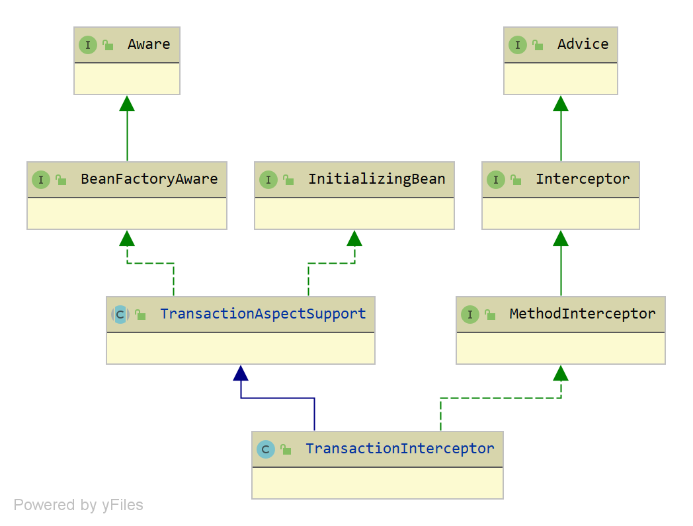
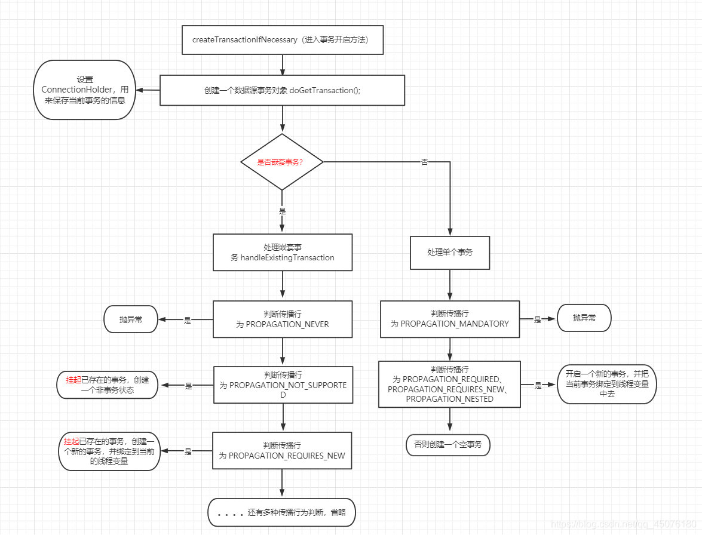

# 第02节 spring事务的原理

## 一、XML方式和Java方式配置事务

### XML方式配置事务
```text
  <beans>
 
      <tx:annotation-driven/>
 
      <bean id="fooRepository" class="com.foo.JdbcFooRepository">
          <constructor-arg ref="dataSource"/>
      </bean>
 
      <bean id="dataSource" class="com.vendor.VendorDataSource"/>
 
      <bean id="transactionManager" class="org.sfwk...DataSourceTransactionManager">
          <constructor-arg ref="dataSource"/>
      </bean>
 
  </beans>
```

### Java配置事务
```text
  @Configuration
  @EnableTransactionManagement
  public class AppConfig {
 
      @Bean
      public FooRepository fooRepository() {
          // configure and return a class having @Transactional methods
          return new JdbcFooRepository(dataSource());
      }
 
      @Bean
      public DataSource dataSource() {
          // configure and return the necessary JDBC DataSource
      }
 
      @Bean
      public PlatformTransactionManager txManager() {
          return new DataSourceTransactionManager(dataSource());
      }
  }
```

在上面的两个场景中，@EnableTransactionManagement和<tx:annotation-driven/>负责注册必要的Spring组件，
这些组件为【注解驱动的事务管理】提供支持，
例如TransactionInterceptor和基于代理或aspectj的通知，当调用JdbcFooRepository的@Transactional方法时，这些通知将拦截器编织入到调用堆栈中。

这两个示例之间的一个小区别在于TransactionManager bean的命名：
在@Bean的情况下，名称是“txManager”(根据方法的名称);在XML的情况下，名称是“transactionManager”。
<tx:annotation-driven/>默认情况下查找名为“transactionManager”的bean，
但是@EnableTransactionManagement更灵活;它将退回到按类型查找容器中的任何TransactionManager bean。
因此，名称可以是“txManager”、“transactionManager”或“tm”:这并不重要。

## 二、流程简介

Spring的事务 和 Spring的Aop，他们之间的套路非常相似，都是由以下三步组成：

> 1：Spring boot 项目启动，进行事务自动配置时，
>  通过@Import注册一个创建 动态代理的bean的后置处理器 和 BeanFactoryTransactionAttributeSourceAdvisor、
>  TransactionAttributeSource、TransactionInterceptor等处理事务相关的bean;
>
> 2：在创建bean时，通过bean后置处理器的postProcessBeforeInstantistion方法找到@Trantional注解标注的方法，
>  并存入缓存，这点与AOP逻辑类似;
> 
> 3：创建动态代理，在bean后置处理器的postProcessAfterInstantistion方法中与当前正在创建的bean进行匹配，
> 如果bean中的方法或者类上有@Trantional注解，则为其创建动态代理！
> 
> 4：当调用带有 @Transactional注解 的方法或类时， 会进入TransactionInterceptor中，触发代理逻辑。
> 会先开启事务，然后分别处理【嵌套事务】和【单一事务】，以及两种【事务的各种传播行为】！如果抛异常则回滚方法，无异常则提交事务！
>

下面就一一介绍这三步操作，在Spring事务中的实现。

## 三、开启事务

从配置类查看事务源码，配置类如下：
```java
@EnableTransactionManagement // 开启事务
@EnableAspectJAutoProxy(exposeProxy = true) // 开启Aop
@ComponentScan(basePackages = {"com.**"})  // 包扫描
public class MainConfig {

	// 使用@EnableTransactionManagement注解前，
	// 请务必保证你已经配置了至少一个PlatformTransactionManager的Bean，否则会报错。
    @Bean
    public PlatformTransactionManager transactionManager(DataSource dataSource) {
        return new DataSourceTransactionManager(dataSource);
    }

}
```

## 四、注册bean的后置处理器和相关bean对象,封装Advisor

由 @EnableTransactionManagement 进入源码，
```java
/**
 * 启用Spring的注释驱动事务管理功能，类似于Spring的<tx:*> XML名称空间中的支持。
 * 在@Configuration类上使用，用于配置传统的、命令式事务管理 或 响应式事务管理。
 */
@Target(ElementType.TYPE)
@Retention(RetentionPolicy.RUNTIME)
@Documented
@Import(TransactionManagementConfigurationSelector.class)
public @interface EnableTransactionManagement {

	/**
	 * 指示是否要创建基于子类(CGLIB)的代理(true)，而不是基于标准Java接口的代理(false)。
     * 默认为false。仅当mode()设置为AdviceMode.PROXY时适用。
     * <p> 
     * 注意，将此属性设置为true将影响 所有需要代理的spring管理 bean，而不仅仅是那些标有@Transactional的bean。
     * 例如，其他带有Spring的@Async注释的bean将同时升级为子类代理。
     * 这种方法在实践中没有负面影响，除非有人明确地期望一种类型的代理与另一种类型的代理相比，例如在测试中。
	 */
	boolean proxyTargetClass() default false;

	/**
	 * 说明事务性通知应该如何应用。
     * 默认为AdviceMode.PROXY。请注意，代理模式只允许通过代理拦截呼叫。
     * 同一类中的本地调用不会被拦截，在本地调用中对这种方法的事务性注解将被忽略，
     * 因为Spring的拦截器甚至不会在这种运行时场景中启动。
     * 对于更高级的拦截模式，请考虑将其切换为AdviceMode.ASPECTJ。
	 */
	AdviceMode mode() default AdviceMode.PROXY;

	/**
	 * 当在特定连接点应用多个通知时，指示事务建议器的执行顺序。
     * 默认值是Ordered.LOWEST_PRECEDENCE。
	 */
	int order() default Ordered.LOWEST_PRECEDENCE;

}
```
通过 @Import注解 帮我们导入了【事务组件TransactionManagementConfigurationSelector】，在容器初始化的时候注册。

@Import导入的组件会在Spring应用启动时，在**refresh()方法**中的invokeBeanFactoryPostProcessors中注册，如下：
```
  // 调用我们的bean工厂的后置处理器.
  invokeBeanFactoryPostProcessors(beanFactory);
```
然后经由ConfigurationClassPostProcessor#postProcessBeanDefinitionRegistry方法解析@Import注解，
然后将迭代解析出来的类分为三种情况处理：
```text
1) ImportSelector：执行selectImports方法
2) ImportBeanDefinitionRegistrar：执行registerBeanDefinitions方法
3) 普通类：通过processConfigurationClass方法迭代解析并注册到容器
```
下面来看看TransactionManagementConfigurationSelector源码和注释：
```text
/**
 * 根据EnableTransactionManagement的值选择应该使用AbstractTransactionManagementConfiguration的哪个实现。
 * 模式导入@Configuration类。
 *
 */
public class TransactionManagementConfigurationSelector extends AdviceModeImportSelector<EnableTransactionManagement> {

	/**
	 * 为EnableTransactionManagement.mode()的PROXY和AspectJ值
     * 分别返回ProxyTransactionManagementConfiguration或AspectJ(Jta)TransactionManagementConfiguration。
	 */
	@Override
	protected String[] selectImports(AdviceMode adviceMode) {
		switch (adviceMode) {
			/*
			 * PROXY：jdk代理默认使用这个
			 * 为我们的容器中导入了二个组件 一个是AutoProxyRegistrar
			 * 一个是ProxyTransactionManagementConfiguration
			 */
			case PROXY: 
				return new String[] {AutoProxyRegistrar.class.getName(),
						ProxyTransactionManagementConfiguration.class.getName()};
			// ASPECTJ：这个需要使用AspectJ的编译器，麻烦，一般不使用
			case ASPECTJ:
				return new String[] {determineTransactionAspectClass()};
			default:
				return null;
		}
	}

	private String determineTransactionAspectClass() {
		return (ClassUtils.isPresent("javax.transaction.Transactional", getClass().getClassLoader()) ?
				TransactionManagementConfigUtils.JTA_TRANSACTION_ASPECT_CONFIGURATION_CLASS_NAME :
				TransactionManagementConfigUtils.TRANSACTION_ASPECT_CONFIGURATION_CLASS_NAME);
	}

}
```
在TransactionManagementConfigurationSelector组件中，默认case的是PROXY，
它给我们容器注册了两个组件：
```text
    1) AutoProxyRegistrar，
    2) ProxyTransactionManagementConfiguration
```
这两个组件非常重要，下面一一来介绍：

1)：**AutoProxyRegistrar**：
**作用**: 向Spring容器注入了一个【创建动态代理】的【bean后置处理器】(这个事务的bean的后置处理器只针对内部的类起作用)。
```text
/**
 * 基于将mode和proxyTargetClass属性设置为正确值的@Enable*注解，针对当前BeanDefinitionRegistry注册一个自动代理创建器。
 */
public class AutoProxyRegistrar implements ImportBeanDefinitionRegistrar {

	private final Log logger = LogFactory.getLog(getClass());

	/**
	 * 针对给定的注册中心注册、升级和配置标准 自动代理创建器(APC)。
     * 通过查找在导入的同时具有mode和proxyTargetClass属性的@Configuration类上声明的最近的注释来工作。
     * 如果模式设置为PROXY，则APC注册;如果proxyTargetClass设置为true，那么APC将强制使用子类(CGLIB)代理。
     * 几个@Enable*注解暴露了mode和proxyTargetClass属性。
     * 重要的是要注意，这些功能中的大多数最终共享一个APC。
     * 由于这个原因，这个实现并不“关心”它找到的是哪个注释——只要它公开了正确的mode和proxyTargetClass属性，APC就可以被注册和配置。
	 */
	@Override
	public void registerBeanDefinitions(AnnotationMetadata importingClassMetadata, BeanDefinitionRegistry registry) {
		boolean candidateFound = false;
		Set<String> annTypes = importingClassMetadata.getAnnotationTypes();
		for (String annType : annTypes) {
			AnnotationAttributes candidate = AnnotationConfigUtils.attributesFor(importingClassMetadata, annType);
			if (candidate == null) {
				continue;
			}
			Object mode = candidate.get("mode");
			Object proxyTargetClass = candidate.get("proxyTargetClass");
			if (mode != null && proxyTargetClass != null && AdviceMode.class == mode.getClass() &&
					Boolean.class == proxyTargetClass.getClass()) {
				candidateFound = true;
				if (mode == AdviceMode.PROXY) {
                    // 注册 自动代理创建器
					AopConfigUtils.registerAutoProxyCreatorIfNecessary(registry);
					if ((Boolean) proxyTargetClass) {
						AopConfigUtils.forceAutoProxyCreatorToUseClassProxying(registry);
						return;
					}
				}
			}
		}
		if (!candidateFound && logger.isInfoEnabled()) {
			String name = getClass().getSimpleName();
			logger.info(String.format("%s was imported but no annotations were found " +
					"having both 'mode' and 'proxyTargetClass' attributes of type " +
					"AdviceMode and boolean respectively. This means that auto proxy " +
					"creator registration and configuration may not have occurred as " +
					"intended, and components may not be proxied as expected. Check to " +
					"ensure that %s has been @Import'ed on the same class where these " +
					"annotations are declared; otherwise remove the import of %s " +
					"altogether.", name, name, name));
		}
	}

}
```
AopConfigUtils#registerAutoProxyCreatorIfNecessary(registry)方法：
```
	// 【事务】调用这个方法注册bean后置处理器(由AutoProxyRegistrar进入)
	@Nullable
	public static BeanDefinition registerAutoProxyCreatorIfNecessary(
			BeanDefinitionRegistry registry, @Nullable Object source) {
		return registerOrEscalateApcAsRequired(InfrastructureAdvisorAutoProxyCreator.class, registry, source);
	}

	// 【Aop】调用这个方法注册bean后置处理器(由AspectJAutoProxyRegistrar进入)
	@Nullable
	public static BeanDefinition registerAspectJAutoProxyCreatorIfNecessary(
			BeanDefinitionRegistry registry, @Nullable Object source) {
		return registerOrEscalateApcAsRequired(AspectJAwareAdvisorAutoProxyCreator.class, registry, source);
	}
```
我们已经知道，Aop也会帮我们向Spring容器注入了一个【创建动态代理】的【bean后置处理器】。

那么问题来了，如果一个系统同时用到了【事务】和【Aop】，这样是不是就会注册两个bean后置处理器？创建两套动态代理？
答案肯定是不会的！带着这个问题，我们看一下事务的源码是怎么处理的。

InfrastructureAdvisorAutoProxyCreator类和AspectJAwareAdvisorAutoProxyCreator类 关系图如下：


可以看到，两个方法都调用了**registerOrEscalateApcAsRequired**方法，
进去一探究竟，如何避免事务和Aop同时存在从而对一个bean创建多个动态代理呢？
答案就是优先级覆盖，【事务的优先级低于Aop，如果同时存在，Aop会覆盖事务注册的bean后置处理器】.
```
	private static BeanDefinition registerOrEscalateApcAsRequired(
			Class<?> cls, BeanDefinitionRegistry registry, @Nullable Object source) {

		Assert.notNull(registry, "BeanDefinitionRegistry must not be null");

		// 因为【事务】和【Aop】都是一样的名字，所以内部会根据优先级覆盖beanClass
		if (registry.containsBeanDefinition(AUTO_PROXY_CREATOR_BEAN_NAME)) {
			BeanDefinition apcDefinition = registry.getBeanDefinition(AUTO_PROXY_CREATOR_BEAN_NAME);
			if (!cls.getName().equals(apcDefinition.getBeanClassName())) {
				// 当同时有【事务】和【Aop】，两者都会创建bean的后置处理器
				// 为了防止创建两个，在内部进行了优先级覆盖
				// 【事务优先级】为 0, 【Aop的优先级】为 2
				int currentPriority = findPriorityForClass(apcDefinition.getBeanClassName());
				int requiredPriority = findPriorityForClass(cls);
				// 比较优先级，此时【Aop会覆盖事务】
				if (currentPriority < requiredPriority) {
					apcDefinition.setBeanClassName(cls.getName());
				}
			}
			return null;
		}

		RootBeanDefinition beanDefinition = new RootBeanDefinition(cls);
		beanDefinition.setSource(source);
		beanDefinition.getPropertyValues().add("order", Ordered.HIGHEST_PRECEDENCE);
		beanDefinition.setRole(BeanDefinition.ROLE_INFRASTRUCTURE);
		registry.registerBeanDefinition(AUTO_PROXY_CREATOR_BEAN_NAME, beanDefinition);
		return beanDefinition;
	}
```

2)：**ProxyTransactionManagementConfiguration**: 
它是一个@Configuration配置类，给容器中注册了三个与事务相关的bean对象。
```text
/**
 * @Configuration类，它注册了启用基于代理的注释驱动的事务管理所需的Spring基础设施bean。
 *
 */
@Configuration(proxyBeanMethods = false)
@Role(BeanDefinition.ROLE_INFRASTRUCTURE)
public class ProxyTransactionManagementConfiguration extends AbstractTransactionManagementConfiguration {

    @Bean(name = TransactionManagementConfigUtils.TRANSACTION_ADVISOR_BEAN_NAME)
    @Role(BeanDefinition.ROLE_INFRASTRUCTURE)
    public BeanFactoryTransactionAttributeSourceAdvisor transactionAdvisor(
            TransactionAttributeSource transactionAttributeSource, TransactionInterceptor transactionInterceptor) {

        BeanFactoryTransactionAttributeSourceAdvisor advisor = new BeanFactoryTransactionAttributeSourceAdvisor();
        // 设置事务的事务属性源AttributeSource，解析@Transactional注解，类似于切点
        advisor.setTransactionAttributeSource(transactionAttributeSource);
        // 设置事务的通知逻辑
        advisor.setAdvice(transactionInterceptor);
        if (this.enableTx != null) {
            advisor.setOrder(this.enableTx.<Integer>getNumber("order"));
        }
        return advisor;
    }

    @Bean
    @Role(BeanDefinition.ROLE_INFRASTRUCTURE)
    public TransactionAttributeSource transactionAttributeSource() {
        return new AnnotationTransactionAttributeSource();
    }

    @Bean
    @Role(BeanDefinition.ROLE_INFRASTRUCTURE)
    public TransactionInterceptor transactionInterceptor(TransactionAttributeSource transactionAttributeSource) {
        TransactionInterceptor interceptor = new TransactionInterceptor();
        interceptor.setTransactionAttributeSource(transactionAttributeSource);
        if (this.txManager != null) {
            interceptor.setTransactionManager(this.txManager);
        }
        return interceptor;
    }
}
```
归纳ProxyTransactionManagementConfiguration的作用：
```text
I) BeanFactoryTransactionAttributeSourceAdvisor：【事务Advisor顾问】，封装了【事务的切面信息】。
继承于AbstractBeanFactoryPointcutAdvisor，间接实现PointcutAdvisor接口，
BeanFactoryTransactionAttributeSourceAdvisor对象在关联的【Pointcut切点】中筛选@Transactional注解的方法(标注在类上也可以)，
在关联的【Advice通知】中会进行事务的拦截处理。

与Aop不同的是，Aop需要【自定义切面逻辑】，然后【调用AspectJ来解析切面封装成Advisor】。
而事务不同，Spring内部帮我们【封装好事务的逻辑】，【连Advisor在这里都直接帮我们设置好了】。

II) TransactionAttributeSource：【事务Pointcut切点】，事务属性源对象，获取事务属性对象，【解析@Transactional注解】。
被Pointcut和Advice关联，
在它的构造方法中会添加一个SpringTransactionAnnotationParser事务注解解析器，用于解析@Transactional注解。
只有带@Transactional的类才会被创建动态代理。

III) TransactionInterceptor：【事务Advice(通知)】，里边有【Spring事务的逻辑，拦截事务方法，执行事务逻辑】！
TransactionInterceptor实现了MethodInterceptor方法拦截器，
并关联着一个AnnotationTransactionAttributeSource对象。
```

## 五、匹配并创建动态代理

创建 事务动态代理 的逻辑与 AOP动态代理 的逻辑是代码复用的，都是从Bean加载开始。
下面来简单看看流程：
```text
==>DefaultListableBeanFactory#preInstantiateSingletons()
 ==>AbstractBeanFactory#getBean()
  ==>AbstractBeanFactory#doGetBean()
   ==>AbstractAutowireCapableBeanFactory#createBean()
    ==>AbstractAutowireCapableBeanFactory#doCreateBean()
     ==>AbstractAutowireCapableBeanFactory#createBeanInstance()(创建bean实例)
     ==>AbstractAutowireCapableBeanFactory#populateBean()(填充bean属性)
     ==>AbstractAutowireCapableBeanFactory#initializeBean()(初始化bean)
      ==>AbstractAutowireCapableBeanFactory#invokeAwareMethods()(调用各种Aware中的方法)
      ==>AbstractAutowireCapableBeanFactory#applyBeanPostProcessorsBeforeInitialization()(各种bean的后置处理器的postProcessBeforeInitialization)
      ==>AbstractAutowireCapableBeanFactory#invokeInitMethods()(执行init-method方法)
      ==>AbstractAutowireCapableBeanFactory#applyBeanPostProcessorsAfterInitialization()(AOP和事务的动态代理，各种bean的后置处理器的postProcessAfterInitialization)
     ==>AbstractAutowireCapableBeanFactory#registerDisposableBeanIfNecessary()
```
下面我们进入AbstractAutowireCapableBeanFactory#applyBeanPostProcessorsAfterInitialization()方法：
```text
	@Override
	public Object applyBeanPostProcessorsAfterInitialization(Object existingBean, String beanName)
			throws BeansException {

		Object result = existingBean;
		// getBeanPostProcessors()中包含一个AnnotationAwareAspectJAutoProxyCreator的bean后置处理器
		for (BeanPostProcessor processor : getBeanPostProcessors()) {
		    // 进入AnnotationAwareAspectJAutoProxyCreator#postProcessAfterInitialization方法
			Object current = processor.postProcessAfterInitialization(result, beanName);
			if (current == null) {
				return result;
			}
			result = current;
		}
		return result;
	}
```
进入AnnotationAwareAspectJAutoProxyCreator#postProcessAfterInitialization方法，
发现postProcessAfterInitialization方法来自AbstractAutoProxyCreator类，
即实际上进入的是AbstractAutoProxyCreator#postProcessAfterInitialization方法：
```text
	@Override
	public Object postProcessAfterInitialization(@Nullable Object bean, String beanName) {
		if (bean != null) {
			Object cacheKey = getCacheKey(bean.getClass(), beanName);
			if (this.earlyProxyReferences.remove(cacheKey) != bean) {
				return wrapIfNecessary(bean, beanName, cacheKey);
			}
		}
		return bean;
	}
```
进入AbstractAutoProxyCreator#wrapIfNecessary方法进行动态代理包裹bean：
```text
	protected Object wrapIfNecessary(Object bean, String beanName, Object cacheKey) {
		if (StringUtils.hasLength(beanName) && this.targetSourcedBeans.contains(beanName)) {
			return bean;
		}
		if (Boolean.FALSE.equals(this.advisedBeans.get(cacheKey))) {
			return bean;
		}
		if (isInfrastructureClass(bean.getClass()) || shouldSkip(bean.getClass(), beanName)) {
			this.advisedBeans.put(cacheKey, Boolean.FALSE);
			return bean;
		}

		// Create proxy if we have advice. 如果有通知，则创建动态代理
		// 1、【获取通知和顾问】
		Object[] specificInterceptors = getAdvicesAndAdvisorsForBean(bean.getClass(), beanName, null);
		if (specificInterceptors != DO_NOT_PROXY) {
			this.advisedBeans.put(cacheKey, Boolean.TRUE);
			// 2、创建动态代理
			Object proxy = createProxy(
					bean.getClass(), beanName, specificInterceptors, new SingletonTargetSource(bean));
			this.proxyTypes.put(cacheKey, proxy.getClass());
			return proxy;
		}

		this.advisedBeans.put(cacheKey, Boolean.FALSE);
		return bean;
	}
```
### 解析@Transactional注解逻辑
进入AbstractAdvisorAutoProxyCreator#getAdvicesAndAdvisorsForBean方法：
```text
	protected Object[] getAdvicesAndAdvisorsForBean(
			Class<?> beanClass, String beanName, @Nullable TargetSource targetSource) {
        // 寻找合格的advisor顾问
		List<Advisor> advisors = findEligibleAdvisors(beanClass, beanName);
		if (advisors.isEmpty()) {
			return DO_NOT_PROXY;
		}
		return advisors.toArray();
	}
```
进入AbstractAdvisorAutoProxyCreator#findEligibleAdvisors方法：
```text
    // 为自动代理类查找所有的顾问advisor
	protected List<Advisor> findEligibleAdvisors(Class<?> beanClass, String beanName) {
	    // 1、查找BeanFactory中所有的Advisor顾问
	    // 其中，有Spring自注册的BeanFactoryTransactionAttributeSourceAdvisor(bean工厂事务属性源顾问)
		List<Advisor> candidateAdvisors = findCandidateAdvisors();
		// 2、根据代理类查找 符合条件的 Advisor顾问 【重要：解析@Transactional注解】
		List<Advisor> eligibleAdvisors = findAdvisorsThatCanApply(candidateAdvisors, beanClass, beanName);
		extendAdvisors(eligibleAdvisors);
		if (!eligibleAdvisors.isEmpty()) {
			eligibleAdvisors = sortAdvisors(eligibleAdvisors);
		}
		return eligibleAdvisors;
	}
```
进入AbstractAdvisorAutoProxyCreator#findAdvisorsThatCanApply方法：
```text
	protected List<Advisor> findAdvisorsThatCanApply(
			List<Advisor> candidateAdvisors, Class<?> beanClass, String beanName) {

		ProxyCreationContext.setCurrentProxiedBeanName(beanName);
		try {
		    // 【查找beanClass符合条件的 Advisor顾问】
			return AopUtils.findAdvisorsThatCanApply(candidateAdvisors, beanClass);
		}
		finally {
			ProxyCreationContext.setCurrentProxiedBeanName(null);
		}
	}
```
进入AopUtils#findAdvisorsThatCanApply方法：
```text
	public static List<Advisor> findAdvisorsThatCanApply(List<Advisor> candidateAdvisors, Class<?> clazz) {
		if (candidateAdvisors.isEmpty()) {
			return candidateAdvisors;
		}
		List<Advisor> eligibleAdvisors = new ArrayList<>();
		// 1、过滤出IntroductionAdvisor类型 符合条件的Advisor顾问
		for (Advisor candidate : candidateAdvisors) {
			if (candidate instanceof IntroductionAdvisor && canApply(candidate, clazz)) {
				eligibleAdvisors.add(candidate);
			}
		}
		boolean hasIntroductions = !eligibleAdvisors.isEmpty();
		// 2、过滤出普通 符合条件的Advisor顾问
		for (Advisor candidate : candidateAdvisors) {
			if (candidate instanceof IntroductionAdvisor) {
				// already processed
				continue;
			}
			// 【重要: 是否符合切面的应用条件】
			if (canApply(candidate, clazz, hasIntroductions)) {
				eligibleAdvisors.add(candidate);
			}
		}
		return eligibleAdvisors;
	}
```
进入AopUtils#canApply方法：
```text
	public static boolean canApply(Advisor advisor, Class<?> targetClass, boolean hasIntroductions) {
		if (advisor instanceof IntroductionAdvisor) {
			return ((IntroductionAdvisor) advisor).getClassFilter().matches(targetClass);
		}
		else if (advisor instanceof PointcutAdvisor) {
			PointcutAdvisor pca = (PointcutAdvisor) advisor;
			return canApply(pca.getPointcut(), targetClass, hasIntroductions);
		}
		else {
			// It doesn't have a pointcut so we assume it applies.
			return true;
		}
	}
	
	public static boolean canApply(Pointcut pc, Class<?> targetClass, boolean hasIntroductions) {
		Assert.notNull(pc, "Pointcut must not be null");
		if (!pc.getClassFilter().matches(targetClass)) {
			return false;
		}

        // 1、获取方法匹配器
		MethodMatcher methodMatcher = pc.getMethodMatcher();
		if (methodMatcher == MethodMatcher.TRUE) {
			// No need to iterate the methods if we're matching any method anyway...
			return true;
		}

		IntroductionAwareMethodMatcher introductionAwareMethodMatcher = null;
		if (methodMatcher instanceof IntroductionAwareMethodMatcher) {
			introductionAwareMethodMatcher = (IntroductionAwareMethodMatcher) methodMatcher;
		}

        // 2、获取 目标类、所有父类和接口
		Set<Class<?>> classes = new LinkedHashSet<>();
		if (!Proxy.isProxyClass(targetClass)) {
			classes.add(ClassUtils.getUserClass(targetClass));
		}
		classes.addAll(ClassUtils.getAllInterfacesForClassAsSet(targetClass));

        // 3、判断 目标类、所有父类和接口 的所有方法中是否有符合 切点应用逻辑条件
		for (Class<?> clazz : classes) {
		    // 通过反射 获取所有 所有方法
			Method[] methods = ReflectionUtils.getAllDeclaredMethods(clazz);
			for (Method method : methods) {
				if (introductionAwareMethodMatcher != null ?
						introductionAwareMethodMatcher.matches(method, targetClass, hasIntroductions) :
						// 【切点 匹配方法】
						methodMatcher.matches(method, targetClass)) {
					return true;
				}
			}
		}

		return false;
	}
```
进入(事务切点)TransactionAttributeSourcePointcut#matches方法：
```text
	@Override
	public boolean matches(Method method, Class<?> targetClass) {
	    // Spring自动注册的AnnotationTransactionAttributeSource，里面包括【@Transactional解析器】
		TransactionAttributeSource tas = getTransactionAttributeSource();
		// 判断是否有 @transactional注解
		return (tas == null || tas.getTransactionAttribute(method, targetClass) != null);
	}
```
注(AOP切点): AspectJExpressionPointcut#matches方法：
```text
	@Override
	public boolean matches(Method method, Class<?> targetClass, boolean hasIntroductions) {
	    // 【获取切点表达式】
		obtainPointcutExpression();
		// 匹配器
		ShadowMatch shadowMatch = getTargetShadowMatch(method, targetClass);
		// 【已匹配成功】
		if (shadowMatch.alwaysMatches()) {
			return true;
		}
		else if (shadowMatch.neverMatches()) {
			return false;
		}
		else {
			if (hasIntroductions) {
				return true;
			}
			RuntimeTestWalker walker = getRuntimeTestWalker(shadowMatch);
			return (!walker.testsSubtypeSensitiveVars() || walker.testTargetInstanceOfResidue(targetClass));
		}
	}
```

进入AbstractFallbackTransactionAttributeSource#getTransactionAttribute方法：
```text
	@Override
	@Nullable
	public TransactionAttribute getTransactionAttribute(Method method, @Nullable Class<?> targetClass) {
		if (method.getDeclaringClass() == Object.class) {
			return null;
		}

		// First, see if we have a cached value.
		Object cacheKey = getCacheKey(method, targetClass);
		TransactionAttribute cached = this.attributeCache.get(cacheKey);
		if (cached != null) {
			// Value will either be canonical value indicating there is no transaction attribute,
			// or an actual transaction attribute.
			if (cached == NULL_TRANSACTION_ATTRIBUTE) {
				return null;
			}
			else {
				return cached;
			}
		}
		else {
			// We need to work it out.
			// 1、【重要: 解析@Transactional注解的属性值】
			TransactionAttribute txAttr = computeTransactionAttribute(method, targetClass);
			// Put it in the cache.
			if (txAttr == null) {
				this.attributeCache.put(cacheKey, NULL_TRANSACTION_ATTRIBUTE);
			}
			else {
				String methodIdentification = ClassUtils.getQualifiedMethodName(method, targetClass);
				if (txAttr instanceof DefaultTransactionAttribute) {
					DefaultTransactionAttribute dta = (DefaultTransactionAttribute) txAttr;
					dta.setDescriptor(methodIdentification);
					dta.resolveAttributeStrings(this.embeddedValueResolver);
				}
				if (logger.isTraceEnabled()) {
					logger.trace("Adding transactional method '" + methodIdentification + "' with attribute: " + txAttr);
				}
				this.attributeCache.put(cacheKey, txAttr);
			}
			return txAttr;
		}
	}
```
进入AbstractFallbackTransactionAttributeSource#computeTransactionAttribute方法：
```text
	@Nullable
	protected TransactionAttribute computeTransactionAttribute(Method method, @Nullable Class<?> targetClass) {
		// Don't allow non-public methods, as configured.
		if (allowPublicMethodsOnly() && !Modifier.isPublic(method.getModifiers())) {
			return null;
		}

		// The method may be on an interface, but we need attributes from the target class.
		// If the target class is null, the method will be unchanged.
		// 【反射 目标方法】
		Method specificMethod = AopUtils.getMostSpecificMethod(method, targetClass);

		// First try is the method in the target class.
		TransactionAttribute txAttr = findTransactionAttribute(specificMethod);
		if (txAttr != null) {
			return txAttr;
		}

		// Second try is the transaction attribute on the target class.
		// 【查找 事务属性】
		txAttr = findTransactionAttribute(specificMethod.getDeclaringClass());
		if (txAttr != null && ClassUtils.isUserLevelMethod(method)) {
			return txAttr;
		}

		if (specificMethod != method) {
			// Fallback is to look at the original method.
			txAttr = findTransactionAttribute(method);
			if (txAttr != null) {
				return txAttr;
			}
			// Last fallback is the class of the original method.
			txAttr = findTransactionAttribute(method.getDeclaringClass());
			if (txAttr != null && ClassUtils.isUserLevelMethod(method)) {
				return txAttr;
			}
		}

		return null;
	}
```
进入AnnotationTransactionAttributeSource#findTransactionAttribute方法：
```text
	@Override
	@Nullable
	protected TransactionAttribute findTransactionAttribute(Method method) {
		return determineTransactionAttribute(method);
	}
	
	@Nullable
	protected TransactionAttribute determineTransactionAttribute(AnnotatedElement element) {
	    // 【事务注解解析器】 解析【@Transactional注解】
		for (TransactionAnnotationParser parser : this.annotationParsers) {
			TransactionAttribute attr = parser.parseTransactionAnnotation(element);
			if (attr != null) {
				return attr;
			}
		}
		return null;
	}
```
进入SpringTransactionAnnotationParser#parseTransactionAnnotation方法：
```text
	@Nullable
	public TransactionAttribute parseTransactionAnnotation(AnnotatedElement element) {
		// 【解析@Transactional注解】的属性值
		AnnotationAttributes attributes = AnnotatedElementUtils.findMergedAnnotationAttributes(
				element, Transactional.class, false, false);
		if (attributes != null) {
		    // AnnotationAttributes是HashMap，封装成 TransactionAttribute类型
			return parseTransactionAnnotation(attributes);
		}
		else {
			return null;
		}
	}
```
至此，@Transactional注解 解析完成，并根据事务和AOP切面创建 动态代理。

因为事务和Aop不一样，【Aop根据不同的切点和Advice会有多个Advisor】，而【事务只有一个Advisor】。
也就是上一步开启事务时，已经放入容器的**BeanFactoryTransactionAttributeSourceAdvisor**类。

接下来只需要拿当前创建的bean与事务的Advisor匹配，匹配成功则创建动态代理即可。这个过程与Aop达成了代码复用。


如何判断当前类具备事务，具有创建动态代理的资格？
答：从当前正在初始化的bean的所有的方法中，找到带有@Transactional的方法，
根据方法优先原则，由 本类方法 ==> 接口方法 ==> 父类方法 的顺序去找，如果找到，就表示有创建动态代理的资格。
如果方法上都没有，则去类上面找，由 本类上 ==> 接口上 ==> 父类上 的顺序去找，如果找到，就表示有创建动态代理的资格。

如果具备创建动态代理的资格，就会为当前bean创建动态代理，这个过程与Aop一样，在此不多说，详情请看 **Spring的Aop源码逻辑*

## 六、调用事务的代理逻辑

如果启动事务，在容器启动时，Spring会在容器中注入TransactionInterceptor这个bean对象。
这个bean里边有Spring事务的逻辑，作用是拦截事务方法，执行事务逻辑！
先来看看Spring官方源码注释翻译：
```text
AOP Alliance MethodInterceptor，用于声明性事务管理，
使用通用的Spring【事务基础设施】
(PlatformTransactionManager / org.springframework.transaction.ReactiveTransactionManager)。

派生自TransactionAspectSupport类，该类包含了与Spring底层事务API的集成。
TransactionInterceptor只是按照正确的顺序调用相关的超类方法，比如invokeWithinTransaction。
```
如下是TransactionInterceptor类图：


当为某个类创建了**事务的动态代理**后，就会执行TransactionInterceptor中处理Spring事务的逻辑。

具体代码见 ==> TransactionInterceptor#invoke()方法：
```text
	@Override
	@Nullable
	public Object invoke(MethodInvocation invocation) throws Throwable {
		// Work out the target class: may be {@code null}.
		// The TransactionAttributeSource should be passed the target class
		// as well as the method, which may be from an interface.
		Class<?> targetClass = (invocation.getThis() != null ? AopUtils.getTargetClass(invocation.getThis()) : null);

		// Adapt to TransactionAspectSupport's invokeWithinTransaction...
		// 事务调用逻辑
		return invokeWithinTransaction(
                    invocation.getMethod(), 
                    targetClass, 
                    new CoroutinesInvocationCallback() {
                        @Override
                        @Nullable
                        public Object proceedWithInvocation() throws Throwable {
                            return invocation.proceed();
                        }
                        @Override
                        public Object getTarget() {
                            return invocation.getThis();
                        }
                        @Override
                        public Object[] getArguments() {
                            return invocation.getArguments();
                        }
                    }
                );
	}
```
TransactionAspectSupport#invokeWithinTransaction方法：
```
	@Nullable
	protected Object invokeWithinTransaction(Method method, @Nullable Class<?> targetClass,
			final InvocationCallback invocation) throws Throwable {

		// 获取【事务属性源】
		TransactionAttributeSource tas = getTransactionAttributeSource();
		// 通过【事务属性源】获取【事务属性】
		final TransactionAttribute txAttr = (tas != null ? tas.getTransactionAttribute(method, targetClass) : null);
		// 获取我们配置的【事务管理器】
		final PlatformTransactionManager tm = determineTransactionManager(txAttr);
		// 从txAttr【事务属性】对象中获取标注了@Transactionl的方法名
		final String joinpointIdentification = methodIdentification(method, targetClass, txAttr);

		// 1、处理声明式事务
		if (txAttr == null || !(tm instanceof CallbackPreferringPlatformTransactionManager)) {
			// 如果有必要，则创建事务（开启事务）
			TransactionInfo txInfo = createTransactionIfNecessary(tm, txAttr, joinpointIdentification);

			Object retVal;
			try {
				// 调用钩子函数进行回调目标方法，事务也会责任链调用，不过责任链中只有一个
				retVal = invocation.proceedWithInvocation();
			}
			catch (Throwable ex) {
				// 抛出异常进行回滚处理
				completeTransactionAfterThrowing(txInfo, ex);
				throw ex;
			}
			finally {
				// 清空我们的线程变量中transactionInfo的值
				cleanupTransactionInfo(txInfo);
			}
			// 提交事务
			commitTransactionAfterReturning(txInfo);
			return retVal;
		}
		
		// 2、处理编程式事务
		.......
	}
```

其中最主要的就是**createTransactionIfNecessary**这个方法，它内部封装了开启事务的操作。

单事务和嵌套事务分别有不同的操作，大致流程如下图

Spring针对不同的传播行为有不同的处理，下面来了解一下事务的传播行为
```java
/**
 * 表示事务传播行为的枚举，以与事务性注释一起使用，对应于TransactionDefinition接口。
 */
public enum Propagation {

	/**
	 * 支持当前事务，如果不存在，则创建一个新事务。类似于同名的EJB事务属性。
     * 这是事务注释的默认设置。
	 */
	REQUIRED(TransactionDefinition.PROPAGATION_REQUIRED),

	/**
	 * 支持当前事务，如果不存在，则执行非事务。类似于同名的EJB事务属性。
     * 注意:对于具有事务同步的事务管理器，SUPPORTS与根本没有事务略有不同，因为它定义了同步将应用的事务范围。
     * 因此，相同的资源(JDBC Connection、Hibernate Session等)将在整个指定范围内共享。
     * 注意，这取决于事务管理器的实际同步配置。
	 */
	SUPPORTS(TransactionDefinition.PROPAGATION_SUPPORTS),

	/**
	 * 支持当前事务，如果不存在则抛出异常。类似于同名的EJB事务属性。
	 */
	MANDATORY(TransactionDefinition.PROPAGATION_MANDATORY),

	/**
	 * 创建一个新事务，并挂起当前事务(如果存在)。类似于同名的EJB事务属性。
     * 注意:实际的事务挂起不会在所有事务管理器上开箱即用。
     * 这尤其适用于org.springframework.transaction.jta。JtaTransactionManager，
     * 它需要javax.transaction.TransactionManager对它可用(这在标准Java EE中是特定于服务器的)。
	 */
	REQUIRES_NEW(TransactionDefinition.PROPAGATION_REQUIRES_NEW),

	/**
	 * 非事务性地执行，挂起当前事务(如果存在)。类似于同名的EJB事务属性。
     * 注意:实际的事务挂起不会在所有事务管理器上开箱即用。
     * 这尤其适用于org.springframework.transaction.jta。JtaTransactionManager，
     * 它需要javax.transaction.TransactionManager对它可用(这在标准Java EE中是特定于服务器的)。
	 */
	NOT_SUPPORTED(TransactionDefinition.PROPAGATION_NOT_SUPPORTED),

	/**
	 * 非事务执行，如果存在事务则抛出异常。类似于同名的EJB事务属性。
	 */
	NEVER(TransactionDefinition.PROPAGATION_NEVER),

	/**
	 * 如果当前事务存在，则在嵌套事务中执行，否则表现为REQUIRED。在EJB中没有类似的特性。
     * 注意:嵌套事务的实际创建只适用于特定的事务管理器。
     * 开箱即用，这只适用于JDBC DataSourceTransactionManager。一些JTA提供程序也可能支持嵌套事务。
	 */
	NESTED(TransactionDefinition.PROPAGATION_NESTED);
    
	private final int value;

	Propagation(int value) {
		this.value = value;
	}

	public int value() {
		return this.value;
	}
}
```
事务的传播行为:
PROPAGATION_REQUIRED ： 如果当前正要执行的事务不在另外一个事务里，那么就起一个新的事务。
比如说，ServiceB.methodB的事务级别定义为PROPAGATION_REQUIRED, 
那么由于执行ServiceA.methodA的时候，ServiceA.methodA已经起了事务，
这时调用ServiceB.methodB，ServiceB.methodB看到自己已经运行在ServiceA.methodA 的事务内部，就不再起新的事务。
而假如ServiceA.methodA运行的时候发现自己没有在事务中，他就会为自己分配一个事务。 
这样，在ServiceA.methodA或者在ServiceB.methodB内的任何地方出现异常，事务都会被回滚。
即使ServiceB.methodB的事务已经被 提交，但是ServiceA.methodA在接下来fail要回滚，ServiceB.methodB也要回滚。

PROPAGATION_SUPPORTS ： 如果当前在事务中，即以事务的形式运行，如果当前不再一个事务中，那么就以非事务的形式运行。
这就跟平常用的普通非事务的代码只有一点点区别了。不理这个，因为我也没有觉得有什么区别。

PROPAGATION_REQUIRES_NEW ：
假如设计ServiceA.methodA的事务级别为PROPAGATION_REQUIRED，
ServiceB.methodB的事务级别为PROPAGATION_REQUIRES_NEW， 
那么当执行到ServiceB.methodB的时候，ServiceA.methodA所在的事务就会挂起，ServiceB.methodB会起一个新的事务，
等待ServiceB.methodB的事务完成以后， 他才继续执行。
他与PROPAGATION_REQUIRED 的事务区别在于事务的回滚程度了。
因为ServiceB.methodB是新起一个事务，那么就是存在两个不同的事务。
如果ServiceB.methodB已经提交，那么ServiceA.methodA失败回滚，ServiceB.methodB是不会回滚的。
如果ServiceB.methodB失败回滚，如果他抛出的异常被ServiceA.methodA捕获，ServiceA.methodA事务仍然可能提交。

PROPAGATION_NOT_SUPPORTED ： 当前不支持事务。
比如ServiceA.methodA的事务级别是PROPAGATION_REQUIRED ，
而ServiceB.methodB的事务级别是PROPAGATION_NOT_SUPPORTED，
那么当执行到ServiceB.methodB时，ServiceA.methodA的事务挂起，而他以非事务的状态运行完，
再继续ServiceA.methodA的事务。

PROPAGATION_NEVER ： 不能在事务中运行。
假设ServiceA.methodA的事务级别是PROPAGATION_REQUIRED， 而ServiceB.methodB的事务级别是PROPAGATION_NEVER，
那么ServiceB.methodB就要抛出异常了。

PROPAGATION_MANDATORY ： 必须在一个事务中运行。也就是说，他只能被一个父事务调用。否则，他就要抛出异常。

PROPAGATION_NESTED ：
他与PROPAGATION_REQUIRES_NEW的区别是，
PROPAGATION_REQUIRES_NEW另起一个事务，将会与他的父事务相互独立，而 PROPAGATION_NESTED 则是外部事务的子事务。
也就是说，如果父事务最后回滚，他也要回滚的，父事务最后commit，他也跟着commit。
如果子事务ServiceB.methodB失败回滚，那么ServiceA.methodA也会回滚到savepoint点上，
ServiceA.methodA可以选择另外一个分支，比如ServiceC.methodC，继续执行，来尝试完成自己的事务。

接下来继续源码，看一下单事务与嵌套事务的区别！

单事务逻辑比较简单，如果是嵌套事务，比如以下操作
```
	@Transactional(rollbackFor = Exception.class) //事务方法
    public void pay(String accountId, double money) {
        // 查询余额
        double blance = accountInfoDao.qryBlanceByUserId(accountId);
		// 嵌套事务，更新库存
		this.updateProductStore(1);
    }

    @Transactional(propagation = Propagation.REQUIRES_NEW) //事务方法
    public void updateProductStore(Integer productId) {
		。。。。。。省略代码
    }
```

下面来讲一下嵌套事务的流程，以上面伪代码为例，
pay方法内部调用了updateProductStore方法，会开启一个新事务，
首先pay方法会开启一个事务，获取一个数据库连接Connection，封装到ConnectionHolder，开启事务，
绑定 数据源 和 ConnectionHolder 到 事务管理器TransactionSynchronizationManager上！

逻辑封装在doBegin方法中：
```
	protected void doBegin(Object transaction, TransactionDefinition definition) {
		// 强制转化事物对象
		DataSourceTransactionObject txObject = (DataSourceTransactionObject) transaction;
		Connection con = null;

		try {
			// 判断事务对象没有数据库连接持有器
			if (!txObject.hasConnectionHolder() ||
					txObject.getConnectionHolder().isSynchronizedWithTransaction()) {
				// 通过数据源获取一个数据库连接对象，这个链接是我们自己设置的
				Connection newCon = obtainDataSource().getConnection();
				if (logger.isDebugEnabled()) {
					logger.debug("Acquired Connection [" + newCon + "] for JDBC transaction");
				}
				// 把我们的数据库连接包装成一个ConnectionHolder对象 然后设置到我们的txObject对象中去
				txObject.setConnectionHolder(new ConnectionHolder(newCon), true);
			}

			// 标记当前的连接是一个同步事务
			txObject.getConnectionHolder().setSynchronizedWithTransaction(true);
			con = txObject.getConnectionHolder().getConnection();

			// 为当前的事务设置隔离级别
			Integer previousIsolationLevel = DataSourceUtils.prepareConnectionForTransaction(con, definition);
			txObject.setPreviousIsolationLevel(previousIsolationLevel);

			// 关闭自动提交
			if (con.getAutoCommit()) {
				txObject.setMustRestoreAutoCommit(true);
				if (logger.isDebugEnabled()) {
					logger.debug("Switching JDBC Connection [" + con + "] to manual commit");
				}
				con.setAutoCommit(false);
			}

			// 判断事务为只读事务
			prepareTransactionalConnection(con, definition);
			// 设置事务激活
			txObject.getConnectionHolder().setTransactionActive(true);

			// 设置事务超时时间
			int timeout = determineTimeout(definition);
			if (timeout != TransactionDefinition.TIMEOUT_DEFAULT) {
				txObject.getConnectionHolder().setTimeoutInSeconds(timeout);
			}

			// 绑定我们的数据源和连接到我们的同步管理器上 把数据源作为key,数据库连接作为value 设置到线程变量中
			if (txObject.isNewConnectionHolder()) {
				TransactionSynchronizationManager.bindResource(obtainDataSource(), txObject.getConnectionHolder());
			}
		}
```

然后再次补充事务管理器信息，把当前 事务的信息 绑定到 事务管理器TransactionSynchronizationManager上
```
	protected void prepareSynchronization(DefaultTransactionStatus status, 
	                                        TransactionDefinition definition) {
		if (status.isNewSynchronization()) {
			// 绑定事务激活
			TransactionSynchronizationManager.setActualTransactionActive(status.hasTransaction());
			// 当前事务的隔离级别
			TransactionSynchronizationManager.setCurrentTransactionIsolationLevel(
					definition.getIsolationLevel() != TransactionDefinition.ISOLATION_DEFAULT ?
							definition.getIsolationLevel() : null);
			// 是否为只读事务
			TransactionSynchronizationManager.setCurrentTransactionReadOnly(definition.isReadOnly());
			// 事务的名称
			TransactionSynchronizationManager.setCurrentTransactionName(definition.getName());
			TransactionSynchronizationManager.initSynchronization();
		}
	}
```

然后回调目标方法，启动责任链调用，链上有 pay 和updateProductStore两个节点，此时进入pay节点
```
	//调用钩子函数进行回调目标方法，事务也会责任链调用
	retVal = invocation.proceedWithInvocation();
```

因为pay方法内部还有updateProductStore事务方法，所以pay方法执行一半会暂停，
通过递归的方式进入updateProductStore方法，updateProductStore方法属于内部事务，会走嵌套事务逻辑。
此时内部事务（updateProductStore）会挂起外部事务（pay），
把外部事务（pay）的属性从TransactionSynchronizationManager中取出来，
再封装到SuspendedResourcesHolder做一个临时存储。

然后在开启事务时把内部事务（updateProductStore）的属性填充到已经为空的事务管理器TransactionSynchronizationManager中，
等内部事务方法（updateProductStore）处理完毕并提交后，
再把SuspendedResourcesHolder中临时存储的外部事务pay的事务信息取出，
放入事务管理器TransactionSynchronizationManager中，覆盖掉。
再执行外部方法pay，如果抛出异常，会进行回滚，最后清空我们的线程变量中transactionInfo的值，提交事务。
这才是嵌套事务的整个流程。

注意： 异常回滚 和 内部事务提交 都会清空事务同步管理器TransactionSynchronizationManager的信息，
意义在于：内部事务执行完毕，开始执行外部事务！
