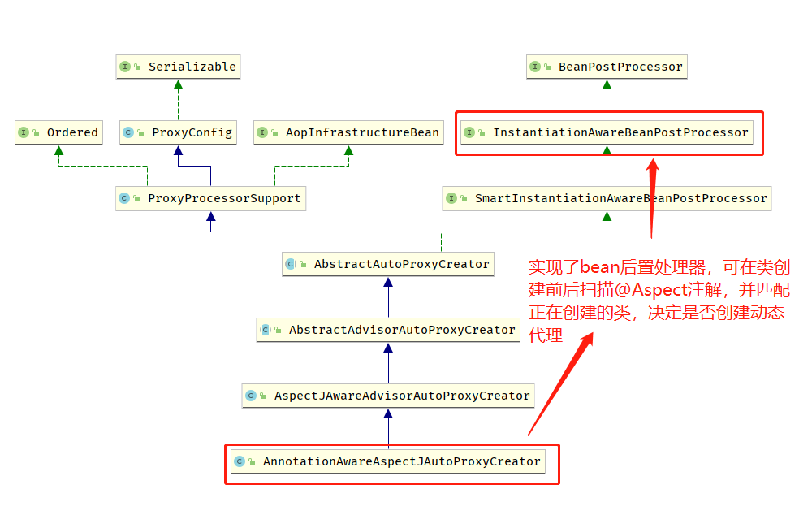
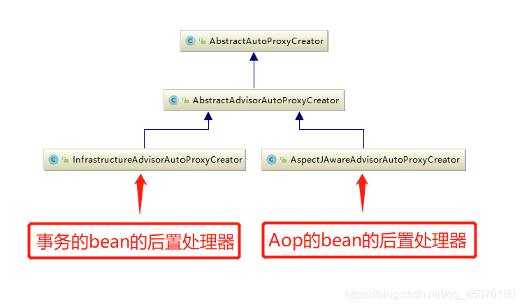
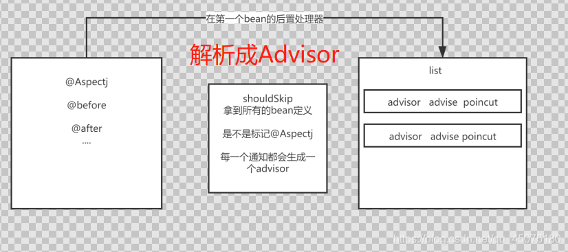
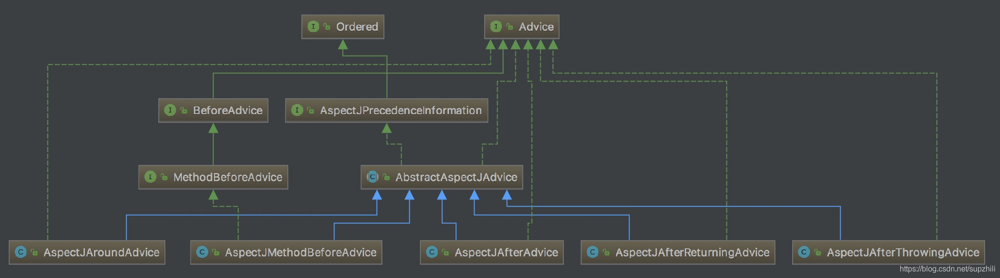

# 第03节 Spring AOP实现原理

## Spring AOP 与 AspectJ 的关系
Spring AOP要实现的是在我们原来写的代码的基础上，进行一定的包装，如在方法执行前、方法返回后、方法抛出异常后等地方进行一定的拦截处理或者增强处理。
Aop依赖于IOC，Aop可以看做是调用IOC的后置处理器来实现的。 
默认地，如果使用接口的，用 JDK 提供的动态代理实现，如果没有接口，使用 CGLIB 实现。
Spring 3.2 以后，spring-core直接就把CGLIB和ASM的源码包括进来了，这也是为什么我们不需要显式的引入这两个依赖。

作为 Java 开发者，我们都很熟悉 AspectJ 这个词，甚至于我们提到 AOP 的时候，想到的往往就是 AspectJ，
但真实情况是Spring虽然提供了AspectJ的支持，但只用到的AspectJ的【切点解析和匹配】。
比如 @Aspect、@Pointcut、@Before、@After 、@Around 等注解都是来自于 AspectJ，
利用AspectJ的解析execution、@Annotation等表达式的能力去解析，
因为AspectJ也是一个优秀的框架，Spring为了不重复造轮子嘛，就利用到了这些。

但是动态代理功能的实现是纯Spring AOP自己实现的。

AspectJ 能干很多Spring AOP干不了的事情，它是AOP编程的完全解决方案。
Spring AOP致力于解决的是【企业级开发中最普遍的AOP需求（方法织入）】，
而不是力求成为一个像AspectJ一样的【AOP编程完全解决方案】。

在性能方面，由于Spring AOP是基于代理实现的，在容器启动的时候需要生成代理实例，在方法调用上也会【增加栈的深度】，
使得Spring AOP的性能不如AspectJ那么好。

Spring AOP术语解释
```text
1) 切面（Aspect）：【横切业务代码】，
    带有@Aspect注解的类，被称为【切面类】，用于存放不同的切点、通知方式（@Around）和切点逻辑等。
2) 连接点（Join point）：【在程序执行过程中某个特定的点】，
    例如某个方法调用的时间点或者处理异常的时间点。
3) 通知（Advice）: 前置通知@Before、后置@After、环绕@Around等等多种通知类型，
    不同的通知类型决定在不同的地方执行【增强代码】。 
    许多AOP框架，包括Spring在内，都是以【拦截器】做通知模型的，并维护着一个以连接点为中心的拦截器链。
4) 顾问（advisor）：是Advice的一种包装，是Pointcut和Advice的一种结合！
5) 切点（Pointcut）：类似于连接点，表示从哪个位置切入，一般与通知关联使用。
6) 织入（Weaving）: 【把通知逻辑切入连接点的过程】
7) 引入（Introduction）： 【把其他接口和实现动态的引入到目标类的过程】
```

问题：为什么spring不使用AspectJ全套的东西呢？而是只使用了部分呢？
猜测原因如下：
```text
①：AspectJ大部分内容是【动态植入】，因为AspectJ编译后的文件是.aj 结尾的，JVM编译后的是.class，
    如果spring使用AspectJ的动态植入，那么就要使用AspectJ的编译器，JVM是肯定编译不了的，无疑增加了开发成本！
    所以spring自己实现了一套代码实现植入增强！
②：Spring在引入别的框架时，理念是取其精华、弃其糟粕。
    取AspectJ对自己有用的理念和切点解析部分，舍弃掉了会增加开发成本的部分！
```

## JDK和Cglib动态代理的区别
相同点 ：
```text
JDK动态代理和Cglib动态代理在 jdk1.7版本后都使用修改字节码的方式来进行代理。
```

不同点：
```text
①：如果目标对象实现了【接口】，默认情况下会采用JDK的动态代理实现AOP。
②：JDK动态代理类实现了【InvocationHandler接口，重写的invoke方法】。
③：JDK动态代理的基础是【反射机制（method.invoke(对象，参数)）Proxy.newProxyInstance()】。
④：如果目标对象没有实现接口，必须采用CGLIB，主要方式是对指定的类生成一个子类，覆盖其中的方法。
    Spring会自动在JDK动态代理和CGLIB之间转换。
⑤：Cglib底层采用ASM字节码生成框架，使用字节码技术生成代理类。
⑥：每一次jdk版本升级，jdk代理效率都得到提升，1.8版本已经略高于CGLIB代理
⑦：Cglib会重复调用动态代理类，而JDK不会！
```

| 代理类型	           | JDK	                                 | Cglib                             |
|-----------------|--------------------------------------|-----------------------------------|
| 使用场景	           | 目标类实现了接口，且未指定ProxyTargetClass = true | 	目标类未实现接口                         |
| 代理类的字节码文件数量	    | 根据接口生成1个$proxy.class文件	              | 根据具体类生成多个cglib.class文件            |
| 调用 原始方法 的方式	    | 反射	                                  | 直接调用（正因为直接调用速度快，所以cglib在调用时比jdk快） |
| 在被增强的方法中调用其他方法时 | 其他方法不会被增强，动态代理类只调用一次                 | 其他方法会被增强，因为每一个方法都会调用动态代理类！        |
| 代码形式	           | InvocationHandler.invoke	            | MethodInterceptor.intercept       |

## Spring AOP应用案例
```
   @Aspect //切面
   @Component
   @Order(Ordered.HIGHEST_PRECEDENCE)
   public class DataSourceAspect { 
      protected Logger logger = LoggerFactory.getLogger(getClass());
      
      // 切入点，寻找带有@DataSource注解的方法
      @Pointcut("@annotation(com.chinalife.policy_manage.common.datasource.annotation.DataSource) " +
      "|| @within(com.chinalife.policy_manage.common.datasource.annotation.DataSource)")
      public void dataSourcePointCut() {
      
      }
      
      // 环绕通知 ProceedingJoinPoint 连接点/切入点
      @Around("dataSourcePointCut()")
      public Object around(ProceedingJoinPoint point) throws Throwable {
      
           MethodSignature signature = (MethodSignature) point.getSignature();
           //获取目标类
           Class targetClass = point.getTarget().getClass();
           //获取目标方法
           Method method = signature.getMethod();
      
           //获取目标类上的@DataSource注解
           DataSource targetDataSource = (DataSource)targetClass.getAnnotation(DataSource.class);
           //获取目标方法上的@DataSource注解
           DataSource methodDataSource = method.getAnnotation(DataSource.class);
      
           //如果@DataSource注解不为空，执行增强逻辑
           if(targetDataSource != null || methodDataSource != null){
               String value;
               if(methodDataSource != null){
                   value = methodDataSource.value();
               }else {
                   value = targetDataSource.value();
               }
      
               DynamicContextHolder.push(value);
               logger.debug("set datasource is {}", value);
           }
      
           try {
               return point.proceed();
           } finally {
               DynamicContextHolder.poll();
               logger.debug("clean datasource");
           }
      }
   }
```

## Spring AOP有几种配置方式？
①： Spring 1.2 基于接口的配置：最早的 Spring AOP 是完全基于几个接口的（如：MethodInterceptor、MethodBeforeAdvice）。
实现MethodBeforeAdvice：≈ 前置通知
```
public class LogAdvice implements MethodBeforeAdvice {
   @Override
   public void before(Method method, Object[] args, Object target) throws Throwable {
      String methodName = method.getName();
      System.out.println("执行目标方法【" + methodName + "】的<前置通知>,入参" + Arrays.asList(args));
   }
}
```
实现MethodInterceptor ≈ 环绕通知
```
public class LogInterceptor implements MethodInterceptor {
   @Override
   public Object invoke(MethodInvocation invocation) throws Throwable {
      System.out.println(getClass()+"调用方法前");
      Object ret=invocation.proceed();
      System.out.println(getClass()+"调用方法后");
      return ret;
   }
}
```
然后把他们注册进容器中！即可实现增强逻辑.

此中方法有个致命的问题，如果我们只能指定单一的Bean的AOP， 如果多个Bean需要创建多个ProxyFactoryBean 。
而且，我们看到，我们的拦截器的粒度只控制到了类级别，类中所有的方法都进行了拦截。

后来有了升级版，通过配置 Advisor（内部封装了Advice通知），精确定位到需要被拦截的方法，
然后使用内部的 Advice 执行逻辑处理。
```
@Bean
public NameMatchMethodPointcutAdvisor logAspect() {
   NameMatchMethodPointcutAdvisor advisor = new NameMatchMethodPointcutAdvisor();
   // 通知(Advice) ：是我们的通知类
   // 通知者(Advisor)：是经过包装后的细粒度控制方式。
   advisor.setAdvice(logAdvice());
   advisor.setMappedNames("div");
   return advisor;
}
```

②： Spring 2.0 XML 配置：Spring 2.0 以后使用 XML 的方式来配置，使用命名空间 ，主要是针对xml形式来配置！
```text
<?xml version="1.0" encoding="UTF-8"?>
<beans xmlns="http://www.springframework.org/schema/beans"
    xmlns:xsi="http://www.w3.org/2001/XMLSchema-instance"
    xmlns:aop="http://www.springframework.org/schema/aop" 
    xsi:schemaLocation="
        http://www.springframework.org/schema/beans 
        http://www.springframework.org/schema/beans/spring-beans.xsd
        http://www.springframework.org/schema/aop 
        http://www.springframework.org/schema/aop/spring-aop.xsd"> 
    
    <!-- bean definitions here -->
    
    <!-- 开启AspectJ注解驱动 -->
    <aop:aspectj-autoproxy/>
    
    <bean id="user" class="com.aop.User"></bean>
    <bean id="myAspect" class="com.aop.MyAspect"></bean>
    
    <aop:config>
        <!-- 配置切面 -->
        <aop:aspect ref="myAspect">
            <!-- 配置切入点 对com.aop.User.login方法进行拦截 -->
            <aop:pointcut expression="execution(* com.aop.User.login(..))" id="myPointcut"/>
            <!-- 将MyAspect的before指定为前置通知-->
            <aop:before method="before" pointcut-ref="myPointcut"/>
        </aop:aspect>
    </aop:config>

</beans>
```
③：Spring 2.0 @AspectJ 配置：使用注解的方式来配置，这种方式感觉是最方便的，还有，这里虽然叫做 @AspectJ，但是这个和 AspectJ 其实没啥关系。
```java
    @Configuration
    @EnableAspectJAutoProxy
    public class AppConfig {
    
      @Bean
      public FooService fooService() {
          return new FooService();
      }
    
      @Bean
      public MyAspect myAspect() {
          return new MyAspect();
      }
    }

    public class FooService {
    
        // various methods
    }
    
    @Aspect
    public class MyAspect {
    
        @Before("execution(* FooService+.*(..))")
        public void advice() {
            // advise FooService methods as appropriate
        }
    }
```

## Spring AOP源码解析

先来看看基于Java配置的Spring启用声明式 AOP的核心注解EnableAspectJAutoProxy的源码注释翻译：
```text
    支持处理用AspectJ的@Aspect注释标记的组件，类似于Spring的<aop:aspectj-autoproxy> XML元素中的功能。
```

Aop源码大概分为以下几步：
```text
1) spring boot 自动配置 AopAutoConfiguration 类中带有@EnableAspectJAutoProxy，
    项目启动即开启对spring AOP的支持，该注解注册了AnnotationAwareAspectJAutoProxyCreator类，
    该类实现了bean的后置处理器，可以在类创建过程中做一些其他操作;
2) 在bean后置处理器的postProcessBeforeInstantiation方法中，解析切面类，把通知封装成Advisor，并放入缓存advisorsCache中;
3) 在创建每一个bean时，在bean的后置处理器中的postProcessAfterInitialization方法中，拿到缓存中所有的Advisor，
    根据切入点PointCut与当前bean做匹配，匹配成功与否决定是否需要创建动态代理！如果匹配到了，则根据实际情况创建动态代理;
4) 调用目标方法时，会调用经过动态代理增强的方法逻辑;
```

### 自动配置类 AopAutoConfiguration 开启对Aop的支持

在spring boot项目中，项目启动时会自动加载(spring.factories)许多自动配置类，以完成项目结构！
其中就有AopAutoConfiguration，该类的作用就是为项目提供Aop的支持，一种是jdk动态代理，一种是cglib动态代理;
```java
@Configuration(proxyBeanMethods = false)
@ConditionalOnProperty(prefix = "spring.aop", name = "auto", havingValue = "true", matchIfMissing = true)
// 自动配置类
public class AopAutoConfiguration {

   @Configuration(proxyBeanMethods = false)
   @ConditionalOnClass(Advice.class)
   static class AspectJAutoProxyingConfiguration {

      @Configuration(proxyBeanMethods = false)
      // 开启自动代理：@EnableAspectJAutoProxy
      @EnableAspectJAutoProxy(proxyTargetClass = false)
      @ConditionalOnProperty(prefix = "spring.aop", name = "proxy-target-class", havingValue = "false",
              matchIfMissing = false)

      // jdk动态代理
      static class JdkDynamicAutoProxyConfiguration {

      }

      @Configuration(proxyBeanMethods = false)
      @EnableAspectJAutoProxy(proxyTargetClass = true)
      @ConditionalOnProperty(prefix = "spring.aop", name = "proxy-target-class", havingValue = "true",
              matchIfMissing = true)

      // Cglib动态代理
      static class CglibAutoProxyConfiguration {

      }
   }
}
```
先看看如下条件配置：
```text
@ConditionalOnProperty(prefix = "spring.aop", name = "auto", havingValue = "true", matchIfMissing = true)
```
表示 当 spring.aop.auto = true 时，开启AOP。
但是 matchIfMissing = true 即表示默认缺省值为true，即表示SpringBoot AOP功能默认是开启的。
还有可以看到**自动配置类AopAutoConfiguration**除了帮我们配置了 jdk动态代理 和 cglib动态代理，
还有一个**注解@EnableAspectJAutoProxy**，其内部通过@Import导入了一个bean定义的注册器**AspectJAutoProxyRegistrar**。
```java
@Target(ElementType.TYPE)
@Retention(RetentionPolicy.RUNTIME)
@Documented
@Import(AspectJAutoProxyRegistrar.class) // 通过`@Import`导入了一个bean定义的注册器
public @interface EnableAspectJAutoProxy {
    
}
```
下面我们来看看@Import注解里面的AspectJAutoProxyRegistrar这个类
```java
/**
 * 根据给定的@EnableAspectJAutoProxy注解，
 * 在当前BeanDefinitionRegistry中注册一个AnnotationAwareAspectJAutoProxyCreator。
 *
 */
class AspectJAutoProxyRegistrar implements ImportBeanDefinitionRegistrar {

    /**
     * 根据导入的@Configuration上的@EnableAspectJAutoProxy.proxyTargetClass()属性的值
     * 注册、升级 和 配置 AspectJ自动代理 创建器。
     */
    @Override
    public void registerBeanDefinitions(
            AnnotationMetadata importingClassMetadata, BeanDefinitionRegistry registry) {
        // 【注册AspectJ 自动代理 创建器】
        AopConfigUtils.registerAspectJAnnotationAutoProxyCreatorIfNecessary(registry);

        AnnotationAttributes enableAspectJAutoProxy =
                AnnotationConfigUtils.attributesFor(importingClassMetadata, EnableAspectJAutoProxy.class);
        if (enableAspectJAutoProxy != null) {
            if (enableAspectJAutoProxy.getBoolean("proxyTargetClass")) {
                AopConfigUtils.forceAutoProxyCreatorToUseClassProxying(registry);
            }
            if (enableAspectJAutoProxy.getBoolean("exposeProxy")) {
                AopConfigUtils.forceAutoProxyCreatorToExposeProxy(registry);
            }
        }
    }
}
```
在看看AopConfigUtils工具类
```text
	@Nullable
	public static BeanDefinition registerAspectJAnnotationAutoProxyCreatorIfNecessary(BeanDefinitionRegistry registry) {
		return registerAspectJAnnotationAutoProxyCreatorIfNecessary(registry, null);
	}

	@Nullable
	public static BeanDefinition registerAspectJAnnotationAutoProxyCreatorIfNecessary(
			BeanDefinitionRegistry registry, @Nullable Object source) {

		return registerOrEscalateApcAsRequired(AnnotationAwareAspectJAutoProxyCreator.class, registry, source);
	}
```
这个注册器帮我们注册了一个Aop中非常重要的类**AnnotationAwareAspectJAutoProxyCreator**！
这个类是AspectJ 自动代理 创建器。

我们先来看看AnnotationAwareAspectJAutoProxyCreator类中Spring官方源码注释翻译：
```text
AnnotationAwareAspectJAutoProxyCreator是AspectJAwareAdvisorAutoProxyCreator子类，
它处理当前应用程序上下文中的所有AspectJ注解切面，以及Spring Advisors。
任何AspectJ注解的类都会被自动识别，如果Spring AOP的基于代理的模型能够应用它们，那么它们的通知就会被应用。
这涵盖了方法执行连接点。
如果使用了<aop:include>元素，那么只有名称与include模式匹配的@AspectJ bean才会被认为是定义了用于Spring自动代理的方面。
Spring advisor的处理遵循org.springframework.aop.framework.autoproxy.AbstractAdvisorAutoProxyCreator中建立的规则。
```
看一下AnnotationAwareAspectJAutoProxyCreator的继承关系：


再来看看AbstractAdvisorAutoProxyCreator类的源码注释翻译：
```text
AbstractAdvisorAutoProxyCreator是 【通用 自动代理 创建器】，基于为每个bean检测到的顾问(Advisor)为特定bean构建AOP代理。
子类可以覆盖findCandidateAdvisors()方法，以返回应用于任何对象的自定义advisor列表。
子类还可以覆盖继承的shouldSkip方法，以从自动代理中排除某些对象。
需要排序的顾问(Advisor)或通知(Advice)应该用@Order注释，或者实现org.springframework.core.Ordered接口。
这个类使用AnnotationAwareOrderComparator对顾问(Advisor)进行排序。
未标注@Order或未实现Ordered接口的顾问(Advisor)将被视为无序，它们将以未定义的顺序出现在顾问(Advisor)链的末尾。
```
该类实现了SmartInstantiationAwareBeanPostProcessor，是一个bean的后置处理器BeanPostProcessor，
可以在类创建bean前后做一些操作，具体如下：
```text
在postProcessBeforeInstantiation方法中，解析切面类，把通知封装成Advisor，并放入缓存advisorsCache中;
在postProcessAfterInitialization方法中，匹配切入点，创建动态代理;
```

### 解析切面类，封装成Advisor

①： 通过bean的后置处理器解析切面类，把通知封装成Advisor，并放入advisorsCache缓存中！
   
与spring事务一样，Aop也是通过 bean的后置处理器 解析带有 @Aspect的bean，这个 bean的后置处理器 在容器创建的时候就被注册，在解析时可以直接调用！

注意：下图中的AspectJAwareAdvisorAutoProxyCreator正是AnnotationAwareAspectJAutoProxyCreator的父类


Spring AOP发生在 **创建bean的时候**，也就是**finishBeanFactoryInitialization()内部**的**createBean()**方法中
```text
	try {
		Object scopedInstance = scope.get(beanName, () -> {
			beforePrototypeCreation(beanName);
			try {
				// 创建bean的方法
				return createBean(beanName, mbd, args);
			}
			finally {
				afterPrototypeCreation(beanName);
			}
		});
		bean = getObjectForBeanInstance(scopedInstance, name, beanName, mbd);
	}
```

在createBean()方法内部，resolveBeforeInstantiation方法，
**会扫描@Aspect注解，解析切面类，把通知封装成Advisor，并放入缓存advisorsCache中**！
```text
	try {
	
		/**
		* 【重要】
		* 第一次调用bean的后置处理器，事务在这里不会被调用，aop的才会被调用
		* 为啥aop在这里调用了？因为在此处需要【解析出对应的切面保存到缓存中】
		*/
		Object bean = resolveBeforeInstantiation(beanName, mbdToUse);
		if (bean != null) {
			return bean;
		}
	}
```

进入resolveBeforeInstantiation方法：
```text
	@Nullable
	protected Object resolveBeforeInstantiation(String beanName, RootBeanDefinition mbd) {
		Object bean = null;
		if (!Boolean.FALSE.equals(mbd.beforeInstantiationResolved)) {
			// 如果有bean后置处理器： InstantiationAwareBeanPostProcessors
			if (!mbd.isSynthetic() && hasInstantiationAwareBeanPostProcessors()) {
				Class<?> targetType = determineTargetType(beanName, mbd);
				if (targetType != null) {
					// 调用 postProcessBeforeInstantiation 方法
					bean = applyBeanPostProcessorsBeforeInstantiation(targetType, beanName);
					if (bean != null) {
						// 调用 postProcessAfterInitialization 方法
						bean = applyBeanPostProcessorsAfterInitialization(bean, beanName);
					}
				}
			}
			mbd.beforeInstantiationResolved = (bean != null);
		}
		return bean;
	}
```

在实例化bean之前，会第一次调用bean的后置处理器，解析到所有的@AspectJ的类，保存到缓存中。
那怎么解析的呢？
进入上文resolveBeforeInstantiation方法中的applyBeanPostProcessorsBeforeInstantiation方法中！
```text
	@Nullable
	protected Object applyBeanPostProcessorsBeforeInstantiation(Class<?> beanClass, String beanName) {
		/**
		 * 获取容器中的所有后置处理器
		 */
		for (BeanPostProcessor bp : getBeanPostProcessors()) {
			// 判断后置处理器是不是InstantiationAwareBeanPostProcessor
			if (bp instanceof InstantiationAwareBeanPostProcessor) {
				// BeanPostProcessor强制转为 InstantiationAwareBeanPostProcessor
				InstantiationAwareBeanPostProcessor ibp = (InstantiationAwareBeanPostProcessor) bp;
				/**
				 * 【很重要】
				 * 我们AOP注解@EnableAspectJAutoProxy 为我们容器中导入了 AnnotationAwareAspectJAutoProxyCreator
				 * 我们事务注解@EnableTransactionManagement 为我们的容器导入了 InfrastructureAdvisorAutoProxyCreator
				 * 都是实现了我们的 BeanPostProcessor接口,InstantiationAwareBeanPostProcessor,
				 * 进行后置处理解析切面
				 */
				Object result = ibp.postProcessBeforeInstantiation(beanClass, beanName);
				if (result != null) {
					return result;
				}
			}
		}
		return null;
	}
```
此处AnnotationAwareAspectJAutoProxyCreator#postProcessBeforeInstantiation方法是继承于父类AbstractAutoProxyCreator
```text
@Override
public Object postProcessBeforeInstantiation(Class<?> beanClass, String beanName) throws BeansException {
        // 构建我们的缓存key
        Object cacheKey = getCacheKey(beanClass, beanName);

		if (!StringUtils.hasLength(beanName) || !this.targetSourcedBeans.contains(beanName)) {
			// 已经被解析过 直接返回
			if (this.advisedBeans.containsKey(cacheKey)) {
				return null;
			}
			/**
			 * 判断是不是基础的bean(aop解析直接解析出我们的切面信息(并且把我们的切面信息进行保存)，而事务在这里是不会解析的)
			 * 判断是不是应该跳过 
			 */
			if (isInfrastructureClass(beanClass) || shouldSkip(beanClass, beanName)) {
				this.advisedBeans.put(cacheKey, Boolean.FALSE);
				return null;
			}
		}
		
		..... // 省略不相关的代码
}

@Override
protected boolean isInfrastructureClass(Class<?> beanClass) {
    // 是不是基础类
    return (super.isInfrastructureClass(beanClass) ||
            // 是不是Aspect切面
            (this.aspectJAdvisorFactory != null && this.aspectJAdvisorFactory.isAspect(beanClass)));
}
```
而super.isInfrastructureClass(beanClass)这个方法来自于AbstractAutoProxyCreator
```text
	protected boolean isInfrastructureClass(Class<?> beanClass) {
		boolean retVal = Advice.class.isAssignableFrom(beanClass) ||
				Pointcut.class.isAssignableFrom(beanClass) ||
				Advisor.class.isAssignableFrom(beanClass) ||
				AopInfrastructureBean.class.isAssignableFrom(beanClass);
		if (retVal && logger.isTraceEnabled()) {
			logger.trace("Did not attempt to auto-proxy infrastructure class [" + beanClass.getName() + "]");
		}
		return retVal;
	}
```
然后调用【切面顾问工厂类AbstractAspectJAdvisorFactory】来判断是否是切面，
aspectJAdvisorFactory.isAspect(beanClass)方法:
```text
	@Override
	public boolean isAspect(Class<?> clazz) {
		return (hasAspectAnnotation(clazz) && !compiledByAjc(clazz));
	}

	private boolean hasAspectAnnotation(Class<?> clazz) {
		return (AnnotationUtils.findAnnotation(clazz, Aspect.class) != null);
	}
```
由于AOP使用的是AnnotationAwareAspectJAutoProxyCreator类，
所以选择这个类中的shouldSkip方法，在所有的bean定义 中选择是否跳过，
如果带有@Aspect注解，就不跳过，把这个类中的带有@Before、@After、@Around等注解的方法封装成一个个Advisor（顾问），
它是Pointcut和Advice的一种结合！ 并添加进集合中。
```text
	@Override
	protected List<Advisor> findCandidateAdvisors() {
		// 找出事务相关的advisor
		List<Advisor> advisors = super.findCandidateAdvisors();
		// 找出Aspect相关的信息之后封装为一个advisor
		if (this.aspectJAdvisorsBuilder != null) {
			advisors.addAll(this.aspectJAdvisorsBuilder.buildAspectJAdvisors());
		}
		// 返回我们所有的通知
		return advisors;
	}
```

buildAspectJAdvisors方法内部会把带有下面的注解的挨个解析成Advisor
```text
	// 获取到切面类中的所有方法，但是该方法不会解析标注了@PointCut注解的方法
	for (Method method : getAdvisorMethods(aspectClass)) {
		// 挨个去解析我们切面中的方法
		Advisor advisor = getAdvisor(method, lazySingletonAspectInstanceFactory, advisors.size(), aspectName);
		if (advisor != null) {
			advisors.add(advisor);
		}
	}

	// 看是否含有这些注解！
	private static final Class<?>[] ASPECTJ_ANNOTATION_CLASSES = new Class<?>[] {
			Pointcut.class, Around.class, Before.class, After.class, AfterReturning.class, AfterThrowing.class
		};
```

把解析到的Advisor放入advisorsCache缓存中
```text
	//加入到缓存中
	if (this.beanFactory.isSingleton(beanName)) {
		this.advisorsCache.put(beanName, classAdvisors);
	}
```

原理图：

注意：以上解析切面的操作，是在bean的第一个后置处理器postProcessBeforeInstantiation中完成的！

## 匹配并创建动态代理
② 根据 Advisor 中的 PointCut 决定当前bean是否创建动态代理

我们都知道创建动态代理的时机是在初始化之后（如果存在循环依赖则在实例化之后！），
所以在源码中创建动态代理在【doCreateBean方法】中的【initializeBean方法】中，
这个方法内部调用了bean的后置处理器postProcessAfterInitialization，在后置处理器中完成了判断和动态代理的创建。
```text
	protected Object initializeBean(final String beanName, final Object bean, @Nullable RootBeanDefinition mbd) {
		if (System.getSecurityManager() != null) {
			AccessController.doPrivileged((PrivilegedAction<Object>) () -> {
				invokeAwareMethods(beanName, bean);
				return null;
			}, getAccessControlContext());
		}
		else {
			// 1.回调各种 Aware 接口
			invokeAwareMethods(beanName, bean);
		}

		Object wrappedBean = bean;
		if (mbd == null || !mbd.isSynthetic()) {
			// 2.调用 BeanPostProcessorsBeforeInitialization 扩展
			wrappedBean = applyBeanPostProcessorsBeforeInitialization(wrappedBean, beanName);
		}

		try {
			// 3.调用 实现InitializingBean的afterPropertiesSet方法
			// 调用xml方式的 bean标签里配置 init-method 属性
			invokeInitMethods(beanName, wrappedBean, mbd);
		}
		catch (Throwable ex) {
			throw new BeanCreationException(
					(mbd != null ? mbd.getResourceDescription() : null),
					beanName, "Invocation of init method failed", ex);
		}
		if (mbd == null || !mbd.isSynthetic()) {
			// 4.调用 BeanPostProcessorsAfterInitialization 扩展，动态代理在这里！
			wrappedBean = applyBeanPostProcessorsAfterInitialization(wrappedBean, beanName);
		}

		return wrappedBean;
	}

   ***********************************************************************************************
   ==================== applyBeanPostProcessorsAfterInitialization 内部创建动代理 ==================
   ***********************************************************************************************

	public Object applyBeanPostProcessorsAfterInitialization(Object existingBean, String beanName)
			throws BeansException {

		Object result = existingBean;
		
		for (BeanPostProcessor processor : getBeanPostProcessors()) {
			/** 【很重要】
			 * 我们【AOP】注解@EnableAspectJAutoProxy 为我们容器中导入了 AnnotationAwareAspectJAutoProxyCreator
			 * 我们【事务】注解@EnableTransactionManagement 为我们的容器导入了 InfrastructureAdvisorAutoProxyCreator
			 * 都是实现了我们的 BeanPostProcessor接口，InstantiationAwareBeanPostProcessor,
			 * 在这里实现的是BeanPostProcessor接口的postProcessAfterInitialization来生成我们的代理对象 */
			Object current = processor.postProcessAfterInitialization(result, beanName);
			if (current == null) {
				return result;
			}
			result = current;
		}
		return result;
	}
```

调用AnnotationAwareAspectJAutoProxyCreator#postProcessAfterInitialization方法继承于父类AbstractAutoProxyCreator抽象类，
AbstractAutoProxyCreator抽象类扩展了这个后置处理器
```text
	/**
	 * 在该后置方法中 我们的事务和aop的代理对象都是在这生成的
	 * @param bean bean实例
	 * @param beanName bean的名称
	 * @return
	 * @throws BeansException
	 */
	@Override
	public Object postProcessAfterInitialization(@Nullable Object bean, String beanName) throws BeansException {
		if (bean != null) {
			// 获取缓存key
			Object cacheKey = getCacheKey(bean.getClass(), beanName);
			// 如果循环依赖时已经创建了代理，在这里把他移除掉！！
			if (this.earlyProxyReferences.remove(cacheKey) != bean) {
				// 找到合适的就会被代理
				return wrapIfNecessary(bean, beanName, cacheKey);
			}
		}
		return bean;
	}
```

调用AbstractAutoProxyCreator#wrapIfNecessary方法如下：
主要内容就是拿到所有通知与当前类匹配，如果匹配成功则创建动态代理
```text
	protected Object wrapIfNecessary(Object bean, String beanName, Object cacheKey) {
		// 已经被处理过
		if (StringUtils.hasLength(beanName) && this.targetSourcedBeans.contains(beanName)) {
			return bean;
		}
		// 排除掉不需要增强的，比如Aop一些基础类
		if (Boolean.FALSE.equals(this.advisedBeans.get(cacheKey))) {
			return bean;
		}
		// 是不是基础的bean 是不是需要跳过的
		if (isInfrastructureClass(bean.getClass()) || shouldSkip(bean.getClass(), beanName)) {
			this.advisedBeans.put(cacheKey, Boolean.FALSE);
			return bean;
		}

		// 【重要】如果Advisor中的切点表达式命中了这个类,就【获取适合本类的通知器Advisor】！
		Object[] specificInterceptors = getAdvicesAndAdvisorsForBean(bean.getClass(), beanName, null);
		// 我们的合适的通知器不为空
		if (specificInterceptors != DO_NOT_PROXY) {
			// 表示当前的对象已经代理模式处理过了
			this.advisedBeans.put(cacheKey, Boolean.TRUE);
			
			// 【很重要】【创建真正的代理对象】
			Object proxy = createProxy(
					bean.getClass(), beanName, specificInterceptors, new SingletonTargetSource(bean));
			// 加入到缓存
			this.proxyTypes.put(cacheKey, proxy.getClass());
			return proxy;
		}

		this.advisedBeans.put(cacheKey, Boolean.FALSE);
		return bean;
	}
```

AbstractAdvisorAutoProxyCreator#getAdvicesAndAdvisorsForBean方法中,
拿到了所有的Advisor与当前bean进行了匹配，返回合适本类的通知器advisor，
如果合适的advisor为空，则返回DO_NOT_PROXY，不需要代理，表示不需要代理。
```text
	protected Object[] getAdvicesAndAdvisorsForBean(
			Class<?> beanClass, String beanName, @Nullable TargetSource targetSource) {
		/**
		 * 找到合适的增强器对象advisor
		 */
		List<Advisor> advisors = findEligibleAdvisors(beanClass, beanName);
		// 若合适的通知器为空，则返回DO_NOT_PROXY，不需要代理
		if (advisors.isEmpty()) {
			return DO_NOT_PROXY;
		}
		return advisors.toArray();
	}
```
AbstractAdvisorAutoProxyCreator#findEligibleAdvisors方法：
```text
    protected List<Advisor> findEligibleAdvisors(Class<?> beanClass, String beanName) {

		// 找到ioc容器中候选的通知（找到Aop扫描到所有通知的Advisor，注意是所有的！！！）
		List<Advisor> candidateAdvisors = findCandidateAdvisors();
		
		// 判断我们的通知Advisor能不能作用到当前的类上，返回合适本类的通知器advisor
		List<Advisor> eligibleAdvisors = findAdvisorsThatCanApply(candidateAdvisors, beanClass, beanName);
		
		// 加了一个内置的advisor
		extendAdvisors(eligibleAdvisors);
		
		// 对我们的advisor进行排序，如果有多个切面类，则根据order排序
		// 排序方式：异常--返回通知--后置通知--前置通知
		// 这样排序的原因是，后边调用目标方法会讲！！
		if (!eligibleAdvisors.isEmpty()) {
			eligibleAdvisors = sortAdvisors(eligibleAdvisors);
		}
		return eligibleAdvisors;
	}
```

findAdvisorsThatCanApply的调用链很深，这里就不再跟进了。

以上代码其实都是匹配顾问(Advisor)阶段的代码，
如果匹配成功，即找到beanName对应的顾问(Advisor)或者拦截器，则进入上文wrapIfNecessary方法中的createProxy方法中，开始真正创建动态代理对象。

AbstractAutoProxyCreator#createProxy方法中由ProxyFactory代理工厂来创建的代理：
```text
	// 创建一个代理对象工厂
	ProxyFactory proxyFactory = new ProxyFactory();
	
	......
	
	// 真正的创建代理对象
	return proxyFactory.getProxy(getProxyClassLoader());
```
通过代理工厂方法，ProxyFactory#getProxy()方法：
```text
	public Object getProxy(@Nullable ClassLoader classLoader) {
		return createAopProxy().getProxy(classLoader);
	}
```
ProxyFactory#createAopProxy(): 该方法用来创建我们的代理对象。
```text
@Override
public AopProxy createAopProxy(AdvisedSupport config) throws AopConfigException {
    // 判断我们是否前置指定使用cglib代理ProxyTargetClass = true、false
    // 判断是否实现了接口
    // 判断是否是Optimize() 可手动设置，一般为false
    // 三个判断只要有一个是true，就会使用cglib动态代理！
    if (config.isOptimize() || config.isProxyTargetClass() || hasNoUserSuppliedProxyInterfaces(config)) {
        Class<?> targetClass = config.getTargetClass();
        if (targetClass == null) {
            throw new AopConfigException("TargetSource cannot determine target class: " +
                "Either an interface or a target is required for proxy creation.");
        }
        // 所targetClass是接口 使用的就是jdk动态代理
       if (targetClass.isInterface() || Proxy.isProxyClass(targetClass)) {
           return new JdkDynamicAopProxy(config);
       }
       // cglib动态代理
       return new ObjenesisCglibAopProxy(config);
    } else {
        // jdk动态代理
        return new JdkDynamicAopProxy(config);
    }
}
```
代理形式由 **ProxyTargetClass** 和 **是否实现接口** 来决定！！
```text
①：我们代理的类没有实现接口，那么会直接走cglib代理
②：我们代理的类实现了接口，且ProxyTargetClass 指定为false才会走jdk动态代理，如果ProxyTargetClass指定的有值，则还是使用cglib代理。
```
然后根据具体的代理工厂来创建代理对象：
```text
    getProxy(classLoader)
```
至此，目标类的动态代理创建完成！


## 调用代理类增强逻辑
③ 调用目标方法

如果使用的时jdk动态代理，在调用目标方法时会进入JdkDynamicAopProxy中的**invoke**方法，把【通知】加入 责任链，
把Advisor转换成Interceptor，通过责任链的方式递归调用**proceed()**方法完成对方法的增强调用处理。
```text
	@Override
	@Nullable
	public Object invoke(Object proxy, Method method, Object[] args) throws Throwable {
		Object oldProxy = null;
		boolean setProxyContext = false;
		// 获取到我们的目标对象
		TargetSource targetSource = this.advised.targetSource;
		Object target = null;

		try {
			// 若执行代理对象的equals方法不需要代理
			if (!this.equalsDefined && AopUtils.isEqualsMethod(method)) {
				// The target does not implement the equals(Object) method itself.
				return equals(args[0]);
			}
			// 若执行的是hashCode方法 不需要代理
			else if (!this.hashCodeDefined && AopUtils.isHashCodeMethod(method)) {
				// The target does not implement the hashCode() method itself.
				return hashCode();
			}
			// 若执行的class对象是DecoratingProxy 也不要拦截器执行
			else if (method.getDeclaringClass() == DecoratingProxy.class) {
				// There is only getDecoratedClass() declared -> dispatch to proxy config.
				return AopProxyUtils.ultimateTargetClass(this.advised);
			}
			else if (!this.advised.opaque && method.getDeclaringClass().isInterface() &&
					method.getDeclaringClass().isAssignableFrom(Advised.class)) {
				// Service invocations on ProxyConfig with the proxy config...
				return AopUtils.invokeJoinpointUsingReflection(this.advised, method, args);
			}

			Object retVal;

			/**
			 * 这个配置很重要很实用【暴露我们的代理对象到线程变量中】需要搭配@EnableAspectJAutoProxy(exposeProxy = true)
			 * 一起使用.
			 * 比如我们的aop中 multi和 mode方法都是被切入的方法，但是在切入的方法中通过
			 * this来调用另外一个方法的时候,那么该方法就不会被代理执行，而是通过方法内部执行
			 * 还有的就是事务方法调用事务方法的时候 也需要这样
			 */
			if (this.advised.exposeProxy) {
				// 把我们的代理对象暴露到线程变量中
				oldProxy = AopContext.setCurrentProxy(proxy);
				setProxyContext = true;
			}

			// 获取我们的目标对象
			target = targetSource.getTarget();
			// 获取我们目标对象的class
			Class<?> targetClass = (target != null ? target.getClass() : null);

			// 把我们的aop的【advisor】转化为【拦截器】，相当于责任链的Handler顶级接口
			List<Object> chain = this.advised.getInterceptorsAndDynamicInterceptionAdvice(method, targetClass);

			// 加入我们的拦截器链为空
			if (chain.isEmpty()) {
				// 通过反射直接调用执行
				Object[] argsToUse = AopProxyUtils.adaptArgumentsIfNecessary(method, args);
				retVal = AopUtils.invokeJoinpointUsingReflection(target, method, argsToUse);
			}
			else {
				// 创建一个方法调用对象
				MethodInvocation invocation =
						new ReflectiveMethodInvocation(proxy, target, method, args, targetClass, chain);
				// 调用执行，注意proceed方法是递归调用，
				// 会把需要的通知 通过责任链模式全部调用
				retVal = invocation.proceed();
			}

			Class<?> returnType = method.getReturnType();
			if (retVal != null && retVal == target &&
					returnType != Object.class && returnType.isInstance(proxy) &&
					!RawTargetAccess.class.isAssignableFrom(method.getDeclaringClass())) {
		
				retVal = proxy;
			}
			else if (retVal == null && returnType != Void.TYPE && returnType.isPrimitive()) {
				throw new AopInvocationException(
						"Null return value from advice does not match primitive return type for: " + method);
			}
			return retVal;
		}
		finally {
			if (target != null && !targetSource.isStatic()) {
				targetSource.releaseTarget(target);
			}
			if (setProxyContext) {
				AopContext.setCurrentProxy(oldProxy);
			}
		}
	}
```
注意：如果是jdk动态代理，在invoke方法中，会把 代理对象 暴露到 本地线程变量ThreadLocal 中，
这样做的目的是：在A方法中调用另一个B方法时，保证两个方法都享受到动态代理的增强！ 
如果没有暴露出来，那么在调用B方法时，B方法是不会有增强逻辑的！
而cglib就不存在这样的问题，因为他每次调用都会重新获取代理对象！

把advisor转化为Interceptor拦截器，用于责任链调用，这个拦截器就相当于责任链中的顶级接口Handler。
然后递归调用**proceed方法**。
```text
	@Override
	@Nullable
	public Object proceed() throws Throwable {
		// 执行到了最后一个拦截器的时候（从-1开始,结束条件执行目标方法是下标=拦截器的长度-1）
		if (this.currentInterceptorIndex == this.interceptorsAndDynamicMethodMatchers.size() - 1) {
			// 如果责任链运行到了最后一个，表示增强代码结束，开始运行我们自己的代码逻辑
			return invokeJoinpoint();
		}

		/**
		 * 获取第一个方法拦截器，按照之前排好序的advisor获取 
		 * 顺序为：（新增的内置拦截器）-- 异常--返回通知--后置通知--前置通知
		 */
		Object interceptorOrInterceptionAdvice =
				this.interceptorsAndDynamicMethodMatchers.get(++this.currentInterceptorIndex);
		if (interceptorOrInterceptionAdvice instanceof InterceptorAndDynamicMethodMatcher) {
			InterceptorAndDynamicMethodMatcher dm =
					(InterceptorAndDynamicMethodMatcher) interceptorOrInterceptionAdvice;
			if (dm.methodMatcher.matches(this.method, this.targetClass, this.arguments)) {
				return dm.interceptor.invoke(this);
			}
			else {
				return proceed();
			}
		}
		else {
			// 在这个地方需要注意，抵用第一个拦截器的invoke方法，传入的是this 当前的方法拦截器对象
			return ((MethodInterceptor) interceptorOrInterceptionAdvice).invoke(this);
		}
	}
```

问题：那么为什么之前要按照 异常–返回通知–后置通知–前置通知 的方式来排序呢？

答：是因为在递归调用时，递归的过程最底层的通知（前置通知）首先被执行，然后才会有归的过程。 
所以为了使通知顺序保持 前置通知 – 目标方法 – 异常通知(如果有异常) – 返回通知 – 后置通知 的顺序，就必须按照这样排序！

## 五种通知的类图


## 五种通知执行顺序

### 目标方法无异常时
```text
①：前置通知
②：环绕通知的调用目标方法之前的代码
③：目标方法
④：环绕通知的调用目标方法之后的代码
⑤：返回通知
⑥：后置通知
```

### 在目标方法抛出异常的情况下
```text
①：前置通知
②：环绕通知的调用目标方法之前的代码
③：目标方法 抛出异常 异常通知
④：后置通知
```
