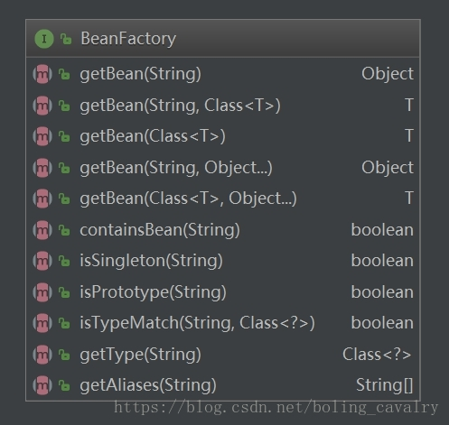
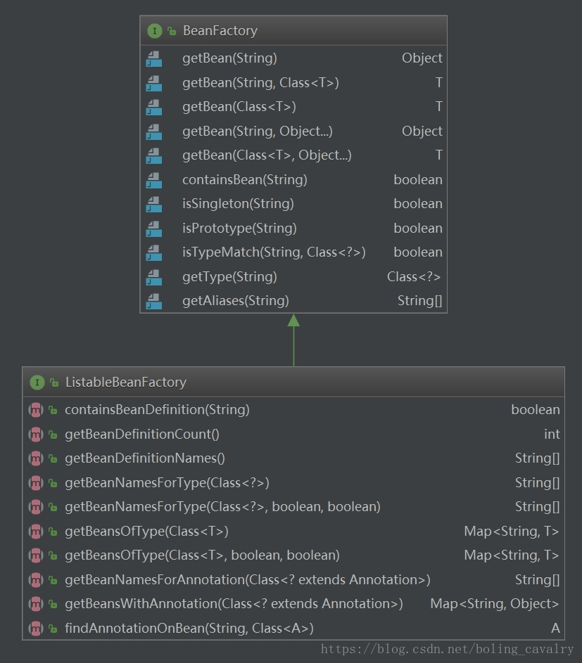
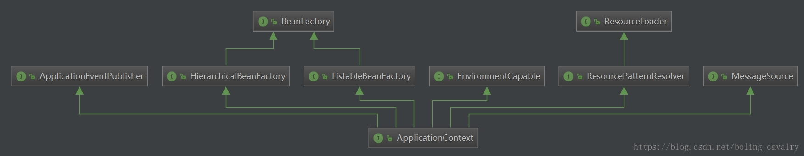

# 第04节 BeanFactory和ApplicationContext的区别

## 简介
BeanFactory是ApplicationContext的顶级接口，
ApplicationContext在前者的基础上又增加了很多扩展点，
例如：注解处理，bean扫描和AOP代理等等。和BeanFactory相比更值得推荐。

对于许多扩展容器功能，BeanPostProcessor扩展点是必不可少的。
如果仅使用普通的DefaultListableBeanFactory，
也就是通过BeanFactory创建bean，默认情况下不会检测到并激活bean后置处理器。 
此时的bean只是一个空的bean，属性注入、aop都没有。
也就是说BeanFactory只负责生产bean，而ApplicationContext除了生产bean，还能提供很多的扩展功能，更加全面、强大。

| 功能                            | BeanFactory | ApplicationContext |
|-------------------------------|-------------|--------------------|
| Bean实例化/装配                    | Yes	        | Yes                |
| 集成的生命周期管理                     | No	         | Yes                |
| 自动注册  BeanPostProcessor       | 	No	        | Yes                |
| 自动注册 BeanFactoryPostProcessor | 	No         | Yes                |
| 便利的 MessageSource 访问 (国际化)	   | No          | Yes                |
| 内置ApplicationEvent 发布机制       | 	No         | Yes                |

## 分析

### BeanFactory接口
在spring容器中，BeanFactory接口是IOC容器要实现的最基础的接口，定义了管理bean的最基本的方法，
例如获取实例、基本的判断等，如下图：



BeanFactory有多个子接口来进一步扩展bean相关的功能，以下两个与本文有直接关系，需要关注：

I) HierarchicalBeanFactory：
```text
    beanFactory可以设置ParentBeanFactory，这个接口的两个方法都和ParentBeanFactory相关的，
    getParentBeanFactory方法返回ParentBeanFactory，
    containsLocalBean方法是相对containsBean方法而言的，containsBean方法找不到bean的时候会通过ParentBeanFactory去找，而containsLocalBean只在当前beanFactory找；
```

II) ListableBeanFactory：
主要用于获取bean相关信息，例如获取所有bean名称，查找指定类型的所有bean等，如下图：


### ApplicationContext接口

关于ApplicationContext和BeanFactory的关系，看类图即可一目了然：


原来ApplicationContext继承了HierarchicalBeanFactory和ListableBeanFactory，
也就是说前面看到的接口特性都被ApplicationContext继承下来了，另外通过类图可以发现，
ApplicationContext还继承了诸如Environment、Resource、Message、Event 等相关的接口，
也就是说除了bean的管理配置相关的能力，
ApplicationContext还拥有了Environment（环境）、MessageSource（国际化）、ResourceLoader（资源）、
ApplicationEventPublisher（应用事件）等服务相关的接口，
简单的说ApplicationContext是以bean管理为基础的综合能力扩展，用于满足业务对Spring综合能力的需要；

再看看ApplicationContext源码，除了继承，它自身也提供了一些扩展的能力：
```java
public interface ApplicationContext extends EnvironmentCapable, ListableBeanFactory, HierarchicalBeanFactory,
MessageSource, ApplicationEventPublisher, ResourcePatternResolver {

    //标识当前context实例的id，最终会通过native方法来生成：System.identityHashCode
    String getId();

    //返回该context所属的应用名称，默认为空字符串，在web应用中返回的是servlet的contextpath 
    String getApplicationName();

    //返回当前context的名称
    String getDisplayName();

    //返回context第一次被加载的时间
    long getStartupDate();

    //返回该context的parent
    ApplicationContext getParent();

    //返回具有自动装配能力的beanFactory，默认返回的就是初始化时实例化的beanFactory
    AutowireCapableBeanFactory getAutowireCapableBeanFactory() throws IllegalStateException;
}
```

小结：
I) BeanFactory是基础，BeanFactory和它的子接口定义的API满足了spring环境中对bean管理和配置的需求；
II) ApplicationContext是扩展，以BeanFactory为主线，通过继承的方式综合了环境、国际化、资源、事件等多条支线，
    自己又规定了一些扩展服务（如返回context的id，应用名称等），而所有支线都以bean服务为基础；

### 实现类解析

如果有个类实现了ApplicationContext接口，就必须实现上述多个接口定义的方法，这个类岂不是很复杂？
我们看看AbstractApplicationContext类的源码，这是个基础抽象类，
常用的ClassPathXmlApplicationContext、AnnotationConfigServletWebServerApplicationContext等都继承自AbstractApplicationContext；

先看看AbstractApplicationContext类是如何实现BeanFactory接口中定义的方法的：
```text
    @Override
    public Object getBean(String name) throws BeansException {
        assertBeanFactoryActive();
        return getBeanFactory().getBean(name);
    }

    @Override
    public <T> T getBean(String name, Class<T> requiredType) throws BeansException {
        assertBeanFactoryActive();
        return getBeanFactory().getBean(name, requiredType);
    }

    @Override
    public <T> T getBean(Class<T> requiredType) throws BeansException {
        assertBeanFactoryActive();
        return getBeanFactory().getBean(requiredType);
    }

    @Override
    public Object getBean(String name, Object... args) throws BeansException {
        assertBeanFactoryActive();
        return getBeanFactory().getBean(name, args);
    }

    @Override
    public <T> T getBean(Class<T> requiredType, Object... args) throws BeansException {
        assertBeanFactoryActive();
        return getBeanFactory().getBean(requiredType, args);
    }

    @Override
    public boolean containsBean(String name) {
        return getBeanFactory().containsBean(name);
    }

    @Override
    public boolean isSingleton(String name) throws NoSuchBeanDefinitionException {
        assertBeanFactoryActive();
        return getBeanFactory().isSingleton(name);
    }

    @Override
    public boolean isPrototype(String name) throws NoSuchBeanDefinitionException {
        assertBeanFactoryActive();
        return getBeanFactory().isPrototype(name);
    }

    @Override
    public boolean isTypeMatch(String name, Class<?> targetType) throws NoSuchBeanDefinitionException {
        assertBeanFactoryActive();
        return getBeanFactory().isTypeMatch(name, targetType);
    }

    @Override
    public Class<?> getType(String name) throws NoSuchBeanDefinitionException {
        assertBeanFactoryActive();
        return getBeanFactory().getType(name);
    }

    @Override
    public String[] getAliases(String name) {
        return getBeanFactory().getAliases(name);
    }
```

看过上述代码后恍然大悟，原来AbstractApplicationContext并没有自己来完成bean的管理配置，
而是全部委托给了getBeanFactory()方法返回的这个实例，接口是组合，实现也是组合，这种清晰的设计是学习典范；

再来看看getBeanFactory()方法，解释究竟是谁在真正的提供bean的管理配置服务，
该方法的实现在AbstractApplicationContext的子类AbstractRefreshableApplicationContext中，
代码很简单，返回了成员变量beanFactory：
```text
public final ConfigurableListableBeanFactory getBeanFactory() {
    synchronized (this.beanFactoryMonitor) {
        if (this.beanFactory == null) {
            throw new IllegalStateException("BeanFactory not initialized or already closed - " +
                "call 'refresh' before accessing beans via the ApplicationContext");
        }
        return this.beanFactory;
    }
}
```

该成员变量在refreshBeanFactory方法中实例化，
而refreshBeanFactory方法又是在spring容器初始化的时候调用的，
所以容器初始化之后，AbstractApplicationContext就具备了bean管理配置的能力；

### 扩展思考
看了AbstractApplicationContext类中beanFactory相关的代码，
我就猜想：莫非Message支线也是这个套路，委托给Message服务相关的实例来完成？看代码吧：
```text
    @Override
    public String getMessage(String code, Object args[], String defaultMessage, Locale locale) {
        return getMessageSource().getMessage(code, args, defaultMessage, locale);
    }

    @Override
    public String getMessage(String code, Object args[], Locale locale) throws NoSuchMessageException {
        return getMessageSource().getMessage(code, args, locale);
    }

    @Override
    public String getMessage(MessageSourceResolvable resolvable, Locale locale) throws NoSuchMessageException {
        return getMessageSource().getMessage(resolvable, locale);
    }
```

如上所示，果然如此，Message相关的接口实现，都是getMessageSource()方法返回的实例在承担，
getMessageSource()方法返回的是成员变量messageSource，
该成员变量也是在spring容器初始化的时候，调用initMessageSource方法生成的；

至此，通过查看源码，我们对spring的BeanFactory和ApplicationContext有了更清晰的认识，
又经历了一次结合类图分析源码的实践，在您学习spring的路上，希望本文能助您一臂之力，一起学习、共同进步；
