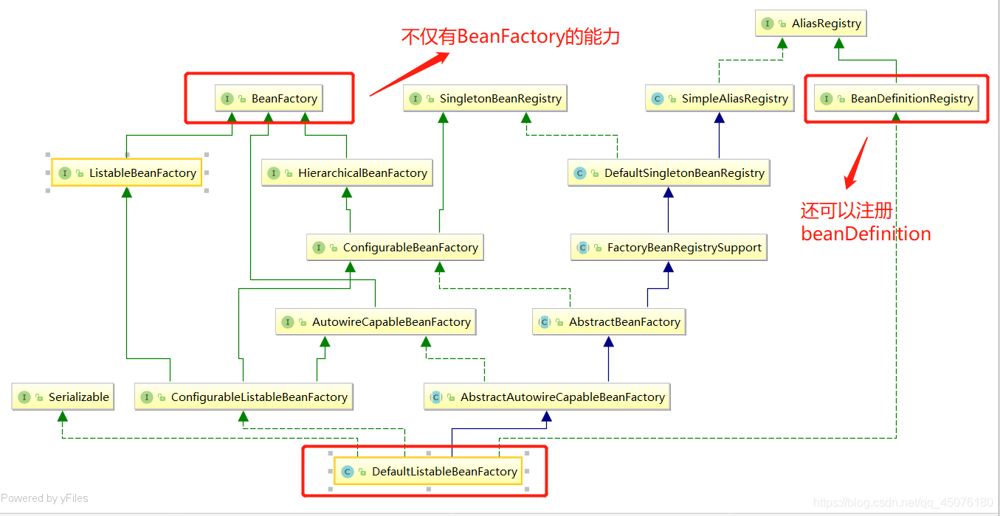
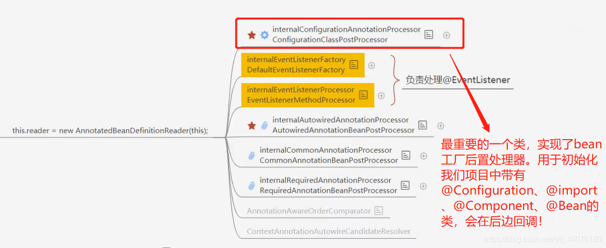
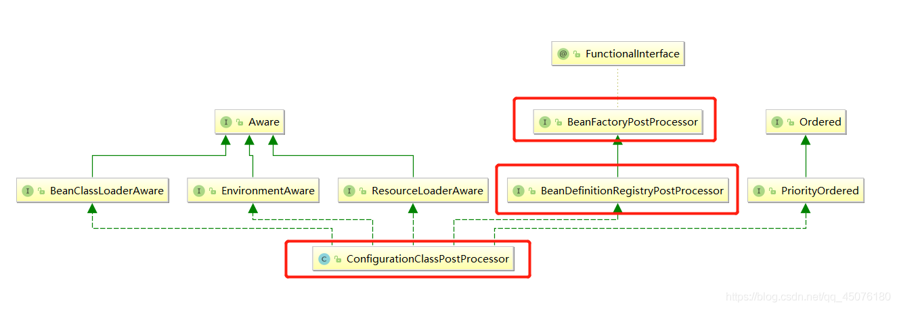
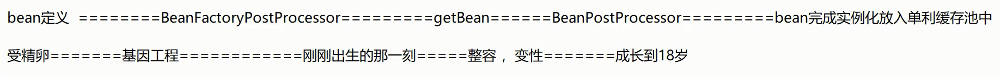
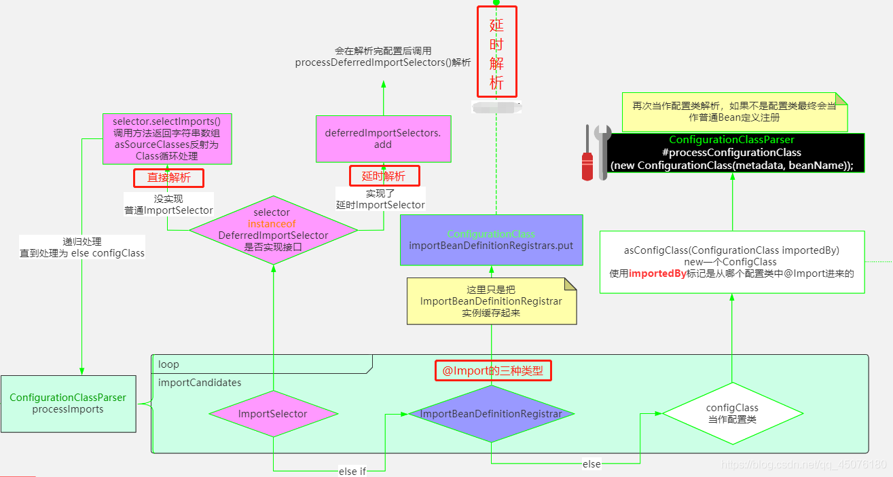
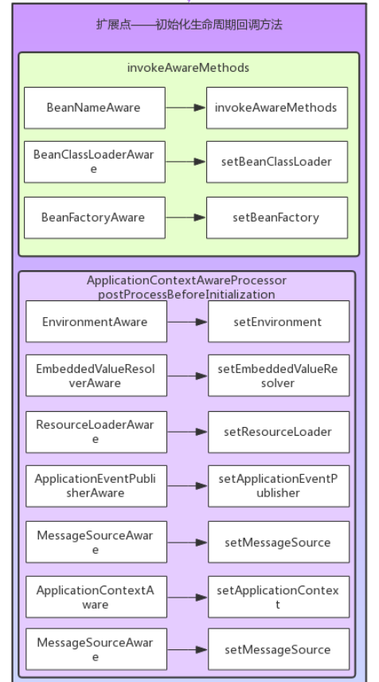

# 第05节 Spring IOC 与 Bean的加载过程

## 一、Spring配置IOC容器的方式
我们可以通过 new ApplicationContext() 去加载spring容器/上下文。
通过不同的配置方式又有以下两种加载容器的方式：

①：通过xml配置文件 ** new ClassPathXmlApplicationContext**
```text
context = new ClassPathXmlApplicationContext("xml");
```

②：通过注解@bean等注解 new AnnotationConfigApplicationContext
```text
context = new AnnotationConfigApplicationContext(MainConfig.class);
```

第一种通过xml配置文件获取的方式，内部的代码是耦合的。也就是说读取器读取配置类、扫描bean对象、注册bean定义这些操作是由上往下写死在代码里的。

第二种通过注解方式获取容器思想比较先进，它通过扩展BeanFactory后置处理器并可插拔的方式，也完成了上述功能，并实现了代码解耦！

所以就从new AnnotationConfigApplicationContext(MainConfig.class)开始讲ioc的加载过程吧!

注意：当使用springboot时，则采用 ServletWebServerApplicationContext() 来加载容器，
这种加载方式不改变原有IOC容器的加载过程，只不过在这个基础上做了一些扩展，比如：加载自动配置类，创建Servlet容器。

## 二、Spring IOC初始化流程

### ①：初始化容器DefaultListableBeanFactory
```text
// 加载spring上下文
public AnnotationConfigApplicationContext(Class... componentClasses) {
        // 调用无参构造方法，下文会讲
        this();

		// 把配置类注册成一个Bean定义，并put到ConcurrentHashMap（Bean定义池）中，因为后边要解析这个类
        this.register(componentClasses);

		// spring容器刷新接口，bean的加载和销毁都体现了，是最重要的方法
        this.refresh();
    }
```

this()方法会调用无参构造方法，主要有三大步：
```text
①：初始化容器DefaultListableBeanFactory
②：初始化读取器AnnotatedBeanDefinitionReader
③：初始化扫描器ClassPathBeanDefinitionScanner
```
this() 方法如下：
```text
    public AnnotationConfigApplicationContext() {
		// 在这里会隐式调用父类的构造方法，初始化DefaultListableBeanFactory

    	// 初始化读取配置类reader，下文会进行读取。在其内部初始化了一些创世纪的bean定义，是spring内部的类，用于服务其他bean！
        this.reader = new AnnotatedBeanDefinitionReader(this);

		// 扫描器，它仅仅是在我们外部手动调用 .scan 等方法才有用，常规方式是不会用到scanner对象的
        this.scanner = new ClassPathBeanDefinitionScanner(this);
    }
```

首先 隐式调用父类的构造方法，初始化DefaultListableBeanFactory作为容器
```text
this.beanFactory = new DefaultListableBeanFactory();
```
为什么容器要使用DefaultListableBeanFactory呢？可以看一下DefaultListableBeanFactory的继承体系

可以看到为什么选择DefaultListableBeanFactory作为容器了吧！因为DefaultListableBeanFactory在BeanFactory的基础上，有很大提升！


### ②：创建读取器，初始化spring IOC容器核心处理类

接下来回到this()方法的 new AnnotatedBeanDefinitionReader(this)中，它有什么作用呢？

在它的内部初始化了很多维持spring功能的最原始的Bean定义，
比如**ConfigurationClassPostProcessor**、XxxBeanPostProcessor等等！如下图所示：


核心代码如下：
```text
		Set<BeanDefinitionHolder> beanDefs = new LinkedHashSet<>(8);
		// 创建 ConfigurationClassPostProcessor 的bean定义
		if (!registry.containsBeanDefinition(CONFIGURATION_ANNOTATION_PROCESSOR_BEAN_NAME)) {
			RootBeanDefinition def = new RootBeanDefinition(ConfigurationClassPostProcessor.class);
			def.setSource(source);
			beanDefs.add(registerPostProcessor(registry, def, CONFIGURATION_ANNOTATION_PROCESSOR_BEAN_NAME));
		}
		// 创建 AutowiredAnnotationBeanPostProcessor的bean定义
		if (!registry.containsBeanDefinition(AUTOWIRED_ANNOTATION_PROCESSOR_BEAN_NAME)) {
			RootBeanDefinition def = new RootBeanDefinition(AutowiredAnnotationBeanPostProcessor.class);
			def.setSource(source);
			beanDefs.add(registerPostProcessor(registry, def, AUTOWIRED_ANNOTATION_PROCESSOR_BEAN_NAME));
		}

		// 创建 CommonAnnotationBeanPostProcessor 的bean定义
		if (jsr250Present && !registry.containsBeanDefinition(COMMON_ANNOTATION_PROCESSOR_BEAN_NAME)) {
			RootBeanDefinition def = new RootBeanDefinition(CommonAnnotationBeanPostProcessor.class);
			def.setSource(source);
			beanDefs.add(registerPostProcessor(registry, def, COMMON_ANNOTATION_PROCESSOR_BEAN_NAME));
		}
	
		// 创建其他 为spring提供基础功能的其他bean定义  省略.....
```

其中ConfigurationClassPostProcessor实现BeanDefinitionRegistryPostProcessor接口， 
BeanDefinitionRegistryPostProcessor接口又扩展了BeanFactoryPostProcessor接口，
BeanFactoryPostProcessor是Spring的扩展点之一，
ConfigurationClassPostProcessor是Spring极为重要的一个类，必须牢牢的记住上面所说的这个类和它的继承关系，如下图：


由于ConfigurationClassPostProcessor实现了BeanDefinitionRegistryPostProcessor接口，
所以必会重写BeanDefinitionRegistryPostProcessor接口的postProcessBeanDefinitionRegistry方法，
重写该方法主要是为了：
读取配置类，解析@ComponentScan、@Import、@ImportResource、@Bean等注解，
并把他们注册为bean定义，不过该过程是放在bean工厂的后置处理器中去做，
通过refresh()方法中的【invokeBeanFactoryPostProcessors方法】回调的方式去调用！
```java
public interface BeanDefinitionRegistryPostProcessor extends BeanFactoryPostProcessor {

	// 该方法可以【注册bean定义】
	void postProcessBeanDefinitionRegistry(BeanDefinitionRegistry registry) throws BeansException;
}
```

### ③：注册配置类的bean定义(BeanDefinition)

register方法会把配置类注册成一个Bean定义，并put到ConcurrentHashMap（Bean定义池，此时的池中已有spring的创世类）中，
后边要通过refresh()方法中的invokeBeanFactoryPostProcessors方法回调解析。
解析其实是分析这个类所带有的元素，比如@Component、@Import所携带的其他元素！
这个过程是ConfigurationClassPostProcessor做的！
```text
    public void register(Class... componentClasses) {
        Assert.notEmpty(componentClasses, "At least one component class must be specified");
        
        //可以看到，上文的读取器在这里使用到，读取了配置类
        this.reader.register(componentClasses);
    }
```

继续往下跟源码，会看到
```text
    public static void registerBeanDefinition(BeanDefinitionHolder definitionHolder, 
            BeanDefinitionRegistry registry) throws BeanDefinitionStoreException {
        String beanName = definitionHolder.getBeanName();
        
        // 注册bean定义，是在DefaultListableBeanFactory中做的实现
        registry.registerBeanDefinition(beanName, definitionHolder.getBeanDefinition());
        String[] aliases = definitionHolder.getAliases();
        if (aliases != null) {
            String[] var4 = aliases;
            int var5 = aliases.length;

            for(int var6 = 0; var6 < var5; ++var6) {
                String alias = var4[var6];
                registry.registerAlias(beanName, alias);
            }
        }
    }
```

registerBeanDefinition方法如下：
```text
this.beanDefinitionMap.put(beanName, beanDefinition);
```
```text
private final Map<String, BeanDefinition> beanDefinitionMap = new ConcurrentHashMap(256);
```

可以看到确实把bean定义放入了ConcurrentHashMap（bean定义池中）。

### ④：refresh()方法: Spring IOC容器 初始化方法

其实到这里，Spring还没有进行扫描，只是实例化了一个工厂，注册了一些内置的Bean和我们传进去的配置类，真正的大头是在第三行代码refresh()。

AbstractApplicationContext#refresh()方法：
```text
    public void refresh() throws BeansException, IllegalStateException {
        Object var1 = this.startupShutdownMonitor;
        synchronized(this.startupShutdownMonitor) {
        	// 1 刷新预处理，和主流程关系不大，就是保存了容器的启动时间，启动标志等
            this.prepareRefresh();
            
            // 2 这个方法和主流程关系也不是很大，可以简单的认为，就是把beanFactory取出来而已。XML模式下会在这里读取BeanDefinition
            ConfigurableListableBeanFactory beanFactory = this.obtainFreshBeanFactory();

			// 3 还是一些准备工作，添加了两个后置处理器：ApplicationContextAwareProcessor，ApplicationListenerDetector ,
			// 还设置了忽略自动装配 和 允许自动装配的接口,如果不存在某个bean的时候，spring就自动注册singleton bean
			// 还设置了bean表达式解析器等
            this.prepareBeanFactory(beanFactory);

            try {	
            	// 4 空方法，留给我们做实现,可能以后Spring会进行扩展
                this.postProcessBeanFactory(beanFactory);
                
                // 5 执行自定义的BeanFactoryProcessor和内置的BeanFactoryProcessor，并实例化，帮我们扫描到@ComponentScan、@Component等类
                // 【重要：注册BeanDefinition】
                this.invokeBeanFactoryPostProcessors(beanFactory);

				/** 6 在生成bean之前需要先注册bean后置处理器
				  * 例如： 
				  * AutowiredAnnotationBeanPostProcessor(处理被@Autowired注解修饰的bean并注入) 
				  * RequiredAnnotationBeanPostProcessor(处理被@Required注解修饰的方法) 
				  * CommonAnnotationBeanPostProcessor(处理@PreDestroy、@PostConstruct、@Resource等多个注解的作用)等。
				  */
                this.registerBeanPostProcessors(beanFactory);

				// 7 初始化国际化资源处理器
                this.initMessageSource();

				// 8 创建事件多播器
                this.initApplicationEventMulticaster();

				// 9 模板方法，在容器刷新的时候可以自定义逻辑，不同的Spring容器做不同的事情。
                this.onRefresh();

				// 10 注册监听器，广播early application events
                this.registerListeners();		
                
                // 11 循环bean定义池，实例化剩余的单例bean，这里是真正的ioc和bean的加载过程!!!!!	
                // 【重要: 实例化、初始化bean】
                this.finishBeanFactoryInitialization(beanFactory);
                
                this.finishRefresh();
            } catch (BeansException var9) {
                if (this.logger.isWarnEnabled()) {
                    this.logger.warn("Exception encountered during context initialization - cancelling refresh attempt: " + var9);
                }
                this.destroyBeans();
                this.cancelRefresh(var9);
                throw var9;
            } finally {
                this.resetCommonCaches();
            }
        }
    }
```
refresh方法中有两个非常重要的方法
```text
invokeBeanFactoryPostProcessors(beanFactory); // 注册beanDefinition

finishBeanFactoryInitialization(beanFactory); // 实例化、初始化bean
```

#### invokeBeanFactoryPostProcessors(beanFactory)方法

调用**BeanFactoryPostProcessor**后置处理器的实现类**ConfigurationClassPostProcessor**，
去解析配置类上边的注解，解析完成后扫描配置类上所有的@Import、@ComponentScan等注解所包含的类，
通过Component过滤器过滤掉不需要的类后，把有用的类注册成bean定义！

注意：
   ```
      1) @ComponentScan扫描的类会被优先注册bean定义;
      2) @Import、@ImportResource导入的类首先被加入到Map中，并延迟注册！ 
         注意：通过@Import可以为容器中导入bean定义，多用于集成其他组件，
         例如springboot的自动配置，就是用的@Import导入的多种组件bean定义到容器。
      3) 所有的 bean定义 被存储在一个Map的数据结构中 
         （key = “bean名字首字母小写，例如userController” ， value =userController的bean定义 ），
         每个对象对应一个bean定义，bean定义包含的属性在AbstractBeanDenifition中，
         包括Class信息、是否抽象、是否懒加载等等！
   ```

**invokeBeanFactoryPostProcessors方法核心逻辑：**

AbstractApplicationContext#invokeBeanFactoryPostProcessors(beanFactory)方法：
```text
	protected void invokeBeanFactoryPostProcessors(ConfigurableListableBeanFactory beanFactory) {
		// 【调用BeanFactory后置处理器】
		PostProcessorRegistrationDelegate.invokeBeanFactoryPostProcessors(beanFactory, getBeanFactoryPostProcessors());

		// Detect a LoadTimeWeaver and prepare for weaving, if found in the meantime
		// (e.g. through an @Bean method registered by ConfigurationClassPostProcessor)
		if (!NativeDetector.inNativeImage() && beanFactory.getTempClassLoader() == null && beanFactory.containsBean(LOAD_TIME_WEAVER_BEAN_NAME)) {
			beanFactory.addBeanPostProcessor(new LoadTimeWeaverAwareProcessor(beanFactory));
			beanFactory.setTempClassLoader(new ContextTypeMatchClassLoader(beanFactory.getBeanClassLoader()));
		}
	}
```
进入PostProcessorRegistrationDelegate.invokeBeanFactoryPostProcessors(beanFactory)方法：
```text
	public static void invokeBeanFactoryPostProcessors(
			ConfigurableListableBeanFactory beanFactory, List<BeanFactoryPostProcessor> beanFactoryPostProcessors) {

		// 定义了一个Set，装载BeanName，后面会根据这个Set，来判断后置处理器是否被执行过了。
		Set<String> processedBeans = new HashSet<>();
		
		// 判断beanFactory是不是BeanDefinitionRegistry的实例，当然肯定是的
		if (beanFactory instanceof BeanDefinitionRegistry) {
			BeanDefinitionRegistry registry = (BeanDefinitionRegistry) beanFactory;
			// 定义了两个List:
			// 一个是regularPostProcessors，用来装载BeanFactoryPostProcessor，一般情况下，这里永远都是空的，只有手动add beanFactoryPostProcessor，这里才会有数据
			// 一个是registryProcessors，用来装载BeanDefinitionRegistryPostProcessor
			// 其中BeanDefinitionRegistryPostProcessor扩展了BeanFactoryPostProcessor。
			List<BeanFactoryPostProcessor> regularPostProcessors = new ArrayList<>();
			List<BeanDefinitionRegistryPostProcessor> registryProcessors = new ArrayList<>();
			
			// 循环传进来的beanFactoryPostProcessors，一般情况下，这里永远都是空的,只有手动add beanFactoryPostProcessor，这里才会有数据
			for (BeanFactoryPostProcessor postProcessor : beanFactoryPostProcessors) {
				//判断postProcessor是不是BeanDefinitionRegistryPostProcessor
				if (postProcessor instanceof BeanDefinitionRegistryPostProcessor) {
					BeanDefinitionRegistryPostProcessor registryProcessor =
							(BeanDefinitionRegistryPostProcessor) postProcessor;
					// 是的话，执行postProcessBeanDefinitionRegistry方法
					registryProcessor.postProcessBeanDefinitionRegistry(registry);
					// 然后把对象装到registryProcessors里面去
					registryProcessors.add(registryProcessor);
				}
				else {
					// 不是的话，就装到regularPostProcessors。
					regularPostProcessors.add(postProcessor);
				}
			}

			// 定义了一个临时变量：currentRegistryProcessors，用来装载BeanDefinitionRegistryPostProcessor。
			List<BeanDefinitionRegistryPostProcessor> currentRegistryProcessors = new ArrayList<>();

			// 是根据类型查到BeanNames,般情况下，只会找到一个，就是ConfigurationAnnotationProcessor
			String[] postProcessorNames =
					beanFactory.getBeanNamesForType(BeanDefinitionRegistryPostProcessor.class, true, false);
			for (String ppName : postProcessorNames) {
				if (beanFactory.isTypeMatch(ppName, PriorityOrdered.class)) {
					// 判断此后置处理器是否实现了PriorityOrdered接口,
					// 如果实现了，把它添加到currentRegistryProcessors这个临时变量中
					currentRegistryProcessors.add(beanFactory.getBean(ppName, BeanDefinitionRegistryPostProcessor.class));
					// 放入processedBeans，代表这个后置处理已经被处理过了。当然现在还没有处理，但是马上就要处理了。。。
					processedBeans.add(ppName);
				}
			}
			// 进行排序，PriorityOrdered是一个排序接口，如果实现了它，就说明此后置处理器是有顺序的，所以需要排序
			// 当然目前这里只有一个后置处理器，就是ConfigurationClassPostProcessor。
			sortPostProcessors(currentRegistryProcessors, beanFactory);
			// 合并
			registryProcessors.addAll(currentRegistryProcessors);
			
			// 【非常重要】在此处回调的currentRegistryProcessors中的ConfigurationClassPostProcessor中的postProcessBeanDefinitionRegistry方法，
			// 依次解析`@PropertySource`、`@ComponentScan`、`@Import`、`@ImportResource`、`@Bean`等注解,并注册成bean定义
			invokeBeanDefinitionRegistryPostProcessors(currentRegistryProcessors, registry);
			
			// 清空currentRegistryProcessors，因为currentRegistryProcessors是一个临时变量，已经完成了目前的使命，所以需要清空，当然后面还会用到。
			currentRegistryProcessors.clear();

			// 然后处理实现了Ordered接口的BeanDefinitionRegistryPostProcessor
			postProcessorNames = beanFactory.getBeanNamesForType(BeanDefinitionRegistryPostProcessor.class, true, false);
			for (String ppName : postProcessorNames) {
				if (!processedBeans.contains(ppName) && beanFactory.isTypeMatch(ppName, Ordered.class)) {
					currentRegistryProcessors.add(beanFactory.getBean(ppName, BeanDefinitionRegistryPostProcessor.class));
					processedBeans.add(ppName);
				}
			}
			sortPostProcessors(currentRegistryProcessors, beanFactory);
			registryProcessors.addAll(currentRegistryProcessors);
			
			invokeBeanDefinitionRegistryPostProcessors(currentRegistryProcessors, registry);
			
			currentRegistryProcessors.clear();

			// 最后,处理没有实现Ordered接口的BeanDefinitionRegistryPostProcessor
			boolean reiterate = true;
			while (reiterate) {
				reiterate = false;
				postProcessorNames = beanFactory.getBeanNamesForType(BeanDefinitionRegistryPostProcessor.class, true, false);
				for (String ppName : postProcessorNames) {
					if (!processedBeans.contains(ppName)) {
						currentRegistryProcessors.add(beanFactory.getBean(ppName, BeanDefinitionRegistryPostProcessor.class));
						processedBeans.add(ppName);
						reiterate = true;
					}
				}
				sortPostProcessors(currentRegistryProcessors, beanFactory);
				registryProcessors.addAll(currentRegistryProcessors);
				invokeBeanDefinitionRegistryPostProcessors(currentRegistryProcessors, registry);
				currentRegistryProcessors.clear();
			}

			// 上面的代码是执行子类独有的方法，这里需要再把父类的方法也执行一次
			invokeBeanFactoryPostProcessors(registryProcessors, beanFactory);
			invokeBeanFactoryPostProcessors(regularPostProcessors, beanFactory);
		}

		else {
			// Invoke factory processors registered with the context instance.
			invokeBeanFactoryPostProcessors(beanFactoryPostProcessors, beanFactory);
		}

		// 上面处理的是实现了BeanDefinitionRegistryPostProcessor接口的类
		
		// ==================================================================================
		
		// 下面处理实现了BeanFactoryPostProcessor接口实现类，其过程与上边的类似！
		// 找到BeanFactoryPostProcessor实现类的BeanName数组
		String[] postProcessorNames =
				beanFactory.getBeanNamesForType(BeanFactoryPostProcessor.class, true, false);

		// 创建三个集合，用来保存实现了PriorityOrdered、Ordered、以及无实现 三种bean
		List<BeanFactoryPostProcessor> priorityOrderedPostProcessors = new ArrayList<>();
		List<String> orderedPostProcessorNames = new ArrayList<>();
		List<String> nonOrderedPostProcessorNames = new ArrayList<>();
		for (String ppName : postProcessorNames) {
			if (processedBeans.contains(ppName)) {
				// skip - already processed in first phase above
			}
			// 如果实现了PriorityOrdered接口，加入到priorityOrderedPostProcessors
			else if (beanFactory.isTypeMatch(ppName, PriorityOrdered.class)) {
				priorityOrderedPostProcessors.add(beanFactory.getBean(ppName, BeanFactoryPostProcessor.class));
			}
			// 如果实现了Ordered接口，加入到orderedPostProcessorNames
			else if (beanFactory.isTypeMatch(ppName, Ordered.class)) {
				orderedPostProcessorNames.add(ppName);
			}
			else {
			// 如果既没有实现PriorityOrdered，也没有实现Ordered。加入到nonOrderedPostProcessorNames
				nonOrderedPostProcessorNames.add(ppName);
			}
		}

		// 分别处理三个数组！
		// First, invoke the BeanFactoryPostProcessors that implement PriorityOrdered.
		sortPostProcessors(priorityOrderedPostProcessors, beanFactory);
		invokeBeanFactoryPostProcessors(priorityOrderedPostProcessors, beanFactory);

		// Next, invoke the BeanFactoryPostProcessors that implement Ordered.
		List<BeanFactoryPostProcessor> orderedPostProcessors = new ArrayList<>(orderedPostProcessorNames.size());
		for (String postProcessorName : orderedPostProcessorNames) {
			orderedPostProcessors.add(beanFactory.getBean(postProcessorName, BeanFactoryPostProcessor.class));
		}
		sortPostProcessors(orderedPostProcessors, beanFactory);
		invokeBeanFactoryPostProcessors(orderedPostProcessors, beanFactory);

		// Finally, invoke all other BeanFactoryPostProcessors.
		List<BeanFactoryPostProcessor> nonOrderedPostProcessors = new ArrayList<>(nonOrderedPostProcessorNames.size());
		for (String postProcessorName : nonOrderedPostProcessorNames) {
			nonOrderedPostProcessors.add(beanFactory.getBean(postProcessorName, BeanFactoryPostProcessor.class));
		}
		invokeBeanFactoryPostProcessors(nonOrderedPostProcessors, beanFactory);

		// Clear cached merged bean definitions since the post-processors might have
		// modified the original metadata, e.g. replacing placeholders in values...
		beanFactory.clearMetadataCache();
	}
```
如上就是回调 bean工厂 后置处理器invokeBeanFactoryPostProcessors的具体逻辑。

其中**invokeBeanDefinitionRegistryPostProcessors**方法中
会依次解析@PropertySource、@ComponentScan、@Import、@ImportResource、@Bean等注解,并注册成bean定义。

进入PostProcessorRegistrationDelegate.invokeBeanFactoryPostProcessors(registry)方法：
```text
	private static void invokeBeanDefinitionRegistryPostProcessors(
			Collection<? extends BeanDefinitionRegistryPostProcessor> postProcessors, BeanDefinitionRegistry registry, ApplicationStartup applicationStartup) {

		for (BeanDefinitionRegistryPostProcessor postProcessor : postProcessors) {
			StartupStep postProcessBeanDefRegistry = applicationStartup.start("spring.context.beandef-registry.post-process")
					.tag("postProcessor", postProcessor::toString);
			postProcessor.postProcessBeanDefinitionRegistry(registry);
			postProcessBeanDefRegistry.end();
		}
	}
```
进入ConfigurationClassPostProcessor#postProcessBeanDefinitionRegistry(registry)方法：
```text
	@Override
	public void postProcessBeanDefinitionRegistry(BeanDefinitionRegistry registry) {
		int registryId = System.identityHashCode(registry);
		if (this.registriesPostProcessed.contains(registryId)) {
			throw new IllegalStateException(
					"postProcessBeanDefinitionRegistry already called on this post-processor against " + registry);
		}
		if (this.factoriesPostProcessed.contains(registryId)) {
			throw new IllegalStateException(
					"postProcessBeanFactory already called on this post-processor against " + registry);
		}
		this.registriesPostProcessed.add(registryId);
        // 【重要: 处理配置类】
		processConfigBeanDefinitions(registry);
	}
```
进入ConfigurationClassPostProcessor#processConfigBeanDefinitions(registry)方法：
```text
	public void processConfigBeanDefinitions(BeanDefinitionRegistry registry) {
		List<BeanDefinitionHolder> configCandidates = new ArrayList<>();
		String[] candidateNames = registry.getBeanDefinitionNames();

		for (String beanName : candidateNames) {
			BeanDefinition beanDef = registry.getBeanDefinition(beanName);
			if (beanDef.getAttribute(ConfigurationClassUtils.CONFIGURATION_CLASS_ATTRIBUTE) != null) {
				if (logger.isDebugEnabled()) {
					logger.debug("Bean definition has already been processed as a configuration class: " + beanDef);
				}
			}
			else if (ConfigurationClassUtils.checkConfigurationClassCandidate(beanDef, this.metadataReaderFactory)) {
				configCandidates.add(new BeanDefinitionHolder(beanDef, beanName));
			}
		}

		// Return immediately if no @Configuration classes were found
		if (configCandidates.isEmpty()) {
			return;
		}

		// Sort by previously determined @Order value, if applicable
		configCandidates.sort((bd1, bd2) -> {
			int i1 = ConfigurationClassUtils.getOrder(bd1.getBeanDefinition());
			int i2 = ConfigurationClassUtils.getOrder(bd2.getBeanDefinition());
			return Integer.compare(i1, i2);
		});

		// Detect any custom bean name generation strategy supplied through the enclosing application context
		SingletonBeanRegistry sbr = null;
		if (registry instanceof SingletonBeanRegistry) {
			sbr = (SingletonBeanRegistry) registry;
			if (!this.localBeanNameGeneratorSet) {
				BeanNameGenerator generator = (BeanNameGenerator) sbr.getSingleton(
						AnnotationConfigUtils.CONFIGURATION_BEAN_NAME_GENERATOR);
				if (generator != null) {
					this.componentScanBeanNameGenerator = generator;
					this.importBeanNameGenerator = generator;
				}
			}
		}

		if (this.environment == null) {
			this.environment = new StandardEnvironment();
		}

		// Parse each @Configuration class 
		// 1、设置【@Configuration注解解析器】
		ConfigurationClassParser parser = new ConfigurationClassParser(
				this.metadataReaderFactory, this.problemReporter, this.environment,
				this.resourceLoader, this.componentScanBeanNameGenerator, registry);

		Set<BeanDefinitionHolder> candidates = new LinkedHashSet<>(configCandidates);
		Set<ConfigurationClass> alreadyParsed = new HashSet<>(configCandidates.size());
		do {
			StartupStep processConfig = this.applicationStartup.start("spring.context.config-classes.parse");
			// 2、【重要: 解析 配置类】
			parser.parse(candidates);
			// 3、【重要: 验证 配置类】
			parser.validate();

			Set<ConfigurationClass> configClasses = new LinkedHashSet<>(parser.getConfigurationClasses());
			configClasses.removeAll(alreadyParsed);

			// Read the model and create bean definitions based on its content
			if (this.reader == null) {
			    // 4、配置类 beanDefinition 读取器
				this.reader = new ConfigurationClassBeanDefinitionReader(
						registry, this.sourceExtractor, this.resourceLoader, this.environment,
						this.importBeanNameGenerator, parser.getImportRegistry());
			}
			// 5、【重要: 根据读取器 加载beanDefinition】
			this.reader.loadBeanDefinitions(configClasses);
			
			alreadyParsed.addAll(configClasses);
			processConfig.tag("classCount", () -> String.valueOf(configClasses.size())).end();

			candidates.clear();
			if (registry.getBeanDefinitionCount() > candidateNames.length) {
				String[] newCandidateNames = registry.getBeanDefinitionNames();
				Set<String> oldCandidateNames = new HashSet<>(Arrays.asList(candidateNames));
				Set<String> alreadyParsedClasses = new HashSet<>();
				for (ConfigurationClass configurationClass : alreadyParsed) {
					alreadyParsedClasses.add(configurationClass.getMetadata().getClassName());
				}
				for (String candidateName : newCandidateNames) {
					if (!oldCandidateNames.contains(candidateName)) {
						BeanDefinition bd = registry.getBeanDefinition(candidateName);
						if (ConfigurationClassUtils.checkConfigurationClassCandidate(bd, this.metadataReaderFactory) &&
								!alreadyParsedClasses.contains(bd.getBeanClassName())) {
							candidates.add(new BeanDefinitionHolder(bd, candidateName));
						}
					}
				}
				candidateNames = newCandidateNames;
			}
		}
		while (!candidates.isEmpty());

		// Register the ImportRegistry as a bean in order to support ImportAware @Configuration classes
		if (sbr != null && !sbr.containsSingleton(IMPORT_REGISTRY_BEAN_NAME)) {
			sbr.registerSingleton(IMPORT_REGISTRY_BEAN_NAME, parser.getImportRegistry());
		}

		if (this.metadataReaderFactory instanceof CachingMetadataReaderFactory) {
			// Clear cache in externally provided MetadataReaderFactory; this is a no-op
			// for a shared cache since it'll be cleared by the ApplicationContext.
			((CachingMetadataReaderFactory) this.metadataReaderFactory).clearCache();
		}
	}
```
进入ConfigurationClassParser#parse(configCandidates)方法：
```text
	public void parse(Set<BeanDefinitionHolder> configCandidates) {
		for (BeanDefinitionHolder holder : configCandidates) {
			BeanDefinition bd = holder.getBeanDefinition();
			try {
				if (bd instanceof AnnotatedBeanDefinition) {
					parse(((AnnotatedBeanDefinition) bd).getMetadata(), holder.getBeanName());
				}
				else if (bd instanceof AbstractBeanDefinition && ((AbstractBeanDefinition) bd).hasBeanClass()) {
					parse(((AbstractBeanDefinition) bd).getBeanClass(), holder.getBeanName());
				}
				else {
					parse(bd.getBeanClassName(), holder.getBeanName());
				}
			}
			catch (BeanDefinitionStoreException ex) {
				throw ex;
			}
			catch (Throwable ex) {
				throw new BeanDefinitionStoreException(
						"Failed to parse configuration class [" + bd.getBeanClassName() + "]", ex);
			}
		}

		this.deferredImportSelectorHandler.process();
	}
	
	protected final void parse(AnnotationMetadata metadata, String beanName) throws IOException {
		// 【解析 配置类】
		processConfigurationClass(new ConfigurationClass(metadata, beanName), DEFAULT_EXCLUSION_FILTER);
	}
```
进入ConfigurationClassParser#parse(configClass)方法：
```text
	protected void processConfigurationClass(ConfigurationClass configClass, Predicate<String> filter) throws IOException {
		if (this.conditionEvaluator.shouldSkip(configClass.getMetadata(), ConfigurationPhase.PARSE_CONFIGURATION)) {
			return;
		}

		ConfigurationClass existingClass = this.configurationClasses.get(configClass);
		if (existingClass != null) {
			if (configClass.isImported()) {
				if (existingClass.isImported()) {
					existingClass.mergeImportedBy(configClass);
				}
				// Otherwise ignore new imported config class; existing non-imported class overrides it.
				return;
			}
			else {
				// Explicit bean definition found, probably replacing an import.
				// Let's remove the old one and go with the new one.
				this.configurationClasses.remove(configClass);
				this.knownSuperclasses.values().removeIf(configClass::equals);
			}
		}

		// Recursively process the configuration class and its superclass hierarchy.
		SourceClass sourceClass = asSourceClass(configClass, filter);
		do {
		    // 【重要: 实际解析 配置类】
			sourceClass = doProcessConfigurationClass(configClass, sourceClass, filter);
		}
		while (sourceClass != null);

		this.configurationClasses.put(configClass, configClass);
	}
```
进入ConfigurationClassParser#doProcessConfigurationClass(configClass)方法：
```text
	@Nullable
	protected final SourceClass doProcessConfigurationClass(
			ConfigurationClass configClass, SourceClass sourceClass, Predicate<String> filter)
			throws IOException {
		// 1、递归处理内部类，一般不会写内部类
		if (configClass.getMetadata().isAnnotated(Component.class.getName())) {
			processMemberClasses(configClass, sourceClass, filter);
		}

		// 2、处理@PropertySource注解，@PropertySource注解用来加载properties文件
		for (AnnotationAttributes propertySource : AnnotationConfigUtils.attributesForRepeatable(
				sourceClass.getMetadata(), PropertySources.class,
				org.springframework.context.annotation.PropertySource.class)) {
			if (this.environment instanceof ConfigurableEnvironment) {
				processPropertySource(propertySource);
			}
			else {
				logger.info("Ignoring @PropertySource annotation on [" + sourceClass.getMetadata().getClassName() +
						"]. Reason: Environment must implement ConfigurableEnvironment");
			}
		}

        // 3、处理ComponentScan注解
		// 获得ComponentScan注解具体的内容，
		// ComponentScan注解除了最常用的basePackage之外，还有includeFilters，excludeFilters等
		Set<AnnotationAttributes> componentScans = AnnotationConfigUtils.attributesForRepeatable(
				sourceClass.getMetadata(), ComponentScans.class, ComponentScan.class);
		if (!componentScans.isEmpty() &&
				!this.conditionEvaluator.shouldSkip(sourceClass.getMetadata(), ConfigurationPhase.REGISTER_BEAN)) {
			// 循环处理componentScans
			for (AnnotationAttributes componentScan : componentScans) {
				// 核心方法！执行扫描解析 parse，把扫描出来的放入set
				Set<BeanDefinitionHolder> scannedBeanDefinitions =
						this.componentScanParser.parse(componentScan, sourceClass.getMetadata().getClassName());
				// 循环set，判断是否是配置类
				// 是的话，递归调用parse方法，因为被扫描出来的类，还是一个配置类，有@ComponentScans注解，或者其中有被@Bean标记的方法 等等，所以需要再次被解析。
				for (BeanDefinitionHolder holder : scannedBeanDefinitions) {
					BeanDefinition bdCand = holder.getBeanDefinition().getOriginatingBeanDefinition();
					if (bdCand == null) {
						bdCand = holder.getBeanDefinition();
					}
					// 如果是配置类，有@ComponentScans注解，递归解析
					if (ConfigurationClassUtils.checkConfigurationClassCandidate(bdCand, this.metadataReaderFactory)) {
						parse(bdCand.getBeanClassName(), holder.getBeanName());
					}
				}
			}
		}

		// 4、处理@Import注解，@Import是Spring中很重要的一个注解，
		// 正是由于它的存在，让Spring非常灵活，不管是Spring内部，还是与Spring整合的第三方技术，都大量的运用了@Import注解
		// @Import有三种情况：
		// 1.Import 普通类，将其作为 @Configuration 类
		// 2.Import ImportSelector，【非常重要: SpringBoot自动配置原理就是通过这种方式实现的】
		// 3.Import ImportBeanDefinitionRegistrar【注册 特定的beanDefinition】
		processImports(configClass, sourceClass, getImports(sourceClass), filter, true);

		// 处理@ImportResource注解
		AnnotationAttributes importResource =
				AnnotationConfigUtils.attributesFor(sourceClass.getMetadata(), ImportResource.class);
		if (importResource != null) {
			String[] resources = importResource.getStringArray("locations");
			Class<? extends BeanDefinitionReader> readerClass = importResource.getClass("reader");
			for (String resource : resources) {
				String resolvedResource = this.environment.resolveRequiredPlaceholders(resource);
				configClass.addImportedResource(resolvedResource, readerClass);
			}
		}

		// 5、处理@Bean的方法，可以看到获得了带有@Bean的方法后，不是马上转换成BeanDefinition，而是先用一个set接收
		Set<MethodMetadata> beanMethods = retrieveBeanMethodMetadata(sourceClass);
		for (MethodMetadata methodMetadata : beanMethods) {
			configClass.addBeanMethod(new BeanMethod(methodMetadata, configClass));
		}

		// Process default methods on interfaces
		processInterfaces(configClass, sourceClass);

		// 处理父类的东西
		if (sourceClass.getMetadata().hasSuperClass()) {
			String superclass = sourceClass.getMetadata().getSuperClassName();
			if (superclass != null && !superclass.startsWith("java") &&
					!this.knownSuperclasses.containsKey(superclass)) {
				this.knownSuperclasses.put(superclass, configClass);
				// Superclass found, return its annotation metadata and recurse
				return sourceClass.getSuperClass();
			}
		}

		// No superclass -> processing is complete
		return null;
	}
```

**@Controller、@Service、@Component等注解标注的类是如何被注册成bean定义的？**
```text
想要将@Controller、@Service、@Component等注解标注的类注册成bean定义的，首先要被扫描到！
如上代码所示！这些注解的扫描是发生在Spring解析@ComponentScan时触发的！
这些注解虽然名字不同，但都继承于@Component注解。
```

进入解析@ComponentScan的核心方法parse():
```text
	public Set<BeanDefinitionHolder> parse(AnnotationAttributes componentScan, final String declaringClass) {
		// 可以看到上来就初始化了一个路径扫描器！
		ClassPathBeanDefinitionScanner scanner = new ClassPathBeanDefinitionScanner(this.registry,
				componentScan.getBoolean("useDefaultFilters"), this.environment, this.resourceLoader);
				
		。。。。。。 // 省略
```
这个路径扫描器ClassPathBeanDefinitionScanner中定义了两种过滤器：
```text
包含过滤器：includeFilters ，可根据注解过滤，必须扫描某些注解
排除过滤器：excludeFilters，可根据注解过滤，使其不扫描@Controller等注解
```
后续会把扫描到的类与这两个过滤器做匹配，匹配成功的才可以注册bean定义！
而在new ClassPathBeanDefinitionScanner初始化扫描器时，默认把@Component注解加入了包含过滤器includeFilters中，
所以后续扫描就可以扫描到@Controller、@Service、@Component等注解标注的类。
```text
	protected void registerDefaultFilters() {
		// 把`@Component`注解加入了包含过滤器`includeFilters `中
		this.includeFilters.add(new AnnotationTypeFilter(Component.class));
		ClassLoader cl = ClassPathScanningCandidateComponentProvider.class.getClassLoader();
	}
```

再扫描时会进入findCandidateComponents，寻找候选者类
```text
	public Set<BeanDefinition> findCandidateComponents(String basePackage) {
		if (this.componentsIndex != null && indexSupportsIncludeFilters()) {
			return addCandidateComponentsFromIndex(this.componentsIndex, basePackage);
		} else {
			// 会进入到这个if
			return scanCandidateComponents(basePackage);
		}
	}
```

scanCandidateComponents（）方法如下：
```text
private Set<BeanDefinition> scanCandidateComponents(String basePackage) {
		Set<BeanDefinition> candidates = new LinkedHashSet<>();
		try {
			// 把 传进来的类似 命名空间形式的字符串转换成类似类文件地址的形式，然后在前面加上classpath*:
			// 即：com.xx=>classpath*:com/xx/**/*.class
			String packageSearchPath = ResourcePatternResolver.CLASSPATH_ALL_URL_PREFIX +
					resolveBasePackage(basePackage) + '/' + this.resourcePattern;
			// 根据packageSearchPath，获得符合要求的文件
			Resource[] resources = getResourcePatternResolver().getResources(packageSearchPath);
			boolean traceEnabled = logger.isTraceEnabled();
			boolean debugEnabled = logger.isDebugEnabled();
			// 循环资源
			for (Resource resource : resources) {
				if (traceEnabled) {
					logger.trace("Scanning " + resource);
				}

				if (resource.isReadable()) {// 判断资源是否可读，并且不是一个目录
					try {
						// metadataReader 元数据读取器，解析resource，也可以理解为描述资源的数据结构
						MetadataReader metadataReader = getMetadataReaderFactory().getMetadataReader(resource);
						
						// 核心逻辑！在isCandidateComponent方法内部会真正执行匹配规则
						// 注册配置类自身会被排除，不会进入到这个if
						if (isCandidateComponent(metadataReader)) {
							ScannedGenericBeanDefinition sbd = new ScannedGenericBeanDefinition(metadataReader);
							sbd.setResource(resource);
							sbd.setSource(resource);
							if (isCandidateComponent(sbd)) {
								if (debugEnabled) {
									logger.debug("Identified candidate component class: " + resource);
								}
								// 把符合条件的放入结合
								candidates.add(sbd);
							}
							
							...... // 省略
				// 返回集合！	
				return candidates;
		}

```

核心匹配规则isCandidateComponent()如下：
```text
	protected boolean isCandidateComponent(MetadataReader metadataReader) throws IOException {
		// 匹配excludeFilters排除过滤器中的类
		for (TypeFilter tf : this.excludeFilters) {
			if (tf.match(metadataReader, getMetadataReaderFactory())) {
				return false;
			}
		}
		// 匹配 includeFilters 包含过滤器中的类
		for (TypeFilter tf : this.includeFilters) {
			if (tf.match(metadataReader, getMetadataReaderFactory())) {
				return isConditionMatch(metadataReader);
			}
		}
		return false;
	}
```

**如何修改bean定义？**

我们可以通过实现BeanFactoryPostProcessor来修改bean定义的属性，使类根据我们的要求完成初始化，如下所示:
```text
@Component
public class MyBeanFactoryPostProcessor implements BeanFactoryPostProcessor {

    @Override
    public void postProcessBeanFactory(ConfigurableListableBeanFactory beanFactory) throws BeansException {

		// 获取bean定义
		GenericBeanDefinition rootBeanDefinition = (GenericBeanDefinition) beanFactory.getBeanDefinition("instA");

		/**
		 * 修改自动注入模型
		 * 属性默认使用AutoWired自动注入
		 * 下面修改为按照类型自动注入
 		 */
		rootBeanDefinition.setAutowireMode(AbstractBeanDefinition.AUTOWIRE_BY_TYPE);

		/**
		 * 修改beanclass，实例化时根据此处设置的class进行实例化
		 */
		rootBeanDefinition.setBeanClass(InstD.class);
		
		/**
		 * 修改懒加载方式
		 */
		rootBeanDefinition.setLazyInit(true);

		/**
		 * 修改默认调用构造器方式
		 * 以前是默认空参构造器，现在是默认调用带有String参数的构造器
		 */
		GenericBeanDefinition genericBeanDefinition =
				(GenericBeanDefinition) beanFactory.getBeanDefinition("person");

		ConstructorArgumentValues constructorArgumentValues = new ConstructorArgumentValues();

		constructorArgumentValues.addIndexedArgumentValue(0,"adc");

		genericBeanDefinition.setConstructorArgumentValues(constructorArgumentValues);
	}
}
```
该自定义的bean工厂后置处理器MyBeanFactoryPostProcessor就在invokeBeanFactoryPostProcessors方法中被执行！
类比形象图


**解析@Import注解过程：**

注意：
```text
1) @ComponentScan所扫描到的类(@Component)会立刻注册成bean定义;
2) 但是对于@Bean、@Import注解所标注的类，在parser.parse(candidates)解析时,会先将其放在一个Set集合中，延迟注册。
    等到parser.parse(candidates)方法执行完毕后，在reader.loadBeanDefinitions(configClasses)方法中进行注册bean定义！
3) 对于DeferredImportSelector类，则是在最后进行处理的（@Import之后），
    spring boot加载自动配置类时就用的是DeferredImportSelector类。
    它在parser.parse(candidates)方法中，处理它的方法：
    deferredImportSelectorHandler.process()是放在最后执行的！
```

#### finishBeanFactoryInitialization(beanFactory)方法

为什么要单独介绍这个方法呢，因为这个方法里边涵盖了bean的加载过程，是本章的重点！
它的主要作用是实例化所有剩余的(非懒加载、单例)的bean。
比如上文第5个方法invokeBeanFactoryPostProcessors方法中根据各种注解解析出来的类，在这个时候都会被初始化。 
实例化的过程各种BeanPostProcessor开始起作用。

首先从Bean定义池中拿到所有的bean定义，把bean定义合并成RootBeanDefinition，因为各种bean定义是不一样的，
所以要合成统一类型的RootBeanDefinition，方便后续判断，并检验是否是单例、是否抽象、是否是工厂bean等是否符合生产标准，
然后执行doGetBean方法创建实例。实例又分两种：
```text
如果是FactoryBean，则通过getObject()方法获取实例，源码会在第4个标题中讲解
如果是普通bean，则通过createBean()方法去创建实例
```
```text
protected <T> T doGetBean(final String name, @Nullable final Class<T> requiredType,
    @Nullable final Object[] args, boolean typeCheckOnly) throws BeansException {

		// transformedBeanName: 去掉 & ，获取真正的实例名 ，而不是 “&实例名“，
		// 注意： “&实例名“ 是用来获取FactoryBean对象本身的，而不是获取FactoryBean的getObject()方法
		final String beanName = transformedBeanName(name);
		Object bean;

		// 从单例池中拿对象
		Object sharedInstance = getSingleton(beanName);
		if (sharedInstance != null && args == null) {
			if (logger.isTraceEnabled()) {
				if (isSingletonCurrentlyInCreation(beanName)) {
					logger.trace("Returning eagerly cached instance of singleton bean '" + beanName +
							"' that is not fully initialized yet - a consequence of a circular reference");
				}
				else {
					logger.trace("Returning cached instance of singleton bean '" + beanName + "'");
				}
			}
			// 如果是FactoryBean的话，就调用getObject方法获取实例，下文会讲
			// 如果不是，返回实例本身
			bean = getObjectForBeanInstance(sharedInstance, name, beanName, null);
		}

			...... // 省略代码

			try {
			    // 合成统一类型的RootBeanDefinition
				final RootBeanDefinition mbd = getMergedLocalBeanDefinition(beanName);
				
				// 检查是否抽象
				checkMergedBeanDefinition(mbd, beanName, args);

				// 检查是否有其他依赖的类
				String[] dependsOn = mbd.getDependsOn();
				
					...... // 省略代码
					
					try {
					    // 【重要】这个getSingleton并不是去单例池中获取，而是创建bean的方法
						Object scopedInstance = scope.get(beanName, () -> {
							beforePrototypeCreation(beanName);
							try {
								// 钩子函数创建bean
								return createBean(beanName, mbd, args);
							}
							finally {
								afterPrototypeCreation(beanName);
							}
						});
						bean = getObjectForBeanInstance(scopedInstance, name, beanName, mbd);
					}
					
			...... // 省略代码
			
		return (T) bean;
	}
```

在这里先来分析普通bean的创建过程，主要是以下代码：
```text
	 if (mbd.isSingleton()) {
	 		         // 这个getSingleton并不是去单例池中获取，而是创建bean的方法
	                 sharedInstance = this.getSingleton(beanName, () -> {
	                     try {
	                     	 //钩子函数创建bean
	                         return this.createBean(beanName, mbd, args);
	                     } catch (BeansException var5) {
	                         this.destroySingleton(beanName);
	                         throw var5;
	                     }
	                 });
	                 bean = this.getObjectForBeanInstance(sharedInstance, name, beanName, mbd);

```

接下来看一下getSingleton方法！
```text
    public Object getSingleton(String beanName, ObjectFactory<?> singletonFactory) {
   			
   				......  // 省略代码
   				
				// 标记为正在创建
                this.beforeSingletonCreation(beanName);
                boolean newSingleton = false;
                boolean recordSuppressedExceptions = this.suppressedExceptions == null;
                if (recordSuppressedExceptions) {
                    this.suppressedExceptions = new LinkedHashSet();
                }

                try {
                	// 函数接口调用，获取创建的对象，此时调用的lambda式创建的createBean方法
                    singletonObject = singletonFactory.getObject();
                    newSingleton = true;
                } catch (IllegalStateException var16) {
                
              	......  // 省略代码
```

通过singletonFactory.getObject()获取创建的对象，此时调用的lambda式创建的createBean方法，
再继续深入doCreateBean方法，这个方法又做了一堆一堆的事情，但是值得开心的事情就是 我们已经找到了我们要寻找的东西了。

**bean实例的创建分为以下几步：**

①：创建实例
```text
instanceWrapper = createBeanInstance(beanName, mbd, args); // 创建bean的实例。核心
```
创建实例的源码解读！
创建实例的步骤如下：
```text
1) 调用 Supplier 接口创建实例 - obtainFromSupplier
    I) 若 RootBeanDefinition 中设置了 Supplier 则使用 Supplier 提供的bean替代Spring要生成的bean。
        主要是为了替代工厂方法（包含静态工厂）或者构造器创建对象，但是其后面的生命周期回调不影响。
    II) 因为不管是静态工厂还是工厂方法，都需要通过反射调用目标方法创建对象，反射或多或少影响性能，如果不使用反射呢？
        Supplier就是面向java8函数式接口编程，就是提供一个回调方法，直接调用回调方法即可，不需要通过反射了。
        主要是考虑反射调用目标方法不如直接调用目标方法效率高。
2) 使用 factory-method 属性创建实例 - instantiateUsingFactoryMethod
    I) 如果RootBeanDefinition 中存在 factoryMethodName 属性，或者在配置文件中配置了factory-method，
        Spring会尝试使用 instantiateUsingFactoryMethod 方法;
    II) 在 xml配置中，可以使用 factory-bean 和 factory-method 两个标签可以指定一个类中的方法，
        Spring会将这个指定的方法的返回值作为bean返回;
    III) 在注解配置中， 会解析@Bean修饰的方法。并将返回结果注入到Spring容器中。
        解析时BeanDefinition 的 factoryMethodName 正是 @Bean修饰的方法本身。
3) 使用构造器创建实例
    I) Spring则打算通过bean的构造函数来创建bean。
        但是一个bean可能会存在多个构造函数，这时候Spring会根据参数列表的来判断使用哪个构造函数进行实例化。
        但是判断过程比较消耗性能，所以Spring将判断好的构造函数缓存到RootBeanDefinition 中;
    II) 如果缓存中不存在，则进行构造函数的筛选并缓存解析结果。过程如下:
         解析构造函数参数
         获取候选的构造函数列表
         解析构造函数参数个数
         寻找最匹配的构造函数
    III) 如果无参数传入，则使用无参构造器实例化！
    IV) 使用构造器创建实例，主要两种实例化 SimpleInstantiationStrategy 和 CglibSubclassingInstantiationStrategy，
        简单实例化策略(直接反射) 和 Cglib 动态代理策略(通过cglib 代理)，默认第二种。
```

注意：如果有两个类型相同的bean
```text
在spring中：后创建的覆盖先创建的，@Bean覆盖@Component。
而在springboot中：由于在springboot启动时设置了不允许覆盖，所以有多个bean时，会抛异常！
```

**②：加入三级缓存，解决循环依赖**
```text
		boolean earlySingletonExposure = (mbd.isSingleton() && this.allowCircularReferences &&
				isSingletonCurrentlyInCreation(beanName));
		if (earlySingletonExposure) {
			if (logger.isTraceEnabled()) {
				logger.trace("Eagerly caching bean '" + beanName +
						"' to allow for resolving potential circular references");
			}
			// 加入三级缓存
			addSingletonFactory(beanName, () -> getEarlyBeanReference(beanName, mbd, bean));
		}
```

**③：填充属性**
```text
populateBean(beanName, mbd, instanceWrapper);//填充属性
exposedObject = this.initializeBean(beanName, exposedObject, mbd);//aware系列接口的回调
```
填充属性源码分析！

属性注入源码中有如下五种方式

| 注入方式	                                         | 变量	                   | 变量值 |
|-----------------------------------------------|-----------------------|-----|
| 没有显式配置上装配的方式                                  | 	AUTOWIRE_NO          | 	0  |
| 按beanName进行装配                                 | 	AUTOWIRE_BY_NAME     | 	1  |
| 按type进行装配                                     | 	AUTOWIRE_BY_TYPE     | 	2  |
| 在构造函数中进行装配                                    | 	AUTOWIRE_CONSTRUCTOR | 	3  |
| 通过内省bean类确定适当的自动装配策略,Spring已经将其标注为@Deprecated | 	AUTOWIRE_AUTODETECT  | 	4  |

一般以注解的形式（@Autowired,@Bean）注入的属性，都会由bean的后置处理器进行注入，
在进行自动装配的过程中，默认按照"byType"的方式进行Bean加载，
如果出现无法挑选出合适的Bean的情况，再将属性名与候选Bean名单中的beanName进行对比。
当做完这一步，Bean对象基本是完整的了，可以理解为Autowired注解已经解析完毕，依赖注入完成了。

**④：回调各种 Aware 接口**
```text
populateBean(beanName, mbd, instanceWrapper); // 填充属性
exposedObject = this.initializeBean(beanName, exposedObject, mbd); // aware系列接口的回调
```

可以看到在populateBean填充属性方法后边还有一个initializeBean方法，里边主要回调了一些aware接口！
如果bean实现了以下三种aware接口，即可在这里执行aware回调逻辑！
```text
bean implements BeanNameAware
bean implements BeanClassLoaderAware
bean implements BeanFactoryAware
```

进入initializeBean方法，
```text
	protected Object initializeBean(final String beanName, final Object bean, @Nullable RootBeanDefinition mbd) {
		if (System.getSecurityManager() != null) {
			AccessController.doPrivileged((PrivilegedAction<Object>) () -> {
				invokeAwareMethods(beanName, bean);
				return null;
			}, getAccessControlContext());
		}
		else {
			// 1.回调各种 Aware 接口
			invokeAwareMethods(beanName, bean);
		}

		Object wrappedBean = bean;
		if (mbd == null || !mbd.isSynthetic()) {
			// 2.调用 BeanPostProcessorsBeforeInitialization 扩展
			wrappedBean = applyBeanPostProcessorsBeforeInitialization(wrappedBean, beanName);
		}

		try {
			// 3.调用实现InitializingBean的afterPropertiesSet方法
			// 调用xml方式的 bean标签里配置init-mothod属性
			invokeInitMethods(beanName, wrappedBean, mbd);
		}
		catch (Throwable ex) {
			throw new BeanCreationException(
					(mbd != null ? mbd.getResourceDescription() : null),
					beanName, "Invocation of init method failed", ex);
		}
		if (mbd == null || !mbd.isSynthetic()) {
			// 4.调用 BeanPostProcessorsAfterInitialization 扩展
			wrappedBean = applyBeanPostProcessorsAfterInitialization(wrappedBean, beanName);
		}

		return wrappedBean;
	}
```

回调各种 Aware 接口主要是在invokeInitMethods这个方法中回调的
```text
    private void invokeAwareMethods(String beanName, Object bean) {
        if (bean instanceof Aware) {
        
        	// 1.回调了BeanNameAware
            if (bean instanceof BeanNameAware) {
                ((BeanNameAware)bean).setBeanName(beanName);
            }
            
        	// 2.回调了BeanClassLoaderAware
            if (bean instanceof BeanClassLoaderAware) {
                ClassLoader bcl = this.getBeanClassLoader();
                if (bcl != null) {
                    ((BeanClassLoaderAware)bean).setBeanClassLoader(bcl);
                }
            }
            
        	// 3.回调了BeanFactoryAware
            if (bean instanceof BeanFactoryAware) {
                ((BeanFactoryAware)bean).setBeanFactory(this);
            }
        }

    }
```

**⑤：调用 BeanPostProcessorsBeforeInitialization**
```text
   if (mbd == null || !mbd.isSynthetic()) {
       wrappedBean = applyBeanPostProcessorsBeforeInitialization(wrappedBean, beanName);
   }
```

可以看到第③步的invokeAwareMethods最多只调用了三个Aware，那么其他的Aware在哪里调用呢？
在bean后置处理器的BeanPostProcessorsBeforeInitialization方法中调用的。
```text
 /*  各种 Aware 接口
 * @see org.springframework.context.EnvironmentAware
 * @see org.springframework.context.EmbeddedValueResolverAware
 * @see org.springframework.context.ResourceLoaderAware
 * @see org.springframework.context.ApplicationEventPublisherAware
 * @see org.springframework.context.MessageSourceAware
 * @see org.springframework.context.ApplicationContextAware
 * @see org.springframework.context.support.AbstractApplicationContext#refresh()
 */
 //ApplicationContextAwareProcessor 实现了 bean后置处理器
class ApplicationContextAwareProcessor implements BeanPostProcessor {

	//在postProcessBeforeInitialization 方法中调用各种Aware接口！
	@Override
	@Nullable
	public Object postProcessBeforeInitialization(Object bean, String beanName) throws BeansException {
		if (!(bean instanceof EnvironmentAware || bean instanceof EmbeddedValueResolverAware ||
				bean instanceof ResourceLoaderAware || bean instanceof ApplicationEventPublisherAware ||
				bean instanceof MessageSourceAware || bean instanceof ApplicationContextAware)){
			return bean;
		}
		// ...... 省略代码
		return bean;
	}
}
```
图示如下：


当然我们也可以实现bean的后置处理器，重写postProcessBeforeInitialization方法，执行某些业务逻辑

**⑥：初始化回调**
```text
invokeInitMethods(beanName, wrappedBean, mbd);
```
一个bean想要在初始化完成时，做某些操作，有以下三种方法，执行顺序自上向下！
```text
类中某方法加注解@PostConstruct
实现InitializingBean接口，实现afterPropertiesSet方法
xml方式，bean标签里配置init-mothod属性，指向类中的方法。
```

**⑦：调用 BeanPostProcessorsAfterInitialization**
```text
	if (mbd == null || !mbd.isSynthetic()) {
        wrappedBean = applyBeanPostProcessorsAfterInitialization(wrappedBean, beanName);
    }
```

在第④步调用的是BeanPostProcessors**Before**Initialization的postProcessBeforeInitialization方法，
现在调用的是BeanPostProcessors**After**Initialization的postProcessAfterInitialization方法！

注意：无论是实例化、属性赋值都调用了bean后置处理器，对功能进行增强！

**⑦：最后把对象加入一级缓存中**
```text
this.addSingleton(beanName, singletonObject);
```

经过上边的几步，单例对象创建才创建完成！

如何自定义一个BeanPostProcessor ？
```text
@Component
public class MyBeanPostProcessor implements BeanPostProcessor {

	//重写 postProcessBeforeInitialization 方法
    @Override
    public Object postProcessBeforeInitialization(Object bean, String beanName) throws BeansException {
    	
        if(beanName.equals("car")) {
            System.out.println("postProcessBeforeInitialization");
        }
        return bean;
    }
    
	//重写 postProcessAfterInitialization方法
    @Override
    public Object postProcessAfterInitialization(Object bean, String beanName) throws BeansException {
    	
        if(beanName.equals("car")) {
            System.out.println("postProcessAfterInitialization");
        }
        return bean;
    }
}
```

如果获取car这个类时，就会打印
```text
postProcessBeforeInitialization
postProcessAfterInitialization
```

## IOC 和 bean 从加载到初始化过程总结
首先从new AnnotationConfigApplicationContext(MainConfig.class)进入初始化。
```text
1) 在构造器中实例化一个强大的bean工厂DefaultListableBeanFactory。

2) 在构造器中会实例化一个读取器reader，reader中注册了一些spring内部所需要的类，
    比如ConfigurationClassPostProcessor、处理事件的类、处理@Autoworied的类等。

3) 实例化一个扫描器scanner，用于手动扫描包，无关紧要。真正扫描我们系统的bean的其实不是它。

4) 调用invokeBeanFactoryPostProcessors方法解析配置类所包含的所有@ConmponentScan、@Import中所涉及的bean，
    把它们注册成bean定义，放进bean定义池中。

5) 执行完invokeBeanFactoryPostProcessors后，bean定义注册完毕。

6) 然后调用finishBeanFactoryInitialization方法，循环bean定义池，
    并判断是否符合生产标准，如果符合，就生产bean对象。

7) 在生产bean之前先从单例池中拿一次bean，没有的话，调用doCreateBean方法，
    通过反射创建bean、填充属性、执行生命周期回调等方式创建一个单例bean，最后放入单例池中。
```
