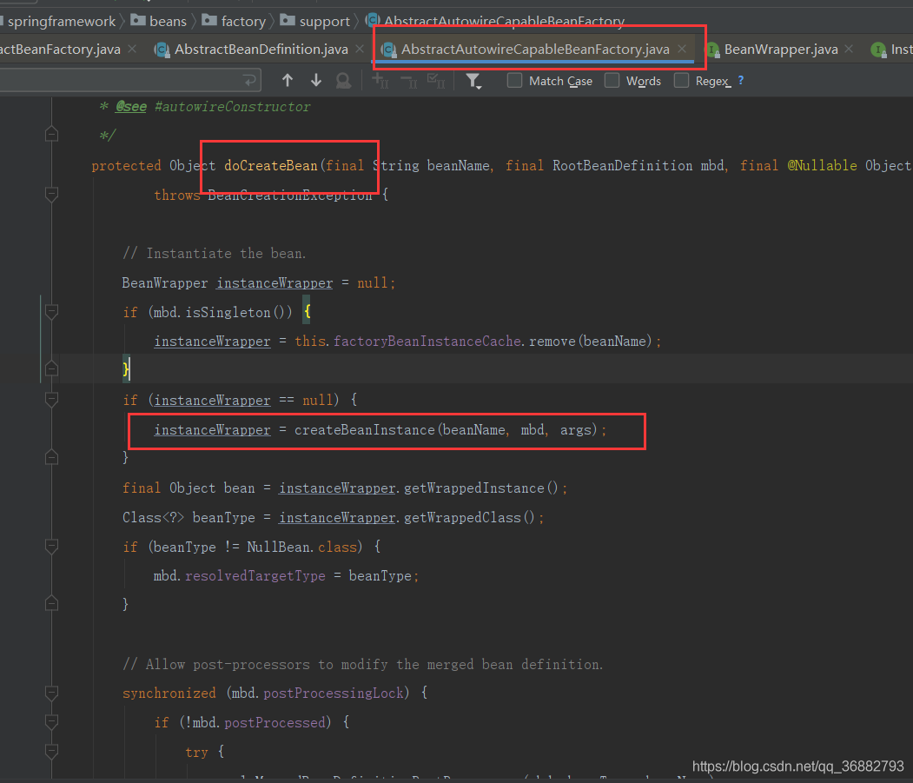
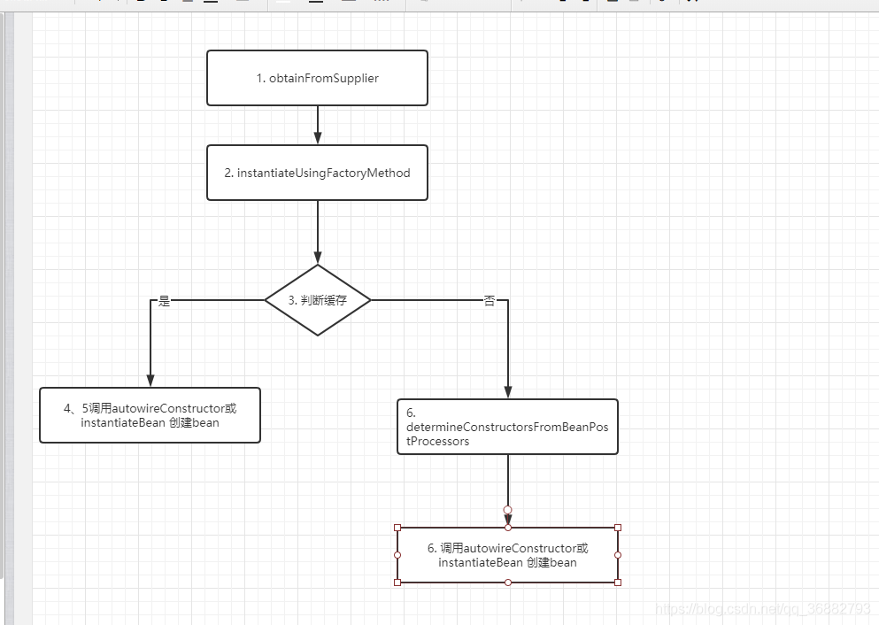
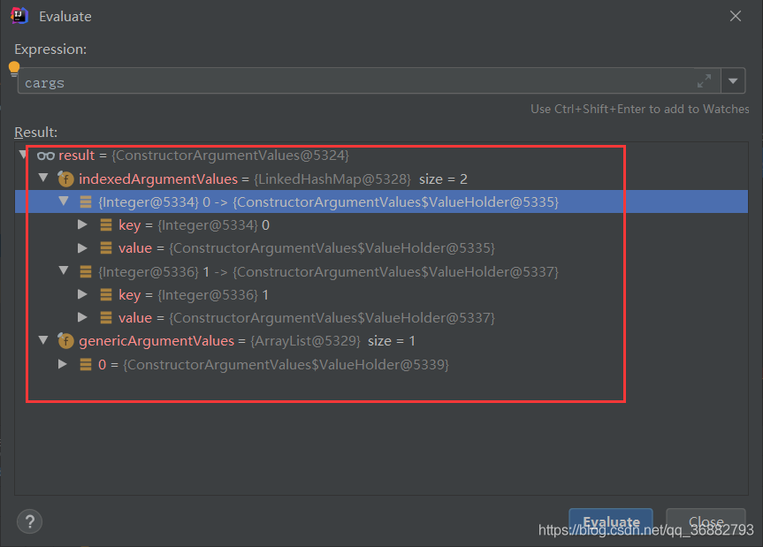

# 第06节 Spring Bean的实例创建过程--createBeanInstance方法

## 一、前言
本文是笔者阅读Spring源码的记录文章，由于本人技术水平有限，在文章中难免出现错误，如有发现，感谢各位指正。
在阅读过程中也创建了一些衍生文章，衍生文章的意义是因为自己在看源码的过程中，部分知识点并不了解或者对某些知识点产生了兴趣，
所以为了更好的阅读源码，所以开设了衍生篇的文章来更好的对这些知识点进行进一步的学习。

这篇文章应该是接着 Spring源码分析五 ：bean的获取③ - getSingleton 的继续分析过程。

本文主要是分析的方法是 AbstractAutowireCapableBeanFactory#**createBeanInstance**，
功能是 Spring 具体创建bean的过程。调用如下：


## 二、createBeanInstance 概述
进入该方法的链路如下：
```text
AbstractApplicationContext#refresh()方法
==>AbstractApplicationContext#finishBeanFactoryInitialization(beanFactory)方法
==>DefaultListableBeanFactory#preInstantiateSingletons()方法
==>遍历DefaultListableBeanFactory成员变量beanDefinitionNames,逐个调用AbstractBeanFactory#getBean(beanName)方法
==>AbstractBeanFactory#doGetBean(beanName)方法
==>AbstractAutowireCapableBeanFactory#createBean(beanName)方法
==>AbstractAutowireCapableBeanFactory#doCreateBean(beanName)方法
==>AbstractAutowireCapableBeanFactory#createBeanInstance(beanName)方法
```

createBeanInstance 根据方法名就知道，是创建bean的实例，也就注定了这个方法的不平凡。下面就来一步一步的剖析他。

整个方法的源码如下：
```text
 protected BeanWrapper createBeanInstance(String beanName, RootBeanDefinition mbd, @Nullable Object[] args) {
     // Make sure bean class is actually resolved at this point.
     // 【非常重要】解析bean，获取class
     Class<?> beanClass = resolveBeanClass(mbd, beanName);
     // beanClass != null && 当前类不是public && 不允许访问非公共构造函数和方法。抛出异常
     if (beanClass != null && !Modifier.isPublic(beanClass.getModifiers()) && !mbd.isNonPublicAccessAllowed()) {
         throw new BeanCreationException(mbd.getResourceDescription(), beanName,
                 "Bean class isn't public, and non-public access not allowed: " + beanClass.getName());
     }
     // 【非常重要】1 是否有bean的 Supplier 接口，如果有，通过回调来创建bean
     Supplier<?> instanceSupplier = mbd.getInstanceSupplier();
     if (instanceSupplier != null) {
         return obtainFromSupplier(instanceSupplier, beanName);
     }
     // 【非常重要】2 如果工厂方法不为空，则使用工厂方法初始化策略
     // 通过 @Bean 注解方法注入的bean 或者xml 配置注入 的BeanDefinition 会存在这个值。而注入这个bean的方法就是工厂方法。后面会详细解读
     if (mbd.getFactoryMethodName() != null) {
         // 执行工厂方法，创建bean
         return instantiateUsingFactoryMethod(beanName, mbd, args);
     }

     // Shortcut when re-creating the same bean...
     // 【非常重要】3 尝试使用构造函数构建bean，后面详解
     // 经过上面两步，Spring确定没有其他方式来创建bean，所以打算使用构造函数来进行创建bean。 但是 bean 的构造函数可能有多个，需要确定使用哪一个。
     // 【非常重要】这里实际上是一个缓存，resolved 表示构造函数是否已经解析完成；autowireNecessary 表示是否需要自动装配
     boolean resolved = false;
     boolean autowireNecessary = false;
     if (args == null) {
         synchronized (mbd.constructorArgumentLock) {
             // 一个类可能有多个不同的构造函数，每个构造函数参数列表不同，所以调用前需要根据参数锁定对应的构造函数或工程方法
             // 如果这个bean的构造函数或者工厂方法已经解析过了，会保存到 mbd.resolvedConstructorOrFactoryMethod 中。这里来判断是否已经解析过了。
             if (mbd.resolvedConstructorOrFactoryMethod != null) {
                 resolved = true;
                 autowireNecessary = mbd.constructorArgumentsResolved;
             }
         }
     }
     // 如果已经解析过则使用功能解析好的构造函数方法，不需要再次解析。这里的是通过 mbd.resolvedConstructorOrFactoryMethod 属性来缓存解析过的构造函数。
     if (resolved) {
         if (autowireNecessary) {
             // 【非常重要】4 构造函数自动注入
             return autowireConstructor(beanName, mbd, null, null);
         }
         else {
             // 【非常重要】5 使用默认构造函数构造
             return instantiateBean(beanName, mbd);
         }
     }

     // Candidate constructors for autowiring?
     // 【非常重要】6 根据参数解析构造函数，并将解析出来的构造函数缓存到mdb的resolvedConstructorOrFactoryMethod  属性中
     // 到这一步，说明 bean 是第一次加载，所以没有对构造函数进行相关缓存(resolved 为 false)
     // 调用 determineConstructorsFromBeanPostProcessors  方法来获取指定的构造函数列表。后面详解
     Constructor<?>[] ctors = determineConstructorsFromBeanPostProcessors(beanClass, beanName);
     
     if (ctors != null || mbd.getResolvedAutowireMode() == AUTOWIRE_CONSTRUCTOR ||
             mbd.hasConstructorArgumentValues() || !ObjectUtils.isEmpty(args)) {
         return autowireConstructor(beanName, mbd, ctors, args);
     }

     // Preferred constructors for default construction?
     // 获取最优的构造函数
     ctors = mbd.getPreferredConstructors();
     if (ctors != null) {
         // 构造函数自动注入
         return autowireConstructor(beanName, mbd, ctors, null);
     }

     // No special handling: simply use no-arg constructor.
     // 使用默认构造函数构造
     return instantiateBean(beanName, mbd);
 }
```
我们可以看到：
```text
1) 如果RootBeanDefinition 中存在 Supplier 供应商接口，则使用 Supplier 的回调来创建bean。 
   Supplier是用来替代声明式指定的工厂。
2) 如果RootBeanDefinition 中存在 factoryMethodName 属性，或者在配置文件中配置了factory-method，
   Spring会尝试使用 instantiateUsingFactoryMethod 方法，根据RootBeanDefinition 中的配置生成bean实例。
   需要注意的是，如果一个类中的方法被 @Bean注解修饰，那么Spring则会将其封装成一个ConfigurationClassBeanDefinition。
   此时 factoryMethodName 也被赋值。所以也会调用instantiateUsingFactoryMethod 方法通过反射完成方法的调用，
   并将结果注入Spring容器中。
3) 当以上两种都没有配置时，Spring则打算通过bean的构造函数来创建bean。
   首先会判断是否有缓存，即构造函数是否已经被解析过了， 
   因为一个bean可能会存在多个构造函数，这时候Spring会根据参数列表的来判断使用哪个构造函数进行实例化。
   但是判断过程比较消耗性能，所以Spring将判断好的构造函数缓存到RootBeanDefinition中的resolvedConstructorOrFactoryMethod属性中。
4) 如果存在缓存，则不需要再次解析筛选构造函数，直接调用 autowireConstructor 或者 instantiateBean 方法创建bean。
   有参构造调用 autowireConstructor 方法，无参构造调用 instantiateBean 方法。
5) 如果不存在缓存则需要进行解析，这里通过 determineConstructorsFromBeanPostProcessors 方法
   调用了 SmartInstantiationAwareBeanPostProcessor.determineCandidateConstructors 的后处理器方法来进行解析，
   Spring 默认的实现在AutowiredAnnotationBeanPostProcessor.determineCandidateConstructors 方法中。
   通过determineCandidateConstructors 方法获取到了候选的构造函数
   (因为满足条件的构造函数可能不止一个，需要进行进一步的选择)。
6) 获取解析后的候选的构造函数列表 ctors 后(最终的构造函数就从这个列表中选取)，
   开始调用 autowireConstructor 或者 instantiateBean 方法创建bean。
   在autowireConstructor 中，进行了候选构造函数的选举，选择最合适的构造函数来构建bean，
   如果缓存已解析的构造函数，则不用选举，直接使用解析好的构造来进行bean的创建。
```

## 三、createBeanInstance详解

需要注意的是，本文分析顺序由于是从代码编写的顺序分析，所以跟实际执行时候的顺序可能并不完全一致。
正常的代码流程在第一遍创建bean 时是没有缓存存在的，所以bean在第一遍创建时的执行顺序是 1->2->3->6，
当存在缓存的时候则会执行 1->2->3->4->5。需要区别两种执行逻辑。这里建议阅读顺序是 1->2->3->6->4->5

下面我们来分段解析代码。

### 3.1 调用 Supplier 接口 - obtainFromSupplier

这部分的功能：若 RootBeanDefinition 中设置了 Supplier 则使用 Supplier 提供的bean替代Spring要生成的bean;
```text
		Supplier<?> instanceSupplier = mbd.getInstanceSupplier();
		if (instanceSupplier != null) {
			return obtainFromSupplier(instanceSupplier, beanName);
		}

	...

	protected BeanWrapper obtainFromSupplier(Supplier<?> instanceSupplier, String beanName) {
		Object instance;
		// 这里做了一个类似
		String outerBean = this.currentlyCreatedBean.get();
		this.currentlyCreatedBean.set(beanName);
		try {
			// 从 Supplier 接口中获取 bean实例
			instance = instanceSupplier.get();
		}
		finally {
			if (outerBean != null) {
				this.currentlyCreatedBean.set(outerBean);
			}
			else {
				this.currentlyCreatedBean.remove();
			}
		}

		if (instance == null) {
			instance = new NullBean();
		}
		// 包装成 BeanWrapper 
		BeanWrapper bw = new BeanWrapperImpl(instance);
		initBeanWrapper(bw);
		return bw;
	}

```

关于其应用场景：
   指定一个用于创建bean实例的回调，以替代声明式指定的工厂方法。主要是考虑反射调用目标方法不如直接调用目标方法效率高。

详参 ： https://blog.csdn.net/duxd185120/article/details/109224025

### 3.2 使用 factory-method 属性 - instantiateUsingFactoryMethod

如果RootBeanDefinition 中存在 factoryMethodName 属性，或者在配置文件中配置了factory-method，
Spring会尝试使用 instantiateUsingFactoryMethod 方法，根据RootBeanDefinition 中的配置生成bean实例。

简单来说，就是如果BeanDefinition 指定了工厂方法，则使用其指定的工厂方法来初始化bean。
```text
   	if (mbd.getFactoryMethodName() != null) {
   		return instantiateUsingFactoryMethod(beanName, mbd, args);
   	}
```
这个源码太长，也并不重要，就不在这里展示了。简单来说，这里可以分为两种情况 ：

在 xml配置中，可以使用 factory-bean 和 factory-method 两个标签可以指定一个类中的方法，
Spring会将这个指定的方法的返回值作为bean返回
(如果方法是静态方法，则可以不创建factoryBean就直接调用，否则需要先将factoryBean注入到Spring中)。

对@Bean 注解的解析，在 ConfigurationClassPostProcessor 后处理器中，会对被 @Bean 注解修饰的方法进行解析，
生成一个 ConfigurationClassBeanDefinition的 BeanDefinition。
此时BeanDefinition 的 factoryMethodName 正是 @Bean修饰的方法本身。
所以这里会调用 instantiateUsingFactoryMethod 方法，通过回调的方式调用 @Bean修饰的方法，
并将返回结果注入到Spring容器中。

### 3.3 构造函数的缓存判断

到达这一步，Spring则打算通过bean的构造函数来创建bean。
但是一个bean可能会存在多个构造函数，这时候Spring会根据 **参数列表** 的来判断使用哪个构造函数进行实例化。
但是判断过程比较消耗性能，所以Spring将判断好的构造函数缓存到 **RootBeanDefinition** 中，
如果不存在缓存则进行构造函数的筛选并缓存解析结果。

RootBeanDefinition 中主要使用如下几个属性缓存 ：
```text
1) resolvedConstructorOrFactoryMethod ： 用于缓存已解析的构造函数或工厂方法

2) constructorArgumentsResolved ：
    这个字段有两层含义： 
        一，标记构造函数是否已经完成解析。
        二，标志这个bean的加载是否 需要通过构造注入(autowireConstructor) 的方式加载。
           因为只有在 autowireConstructor 方法中才会将其置为 true。

3) resolvedConstructorArguments ： 缓存解析好的构造函数的入参
```

下面我们来看详细代码：
```text
		// 是否已经完成解析
		boolean resolved = false;
		// 标志构造函数参数是否解析完成
		boolean autowireNecessary = false;
		if (args == null) {
			synchronized (mbd.constructorArgumentLock) {
				if (mbd.resolvedConstructorOrFactoryMethod != null) {
					resolved = true;
					autowireNecessary = mbd.constructorArgumentsResolved;
				}
			}
		}
		if (resolved) {
			if (autowireNecessary) {
				// 需要自动注入
				return autowireConstructor(beanName, mbd, null, null);
			}
			else {
				// 使用其默认构造函数实例化给定的bean。
				return instantiateBean(beanName, mbd);
			}
		}
		//  如果 resolved = false 则会执行第六步
```

### 3.4 带有参数的构造函数实例化 - autowireConstructor

上面的代码我们可以看到，Bean的的创建，分为有参构造函数和无参构造函数两种方式进行创建，
对于有参构造函数，使用的就是该方法进行处理。这个代码量非常巨大，实现的功能实现上比较复杂，功能上却可以一句话讲清，
简单来说，就是根据传入的参数列表，来匹配到合适的构造函数进行bean 的创建。
```text
   autowireConstructor(beanName, mbd, null, null);
```

autowireConstructor 的代码比较复杂，详细代码如下：
```text
//   chosenCtors :  候选构造函数列表, 没有则为null
//   explicitArgs : 通过getBean方法以编程方式传递的参数值，
public BeanWrapper autowireConstructor(String beanName, RootBeanDefinition mbd,
   @Nullable Constructor<?>[] chosenCtors, @Nullable Object[] explicitArgs) {

   	BeanWrapperImpl bw = new BeanWrapperImpl();
   	this.beanFactory.initBeanWrapper(bw);
   	// 候选的构造函数列表
   	Constructor<?> constructorToUse = null;
   	ArgumentsHolder argsHolderToUse = null;
   	// 构造函数最后确定使用的参数
   	Object[] argsToUse = null;
   	// 1. 解析构造函数参数
   	// explicitArgs  参数是通过 getBean 方法传入
   	// 如果 getBean在调用时传入了参数，那么直接使用即可。getBean 调用的传参，不用从缓存中获取构造函数，需要进行筛选匹配(个人理解，getBean 方法的入参可能并不相同，缓存的构造函数可能并不适用)
   	if (explicitArgs != null) {
   		argsToUse = explicitArgs;
   	}
   	else {
   		// 否则 尝试从 BeanDefinition 中加载缓存的bean构造时需要的参数
   		Object[] argsToResolve = null;
   		// 加锁
   		synchronized (mbd.constructorArgumentLock) {
   			// 从缓存中获取要使用的构造函数。没有缓存则为null
   			constructorToUse = (Constructor<?>) mbd.resolvedConstructorOrFactoryMethod;
   			// 如果构造函数不为空 && 构造函数参数已经解析
   			if (constructorToUse != null && mbd.constructorArgumentsResolved) {
   				// Found a cached constructor...
   				// 从缓存中获取。这里如果不能获取到完全解析好的参数，则获取尚未解析的参数，进行解析后再赋值给 argsToUse 
   				// resolvedConstructorArguments 是完全解析好的构造函数参数
   				argsToUse = mbd.resolvedConstructorArguments;
   				if (argsToUse == null) {
   					// 配置构造函数参数
   					// preparedConstructorArguments 是尚未完全解析的构造函数参数
   					argsToResolve = mbd.preparedConstructorArguments;
   				}
   			}
   		}
   		//  如果缓存中存在 尚未完全解析的参数列表，则进行进一步的解析
   		if (argsToResolve != null) {
   			// 解析参数类型，如给定的参数列表为(int,int),这时就会将配置中的("1", "1") 转化为 (1,1)
   			// 缓存中的值可能是最终值，也可能是原始值，因为不一定需要类型转换
   			argsToUse = resolvePreparedArguments(beanName, mbd, bw, constructorToUse, argsToResolve, true);
   		}
   	}
   	
   	// 如果构造函数 和 构造函数入参都不为空，则可以直接生成bean。否则的话，需要通过一定的规则进行筛选
   	if (constructorToUse == null || argsToUse == null) {
   		// Take specified constructors, if any.
   		// chosenCtors 是候选的构造函数，如果存在候选的构造函数，则跳过这里，否则通过反射获取bean的构造函数集合		
   		// 2. 获取候选的构造参数列表
   		Constructor<?>[] candidates = chosenCtors;
   		if (candidates == null) {
   			Class<?> beanClass = mbd.getBeanClass();
   			try {
   				// 反射获取bean的构造函数集合 
   				candidates = (mbd.isNonPublicAccessAllowed() ?
   						beanClass.getDeclaredConstructors() : beanClass.getConstructors());
   			}
   			catch (Throwable ex) {
   				throw new BeanCreationException(mbd.getResourceDescription(), beanName,
   						"Resolution of declared constructors on bean Class [" + beanClass.getName() +
   						"] from ClassLoader [" + beanClass.getClassLoader() + "] failed", ex);
   			}
   		}
   		// 如果构造函数只有一个 && getBean 没有传参 && 构造参数无参
   		// 满足上述三个条件，则无需继续筛选构造函数，直接使用唯一一个构造函数创建 BeanWrapper 并返回即可。
   		if (candidates.length == 1 && explicitArgs == null && !mbd.hasConstructorArgumentValues()) {
   			Constructor<?> uniqueCandidate = candidates[0];
   			// 确定该构造函数无参
   			if (uniqueCandidate.getParameterCount() == 0) {
   				synchronized (mbd.constructorArgumentLock) {
   					// 将解析结束的信息缓存到 mdb中
   					// 缓存解析出来的唯一构造函数
   					mbd.resolvedConstructorOrFactoryMethod = uniqueCandidate;
   					// 标记构造函数已经完全解析
   					mbd.constructorArgumentsResolved = true;
   					// 缓存解析好的构造函数参数。这里是空数组 (Object[] EMPTY_ARGS = new Object[0];)
   					mbd.resolvedConstructorArguments = EMPTY_ARGS;
   				}
   				// 调用 instantiate 方法创建对象实例并保存到 bw中
   				bw.setBeanInstance(instantiate(beanName, mbd, uniqueCandidate, EMPTY_ARGS));
   				return bw;
   			}
   		}

   		// Need to resolve the constructor.
   		//  待选构造函数列表不为null || 需要构造注入，则需要解析。
   		//  mbd.getResolvedAutowireMode() 是针对 xml 注入的
   		boolean autowiring = (chosenCtors != null ||
   				mbd.getResolvedAutowireMode() == AutowireCapableBeanFactory.AUTOWIRE_CONSTRUCTOR);
   		ConstructorArgumentValues resolvedValues = null;
   		// 3. 解析出来的构造函数的个数
   		int minNrOfArgs;
   		// 如果explicitArgs  不为空，直接使用它作为参数，毕竟是传入的参数，没必要再从进一步解析。
   		if (explicitArgs != null) {
   			minNrOfArgs = explicitArgs.length;
   		}
   		else {
   			// 获取xml配置文件中的配置的构造函数参数
   			ConstructorArgumentValues cargs = mbd.getConstructorArgumentValues();
   			// 用于承载解析后的构造函数参数的值
   			resolvedValues = new ConstructorArgumentValues();
   			// 确定解析到的构造函数参数个数并进行类型转换匹配。在下面有详细解读
   			minNrOfArgs = resolveConstructorArguments(beanName, mbd, bw, cargs, resolvedValues);
   		}
   		 // 4. 寻找最匹配的构造函数
   		// 对构造函数列表进行排序： public 构造函数优先参数数量降序，非public构造函数参数数量降序
   		AutowireUtils.sortConstructors(candidates);
   		int minTypeDiffWeight = Integer.MAX_VALUE;
   		Set<Constructor<?>> ambiguousConstructors = null;
   		LinkedList<UnsatisfiedDependencyException> causes = null;
   		// 遍历构造函数，寻找合适的构造函数
   		for (Constructor<?> candidate : candidates) {
   			// 获取当前构造函数参数个数
   			int parameterCount = candidate.getParameterCount();
   			// 如果已经找到选用的构造函数 (argstoUse != null) 或者  需要的构造函数的参数个数 小于 当前构造函数参数个数 则终止
   			// constructorToUse != null 说明找到了构造函数
   			// argsToUse != null 说明参数已经赋值
   			// argsToUse.length > parameterCount  
   			// 即已经找到适配的构造函数(可能不是最终的，但参数数量一定相同), 预选构造函数的参数数量 大于 当前构造函数的数量，可以直接break，因为按照参数数量降序排序，这里如果小于就没有必要继续比较下去
   			if (constructorToUse != null && argsToUse != null && argsToUse.length > parameterCount) {
   				// Already found greedy constructor that can be satisfied ->
   				// do not look any further, there are only less greedy constructors left.
   				break;
   			}
   			
   			if (parameterCount < minNrOfArgs) {
   				// 参数数量不相等,跳过
   				continue;
   			}
   			// 到这里说明尚未找到构造函数，且目前的构造函数和需要的构造函数参数个数相同，下面要对类型进行比较。
   			ArgumentsHolder argsHolder;
   			Class<?>[] paramTypes = candidate.getParameterTypes();
   			// 如果构造函数存在参数，resolvedValues 是上面解析后的构造函数，有参则根据 值 构造对应参数类型的参数
   			if (resolvedValues != null) {
   				try {
   					// 获取参数名称
   					// 从 @ConstructorProperties 注解上获取参数名称
   					String[] paramNames = ConstructorPropertiesChecker.evaluate(candidate, parameterCount);		
   					// 为null则说明没有使用注解
   					if (paramNames == null) {
   						// 获取参数名称探索器
   						ParameterNameDiscoverer pnd = this.beanFactory.getParameterNameDiscoverer();
   						if (pnd != null) {
   							// 获取指定的构造函数的参数名称
   							paramNames = pnd.getParameterNames(candidate);
   						}
   					}
   					// 根据类型和数据类型创建 参数持有者
   					// 这里会调用  DefaultListableBeanFactory#resolveDependency 方法来解析依赖关系
   					argsHolder = createArgumentArray(beanName, mbd, resolvedValues, bw, paramTypes, paramNames,
   							getUserDeclaredConstructor(candidate), autowiring, candidates.length == 1);
   				}
   				catch (UnsatisfiedDependencyException ex) {
   					if (logger.isTraceEnabled()) {
   						logger.trace("Ignoring constructor [" + candidate + "] of bean '" + beanName + "': " + ex);
   					}
   					// Swallow and try next constructor.
   					if (causes == null) {
   						causes = new LinkedList<>();
   					}
   					causes.add(ex);
   					continue;
   				}
   			}
   			
   			else {
   				// 如果构造函数为默认构造函数，没有参数，如果参数不完全一致则跳过
   				// Explicit arguments given -> arguments length must match exactly.
   				if (parameterCount != explicitArgs.length) {
   					continue;
   				}
   				// 构造函数没有参数的情况
   				argsHolder = new ArgumentsHolder(explicitArgs);
   			}
   			// 探测是否有不确定性的构造函数存在，例如不同构造函数的参数为父子关系
   			int typeDiffWeight = (mbd.isLenientConstructorResolution() ?
   					argsHolder.getTypeDifferenceWeight(paramTypes) : argsHolder.getAssignabilityWeight(paramTypes));
   			// Choose this constructor if it represents the closest match.
   			// 如果他是当前最接近匹配则选择作为构造函数，因为可能有多个构造函数都同时满足,比如构造函数参数类型全是 Object，选择最合适的（typeDiffWeight 最小的）作为最终构造函数
   			if (typeDiffWeight < minTypeDiffWeight) {
   				// 找到最匹配的构造函数赋值保存
   				constructorToUse = candidate;
   				argsHolderToUse = argsHolder;
   				argsToUse = argsHolder.arguments;
   				minTypeDiffWeight = typeDiffWeight;
   				ambiguousConstructors = null;
   			}
   			else if (constructorToUse != null && typeDiffWeight == minTypeDiffWeight) {
   				// 如果 已经找到候选构造函数，且当前这个构造函数也有相同的类似度则保存到 ambiguousConstructors 中。后面用于抛出异常
   				if (ambiguousConstructors == null) {
   					ambiguousConstructors = new LinkedHashSet<>();
   					ambiguousConstructors.add(constructorToUse);
   				}
   				ambiguousConstructors.add(candidate);
   			}
   		}
   		// 如果 constructorToUse  构造函数为  null，则查找构造函数失败，抛出异常
   		if (constructorToUse == null) {
   			if (causes != null) {
   				UnsatisfiedDependencyException ex = causes.removeLast();
   				for (Exception cause : causes) {
   					this.beanFactory.onSuppressedException(cause);
   				}
   				throw ex;
   			}
   			throw new BeanCreationException(mbd.getResourceDescription(), beanName,
   					"Could not resolve matching constructor " +
   					"(hint: specify index/type/name arguments for simple parameters to avoid type ambiguities)");
   		}
   		// 如果ambiguousConstructors 不为空说明有多个构造函数可适配，并且 如果不允许多个存在，则抛出异常
   		else if (ambiguousConstructors != null && !mbd.isLenientConstructorResolution()) {
   			throw new BeanCreationException(mbd.getResourceDescription(), beanName,
   					"Ambiguous constructor matches found in bean '" + beanName + "' " +
   					"(hint: specify index/type/name arguments for simple parameters to avoid type ambiguities): " +
   					ambiguousConstructors);
   		}
   		// 将解析的构造函数加入缓存
   		if (explicitArgs == null && argsHolderToUse != null) {
   			argsHolderToUse.storeCache(mbd, constructorToUse);
   		}
   	}

   	Assert.state(argsToUse != null, "Unresolved constructor arguments");
   	// 将构建的实例加入BeanWrapper 中
   	bw.setBeanInstance(instantiate(beanName, mbd, constructorToUse, argsToUse));
   	return bw;
}
```

简单理一下上面的逻辑：
```text
1) 首先判断 explicitArgs 是否为空，如果不为空，则就直接使用 explicitArgs 作为构造函数的参数。
    explicitArgs 所代表的意思是 调用getBean方法时的传参，
    代码中可以看到，如果 explicitArgs 不为空，那么并未从缓存中获取构造函数。

2) 如果 explicitArgs 为空，则尝试从之缓存中获取，
   也即是从 RootBeanDefinition 的resolvedConstructorArguments 属性
   或 preparedConstructorArguments 属性中获取。resolvedConstructorArguments 代表完全解析好的参数， 
   preparedConstructorArguments 代表尚未完全解析的参数，如果 获取到 preparedConstructorArguments ，
   则需要在进一步的解析。

3) 如果缓存中也没有获取到，则只能自己开始分析来获取候选构造函数列表，关于候选构造函数的信息，
   在调用该方法时就已经传递了过来，即Constructor<?>[] chosenCtors，
   如果 Constructor<?>[] chosenCtors 为null，则通过反射获取候选构造函数列表 candidates。
4) 获取到候选构造函数列表 candidates后，则会优先判断获取到的 candidates 是否只有一个构造函数，
   如果只要是一个，则不需要解析，直接保存相关信息即解析完毕。

5) 否则则进行候选构造函数列表candidates的选举，寻找最合适的构造函数，
   对 candidates 按照 public 构造函数优先参数数量降序，非public构造函数参数数量降序 规则排序，
   目的是为了后面检索的时候可以更快速判断是否有合适的构造函数。

6) 排序结束后 ，开始遍历构造函数，按照 构造函数的参数类型和数量与构造函数一一匹配，
   寻找差异性最小的构造函数作为最终的构造函数并通过 cglib 或者 反射来 创建bean。
```

按照功能划分，整个 autowireConstructor 方法可以划分为四步：
```text
1) 解析构造函数参数
2) 获取候选的构造函数列表
3) 解析构造函数参数个数
4) 寻找最匹配的构造函数
```

下面分段解析：

### 3.4.1 解析构造函数参数
```text
	// explicitArgs  参数是通过 getBean 方法传入
	// 如果 getBean在调用时传入了参数，那么直接使用即可。
	if (explicitArgs != null) {
		argsToUse = explicitArgs;
	}
	else {
		// 否则 尝试从配置文件中去加载bean构造时需要的参数
		Object[] argsToResolve = null;
		// 加锁
		synchronized (mbd.constructorArgumentLock) {
			// 从缓存中获取要使用的构造函数
			constructorToUse = (Constructor<?>) mbd.resolvedConstructorOrFactoryMethod;
			if (constructorToUse != null && mbd.constructorArgumentsResolved) {
				// Found a cached constructor...
				// 从缓存中获取。这里如果不能获取到完全解析好的参数，则获取尚未解析的参数，进行解析后再赋值给 argsToUse 
				// resolvedConstructorArguments 是完全解析好的构造函数参数
				argsToUse = mbd.resolvedConstructorArguments;
				if (argsToUse == null) {
					// 配置构造函数参数
					// preparedConstructorArguments 是尚未完全解析的构造函数参数
					argsToResolve = mbd.preparedConstructorArguments;
				}
			}
		}
		//  如果缓存中存在 尚未完全解析的参数列表，则进行进一步的解析
		if (argsToResolve != null) {
			// 解析参数类型，如给定的参数列表为(int,int),这时就会将配置中的("1", "1") 转化为 (1,1)
			// 缓存中的值可能是最终值，也可能是原始值
			argsToUse = resolvePreparedArguments(beanName, mbd, bw, constructorToUse, argsToResolve, true);
		}
	}
```

上面的逻辑还是很清楚的
```text
1) 如果有传入参数 explicitArgs，则直接使用 explicitArgs;
2) 如果没有传入，尝试从缓存中获取;
3) 如果参数完全解析了，则直接使用，如果没有则调用 resolvePreparedArguments 进行解析;
```

这里解释一下 resolvePreparedArguments 方法的作用。

我们声明的构造函数的可能是这样的
```text
    public ConstructorDemoA(Integer name) {
        this.name = name;
    }
```
但是我们在配置的时候xml配置文件却是这样的。
```text
    <bean id="constructorDemoA" class="com.kingfish.springbootdemo.constructor.ConstructorDemoA">
        <constructor-arg index="0" value="666" ></constructor-arg>
    </bean>
```
这时候，Spring就需要有一个过程，从Spring 的 “666” 到 Integer 的 666 的转变，这个方法就是做类型转化的工作。
但需要注意调用这个方法的前提条件是 argsToResolve != null。

#### 3.4.2 获取候选的构造函数列表
```text
	// chosenCtors 是候选的构造函数，入参中传入不同场景下可能为空，可能不为空。
	// 如果存在候选的构造函数，则跳过这里，否则获取bean的构造函数集合
	Constructor<?>[] candidates = chosenCtors;
	if (candidates == null) {
		Class<?> beanClass = mbd.getBeanClass();
		try {
			// 获取bean的构造函数
			candidates = (mbd.isNonPublicAccessAllowed() ?
					beanClass.getDeclaredConstructors() : beanClass.getConstructors());
		}
		catch (Throwable ex) {
			throw new BeanCreationException(mbd.getResourceDescription(), beanName,
					"Resolution of declared constructors on bean Class [" + beanClass.getName() +
					"] from ClassLoader [" + beanClass.getClassLoader() + "] failed", ex);
		}
	}
	// 如果构造函数只有一个 & getBean 没有传参 & 构造参数无参
	// 满足上述三个条件，则无需继续筛选，直接创建 BeanWrapper 并返回即可。
	if (candidates.length == 1 && explicitArgs == null && !mbd.hasConstructorArgumentValues()) {
		Constructor<?> uniqueCandidate = candidates[0];
		if (uniqueCandidate.getParameterCount() == 0) {
			synchronized (mbd.constructorArgumentLock) {
				mbd.resolvedConstructorOrFactoryMethod = uniqueCandidate;
				mbd.constructorArgumentsResolved = true;
				mbd.resolvedConstructorArguments = EMPTY_ARGS;
			}
			bw.setBeanInstance(instantiate(beanName, mbd, uniqueCandidate, EMPTY_ARGS));
			return bw;
		}
	}
```
这个逻辑也是比较清楚的 chosenCtors 是传入的构造函数列表。
```text
1) 外部是否传入了候选构造函数列表( chosenCtors == null)
2) 如果没传入（chosenCtors 为null），通过反射获取构造函数列表
3) 如果构造函数只有一个 & getBean 没有传参 & 构造参数无参，则直接使用这唯一一个构造函数并返回
```
这里需要注意点是 传入的 chosenCtors ，在不同的调用场景下可能会传入null，
或者 调用 SmartInstantiationAwareBeanPostProcessor.determineCandidateConstructors 方法返回的值。
Spring 默认的实现是在 AutowiredAnnotationBeanPostProcessor.determineCandidateConstructors 方法中。

#### 3.4.3 解析构造函数参数个数
```text
	// 解析出来的构造函数的个数
	int minNrOfArgs;
	// 如果explicitArgs  不为空，直接使用它作为参数，毕竟是传入的参数，没必要再从进一步解析。
	if (explicitArgs != null) {
		minNrOfArgs = explicitArgs.length;
	} else {
		// 获取xml配置文件中的配置的构造函数参数
		ConstructorArgumentValues cargs = mbd.getConstructorArgumentValues();
		// 用于保存解析后的构造函数参数的值，在resolveConstructorArguments中可以看到他的作用，
		resolvedValues = new ConstructorArgumentValues();
		// 确定最终解析到的构造函数参数个数并进行类型转换
		minNrOfArgs = resolveConstructorArguments(beanName, mbd, bw, cargs, resolvedValues);
	}
```
在 Spring 中指定的构造函数会保存在 RootBeanDefinition.constructorArgumentValues 中，
类型为 ConstructorArgumentValues，如下。可以看到 ConstructorArgumentValues 分为两部分保存参数。
```text
	public class ConstructorArgumentValues {
		// 按照顺序声明的参数列表
		private final Map<Integer, ValueHolder> indexedArgumentValues = new LinkedHashMap<>();
		// 按照类型声明的参数列表
		private final List<ValueHolder> genericArgumentValues = new ArrayList<>();
		...
	}
```

如下的定义中，
```text
	<?xml version="1.0" encoding="UTF-8"?>
	<beans xmlns="http://www.springframework.org/schema/beans"
	       xmlns:xsi="http://www.w3.org/2001/XMLSchema-instance"
	       xsi:schemaLocation="http://www.springframework.org/schema/beans http://www.springframework.org/schema/beans/spring-beans.xsd">
	    <bean id="constructorDemoA" class="com.kingfish.springbootdemo.constructor.ConstructorDemoA">
	        <constructor-arg index="0" ref="constructorDemoB"></constructor-arg>
	        <constructor-arg index="1" value="666" ></constructor-arg>
	        <constructor-arg value="999" ></constructor-arg>
	    </bean>
	    <bean id="constructorDemoB" class="com.kingfish.springbootdemo.constructor.ConstructorDemoB"></bean>
	</beans>
```
constructorDemoB、666就被保存到 indexedArgumentValues 中; 999 就被保存到genericArgumentValues ，
如下图所示：


但是需要注意的是： 这里面保存的是ValueHolder 类型，里面保存的也并不是 实际类型，而是未经转换的类型，
即constructorDemoB 保存的并不是 ConstructorDemoB类 实例，而是保存了一个 beanName 为 constructorDemoB。
这里的 666 保存的也是字符串形式(而实际的构造函数需要的是Integer形式)。
总的来说就是 mbd.getConstructorArgumentValues(); 中的构造函数值并不一定是真正可以使用的类型，
还需要进行一个解析进行类型的匹配。

而这个解析过程就发生在 resolveConstructorArguments 方法中。如下：
```text
	private int resolveConstructorArguments(String beanName, RootBeanDefinition mbd, BeanWrapper bw,
			ConstructorArgumentValues cargs, ConstructorArgumentValues resolvedValues) {
		// 获取类型转换器
		TypeConverter customConverter = this.beanFactory.getCustomTypeConverter();
		TypeConverter converter = (customConverter != null ? customConverter : bw);
		BeanDefinitionValueResolver valueResolver =
				new BeanDefinitionValueResolver(this.beanFactory, beanName, mbd, converter);
		// 获取参数个数，这并不一定是最终的参数个数
		int minNrOfArgs = cargs.getArgumentCount();
		// 遍历 indexedArgumentValues 
		for (Map.Entry<Integer, ConstructorArgumentValues.ValueHolder> entry : cargs.getIndexedArgumentValues().entrySet()) {
			int index = entry.getKey();
			if (index < 0) {
				throw new BeanCreationException(mbd.getResourceDescription(), beanName,
						"Invalid constructor argument index: " + index);
			}
			// 这里注意，如果 <constructor-arg> 的index属性大于 参数实际个数，那么Spring会采用index属性的值
			if (index > minNrOfArgs) {
				// +1 是因为index 从0开始
				minNrOfArgs = index + 1;
			}
			ConstructorArgumentValues.ValueHolder valueHolder = entry.getValue();
			// 如果类型已经解析过，则保存在 resolvedValues 中
			if (valueHolder.isConverted()) {
				resolvedValues.addIndexedArgumentValue(index, valueHolder);
			}
			else {
				// 否则进行类型解析后再保存到 resolvedValues 中
				Object resolvedValue =
						valueResolver.resolveValueIfNecessary("constructor argument", valueHolder.getValue());
				ConstructorArgumentValues.ValueHolder resolvedValueHolder =
						new ConstructorArgumentValues.ValueHolder(resolvedValue, valueHolder.getType(), valueHolder.getName());
				resolvedValueHolder.setSource(valueHolder);
				resolvedValues.addIndexedArgumentValue(index, resolvedValueHolder);
			}
		}
		// 遍历 genericArgumentValues 
		for (ConstructorArgumentValues.ValueHolder valueHolder : cargs.getGenericArgumentValues()) {
			// 如果已经解析，则保存到resolvedValues 中
			if (valueHolder.isConverted()) {
				resolvedValues.addGenericArgumentValue(valueHolder);
			}
			else {
				// 否则进行类型解析后再保存到 resolvedValues 中
				Object resolvedValue =
						valueResolver.resolveValueIfNecessary("constructor argument", valueHolder.getValue());
				ConstructorArgumentValues.ValueHolder resolvedValueHolder = new ConstructorArgumentValues.ValueHolder(
						resolvedValue, valueHolder.getType(), valueHolder.getName());
				resolvedValueHolder.setSource(valueHolder);
				resolvedValues.addGenericArgumentValue(resolvedValueHolder);
			}
		}
		// 返回解析后的构造函数参数个数。
		return minNrOfArgs;
	}
```

#### 3.4.4 寻找最匹配的构造函数

到这里，我们可以知道 minNrOfArgs 为最终构造函数入参数量；candidates 是供选择的构造函数列表。

代码比较长，上面已经贴出了完整版，这里就简化一下。
```text
	...
	// 排序构造函数,方便后面检索
	AutowireUtils.sortConstructors(candidates);
	// 差异度，因为可能不止一个构造函数可以匹配，选择匹配度最接近的。最后选择minTypeDiffWeight  最小的作为最匹配的构造函数
	int minTypeDiffWeight = Integer.MAX_VALUE;
	Set<Constructor<?>> ambiguousConstructors = null;
	LinkedList<UnsatisfiedDependencyException> causes = null;
	// 筛选构造函数，根据参数数量，参数类型匹配
	for (Constructor<?> candidate : candidates) {
		
		...
		
		if (resolvedValues != null) {
			try {
				// 获取参数名
				String[] paramNames = ConstructorPropertiesChecker.evaluate(candidate, parameterCount);
				if (paramNames == null) {
					ParameterNameDiscoverer pnd = this.beanFactory.getParameterNameDiscoverer();
					if (pnd != null) {
						paramNames = pnd.getParameterNames(candidate);
					}
				}
				// 这里会调用  DefaultListableBeanFactory#resolveDependency 方法来解析依赖关系
				argsHolder = createArgumentArray(beanName, mbd, resolvedValues, bw, paramTypes, paramNames,
						getUserDeclaredConstructor(candidate), autowiring, candidates.length == 1);
			}
			catch (UnsatisfiedDependencyException ex) {
				if (logger.isTraceEnabled()) {
					logger.trace("Ignoring constructor [" + candidate + "] of bean '" + beanName + "': " + ex);
				}
				// Swallow and try next constructor.
				if (causes == null) {
					causes = new LinkedList<>();
				}
				causes.add(ex);
				continue;
			}
		}
		else {
			// Explicit arguments given -> arguments length must match exactly.
			if (parameterCount != explicitArgs.length) {
				continue;
			}
			argsHolder = new ArgumentsHolder(explicitArgs);
		}
		
		...
		
		if (explicitArgs == null && argsHolderToUse != null) {
			// 将解析出来的信息缓存到RootBeanDefinition中
			argsHolderToUse.storeCache(mbd, constructorToUse);
		}
	}
    Assert.state(argsToUse != null, "Unresolved constructor arguments");
    // 创建bean，并保存
    bw.setBeanInstance(instantiate(beanName, mbd, constructorToUse, argsToUse));
```

这一步的目的就是 根据 参数数量 和 参数列表 来选择最合适的构造函数，
并且调用 instantiate(beanName, mbd, constructorToUse, argsToUse) 方法来创建bean实例。

**下面提三点：**

I) 由于在配置文件中声明bean不仅仅可以使用参数位置索引的方式创建，也支持通过参数名称设定参数值的情况，如下：
```text
<constructor-arg name="constructorDemoB" ref="constructorDemoB"></constructor-arg>
```
所以这时候，就需要首先确定构造函数中的参数名称。
而获取参数名的方式有两种，
```text
   一种是通过注解直接获取(@ConstructorProperties 注解获取)，
      即上面代码中对应的 ConstructorPropertiesChecker.evaluate(candidate, parameterCount);
   另一种是通过Spring同构的工具类 ParameterNameDiscoverer ，这个在代码中也有使用。
```
完成这一步的时候，**构造函数、参数名称、参数类型、参数值** 都确定后就可以锁定构造函数以及转换对应的参数类型了。

II) instantiate 方法也很简单，根据 beanFactory 中的 bean实例化策略来实例化对象
```text
	private Object instantiate(
			String beanName, RootBeanDefinition mbd, Constructor<?> constructorToUse, Object[] argsToUse) {

		try {
			// 获取实例化策略
			InstantiationStrategy strategy = this.beanFactory.getInstantiationStrategy();
			// 通过策略实例化bean
			if (System.getSecurityManager() != null) {
				return AccessController.doPrivileged((PrivilegedAction<Object>) () ->
						strategy.instantiate(mbd, beanName, this.beanFactory, constructorToUse, argsToUse),
						this.beanFactory.getAccessControlContext());
			}
			else {
				return strategy.instantiate(mbd, beanName, this.beanFactory, constructorToUse, argsToUse);
			}
		}
		catch (Throwable ex) {
			throw new BeanCreationException(mbd.getResourceDescription(), beanName,
					"Bean instantiation via constructor failed", ex);
		}
	}
```
注：关于 实例化策略，主要两种 SimpleInstantiationStrategy 和 CglibSubclassingInstantiationStrategy，
简单实例化策略(直接反射) 和 Cglib 动态代理策略(通过cglib 代理)，默认第二种。

III) 在这里将解析后的内容添加到缓存中的代码如下：
```text
	public void storeCache(RootBeanDefinition mbd, Executable constructorOrFactoryMethod) {
		synchronized (mbd.constructorArgumentLock) {
			// 保存工厂方法
			mbd.resolvedConstructorOrFactoryMethod = constructorOrFactoryMethod;
			// 设置已经完全解析
			mbd.constructorArgumentsResolved = true;
			// 如果必须解析，将一些准备解析的参数保存，后面解析
			if (this.resolveNecessary) {
				mbd.preparedConstructorArguments = this.preparedArguments;
			}
			else {
				mbd.resolvedConstructorArguments = this.arguments;
			}
		}
	}
```

### 3.5 无参构造函数实例化 - instantiateBean

相较于上面的有参构造函数，无参构造函数的解析显的那么简单
```text
	instantiateBean(beanName, mbd);

	....
	protected BeanWrapper instantiateBean(final String beanName, final RootBeanDefinition mbd) {
		try {
			Object beanInstance;
			final BeanFactory parent = this;
			// 这里是对安全管理的处理。
			if (System.getSecurityManager() != null) {
				beanInstance = AccessController.doPrivileged((PrivilegedAction<Object>) () ->
						getInstantiationStrategy().instantiate(mbd, beanName, parent),
						getAccessControlContext());
			}
			else {
				beanInstance = getInstantiationStrategy().instantiate(mbd, beanName, parent);
			}
			BeanWrapper bw = new BeanWrapperImpl(beanInstance);
			initBeanWrapper(bw);
			return bw;
		}
		catch (Throwable ex) {
			throw new BeanCreationException(
					mbd.getResourceDescription(), beanName, "Instantiation of bean failed", ex);
		}
	}
```
可以看到，最关键的调用代码是在InstantiationStrategy#instantiate
(org.springframework.beans.factory.support.RootBeanDefinition, java.lang.String, org.springframework.beans.factory.BeanFactory) 中，
其细代码如下：
```text
	public Object instantiate(RootBeanDefinition bd, @Nullable String beanName, BeanFactory owner) {
		// Don't override the class with CGLIB if no overrides.
		// 如果当前bean中的方法都没有被重写，则直接反射就好了。不需要使用cglib 来进行代理
		if (!bd.hasMethodOverrides()) {
			Constructor<?> constructorToUse;
			synchronized (bd.constructorArgumentLock) {
				// 尝试获取已经解析成功缓存的 构造函数
				constructorToUse = (Constructor<?>) bd.resolvedConstructorOrFactoryMethod;
				if (constructorToUse == null) {
					// 没有缓存则自己指定无参构造函数
					final Class<?> clazz = bd.getBeanClass();
					// 如果是接口直接抛出异常
					if (clazz.isInterface()) {
						throw new BeanInstantiationException(clazz, "Specified class is an interface");
					}
					try {
						if (System.getSecurityManager() != null) {
							constructorToUse = AccessController.doPrivileged(
									(PrivilegedExceptionAction<Constructor<?>>) clazz::getDeclaredConstructor);
						}
						else {
							// 返回符合参数类型的构造函数(这里是无参构造函数，所以并没有传递参数)
							constructorToUse = clazz.getDeclaredConstructor();
						}
						// 指定无参构造函数
						bd.resolvedConstructorOrFactoryMethod = constructorToUse;
					}
					catch (Throwable ex) {
						throw new BeanInstantiationException(clazz, "No default constructor found", ex);
					}
				}
			}
			// 通过反射创建 bean 
			return BeanUtils.instantiateClass(constructorToUse);
		} else {
			// Must generate CGLIB subclass.
			// 如果有方法被重写了，则使用cglib 动态代理
			return instantiateWithMethodInjection(bd, beanName, owner);
		}
	}
```
```text
getDeclaredConstructor(Class<?>... parameterTypes) : 
    这种方法会返回制定參数类型的全部构造器，包含public的和非public的，当然也包含private的。

getDeclaredConstructors() : 的返回结果就没有參数类型的过滤了。

getConstructor(Class<?>... parameterTypes) : 
    这种方法返回的是上面那个方法返回结果的子集。仅仅返回制定參数类型訪问权限是public的构造器。

getConstructors() : 的返回结果相同也没有參数类型的过滤。
```

这里的逻辑非常简单, 甚至可以用一句话概括 ： 
是否有方法被覆盖(是否使用replace 或 lookup 进行配置)，有则使用cglib动态代理，增强方法，否则直接通过反射创建。
这一块判断是否方法被重写，不是为了事务或者aop，因为解析还没到那一步，这里是为了 lookup-method 和 replaced-method。

### 3.6 构造函数的筛选

在bean第一次创建的时候，并不存在构造缓存，所以会执行下面的代码。也就是说，这里是Bean第一次创建所调用的代码。
```text
	// 调用 SmartInstantiationAwareBeanPostProcessor#determineCandidateConstructors 方法来筛选构造函数。
	Constructor<?>[] ctors = determineConstructorsFromBeanPostProcessors(beanClass, beanName);
	// 有候选构造函数 || 构造方式为构造注入 || 有构造函数入参 || 用于构造函数或工厂方法调用的显式参数args 不为null
	// 则调用 autowireConstructor 方法
	if (ctors != null || mbd.getResolvedAutowireMode() == AUTOWIRE_CONSTRUCTOR ||
			mbd.hasConstructorArgumentValues() || !ObjectUtils.isEmpty(args)) {
		return autowireConstructor(beanName, mbd, ctors, args);
	}

	// Preferred constructors for default construction?
	// 如果有 确定用于默认构造的首选构造函数（如果有）。如有必要，构造函数参数将自动装配。
	// RootBeanDefinition 的实现是 null 。
	// 这里仅在 GenericApplicationContext.ClassDerivedBeanDefinition 中有过解析
	ctors = mbd.getPreferredConstructors();
	if (ctors != null) {
		return autowireConstructor(beanName, mbd, ctors, null);
	}
	// No special handling: simply use no-arg constructor.
	// 使用默认方式进行bean 构造
	return instantiateBean(beanName, mbd);
```

这里可以看到，如果没有进行任何额外的配置的话，会使用默认的方式（instantiateBean(beanName, mbd)）创建bean。

我们这里整理一下调用 autowireConstructor 方法的条件(以下条件满足其一即可)：
```text
1) ctors != null ： 
    determineConstructorsFromBeanPostProcessors 方法筛选出的候选构造函数不为null。
    对于默认的Spring来说，实际返回的是 AutowiredAnnotationBeanPostProcessor#determineCandidateConstructors 方法的返回值。
    而其作用简单来说就是返回被 @Autowired 注解修饰的构造函数（实际要更为复杂，这里可以简单这样理解）。

2) mbd.getResolvedAutowireMode() == AUTOWIRE_CONSTRUCTOR ：
    这里的配置是 通过xml 来配置bean时(<bean>)指定的 装配方式autowire属性(byType\byName\constructor\default\no)，
    如果指定了构造器装配(autowire='constructor')，则调用 autowireConstructor 方法。

3) mbd.hasConstructorArgumentValues() ：
    这里表示是否给当前bean定义了构造函数入参。
    通过xml配置bean的时候可以通过 <constructor-arg> 标签指定构造函数入参。

4) !ObjectUtils.isEmpty(args) ： 
    在通过getBean方法以编程方式传递的参数值args。如果有，使用其作为bean创建时构造函数的参数。

5) mbd.getPreferredConstructors() != null : 
    RootBeanDefinition 的实现是 null 。
    这里仅在 GenericApplicationContext.ClassDerivedBeanDefinition 中有过解析。
```

关于determineConstructorsFromBeanPostProcessors 方法，
实际返回的是 AutowiredAnnotationBeanPostProcessor#determineCandidateConstructors 方法的返回值。
关于 AutowiredAnnotationBeanPostProcessor 的解析详参：
Spring源码分析衍生篇五：AutowiredAnnotationBeanPostProcessor

## 四、 总结
AbstractAutowireCapableBeanFactory#**createBeanInstance**方法处于Spring 创建bean 的入口阶段，
完成了bean 的初步创建，调用各种扩展接口来尝试完成bean的创建（Supplier、factory-method），
失败了则根据传入参数和和构造函数列表来选择合适的构造函数来创建bean。

但是并未完成 属性注入、接口特性实现(如 Aware)、标签设置（如inti-method）的设置。
在后续的 AbstractAutowireCapableBeanFactory#**populateBean**方法中完成了属性的注入。

需要注意的是，当一个bean第一次被解析时判断调用 autowireConstructor 方法来进行创建的时候，
那么后面再次解析该bean仍会通过 autowireConstructor 方法进行解析。
因为autowireConstructor方法中在添加缓存的时候将constructorArgumentsResolved置为true
来确保下一次解析时仍调用autowireConstructor方法。
