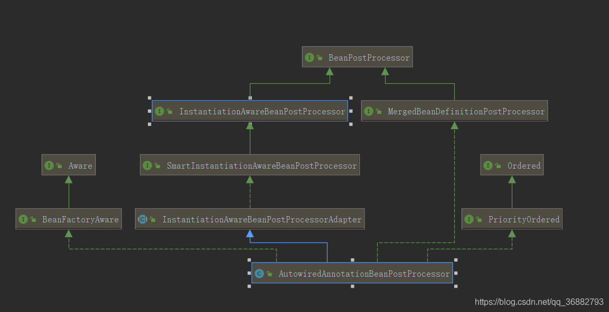
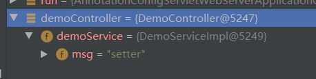

# 第08节 Spring Bean后置处理器--AutowiredAnnotationBeanPostProcessor

## 一、前言

本文是 Spring源码分析：Spring源码分析四：bean的属性注入 - populateBean 的衍生文章。
主要是因为本人菜鸡，在分析源码的过程中还有一些其他的内容不理解，故开设衍生篇来完善内容以学习。

在 Spring源码分析衍生篇四：后处理器 BeanPostProcessor 中我们介绍了 BeanPostProcessor 后处理器的基本使用。
本篇我们来介绍其中的 一个相当重要的实现类 ：AutowiredAnnotationBeanPostProcessor， 
AutowiredAnnotationBeanPostProcessor 完成了 Spring基本的属性注入功能
(@Autowired、@Value 、@Inject 注解功能)。下面我们来详细介绍。

## 二、AutowiredAnnotationBeanPostProcessor

下面是 AutowiredAnnotationBeanPostProcessor 的结构图图。

可以看到 AutowiredAnnotationBeanPostProcessor 
继承InstantiationAwareBeanPostProcessorAdapter类、
实现 MergedBeanDefinitionPostProcessor、PriorityOrdered、BeanFactoryAware 接口。

**个人理解：**
```text
1) 继承InstantiationAwareBeanPostProcessorAdapter、实现 MergedBeanDefinitionPostProcessor 
    是为了根据后处理器的调用时机来完成一些功能。
2) 实现 PriorityOrdered 接口是为了标注自身优先注入。
3) 实现 BeanFactoryAware 是为了拿到 BeanFactory。
```

在进行下面讲解之前，先了解一下AutowiredAnnotationBeanPostProcessor 中的 一个Set集合 autowiredAnnotationTypes 。 

autowiredAnnotationTypes 集合中保存了AutowiredAnnotationBeanPostProcessor类会处理的注解。
```text
	private final Set<Class<? extends Annotation>> autowiredAnnotationTypes = new LinkedHashSet<>(4);

	...
	public AutowiredAnnotationBeanPostProcessor() {
		this.autowiredAnnotationTypes.add(Autowired.class);
		this.autowiredAnnotationTypes.add(Value.class);
		try {
			this.autowiredAnnotationTypes.add((Class<? extends Annotation>)
					ClassUtils.forName("javax.inject.Inject", AutowiredAnnotationBeanPostProcessor.class.getClassLoader()));
			logger.trace("JSR-330 'javax.inject.Inject' annotation found and supported for autowiring");
		}
		catch (ClassNotFoundException ex) {
			// JSR-330 API not available - simply skip.
		}
	}
```
可以看到的是 在 AutowiredAnnotationBeanPostProcessor初始化的时， 
autowiredAnnotationTypes 中添加了三个注解@Autowired、@Value、和通过反射得到的 javax.inject.Inject。
这三个注解也就是本类负责解析的三个注解了(@Inject 并不一定能加载到，看用户是否引入相应的包)。

## 三、determineCandidateConstructors

determineCandidateConstructors 方法是 InstantiationAwareBeanPostProcessorAdapter 接口中的方法。
其作用是从 注入bean的所有构造函数中过滤出可以作为构造注入的构造函数列表。
```text
    @Override
    @Nullable
    public Constructor<?>[] determineCandidateConstructors(Class<?> beanClass, final String beanName)
    throws BeanCreationException {

		// Let's check for lookup methods here...
		// 在这里首先处理了@Lookup注解
		// 判断是否已经解析过 。lookupMethodsChecked 作为一个缓存集合，保存已经处理过的bean
		if (!this.lookupMethodsChecked.contains(beanName)) {
			if (AnnotationUtils.isCandidateClass(beanClass, Lookup.class)) {
				try {
					Class<?> targetClass = beanClass;
					do {
						// 遍历bean中的每一个方法
						ReflectionUtils.doWithLocalMethods(targetClass, method -> {
							// 判断 方法是否被 @Lookup 修饰
							Lookup lookup = method.getAnnotation(Lookup.class);
							if (lookup != null) {
								Assert.state(this.beanFactory != null, "No BeanFactory available");
								// 如果被@Lookup 修饰，则封装后保存到RootBeanDefinition 的methodOverrides 属性中，在 SimpleInstantiationStrategy#instantiate(RootBeanDefinition, String, BeanFactory) 进行了cglib的动态代理。
								LookupOverride override = new LookupOverride(method, lookup.value());
								try {
									RootBeanDefinition mbd = (RootBeanDefinition)
											this.beanFactory.getMergedBeanDefinition(beanName);
									mbd.getMethodOverrides().addOverride(override);
								}
								catch (NoSuchBeanDefinitionException ex) {
									throw new BeanCreationException(beanName,
											"Cannot apply @Lookup to beans without corresponding bean definition");
								}
							}
						});
						targetClass = targetClass.getSuperclass();
					}
					while (targetClass != null && targetClass != Object.class);

				}
				catch (IllegalStateException ex) {
					throw new BeanCreationException(beanName, "Lookup method resolution failed", ex);
				}
			}
			// 将已经解析好的beanName 添加到缓存中
			this.lookupMethodsChecked.add(beanName);
		}

		// Quick check on the concurrent map first, with minimal locking.
		// 这里开始处理构造函数
		// 获取bean的所有候选构造函数
		Constructor<?>[] candidateConstructors = this.candidateConstructorsCache.get(beanClass);
		if (candidateConstructors == null) {
			// Fully synchronized resolution now...
			synchronized (this.candidateConstructorsCache) {
				candidateConstructors = this.candidateConstructorsCache.get(beanClass);
				// 如果构造函数为null，则通过反射获取
				if (candidateConstructors == null) {
					Constructor<?>[] rawCandidates;
					try {
						rawCandidates = beanClass.getDeclaredConstructors();
					}
					catch (Throwable ex) {
						throw new BeanCreationException(beanName,
								"Resolution of declared constructors on bean Class [" + beanClass.getName() +
								"] from ClassLoader [" + beanClass.getClassLoader() + "] failed", ex);
					}
					List<Constructor<?>> candidates = new ArrayList<>(rawCandidates.length);
					// @Autowired(required = true) 的构造函数,有且只能有一个
					Constructor<?> requiredConstructor = null;
					// 默认的无参构造函数
					Constructor<?> defaultConstructor = null;
					// 针对 Kotlin 语言的构造函数，不太明白，一般为null
					Constructor<?> primaryConstructor = BeanUtils.findPrimaryConstructor(beanClass);
					int nonSyntheticConstructors = 0;
					for (Constructor<?> candidate : rawCandidates) {
						// 构造函数是否是非合成，一般我们自己创建的都是非合成的。Java在编译过程中可能会出现一些合成的构造函数
						if (!candidate.isSynthetic()) {
							nonSyntheticConstructors++;
						}
						else if (primaryConstructor != null) {
							continue;
						}
						// 遍历autowiredAnnotationTypes 集合，判断当前构造函数是否被 autowiredAnnotationTypes集合中的注解修饰,若未被修饰，则返回null
						// autowiredAnnotationTypes 集合中的注解在一开始就说了是 @Autowired、@Value 和 @Inject 三个。 
						MergedAnnotation<?> ann = findAutowiredAnnotation(candidate);
						if (ann == null) {
							// 如果未被修饰，这里判断是否是 Cglib 的代理类，如果是则获取原始类，否则直接返回beanClass
							Class<?> userClass = ClassUtils.getUserClass(beanClass);
							// 如果这里不相等，肯定是通过 cglib的代理类，这里的userClass 就是原始类，再次判断构造函数是否包含指定注解
							if (userClass != beanClass) {
								try {
									Constructor<?> superCtor =
											userClass.getDeclaredConstructor(candidate.getParameterTypes());
									ann = findAutowiredAnnotation(superCtor);
								}
								catch (NoSuchMethodException ex) {
									// Simply proceed, no equivalent superclass constructor found...
								}
							}
						}
						
						if (ann != null) {
							// 如果已经找到了必须装配的构造函数(requiredConstructor  != null)，那么当前这个就是多余的，则抛出异常
							if (requiredConstructor != null) {
								throw new BeanCreationException(beanName,
										"Invalid autowire-marked constructor: " + candidate +
										". Found constructor with 'required' Autowired annotation already: " +
										requiredConstructor);
							}
							// 确定是否是必须的，@Autowired 和@Inject 默认为true。@Autowired 可以通过 required 修改
							boolean required = determineRequiredStatus(ann);
							if (required) {
								// 如果当前构造函数为必须注入，但是候选列表不为空，则说明已经有构造函数适配，则抛出异常。就是只要有required = true的构造函数就不允许存在其他可注入的构造函数
								if (!candidates.isEmpty()) {
									throw new BeanCreationException(beanName,
											"Invalid autowire-marked constructors: " + candidates +
											". Found constructor with 'required' Autowired annotation: " +
											candidate);
								}
								// 到这一步，说明当前构造函数是必须的，且目前没有其他构造函数候选
								// 直接将当前构造函数作为必须构造函数
								requiredConstructor = candidate;
							}
							// 添加到候选列表
							candidates.add(candidate);
						}
						// 如果 构造函数参数数量为0，则是默认构造函数，使用默认构造函数
						else if (candidate.getParameterCount() == 0) {
							defaultConstructor = candidate;
						}
					}
					// 如果候选构造函数不为空
					if (!candidates.isEmpty()) {
						// Add default constructor to list of optional constructors, as fallback.
						if (requiredConstructor == null) {
							if (defaultConstructor != null) {
								candidates.add(defaultConstructor);
							}
							else if (candidates.size() == 1 && logger.isInfoEnabled()) {
								logger.info("Inconsistent constructor declaration on bean with name '" + beanName +
										"': single autowire-marked constructor flagged as optional - " +
										"this constructor is effectively required since there is no " +
										"default constructor to fall back to: " + candidates.get(0));
							}
						}
						candidateConstructors = candidates.toArray(new Constructor<?>[0]);
					}
					// 如果 当前bean只有一个有参构造函数，那么将此构造函数作为候选列表返回(这就代表，如果bean中只有一个有参构造函数并不需要使用特殊注解，也会作为构造函数进行注入)
					else if (rawCandidates.length == 1 && rawCandidates[0].getParameterCount() > 0) {
						candidateConstructors = new Constructor<?>[] {rawCandidates[0]};
					}
					//下面这一段判断不是太理解
					else if (nonSyntheticConstructors == 2 && primaryConstructor != null &&
							defaultConstructor != null && !primaryConstructor.equals(defaultConstructor)) {
						candidateConstructors = new Constructor<?>[] {primaryConstructor, defaultConstructor};
					}
					else if (nonSyntheticConstructors == 1 && primaryConstructor != null) {
						candidateConstructors = new Constructor<?>[] {primaryConstructor};
					}
					else {
						candidateConstructors = new Constructor<?>[0];
					}
					this.candidateConstructorsCache.put(beanClass, candidateConstructors);
				}
			}
		}
		return (candidateConstructors.length > 0 ? candidateConstructors : null);
	}
```
这里的构造函数选取规则大致如下：
```text
1) 解析@Lookup 注解的方法，保存到 RootBeanDefinition 中
2) 从缓存中获取筛选好的构造函数列表，若有直接返回，没有则进行下一步
3) 通过反射获取bean 的所有构造函数，并进行构造函数遍历。筛选每个构造函数是否被 @Autowired、@Inject 注解修饰。
4) 当前构造函数没有被修饰，则判断当前bean是否 是 Cglib动态代理类，
    如果是，则获取原始类的构造函数，再判断 构造函数是否被 @Autowired、@Inject 注解修饰。
5) 如果第三步或者第四步成功，则根据如下规则筛选
    I) 如果有一个必须注入的构造函数(@Autowired(required =true) 或者 @Inject )，则不允许有其他候选构造函数出现。
    有且只能筛选出一个必须注入的构造函数
    II) 如果不存在必须注入的构造含函数 （@Autowired(required =false) 或者 @Inject) ，
    则允许多个候选注入构造函数出现（@Autowired(required = false) 修饰的构造函数）。
    并且将这个几个候选构造函数返回。
    III) 如果bean有且只有一个构造函数，即使没有被注解修饰，也会调用该构造函数作为bean创建的构造函使用
    IV) 上面三种情况都不满足，就按照指定的规则来进行判断返回候选列表(其实是我没看懂else if 后面的逻辑 )
```

## 四、postProcessProperties & postProcessPropertyValues

在这两个方法中完成了@Autowired、@Inject、 @Value 注解的解析。

在调用 postProcessProperties 时正是完成Bean 属性注入的时候，
详情请看 Spring源码分析四：bean的属性注入 - populateBean。这里不多讲。

在postProcessProperties 方法中完成了Bean 中@Autowired、@Inject、 @Value 注解的解析并注入的功能。

具体代码如下：
```text
	@Override
	public PropertyValues postProcessProperties(PropertyValues pvs, Object bean, String beanName) {
		// 筛选出需要注入的属性类型
		InjectionMetadata metadata = findAutowiringMetadata(beanName, bean.getClass(), pvs);
		try {
			// 进行属性注入
			metadata.inject(bean, beanName, pvs);
		}
		catch (BeanCreationException ex) {
			throw ex;
		}
		catch (Throwable ex) {
			throw new BeanCreationException(beanName, "Injection of autowired dependencies failed", ex);
		}
		return pvs;
	}

	@Deprecated
	@Override
	// 过时方法
	public PropertyValues postProcessPropertyValues(
			PropertyValues pvs, PropertyDescriptor[] pds, Object bean, String beanName) {

		return postProcessProperties(pvs, bean, beanName);
	}
```

### 4.1 findAutowiringMetadata

上面可以看到，findAutowiringMetadata完成了对需要注入属性的筛选工作，
将筛选通过的bean信息缓存到injectionMetadataCache 中，表示当前加载的bean需要注入的bean属性，下面来分析如何完成。

注： 这个方法第一次调用是在 postProcessMergedBeanDefinition 方法中，后续的调用都是从缓存中获取了。
```text
	private InjectionMetadata findAutowiringMetadata(String beanName, Class<?> clazz, @Nullable PropertyValues pvs) {
		// Fall back to class name as cache key, for backwards compatibility with custom callers.
		String cacheKey = (StringUtils.hasLength(beanName) ? beanName : clazz.getName());
		// Quick check on the concurrent map first, with minimal locking.
		// 从缓存中获取metadata
		InjectionMetadata metadata = this.injectionMetadataCache.get(cacheKey);
		// 如果需要刷新  ： metadata == null || metadata.needsRefresh(clazz)
		if (InjectionMetadata.needsRefresh(metadata, clazz)) {
			synchronized (this.injectionMetadataCache) {
				metadata = this.injectionMetadataCache.get(cacheKey);
				if (InjectionMetadata.needsRefresh(metadata, clazz)) {
					if (metadata != null) {
						metadata.clear(pvs);
					}
					// 创建 metadata 
					metadata = buildAutowiringMetadata(clazz);
					this.injectionMetadataCache.put(cacheKey, metadata);
				}
			}
		}
		return metadata;
	}
	// 核心的筛选功能方法
	private InjectionMetadata buildAutowiringMetadata(final Class<?> clazz) {
		// 确定给定的类是否适合携带指定的注释，比如一些注释只能用在方法或者类上
		if (!AnnotationUtils.isCandidateClass(clazz, this.autowiredAnnotationTypes)) {
			return InjectionMetadata.EMPTY;
		}

		List<InjectionMetadata.InjectedElement> elements = new ArrayList<>();
		Class<?> targetClass = clazz;

		do {
			final List<InjectionMetadata.InjectedElement> currElements = new ArrayList<>();
			// 遍历类中的每个属性，判断属性是否包含指定的属性(通过 findAutowiredAnnotation 方法)
			// 如果存在则保存，这里注意，属性保存的类型是 AutowiredFieldElement
			ReflectionUtils.doWithLocalFields(targetClass, field -> {
				MergedAnnotation<?> ann = findAutowiredAnnotation(field);
				if (ann != null) {
					if (Modifier.isStatic(field.getModifiers())) {
						if (logger.isInfoEnabled()) {
							logger.info("Autowired annotation is not supported on static fields: " + field);
						}
						return;
					}
					boolean required = determineRequiredStatus(ann);
					currElements.add(new AutowiredFieldElement(field, required));
				}
			});
			// 遍历类中的每个方法，判断属性是否包含指定的属性(通过 findAutowiredAnnotation 方法)
			// 如果存在则保存，这里注意，方法保存的类型是 AutowiredMethodElement
			ReflectionUtils.doWithLocalMethods(targetClass, method -> {
				Method bridgedMethod = BridgeMethodResolver.findBridgedMethod(method);
				if (!BridgeMethodResolver.isVisibilityBridgeMethodPair(method, bridgedMethod)) {
					return;
				}
				MergedAnnotation<?> ann = findAutowiredAnnotation(bridgedMethod);
				if (ann != null && method.equals(ClassUtils.getMostSpecificMethod(method, clazz))) {
					if (Modifier.isStatic(method.getModifiers())) {
						if (logger.isInfoEnabled()) {
							logger.info("Autowired annotation is not supported on static methods: " + method);
						}
						return;
					}
					if (method.getParameterCount() == 0) {
						if (logger.isInfoEnabled()) {
							logger.info("Autowired annotation should only be used on methods with parameters: " +
									method);
						}
					}
					boolean required = determineRequiredStatus(ann);
					PropertyDescriptor pd = BeanUtils.findPropertyForMethod(bridgedMethod, clazz);
					currElements.add(new AutowiredMethodElement(method, required, pd));
				}
			});

			elements.addAll(0, currElements);
			targetClass = targetClass.getSuperclass();
		}
		while (targetClass != null && targetClass != Object.class);
		// 将结果返回
		return InjectionMetadata.forElements(elements, clazz);
	}
```
总结 : 遍历当前bean中的所有属性和方法，如果包含指定属性，则保存起来。
属性保存的类型是AutowiredFieldElement, 方法保存的类型是 AutowiredMethodElement。

注： AutowiredFieldElement 和 AutowiredMethodElement 是 AutowiredAnnotationBeanPostProcessor 的内部类。

## 4.2 InjectionMetadata#inject

筛选出需要注入的元素，则开始进行注入，这里可以看到，inject 的实现很简单，遍历所有元素，调用元素的 inject 方法。
不过这里就知道上面针对属性和方法，保存的类型分别是 AutowiredFieldElement、AutowiredMethodElement。
所以属性调用的是AutowiredFieldElement.inject， 方法调用的是 AutowiredMethodElement.inject。
```text
	public void inject(Object target, @Nullable String beanName, @Nullable PropertyValues pvs) throws Throwable {
		Collection<InjectedElement> checkedElements = this.checkedElements;
		Collection<InjectedElement> elementsToIterate =
				(checkedElements != null ? checkedElements : this.injectedElements);
		if (!elementsToIterate.isEmpty()) {
			for (InjectedElement element : elementsToIterate) {
				if (logger.isTraceEnabled()) {
					logger.trace("Processing injected element of bean '" + beanName + "': " + element);
				}
				element.inject(target, beanName, pvs);
			}
		}
	}
```
这里我们需要注意：
   在 findAutowiringMetadata 中添加的注入元素的顺序先添加 属性元素，再添加 方法元素。
   那么在 InjectionMetadata#inject 的遍历中也是先遍历属性元素，再遍历方法元素。
那么就可以知道，方法注入的优先级要高于属性注入，因为方法注入在属性注入后，会将属性注入的结果覆盖掉。

比如 ：
```java
@RestController
public class DemoController {
    @Autowired
    private DemoService demoService;

    @Autowired
    public void setDemoService(DemoService demoService) {
        this.demoService = new DemoServiceImpl("setter");
    }

    public DemoController(DemoService demoService) {
        this.demoService = new DemoServiceImpl("构造");
    }
}
```
最终注入的 DemoService 是 设值注入的 结果。

跑题了，下面来看看属性注入和方法注入的具体实现

## 4.3 AutowiredAnnotationBeanPostProcessor.AutowiredFieldElement#inject

AutowiredFieldElement#inject 针对 **属性** 的注入实现。具体实现如下：
```text
protected void inject(Object bean, @Nullable String beanName, @Nullable PropertyValues pvs) throws Throwable {
			Field field = (Field) this.member;
			Object value;
			// 如果缓存，从缓存中获取
			if (this.cached) {
				// 判断 如果  cachedFieldValue instanceof DependencyDescriptor。则调用 resolveDependency 方法重新加载。
				value = resolvedCachedArgument(beanName, this.cachedFieldValue);
			}
			else {
				// 否则调用了 resolveDependency 方法。这个在前篇讲过，在 populateBean 方法中按照类型注入的时候就是通过此方法，也就是说明了 @Autowired 和 @Inject默认是 按照类型注入的
				DependencyDescriptor desc = new DependencyDescriptor(field, this.required);
				desc.setContainingClass(bean.getClass());
				Set<String> autowiredBeanNames = new LinkedHashSet<>(1);
				Assert.state(beanFactory != null, "No BeanFactory available");
				TypeConverter typeConverter = beanFactory.getTypeConverter();
				try {
					value = beanFactory.resolveDependency(desc, beanName, autowiredBeanNames, typeConverter);
				}
				catch (BeansException ex) {
					throw new UnsatisfiedDependencyException(null, beanName, new InjectionPoint(field), ex);
				}
				synchronized (this) {
					// 如果没有缓存，则开始缓存
					if (!this.cached) {
						if (value != null || this.required) {
							// 这里先缓存一下 desc，如果下面 utowiredBeanNames.size() > 1。则在上面从缓存中获取的时候会重新获取。
							this.cachedFieldValue = desc;
							// 注册依赖bean
							registerDependentBeans(beanName, autowiredBeanNames);
							// 如果按照类型只查到一个bean(因为可能存在多个类型相同，name不同的bean)，则缓存
							if (autowiredBeanNames.size() == 1) {
								String autowiredBeanName = autowiredBeanNames.iterator().next();
								if (beanFactory.containsBean(autowiredBeanName) &&
										beanFactory.isTypeMatch(autowiredBeanName, field.getType())) {
									this.cachedFieldValue = new ShortcutDependencyDescriptor(
											desc, autowiredBeanName, field.getType());
								}
							}
						}
						else {
							this.cachedFieldValue = null;
						}
						this.cached = true;
					}
				}
			}
			if (value != null) {
				// 通过反射，给属性赋值
				ReflectionUtils.makeAccessible(field);
				field.set(bean, value);
			}
		}
	}
```
这里需要注意的是：在没有缓存的时候，调用的是 beanFactory.resolveDependency 方法。
这个方法在 Spring源码分析四：bean的属性注入 - populateBean 中有过详细解读。
简单来说，Spring 通过类型来查找bean就是通过该方法实现的，
所以这里说明了 @Autowired 和 @Inject 默认都是按照类型注入的。

### 3.4 AutowiredAnnotationBeanPostProcessor.AutowiredMethodElement#inject

AutowiredFieldElement#inject 针对 **方法** 的注入实现。具体实现如下：
```text
	protected void inject(Object bean, @Nullable String beanName, @Nullable PropertyValues pvs) throws Throwable {
			// 检测是否可以跳过
			if (checkPropertySkipping(pvs)) {
				return;
			}
			// 获取方法
			Method method = (Method) this.member;
			Object[] arguments;
			// 如果缓存从缓存中虎丘
			if (this.cached) {
				// Shortcut for avoiding synchronization...
				arguments = resolveCachedArguments(beanName);
			}
			else {
				// 获取方法的参数，从Spring 容器中获取(缓存中没有则尝试创建)
				int argumentCount = method.getParameterCount();
				arguments = new Object[argumentCount];
				DependencyDescriptor[] descriptors = new DependencyDescriptor[argumentCount];
				Set<String> autowiredBeans = new LinkedHashSet<>(argumentCount);
				Assert.state(beanFactory != null, "No BeanFactory available");
				TypeConverter typeConverter = beanFactory.getTypeConverter();
				// 遍历参数从容器中获取
				for (int i = 0; i < arguments.length; i++) {
					MethodParameter methodParam = new MethodParameter(method, i);
					DependencyDescriptor currDesc = new DependencyDescriptor(methodParam, this.required);
					currDesc.setContainingClass(bean.getClass());
					descriptors[i] = currDesc;
					try {
						// 根据类型从容器中获取
						Object arg = beanFactory.resolveDependency(currDesc, beanName, autowiredBeans, typeConverter);
						if (arg == null && !this.required) {
							arguments = null;
							break;
						}
						arguments[i] = arg;
					}
					catch (BeansException ex) {
						throw new UnsatisfiedDependencyException(null, beanName, new InjectionPoint(methodParam), ex);
					}
				}
				// 进行缓存
				...
			}
			if (arguments != null) {
				try {
					// 通过反射，调用注解标注的方法
					ReflectionUtils.makeAccessible(method);
					method.invoke(bean, arguments);
				}
				catch (InvocationTargetException ex) {
					throw ex.getTargetException();
				}
			}
		}
```
总结：
AutowiredAnnotationBeanPostProcessor 的属性注入是通过类型注入的，
如果是属性，则直接从Spring容器中根据类型获取bean，通过反射赋值。
如果是方法，则获取方法的参数列表，从容器中获取对应的参数，获取到后通过反射调用方法。

## 五、postProcessMergedBeanDefinition

该方法是在AbstractAutowireCapableBeanFactory#doCreateBean， 
创建bean的时候进行的调用了 MergedBeanDefinitionPostProcessor#postProcessMergedBeanDefinition。
如下：

AutowiredAnnotationBeanPostProcessor#postProcessMergedBeanDefinition的实现如下：
```text
	@Override
	public void postProcessMergedBeanDefinition(RootBeanDefinition beanDefinition, Class<?> beanType, String beanName) {
		InjectionMetadata metadata = findAutowiringMetadata(beanName, beanType, null);
		metadata.checkConfigMembers(beanDefinition);
	}
```

findAutowiringMetadata(beanName, beanType, null); 在上面我们已经解析过了，可以很明显知道，
Spring在这里做了一个缓存，因为postProcessMergedBeanDefinition 的调用时机
早于 postProcessProperties & postProcessPropertyValues。

InjectionMetadata#checkConfigMembers 这里个人认为是做了一个注入对象的缓存
```text
	public void checkConfigMembers(RootBeanDefinition beanDefinition) {
		Set<InjectedElement> checkedElements = new LinkedHashSet<>(this.injectedElements.size());
		// 遍历待注入的 bean(被封装成了 element )
		for (InjectedElement element : this.injectedElements) {
			// 获取 Member，包含了 bean 信息
			Member member = element.getMember();
			// 如果没被缓存则进行缓存，否则直接跳过
			if (!beanDefinition.isExternallyManagedConfigMember(member)) {
				beanDefinition.registerExternallyManagedConfigMember(member);
				checkedElements.add(element);
				if (logger.isTraceEnabled()) {
					logger.trace("Registered injected element on class [" + this.targetClass.getName() + "]: " + element);
				}
			}
		}
		this.checkedElements = checkedElements;
	}
```
以上：内容部分参考
《Spring源码深度解析》
如有侵扰，联系删除。 内容仅用于自我记录学习使用。如有错误，欢迎指正
