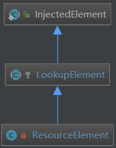

# 第09节 Spring Bean后置处理器--CommonAnnotationBeanPostProcessor

如下是
```text
BeanPostProcessor实现类，它支持开箱即用的常见Java注解，特别是javax.annotation中的JSR-250注解。
许多Java EE 5技术(例如JSF 1.2)以及Java 6的JAX-WS都支持这些常见的Java注解。

这个后处理器通过继承InitDestroyAnnotationBeanPostProcessor和预配置的注解类型，
包括对 @PostConstruct 和 @PreDestroy 注解的支持——分别作为init注释和destroy注释。

中心元素是 @Resource 注解，用于注解驱动的命名bean注入，
在默认情况下 来自包含Spring BeanFactory, JNDI中只解析了mappedName引用。
“alwaysUseJndiLookup”标志对 名称引用 和 默认名称 强制执行 与标准Java EE 5 资源注入 相同的JNDI查找。
目标bean可以是简单的pojo，除了类型必须匹配之外，没有其他特殊要求。

也支持JAX-WS javax.xml.ws.WebServiceRef注解，类似于Resource，但具有创建特定JAX-WS服务端点的功能。
这可以通过名称指向显式定义的资源，也可以对本地指定的JAX-WS服务类进行操作。
最后，这个后处理器还支持EJB 3 javax.ejb.EJB注解，类似于Resource，具有为回退检索指定本地bean名称和全局JNDI名称的能力。
在本例中，目标bean可以是普通pojo，也可以是EJB 3会话bean。

在Java 6 (JDK 1.6)和Java EE 5/6中都可以使用这个后处理器支持的通用注解
(Java EE 5/6也为其通用注解提供了一个独立的jar，允许在任何基于Java 5的应用程序中使用)。

对于默认用法，将 资源名称 解析为Spring bean名称，只需在应用程序上下文中定义以下内容:
    <bean class="org.springframework.context.annotation.CommonAnnotationBeanPostProcessor"/>

对于直接JNDI访问，将 资源名称 解析为Java EE应用程序的“Java:comp/env/”命名空间中的JNDI资源引用，使用以下方法:
    <bean class="org.springframework.context.annotation.CommonAnnotationBeanPostProcessor">
        <property name="alwaysUseJndiLookup" value="true"/>
    </bean>

mappedName引用 将始终在JNDI中解析，从而也允许全局JNDI名称(包括“java:”前缀)。
“alwaysUseJndiLookup”标志只影响名称引用和默认名称(从字段名/属性名推断)。

注意: 
    一个默认的CommonAnnotationBeanPostProcessor将
    被"context:annotation-config"和"context:component-scan" XML标签注册。
    如果您打算指定自定义CommonAnnotationBeanPostProcessor bean定义，请删除或关闭默认 注解配置!
    
注: 注解注入 将在 XML注入 之前执行; 因此，对于通过两种方式(注解注入、XML注入)注入的属性，后一种配置将覆盖前一种配置。
```

CommonAnnotationBeanPostProcessor这个BeanPostProcessor通过
继承InitDestroyAnnotationBeanPostProcessor对@javax.annotation.PostConstruct和@javax.annotation.PreDestroy注解的支持。
以及依据bean name依赖注入的@javax.annotation.Resource支持。
也支持@WebServiceRef注解，具有创建JAX-WS服务端点的能力。
最后,处理器还支持EJB3(@EJB)。

## 1、对@PostConstruct和@PreDestroy注解的处理

CommonAnnotationBeanPostProcessor继承了InitDestroyAnnotationBeanPostProcessor，
这两个注解是由这个父类完成解析的，在CommonAnnotationBeanPostProcessor构造函数中
调用父类的方法setInitAnnotationType()和setDestroyAnnotationType()将这两个注解Class对象传递给父类。
```text
public CommonAnnotationBeanPostProcessor() {
   setOrder(Ordered.LOWEST_PRECEDENCE - 3);
   setInitAnnotationType(PostConstruct.class);
   setDestroyAnnotationType(PreDestroy.class);
   ignoreResourceType("javax.xml.ws.WebServiceContext");
}
```
在InitDestroyAnnotationBeanPostProcessor中分三个阶段完成这两个注解功能，分别为：
```text
1) 实现了MergedBeanDefinitionPostProcessor.postProcessMergedBeanDefinition()方法
    缓存初始化后和销毁前执行的方法。
2) 实现了BeanPostProcessor.postProcessBeforeInitialization()用来执行 @PostConstruct标注 的方法。
3) 实现了DestructionAwareBeanPostProcessor.postProcessBeforeDestruction()用来执行 @PreDestroy标注 的方法。
```

### 1.1、查找生命周期方法

在实例化一个bean后此时还未进行依赖注入时，
每个bean definition会被MergedBeanDefinitionPostProcessor.postProcessMergedBeanDefinition()方法
执行一遍用来获取一些元数据来增加额外的功能，
InitDestroyAnnotationBeanPostProcessor就是将bean定义了被@PostConstruct和@PreDestroy注解的方法
缓存到一个Map中，供之后BeanPostProcessor.postProcessBeforeInitialization()
和DestructionAwareBeanPostProcessor.postProcessBeforeDestruction()阶段可以直接获取这些方法来执行。
```text
@Override
public void postProcessMergedBeanDefinition(RootBeanDefinition beanDefinition, Class<?> beanType, String beanName) {
   super.postProcessMergedBeanDefinition(beanDefinition, beanType, beanName);
   InjectionMetadata metadata = findResourceMetadata(beanName, beanType, null);
   metadata.checkConfigMembers(beanDefinition);
}
```

先看父类查找bean的初始化和销毁的方法。
```text
@Override
public void postProcessMergedBeanDefinition(RootBeanDefinition beanDefinition,
        Class<?> beanType, String beanName) {
    LifecycleMetadata metadata = findLifecycleMetadata(beanType);
    metadata.checkConfigMembers(beanDefinition);
}
```

findLifecycleMetadata方法内部主要调用buildLifecycleMetadata方法完成生命周期方法的，其余部分是缓存的操作不关心。
```text
private LifecycleMetadata buildLifecycleMetadata(final Class<?> clazz) {
   List<LifecycleElement> initMethods = new ArrayList<>();
   List<LifecycleElement> destroyMethods = new ArrayList<>();
   Class<?> targetClass = clazz;
 
   do {
      final List<LifecycleElement> currInitMethods = new ArrayList<>();
      final List<LifecycleElement> currDestroyMethods = new ArrayList<>();
 
      ReflectionUtils.doWithLocalMethods(targetClass, method -> {
         // 构造方法指定的@PostConstruct注解
         if (this.initAnnotationType != null && method.isAnnotationPresent(this.initAnnotationType)) {
            LifecycleElement element = new LifecycleElement(method);
            currInitMethods.add(element);
            if (logger.isTraceEnabled()) {
               logger.trace("Found init method on class [" + clazz.getName() + "]: " + method);
            }
         }
         // @PreDestroy方法
         if (this.destroyAnnotationType != null && method.isAnnotationPresent(this.destroyAnnotationType)) {
            currDestroyMethods.add(new LifecycleElement(method));
            if (logger.isTraceEnabled()) {
               logger.trace("Found destroy method on class [" + clazz.getName() + "]: " + method);
            }
         }
      });
      // 初始化方法父类早于子类
      initMethods.addAll(0, currInitMethods);
      // 销毁方法父类晚于子类
      destroyMethods.addAll(currDestroyMethods);
      targetClass = targetClass.getSuperclass();
   }
   while (targetClass != null && targetClass != Object.class);
 
   return new LifecycleMetadata(clazz, initMethods, destroyMethods);
}
```

LifecycleElement是一个内部类，保存了生命周期方法和方法的一个标识符，和一个invoke()方法用来调用被注解的方法。
值得注意的是这个方法的可以是private的。
```text
private static class LifecycleElement {
   private final Method method;
   private final String identifier;
   public LifecycleElement(Method method) {
      if (method.getParameterCount() != 0) {
         throw new IllegalStateException("Lifecycle method annotation requires a no-arg method: " + method);
      }
      this.method = method;
      this.identifier = (Modifier.isPrivate(method.getModifiers()) ?
            ClassUtils.getQualifiedMethodName(method) : method.getName());
   }
   public void invoke(Object target) throws Throwable {
      ReflectionUtils.makeAccessible(this.method);
      this.method.invoke(target, (Object[]) null);
   }
}
```

在依托**父类完成生命周期方法**的查找后就是查找@Resource有关的字段或方法了。

### 1.2、@PostConstruct方法的处理

bean会经过BeanPostProcessor.postProcessBeforeInitialization()方法处理，这个时候就会调用@PostConstruct方法。
```text
@Override
public Object postProcessBeforeInitialization(Object bean, String beanName) throws BeansException {
   LifecycleMetadata metadata = findLifecycleMetadata(bean.getClass());
   try {
      metadata.invokeInitMethods(bean, beanName);
   }
   catch (InvocationTargetException ex) {
      throw new BeanCreationException(beanName, "Invocation of init method failed", ex.getTargetException());
   }
   catch (Throwable ex) {
      throw new BeanCreationException(beanName, "Failed to invoke init method", ex);
   }
   return bean;
}

public void invokeInitMethods(Object target, String beanName) throws Throwable {
   Collection<LifecycleElement> checkedInitMethods = this.checkedInitMethods;
   Collection<LifecycleElement> initMethodsToIterate =
         (checkedInitMethods != null ? checkedInitMethods : this.initMethods);
   if (!initMethodsToIterate.isEmpty()) {
      for (LifecycleElement element : initMethodsToIterate) {
         if (logger.isTraceEnabled()) {
            logger.trace("Invoking init method on bean '" + beanName + "': " + element.getMethod());
         }
         element.invoke(target);
      }
   }
}
```

### 1.3、@PreDestroy方法的处理

在bean销毁前会经过DestructionAwareBeanPostProcessor.postProcessBeforeDestruction()方法，
在这个时候执行@PreDestroy方法。
```text
@Override
public void postProcessBeforeDestruction(Object bean, String beanName) throws BeansException {
   LifecycleMetadata metadata = findLifecycleMetadata(bean.getClass());
   try {
      metadata.invokeDestroyMethods(bean, beanName);
   }
   catch (InvocationTargetException ex) {
      String msg = "Destroy method on bean with name '" + beanName + "' threw an exception";
      if (logger.isDebugEnabled()) {
         logger.warn(msg, ex.getTargetException());
      }
      else {
         logger.warn(msg + ": " + ex.getTargetException());
      }
   }
   catch (Throwable ex) {
      logger.warn("Failed to invoke destroy method on bean with name '" + beanName + "'", ex);
   }
}

public void invokeDestroyMethods(Object target, String beanName) throws Throwable {
   Collection<LifecycleElement> checkedDestroyMethods = this.checkedDestroyMethods;
   Collection<LifecycleElement> destroyMethodsToUse =
         (checkedDestroyMethods != null ? checkedDestroyMethods : this.destroyMethods);
   if (!destroyMethodsToUse.isEmpty()) {
      for (LifecycleElement element : destroyMethodsToUse) {
         if (logger.isTraceEnabled()) {
            logger.trace("Invoking destroy method on bean '" + beanName + "': " + element.getMethod());
         }
         element.invoke(target);
      }
   }
}
```

## 2、对@Resource注解的处理

与@PostConstruct类似，先在postProcessMergedBeanDefinition中取得被@Resource标记的字段或方法，
后再postProcessProperties()方法中完成对象的注入。
```text
@Override
public void postProcessMergedBeanDefinition(RootBeanDefinition beanDefinition, Class<?> beanType, String beanName) {
   super.postProcessMergedBeanDefinition(beanDefinition, beanType, beanName);
   //找出beanType所有被@Resource标记的字段和方法封装到InjectionMetadata中
   InjectionMetadata metadata = findResourceMetadata(beanName, beanType, null);
   //将InjectionMetadata中每个被@Resource标记的字段和方法打标，防止重复计算
   metadata.checkConfigMembers(beanDefinition);
}
 
private InjectionMetadata findResourceMetadata(String beanName, final Class<?> clazz, @Nullable PropertyValues pvs) {
   // Fall back to class name as cache key, for backwards compatibility with custom callers.
   String cacheKey = (StringUtils.hasLength(beanName) ? beanName : clazz.getName());
   // Quick check on the concurrent map first, with minimal locking.
   InjectionMetadata metadata = this.injectionMetadataCache.get(cacheKey);
   if (InjectionMetadata.needsRefresh(metadata, clazz)) {
      synchronized (this.injectionMetadataCache) {
         metadata = this.injectionMetadataCache.get(cacheKey);
         if (InjectionMetadata.needsRefresh(metadata, clazz)) {
            if (metadata != null) {
               metadata.clear(pvs);
            }
            metadata = buildResourceMetadata(clazz);
            this.injectionMetadataCache.put(cacheKey, metadata);
         }
      }
   }
   return metadata;
}

private InjectionMetadata buildResourceMetadata(final Class<?> clazz) {
   List<InjectionMetadata.InjectedElement> elements = new ArrayList<>();
   Class<?> targetClass = clazz;
 
   do {
      final List<InjectionMetadata.InjectedElement> currElements = new ArrayList<>();
 
      ReflectionUtils.doWithLocalFields(targetClass, field -> {
         if (webServiceRefClass != null && field.isAnnotationPresent(webServiceRefClass)) {
            if (Modifier.isStatic(field.getModifiers())) {
               throw new IllegalStateException("@WebServiceRef annotation is not supported on static fields");
            }
            currElements.add(new WebServiceRefElement(field, field, null));
         }
         else if (ejbRefClass != null && field.isAnnotationPresent(ejbRefClass)) {
            if (Modifier.isStatic(field.getModifiers())) {
               throw new IllegalStateException("@EJB annotation is not supported on static fields");
            }
            currElements.add(new EjbRefElement(field, field, null));
         }
         else if (field.isAnnotationPresent(Resource.class)) {
            // 注意静态字段不支持
            if (Modifier.isStatic(field.getModifiers())) {
               throw new IllegalStateException("@Resource annotation is not supported on static fields");
            }
            // 如果不想注入某一类型对象 可以将其加入ignoredResourceTypes中
            if (!this.ignoredResourceTypes.contains(field.getType().getName())) {
               //字段会封装到ResourceElement
               currElements.add(new ResourceElement(field, field, null));
            }
         }
      });
 
      ReflectionUtils.doWithLocalMethods(targetClass, method -> {
         // 找出我们在代码中定义的方法而非编译器为我们生成的方法
         Method bridgedMethod = BridgeMethodResolver.findBridgedMethod(method);
         if (!BridgeMethodResolver.isVisibilityBridgeMethodPair(method, bridgedMethod)) {
            return;
         }
         // 如果重写了父类的方法，则使用子类的
         if (method.equals(ClassUtils.getMostSpecificMethod(method, clazz))) {
            if (webServiceRefClass != null && bridgedMethod.isAnnotationPresent(webServiceRefClass)) {
               if (Modifier.isStatic(method.getModifiers())) {
                  throw new IllegalStateException("@WebServiceRef annotation is not supported on static methods");
               }
               if (method.getParameterCount() != 1) {
                  throw new IllegalStateException("@WebServiceRef annotation requires a single-arg method: " + method);
               }
               PropertyDescriptor pd = BeanUtils.findPropertyForMethod(bridgedMethod, clazz);
               currElements.add(new WebServiceRefElement(method, bridgedMethod, pd));
            }
            else if (ejbRefClass != null && bridgedMethod.isAnnotationPresent(ejbRefClass)) {
               if (Modifier.isStatic(method.getModifiers())) {
                  throw new IllegalStateException("@EJB annotation is not supported on static methods");
               }
               if (method.getParameterCount() != 1) {
                  throw new IllegalStateException("@EJB annotation requires a single-arg method: " + method);
               }
               PropertyDescriptor pd = BeanUtils.findPropertyForMethod(bridgedMethod, clazz);
               currElements.add(new EjbRefElement(method, bridgedMethod, pd));
            }
            else if (bridgedMethod.isAnnotationPresent(Resource.class)) {
               // 同样不支持静态方法
               if (Modifier.isStatic(method.getModifiers())) {
                  throw new IllegalStateException("@Resource annotation is not supported on static methods");
               }
               Class<?>[] paramTypes = method.getParameterTypes();
               if (paramTypes.length != 1) {
                  throw new IllegalStateException("@Resource annotation requires a single-arg method: " + method);
               }
               if (!this.ignoredResourceTypes.contains(paramTypes[0].getName())) {
                  // bean的getter或setter
                  PropertyDescriptor pd = BeanUtils.findPropertyForMethod(bridgedMethod, clazz);
                  currElements.add(new ResourceElement(method, bridgedMethod, pd));
               }
            }
         }
      });
      //先父后子
      elements.addAll(0, currElements);
      targetClass = targetClass.getSuperclass();
   }
   while (targetClass != null && targetClass != Object.class);
 
   return new InjectionMetadata(clazz, elements);
}
```
上述代码是将@Resource注解的字段和方法以bean name为key，InjectedElement为value封装一个Map中，
在属性注入阶段取出InjectedElement通过 **反射** 为目标字段或方法设置@Resource name指定的bean。
InjectionMetadata封装的是一组InjectionMetadata.InjectedElement，
这个InjectedElement会使用inject方法完成依赖注入，具体下面会讲到。

下面看postProcessProperties()方法如何进行属性注入的。
```text
@Override
public PropertyValues postProcessProperties(PropertyValues pvs, Object bean, String beanName) {
   InjectionMetadata metadata = findResourceMetadata(beanName, bean.getClass(), pvs);
   try {
      metadata.inject(bean, beanName, pvs);
   }
   catch (Throwable ex) {
      throw new BeanCreationException(beanName, "Injection of resource dependencies failed", ex);
   }
   return pvs;
}
```
将缓存中的InjectionMetadata 取出调用它的inject方法。
```text
@Override
public PropertyValues postProcessProperties(PropertyValues pvs, Object bean, String beanName) {
   InjectionMetadata metadata = findResourceMetadata(beanName, bean.getClass(), pvs);
   try {
      metadata.inject(bean, beanName, pvs);
   }
   catch (Throwable ex) {
      throw new BeanCreationException(beanName, "Injection of resource dependencies failed", ex);
   }
   return pvs;
}
```
依次调用之前保存的ResourceElement对象的inject方法。下面的重点就是放到了ResourceElement身上。

```text
private class ResourceElement extends LookupElement {
 
   private final boolean lazyLookup;
 
   // 根据上面分析有两种调用构造方法的情况
   // 1、member是字段ae也是字段，pd==null
   // 2、member是桥接方法(或原始方法)ae是原始方法，pd是原始方法的getter或setter
   public ResourceElement(Member member, AnnotatedElement ae, @Nullable PropertyDescriptor pd) {
      super(member, pd);
      Resource resource = ae.getAnnotation(Resource.class);
      String resourceName = resource.name();
      Class<?> resourceType = resource.type();
      this.isDefaultName = !StringUtils.hasLength(resourceName);
      if (this.isDefaultName) {
         /// 如果没有设置@Resource name属性就用字段名称作为bean name
         resourceName = this.member.getName();
         // 如果member是setter方法方法 则取setXXX得XXX部分为bean name
         if (this.member instanceof Method && resourceName.startsWith("set") && resourceName.length() > 3) {
            resourceName = Introspector.decapitalize(resourceName.substring(3));
         }
      }
      else if (embeddedValueResolver != null) {
         //如果设置了@Resource name的属性，则使用EmbeddedValueResolver对象先做一次SpringEL解析得到真正的bean name
         resourceName = embeddedValueResolver.resolveStringValue(resourceName);
      }
      if (Object.class != resourceType) {
         // 确保字段或setter方法类型与resourceType一致
         checkResourceType(resourceType);
      }
      else {
         // No resource type specified... check field/method.
         resourceType = getResourceType();
      }
      this.name = (resourceName != null ? resourceName : "");
      this.lookupType = resourceType;
      String lookupValue = resource.lookup();
      // 如果使用jndi查找的名字
      this.mappedName = (StringUtils.hasLength(lookupValue) ? lookupValue : resource.mappedName());
      Lazy lazy = ae.getAnnotation(Lazy.class);
      // 是否延迟注入
      this.lazyLookup = (lazy != null && lazy.value());
   }
 
   @Override
   protected Object getResourceToInject(Object target, @Nullable String requestingBeanName) {
      // 如果懒加载则使用一个代理对象，往下看
      return (this.lazyLookup ? buildLazyResourceProxy(this, requestingBeanName) :
            getResource(this, requestingBeanName));
   }
}
```

从上面CommonAnnotationBeanPostProcessor的postProcessProperties()方法可知，
属性的注入是调用ResourceElement的inject()方法，
ResourceElement本身没有这个方法而是调用父类InjectedElement的inject方法。
```text
protected void inject(Object target, @Nullable String requestingBeanName, @Nullable PropertyValues pvs)
      throws Throwable {
 
   if (this.isField) {
      Field field = (Field) this.member;
      ReflectionUtils.makeAccessible(field);
      // 如果是使用字段形式的注入，getResourceToInject由子类@ResourceElement实现，下面再看
      field.set(target, getResourceToInject(target, requestingBeanName));
   }
   else {
      // 此步骤检测如果bean已经显示的设置一个对象依赖引用则跳过使用setter方法再次赋值。
      if (checkPropertySkipping(pvs)) {
         return;
      }
      try {
         Method method = (Method) this.member;
         // 支持私有方法
         ReflectionUtils.makeAccessible(method);
         method.invoke(target, getResourceToInject(target, requestingBeanName));
      }
      catch (InvocationTargetException ex) {
         throw ex.getTargetException();
      }
   }
}
```
可以看到需要注入对象的来源方法getResourceToInject(),
上面已经看到如果懒加载则使用buildLazyResourceProxy()方法将返回一个代理对象，
等到使用到这个代理对象的方法时才会调用getResource()返回requestingBeanName指定的bean。
下面先看getResource()方法。
```text
protected Object getResource(LookupElement element, @Nullable String requestingBeanName)
      throws NoSuchBeanDefinitionException {
    
   if (StringUtils.hasLength(element.mappedName)) {
      return this.jndiFactory.getBean(element.mappedName, element.lookupType);
   }
   if (this.alwaysUseJndiLookup) {
      return this.jndiFactory.getBean(element.name, element.lookupType);
   }
   if (this.resourceFactory == null) {
      throw new NoSuchBeanDefinitionException(element.lookupType,
            "No resource factory configured - specify the 'resourceFactory' property");
   }
   return autowireResource(this.resourceFactory, element, requestingBeanName);
}
```

getResource()方法又直接调用了autowireResource()方法。
```text
protected Object autowireResource(BeanFactory factory, LookupElement element, @Nullable String requestingBeanName)
      throws NoSuchBeanDefinitionException {
 
   Object resource;
   Set<String> autowiredBeanNames;
   String name = element.name;
 
   if (this.fallbackToDefaultTypeMatch && element.isDefaultName &&
         factory instanceof AutowireCapableBeanFactory && !factory.containsBean(name)) {
      // 如果容器中还没有此bean，则会使用resolveDependency()方法将符合bean type的bean definetion调用一次getBean()从这些bean选出符合requestingBeanName的bean
      autowiredBeanNames = new LinkedHashSet<>();
      resource = ((AutowireCapableBeanFactory) factory).resolveDependency(
            element.getDependencyDescriptor(), requestingBeanName, autowiredBeanNames, null);
      if (resource == null) {
         throw new NoSuchBeanDefinitionException(element.getLookupType(), "No resolvable resource object");
      }
   }
   else {
      // 如果容器中有此bean则取出这个bean对象作为属性值
      resource = factory.getBean(name, element.lookupType);
      autowiredBeanNames = Collections.singleton(name);
   }
 
   if (factory instanceof ConfigurableBeanFactory) {
      ConfigurableBeanFactory beanFactory = (ConfigurableBeanFactory) factory;
      for (String autowiredBeanName : autowiredBeanNames) {
         if (requestingBeanName != null && beanFactory.containsBean(autowiredBeanName)) {
            beanFactory.registerDependentBean(autowiredBeanName, requestingBeanName);
         }
      }
   }
 
   return resource;
}
```

下面再看需要懒加载的代理对象创建方法buildLazyResourceProxy()。
```text
protected Object buildLazyResourceProxy(final LookupElement element, final @Nullable String requestingBeanName) {
   TargetSource ts = new TargetSource() {
      @Override
      public Class<?> getTargetClass() {
         return element.lookupType;
      }
      @Override
      public boolean isStatic() {
         return false;
      }
      @Override
      public Object getTarget() {
         // 这个方法里还是会调用getResource()，什么时候调用的getTarget()方法呢，往下看
         return getResource(element, requestingBeanName);
      }
      @Override
      public void releaseTarget(Object target) {
      }
   };
   // 代理对象工厂
   ProxyFactory pf = new ProxyFactory();
   pf.setTargetSource(ts);
   if (element.lookupType.isInterface()) {
      pf.addInterface(element.lookupType);
   }
   ClassLoader classLoader = (this.beanFactory instanceof ConfigurableBeanFactory ?
         ((ConfigurableBeanFactory) this.beanFactory).getBeanClassLoader() : null);
   return pf.getProxy(classLoader);
}
```

代理工厂首先将TargetSource对象赋值到自身的成员变量中，然后调用getProxy()创建代理对象。
```text
public Object getProxy(@Nullable ClassLoader classLoader) {
   return createAopProxy().getProxy(classLoader);
}
protected final synchronized AopProxy createAopProxy() {
   if (!this.active) {
      activate();
   }
   // getAopProxyFactory()默认返回DefaultAopProxyFactory
   return getAopProxyFactory().createAopProxy(this);
}
```
```text
public AopProxy createAopProxy(AdvisedSupport config) throws AopConfigException {
   if (config.isOptimize() || config.isProxyTargetClass() || hasNoUserSuppliedProxyInterfaces(config)) {
      Class<?> targetClass = config.getTargetClass();
      if (targetClass == null) {
         throw new AopConfigException("TargetSource cannot determine target class: " +
               "Either an interface or a target is required for proxy creation.");
      }
      if (targetClass.isInterface() || Proxy.isProxyClass(targetClass)) {
         return new JdkDynamicAopProxy(config);
      }
      return new ObjenesisCglibAopProxy(config);
   }
   else {
      return new JdkDynamicAopProxy(config);
   }
}
```

最终是使用了AopProxy 的具体子类的getProxy()方法完成代理对象的创建。以JdkDynamicAopProxy为例。
```text
public Object getProxy(@Nullable ClassLoader classLoader) {
   if (logger.isTraceEnabled()) {
      logger.trace("Creating JDK dynamic proxy: " + this.advised.getTargetSource());
   }
   Class<?>[] proxiedInterfaces = AopProxyUtils.completeProxiedInterfaces(this.advised, true);
   findDefinedEqualsAndHashCodeMethods(proxiedInterfaces);
   return Proxy.newProxyInstance(classLoader, proxiedInterfaces, this);
}
```

使用了JDK的动态代理，自身也实现了InvocationHandler接口，来看invoke()实现。
```text
public Object invoke(Object proxy, Method method, Object[] args) throws Throwable {
   MethodInvocation invocation;
   Object oldProxy = null;
   boolean setProxyContext = false;
 
   TargetSource targetSource = this.advised.targetSource;
   Object target = null;
 
   try {
      if (!this.equalsDefined && AopUtils.isEqualsMethod(method)) {
         // The target does not implement the equals(Object) method itself.
         return equals(args[0]);
      }
      else if (!this.hashCodeDefined && AopUtils.isHashCodeMethod(method)) {
         // The target does not implement the hashCode() method itself.
         return hashCode();
      }
      else if (method.getDeclaringClass() == DecoratingProxy.class) {
         // There is only getDecoratedClass() declared -> dispatch to proxy config.
         return AopProxyUtils.ultimateTargetClass(this.advised);
      }
      else if (!this.advised.opaque && method.getDeclaringClass().isInterface() &&
            method.getDeclaringClass().isAssignableFrom(Advised.class)) {
         // Service invocations on ProxyConfig with the proxy config...
         return AopUtils.invokeJoinpointUsingReflection(this.advised, method, args);
      }
 
      Object retVal;
 
      if (this.advised.exposeProxy) {
         // Make invocation available if necessary.
         oldProxy = AopContext.setCurrentProxy(proxy);
         setProxyContext = true;
      }
 
      // Get as late as possible to minimize the time we "own" the target,
      // in case it comes from a pool.
      target = targetSource.getTarget();
      Class<?> targetClass = (target != null ? target.getClass() : null);
 
      // Get the interception chain for this method.
      List<Object> chain = this.advised.getInterceptorsAndDynamicInterceptionAdvice(method, targetClass);
 
      // Check whether we have any advice. If we don't, we can fallback on direct
      // reflective invocation of the target, and avoid creating a MethodInvocation.
      if (chain.isEmpty()) {
         // We can skip creating a MethodInvocation: just invoke the target directly
         // Note that the final invoker must be an InvokerInterceptor so we know it does
         // nothing but a reflective operation on the target, and no hot swapping or fancy proxying.
         Object[] argsToUse = AopProxyUtils.adaptArgumentsIfNecessary(method, args);
         retVal = AopUtils.invokeJoinpointUsingReflection(target, method, argsToUse);
      }
      else {
         // We need to create a method invocation...
         invocation = new ReflectiveMethodInvocation(proxy, target, method, args, targetClass, chain);
         // Proceed to the joinpoint through the interceptor chain.
         retVal = invocation.proceed();
      }
 
      // Massage return value if necessary.
      Class<?> returnType = method.getReturnType();
      if (retVal != null && retVal == target &&
            returnType != Object.class && returnType.isInstance(proxy) &&
            !RawTargetAccess.class.isAssignableFrom(method.getDeclaringClass())) {
         // Special case: it returned "this" and the return type of the method
         // is type-compatible. Note that we can't help if the target sets
         // a reference to itself in another returned object.
         retVal = proxy;
      }
      else if (retVal == null && returnType != Void.TYPE && returnType.isPrimitive()) {
         throw new AopInvocationException(
               "Null return value from advice does not match primitive return type for: " + method);
      }
      return retVal;
   }
   finally {
      if (target != null && !targetSource.isStatic()) {
         // Must have come from TargetSource.
         targetSource.releaseTarget(target);
      }
      if (setProxyContext) {
         // Restore old proxy.
         AopContext.setCurrentProxy(oldProxy);
      }
   }
}
```

这个方法大段代码是为了实现AOP，但还是会调用target = targetSource.getTarget();获取实际对象的，
可以看到懒 加载机制 的代理对象只有调用其方法才会去容器中获取实际的bean。
