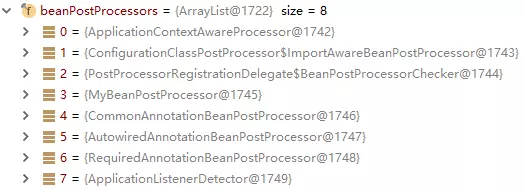

# 第10节 Spring 的BeanPostProcessor

如下是BeanPostProcessor接口的源码注释翻译:
```text
允许自定义修改新 bean实例(bean instance) 的 工厂挂钩 ——例如，检查 标记接口 或用 代理 包装bean。
通常，
通过 标记接口 或类似的方式填充bean的 后处理器 将实现postProcessBeforeInitialization，
通过 代理 包装bean的 后处理器 通常将实现postProcessAfterInitialization。

登记: 
    ApplicationContext可以 在其bean定义中 自动检测BeanPostProcessor bean，
    并将这些 后置处理器(post-processors) 应用于 随后创建的 任何bean。
    普通的BeanFactory允许对 后处理器 进行编程注册，将它们应用于通过bean工厂创建的所有bean。
    
排序: 
    在ApplicationContext中 自动检测 到的后置处理器bean，
    将根据 org.springframework.core.priorityOrdered和org.springframework.core.Ordered语义进行排序。
    相反，通过BeanFactory以编程方式注册的 后置处理器bean，将按照注册的顺序应用。
    通过实现 PriorityOrdered或Ordered接口 表达的任何排序语义，将被编程注册的后处理器忽略。
    此外，@Order注解没有考虑到 后置处理器bean。
```

## 概述

BeanPostProcessor也称为Bean后置处理器，
它是Spring中定义的接口，在Spring容器的创建过程中（具体为Bean初始化前后）会回调BeanPostProcessor中定义的两个方法。
BeanPostProcessor的源码如下
```text
public interface BeanPostProcessor {

    Object postProcessBeforeInitialization(Object bean, String beanName) throws BeansException;

    Object postProcessAfterInitialization(Object bean, String beanName) throws BeansException;

}
```
其中postProcessBeforeInitialization方法会在每一个bean对象的初始化方法调用之前回调；
postProcessAfterInitialization方法会在每个bean对象的初始化方法调用之后被回调。

## 执行原理

BeanPostProcessor的执行是定义 **在容器的刷新过程中**，
容器刷新对象具体的方法为：AbstractApplicationContext.refresh()。
在refresh方法执行的调用栈中会去调用AbstractAutowireCapableBeanFactory.doCreateBean()方法，
该方法节选源码如下:
```text
protected Object initializeBean(final String beanName, final Object bean, RootBeanDefinition mbd) {

    if (mbd == null || !mbd.isSynthetic()) {
        wrappedBean = applyBeanPostProcessorsBeforeInitialization(wrappedBean, beanName);
    }
    // 初始化 方法
    invokeInitMethods(beanName, wrappedBean, mbd);
 
    if (mbd == null || !mbd.isSynthetic()) {
        wrappedBean = applyBeanPostProcessorsAfterInitialization(wrappedBean, beanName);
    }
    return wrappedBean;
}
```
看到在调用初始化方法前后会分别调用applyBeanPostProcessorsBeforeInitialization()和applyBeanPostProcessorsAfterInitialization()。
applyBeanPostProcessorsBeforeInitialization()方法的源码如下: 
```text
public Object applyBeanPostProcessorsBeforeInitialization(Object existingBean, String beanName)
        throws BeansException {

    Object result = existingBean;
    // 获取所有的BeanPostProcessor进行遍历
    for (BeanPostProcessor beanProcessor : getBeanPostProcessors()) {
        result = beanProcessor.postProcessBeforeInitialization(result, beanName);
        if (result == null) {
            return result;
        }
    }
    return result;
}
```
可以看到其逻辑为遍历得到容器中所有的BeanPostProcessor，然后依次执行postProcessBeforeInitialization，
一但返回null，就跳出for循环不执行后面的BeanPostProcessor.postProcessorsBeforeInitialization()。
也就是说如果返回的是null那么我们通过getBean方法将得不到目标Bean。

applyBeanPostProcessorsAfterInitialization()方法的逻辑和上面一致，
就是将循环执行的beanProcessor.postProcessBeforeInitialization()替换成beanProcessor.postProcessAfterInitialization()。

Spring底层的很多功能特性都是借助BeanPostProcessor的子类来实现。

## 常见BeanPostProcessor分析

下图是debug过程中，ApplicationContext对象中的包含的BeanPostProcessor。
具体包含哪些BeanPostProcessor和具体应用程序相关，
除了下标3中的MyBeanPostProcessor为自定义的BeanPostProcessor，其余均为Spring自带的BeanPostProcessor。


### ApplicationContextAwareProcessor

ApplicationContextAwareProcessor后置处理器的作用是，
当应用程序定义的Bean实现ApplicationContextAware接口时注入ApplicationContext对象。
```text
@Component
public class Car implements ApplicationContextAware {

    private ApplicationContext applicationContext;
 
    public Car(){
        System.out.println("car instance...");
    }
 
    @Override
    public void setApplicationContext(ApplicationContext applicationContext) throws BeansException {
        System.out.println("ApplicationContextAware...setApplicationContext()");
        this.applicationContext = applicationContext;
    }
}
```
那Car是如何通过实现ApplicationContextAware接口就能获得ApplicationContext对象呢？
答案是通过ApplicationContextAwareProcessor后置处理器来实现，
我们来看看ApplicationContextAwareProcessor的源码: 
```text
class ApplicationContextAwareProcessor implements BeanPostProcessor {

  private final ConfigurableApplicationContext applicationContext;
  private final StringValueResolver embeddedValueResolver;
  
  /**
   * Create a new ApplicationContextAwareProcessor for the given context.
   */
  public ApplicationContextAwareProcessor(ConfigurableApplicationContext applicationContext) {
      this.applicationContext = applicationContext;
      this.embeddedValueResolver = new EmbeddedValueResolver(applicationContext.getBeanFactory());
  }
  
  @Override
  public Object postProcessBeforeInitialization(final Object bean, String beanName) throws BeansException {
      AccessControlContext acc = null;
      // 这里bean是Car,它实现了ApplicationContextAware接口
      if (System.getSecurityManager() != null &&
              (bean instanceof EnvironmentAware || bean instanceof EmbeddedValueResolverAware ||
                      bean instanceof ResourceLoaderAware || bean instanceof ApplicationEventPublisherAware ||
                      bean instanceof MessageSourceAware || bean instanceof ApplicationContextAware)) {
          invokeAwareInterfaces(bean);
      }
      return bean;
  }
  
  private void invokeAwareInterfaces(Object bean) {
      if (bean instanceof Aware) {
          if (bean instanceof EnvironmentAware) {
              ((EnvironmentAware) bean).setEnvironment(this.applicationContext.getEnvironment());
          }
          if (bean instanceof EmbeddedValueResolverAware) {
              ((EmbeddedValueResolverAware) bean).setEmbeddedValueResolver(this.embeddedValueResolver);
          }
          if (bean instanceof ResourceLoaderAware) {
              ((ResourceLoaderAware) bean).setResourceLoader(this.applicationContext);
          }
          if (bean instanceof ApplicationEventPublisherAware) {
              ((ApplicationEventPublisherAware) bean).setApplicationEventPublisher(this.applicationContext);
          }
          if (bean instanceof MessageSourceAware) {
              ((MessageSourceAware) bean).setMessageSource(this.applicationContext);
          }
          if (bean instanceof ApplicationContextAware) {
              // 会执行这里回调car重写的setApplicationContext方法，然后将this.applicationContext注入给Car
              ((ApplicationContextAware) bean).setApplicationContext(this.applicationContext);
          }
      }
  }
  
  @Override
  public Object postProcessAfterInitialization(Object bean, String beanName) {
      return bean;
  }
}
```

### InitDestroyAnnotationBeanPostProcessor

InitDestroyAnnotationBeanPostProcessor后置处理器是: 用来处理自定义的 初始化方法 和 销毁方法。

Spring中提供了3种自定义初始化和销毁方法：
```text
1) 通过@Bean指定 init-method 和 destroy-method 属性;
2) Bean实现InitializingBean（定义初始化逻辑），DisposableBean（定义销毁逻辑）; 
3) @PostConstruct: 在bean 创建完成 并且 属性赋值完成 之后来执行初始化方法;
   @PreDestroy: 在容器 销毁bean之前 通知我们进行清理工作;
```

InitDestroyAnnotationBeanPostProcessor的作用就是让第3种方式生效。
先看看如何使用@PostConstruct和@PreDestroy注解。
```text
@Component
public class Car {

    public Car(){
        System.out.println("car instance...");
    }
 
    /**
     * 自定义的初始化方法
     */
    @PostConstruct
    public void init(){
        System.out.println("car ... init...");
    }
 
    /**
     * 自定义的销毁方法
     */
    @PreDestroy
    public void detory(){
        System.out.println("car ... detory...");
    }
}
```
InitDestroyAnnotationBeanPostProcessor会 **在Bean创建的时候** 通过 **反射** 的方式
查找包含@PostConstruct和@PreDestroy注解的方法，然后再通过反射执行方法。

我们来看看InitDestroyAnnotationBeanPostProcessor.postProcessBeforeInitialization()的源码:
```text
	@Override
	public Object postProcessBeforeInitialization(Object bean, String beanName) throws BeansException {
		// 查找包含@PostConstruct和@PreDestroy注解的方法
		LifecycleMetadata metadata = findLifecycleMetadata(bean.getClass());
		try {
			metadata.invokeInitMethods(bean, beanName);
		}
		catch (InvocationTargetException ex) {
			throw new BeanCreationException(beanName, "Invocation of init method failed", ex.getTargetException());
		}
		catch (Throwable ex) {
			throw new BeanCreationException(beanName, "Failed to invoke init method", ex);
		}
		return bean;
	}
	
    private LifecycleMetadata findLifecycleMetadata(Class<?> clazz) {
		if (this.lifecycleMetadataCache == null) {
			// Happens after deserialization, during destruction...
			// 构建生命周期元数据
			return buildLifecycleMetadata(clazz);
		}
		// Quick check on the concurrent map first, with minimal locking.
		LifecycleMetadata metadata = this.lifecycleMetadataCache.get(clazz);
		if (metadata == null) {
			synchronized (this.lifecycleMetadataCache) {
				metadata = this.lifecycleMetadataCache.get(clazz);
				if (metadata == null) {
				    // 构建生命周期元数据
					metadata = buildLifecycleMetadata(clazz);
					this.lifecycleMetadataCache.put(clazz, metadata);
				}
				return metadata;
			}
		}
		return metadata;
	}
	
	private LifecycleMetadata buildLifecycleMetadata(final Class<?> clazz) {
		if (!AnnotationUtils.isCandidateClass(clazz, Arrays.asList(this.initAnnotationType, this.destroyAnnotationType))) {
			return this.emptyLifecycleMetadata;
		}

		List<LifecycleElement> initMethods = new ArrayList<>();
		List<LifecycleElement> destroyMethods = new ArrayList<>();
		Class<?> targetClass = clazz;

		do {
			final List<LifecycleElement> currInitMethods = new ArrayList<>();
			final List<LifecycleElement> currDestroyMethods = new ArrayList<>();

			ReflectionUtils.doWithLocalMethods(targetClass, method -> {
			    // 子类 构造函数中 初始化指定的@PostConstruct注解
				if (this.initAnnotationType != null && method.isAnnotationPresent(this.initAnnotationType)) {
					LifecycleElement element = new LifecycleElement(method);
					currInitMethods.add(element);
					if (logger.isTraceEnabled()) {
						logger.trace("Found init method on class [" + clazz.getName() + "]: " + method);
					}
				}
				// 子类 构造函数中 初始化指定的@PreDestroy注解
				if (this.destroyAnnotationType != null && method.isAnnotationPresent(this.destroyAnnotationType)) {
					currDestroyMethods.add(new LifecycleElement(method));
					if (logger.isTraceEnabled()) {
						logger.trace("Found destroy method on class [" + clazz.getName() + "]: " + method);
					}
				}
			});

			initMethods.addAll(0, currInitMethods);
			destroyMethods.addAll(currDestroyMethods);
			targetClass = targetClass.getSuperclass();
		}
		while (targetClass != null && targetClass != Object.class);

		return (initMethods.isEmpty() && destroyMethods.isEmpty() ? this.emptyLifecycleMetadata :
				new LifecycleMetadata(clazz, initMethods, destroyMethods));
	}
```

## 使用
我们定义一个类实现了BeanPostProcessor，默认是会对整个Spring容器中所有的bean进行处理。
```text
public class ConfigValueBeanProcessor implements BeanPostProcessor ,Ordered {
    @Override
    public Object postProcessBeforeInitialization(Object bean, String beanName) throws BeansException {
        ReflectionUtils.doWithLocalFields(bean.getClass(), (field -> {
            System.out.println(field.toString());
            Value valueAnnotation = field.getAnnotation(Value.class);
            if (valueAnnotation != null) {
                if (Modifier.isStatic(field.getModifiers())) {
                    return;
                }
 
            }
        }));
        return bean;
    }
 
    @Override
    public Object postProcessAfterInitialization(Object bean, String beanName) throws BeansException {
        return bean;
    }
 
}
 
  // 配置类中定义bean
  @Bean
  public ConfigValueBeanProcessor getConfigValueBeanProcessor() {
      return new ConfigValueBeanProcessor();
  }
```

## 常用的BeanPostProcessor
```text
1) AutowiredAnnotationBeanPostProcessor:
    解析 @Autowired、@Value 、@Inject 注解等功能。
2) CommonAnnotationBeanPostProcessor:
    解析 @Resource、@PostConstruct、@PreDestroy、@WebServiceRef、@EJB注解等功能。
```
