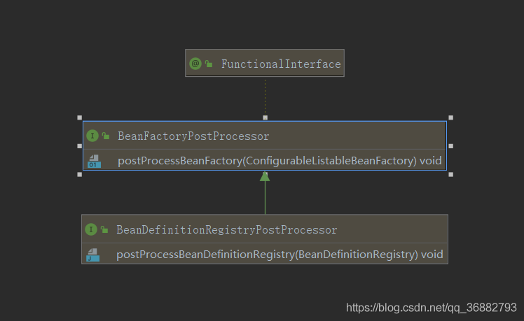
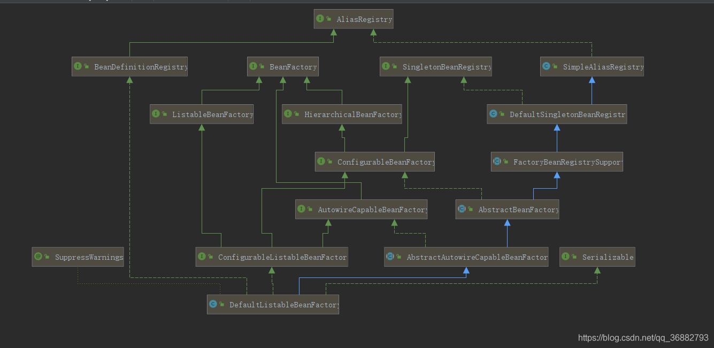
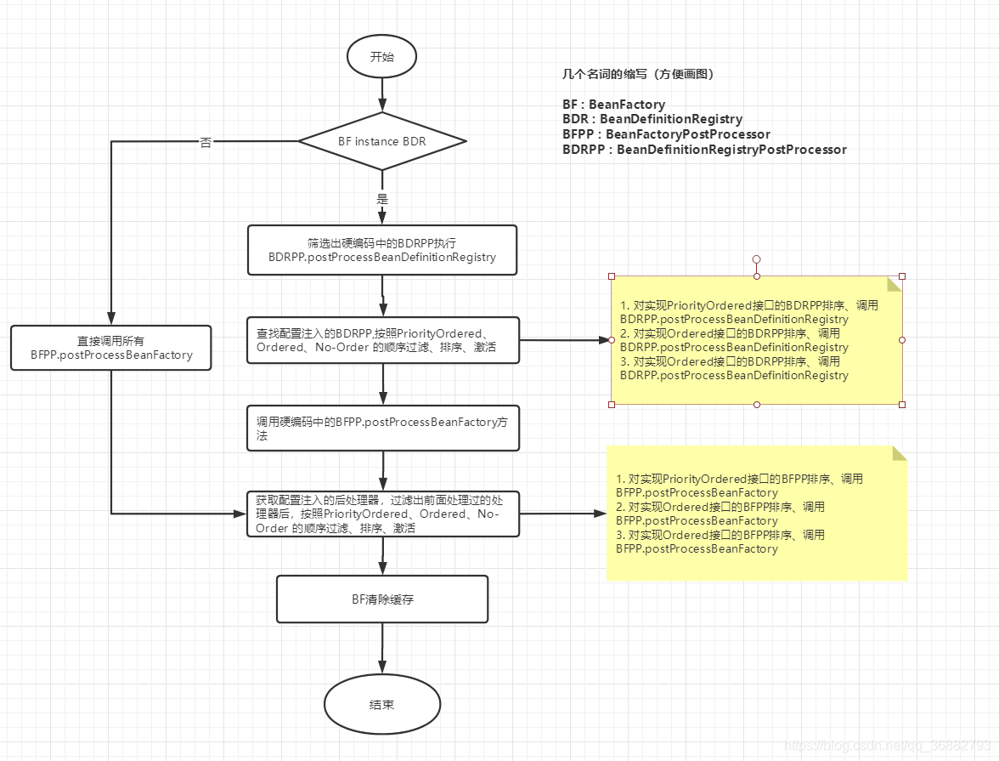

# 第11节 Spring 的BeanFactoryPostProcessor

如下是BeanFactoryPostProcessor的源码注释翻译:
```text
工厂挂钩，允许自定义修改 应用程序上下文 的 bean定义(bean definition)，调整上下文的底层bean工厂的bean属性值。

对于针对系统管理员的自定义配置文件非常有用，这些 配置文件 覆盖在应用程序上下文中配置的bean属性。
有关解决此类配置需求的开箱即用解决方案，请参阅PropertyResourceConfigurer及其具体实现。

BeanFactoryPostProcessor可以与bean定义交互和修改，但不能与bean实例交互。
这样做可能会导致过早的bean实例化，违反容器并导致意想不到的副作用。如果需要bean实例交互，请考虑实现BeanPostProcessor。

登记:
    ApplicationContext在其bean定义中 自动检测 BeanFactory后置处理器bean，并在创建任何其他bean之前应用它们。
    BeanFactoryPostProcessor也可以通过编程方式注册到ConfigurableApplicationContext中。

排序:
    在ApplicationContext中 自动检测 到的BeanFactory后置处理器bean，
    将根据org.springframework.corePriorityOrdered和org.springframework.core.Ordered语义进行排序。
    相反，BeanFactory后置处理器bean是通过ConfigurableApplicationContext以编程方式注册的，它将按照注册的顺序应用。
    通过实现 PriorityOrdered或Ordered接口 表达的任何排序语义 将被编程注册的后处理器忽略。
    此外，@Order注释不会被BeanFactory后置处理器bean考虑在内。
```

## 一、前言

本文是笔者阅读Spring源码的记录文章，由于本人技术水平有限，在文章中难免出现错误，如有发现，感谢各位指正。
在阅读过程中也创建了一些衍生文章，衍生文章的意义是因为自己在看源码的过程中，部分知识点并不了解或者对某些知识点产生了兴趣，
所以为了更好的阅读源码，所以开设了衍生篇的文章来更好的对这些知识点进行进一步的学习。

本文分析的方法是 AbstractApplicationContext#**invokeBeanFactoryPostProcessors**，是 前篇内容的继续部分。

本文衍生篇：

Spring 源码分析衍生篇八 ：ConfigurationClassPostProcessor 上篇
Spring 源码分析衍生篇九 ：ConfigurationClassPostProcessor 下篇

强烈建议阅读完本文后阅读衍生篇内容。与后续文章有关联！！！
强烈建议阅读完本文后阅读衍生篇内容。与后续文章有关联！！！
强烈建议阅读完本文后阅读衍生篇内容。与后续文章有关联！！！

PS : 个人感觉，实现IOC的两个核心后处理器 ：
```text
ConfigurationClassPostProcessor: 
    解析配置类(这里的配置类不仅仅局限于@Configuration注解，还包括 @Import、@ImportResource、@ComponentScan、
     @ComponentScans等注解)，
    将解析到的需要注入到Spring容器中的bean的BeanDefinition保存起来。
AutowiredAnnotationBeanPostProcessor:
    解析bean中的 需要自动注入的bean @Autowired 和 @Inject @Value注解。
```

## 二、BeanFactoryPostProcessor & BeanDefinitionRegistryPostProcessor

由于invokeBeanFactoryPostProcessors方法中主要就是对BeanFactoryPostProcessor的处理，
所以这里简单的介绍一下BeanFactoryPostProcessor及其子接口BeanDefinitionRegistryPostProcessor。
其结构如下图：


BeanFactoryPostProcessor 相比较于 BeanPostProcessor 方法是很简单的，只有一个方法，其子接口也就一个方法。
但是他们俩的功能又是类似的，区别就是作用域并不相同。
BeanFactoryPostProcessor的作用域范围是 容器级别 的。它只和你使用的容器有关。
如果你在容器中定义一个BeanFactoryPostProcessor，它仅仅对此容器中的bean进行后置处理。
BeanFactoryPostProcessor 不会对定义在另一个容器中的bean进行后置处理，即使这两个容器都在同一容器中。

BeanFactoryPostProcessor可以对 bean的定义(配置元数据) 进行处理。
Spring IOC容器允许BeanFactoryPostProcessor在容器实际实例化任何其他bean之前 读取配置元数据，并有可能修改它，
也即是说 **BeanFactoryPostProcessor是直接修改了bean的定义，BeanPostProcessor则是对bean创建过程中进行干涉**。

BeanDefinitionRegistryPostProcessor和BeanFactoryPostProcessor的区别在于：
```text
1) BeanDefinitionRegistryPostProcessor.postProcessBeanDefinitionRegistry方法
    针对是BeanDefinitionRegistry类型的ConfigurableListableBeanFactory，
    可以实现对BeanDefinition的增删改查等操作，
    但是对于非ConfigurableListableBeanFactory类型的BeanFactory，并不起作用。

2) BeanFactoryPostProcessor.postProcessBeanFactory方法针对的是所有的BeanFactory。

3) postProcessBeanDefinitionRegistry方法 的调用时机在postProcessBeanFactory方法 之前。
```

注： 关于 BeanPostProcessor ，请看前篇 ：Spring源码分析衍生篇四：后处理器 BeanPostProcessor

## 三、代码分析

### 1. BeanFactory

需要注意的是，我们这里的 BeanFactory 实际类型是 DefaultListableBeanFactory。
这一点在 Spring源码分析一：容器的刷新 - refresh() 中已经得到证实。

下面我们看看 DefaultListableBeanFactory 的结构图如下，
可以看到DefaultListableBeanFactory 实现了 BeanDefinitionRegistry 接口。这点在下面的分析中会用到。


### 2. 代码分析

invokeBeanFactoryPostProcessors 方法的作用是
   **激活**BeanFactoryPostProcessor 和 BeanDefinitionRegistryPostProcessor 。

为了更好的了解下面的代码，我们先了解几个代码中的规则：

I) BeanFactoryPostProcessor 在本次分析中分为两种类型： 
   BeanFactoryPostProcessor 和其子接口 BeanDefinitionRegistryPostProcessor。
   BeanDefinitionRegistryPostProcessor 相较于 BeanFactoryPostProcessor ，增加了一个方法如下。
```java
@FunctionalInterface
public interface BeanFactoryPostProcessor {
    
   void postProcessBeanFactory(ConfigurableListableBeanFactory beanFactory) throws BeansException;

}

public interface BeanDefinitionRegistryPostProcessor extends BeanFactoryPostProcessor {
    
	void postProcessBeanDefinitionRegistry(BeanDefinitionRegistry registry) throws BeansException;

}
```
需要注意的是，BeanDefinitionRegistryPostProcessor#postProcessBeanDefinitionRegistry 这个方法
仅仅针对于 BeanDefinitionRegistry 类型的 BeanFactory 生效，这一点根据其入参就可以看到。

总结一下即 ： BeanFactoryPostProcessor针对所有的BeanFactory，即对于所有类型的BeanFactory都会调用其方法；
BeanDefinitionRegistryPostProcessor仅对BeanDefinitionRegistry子类的BeanFactory起作用，
非BeanDefinitionRegistry类型则直接处理即可。

II) BeanFactoryPostProcessor 的注入分为两种方式：
```text
1) 配置注入方式：即通过 注解 或者 xml 的方式 动态的注入 到容器中的BeanFactoryPostProcessor;
2) 硬编码注入方式: 这种方式是直接调用**AbstractApplicationContext#addBeanFactoryPostProcessor方法**
    将BeanFactoryPostProcessor添加到AbstractApplicationContext#beanFactoryPostProcessors 属性中。
其中，硬编码注入 的BeanFactoryPostProcessor并不需要也不支持接口 排序，
    而配置注入的BeanFactoryPostProcessor因为Spring无法保证加载的顺序，
    所以通过支持PriorityOrdered、Ordered排序接口的排序。
```

在下面代码分析中会由四个集合
```text
regularPostProcessors：记录通过 硬编码方式 注册的BeanFactoryPostProcessor类型的处理器;
registryProcessors：记录通过 硬编码方式 注册的BeanDefinitionRegistryPostProcessor类型的处理器;
currentRegistryProcessors：记录通过 配置方式 注册的 BeanDefinitionRegistryPostProcessor 类型的处理器
processedBeans：记录当前已经处理过的BeanFactoryPostProcessor和BeanDefinitionRegistryPostProcessor;
```
其实**调用顺序**可以归纳为： 
   **硬编码先于配置**，postProcessBeanDefinitionRegistry先于postProcessBeanFactory。

下面我们来看具体代码：
AbstractApplicationContext#invokeBeanFactoryPostProcessors 方法内容如下
```text
	protected void invokeBeanFactoryPostProcessors(ConfigurableListableBeanFactory beanFactory) {
		PostProcessorRegistrationDelegate.invokeBeanFactoryPostProcessors(beanFactory, getBeanFactoryPostProcessors());

		// Detect a LoadTimeWeaver and prepare for weaving, if found in the meantime
		// (e.g. through an @Bean method registered by ConfigurationClassPostProcessor)
		if (beanFactory.getTempClassLoader() == null && beanFactory.containsBean(LOAD_TIME_WEAVER_BEAN_NAME)) {
			beanFactory.addBeanPostProcessor(new LoadTimeWeaverAwareProcessor(beanFactory));
			beanFactory.setTempClassLoader(new ContextTypeMatchClassLoader(beanFactory.getBeanClassLoader()));
		}
	}
```
可以看到主要功能
在PostProcessorRegistrationDelegate.invokeBeanFactoryPostProcessors(beanFactory, getBeanFactoryPostProcessors()); 这一句上。
我们先来看看 getBeanFactoryPostProcessors() 得到的是什么

#### 2.1 getBeanFactoryPostProcessors()
```text
    private final List<BeanFactoryPostProcessor> beanFactoryPostProcessors = new ArrayList<>();

	@Override
	public void addBeanFactoryPostProcessor(BeanFactoryPostProcessor postProcessor) {
		Assert.notNull(postProcessor, "BeanFactoryPostProcessor must not be null");
		this.beanFactoryPostProcessors.add(postProcessor);
	}

	public List<BeanFactoryPostProcessor> getBeanFactoryPostProcessors() {
		return this.beanFactoryPostProcessors;
	}
```
可以看到 getBeanFactoryPostProcessors() 方法仅仅是将 beanFactoryPostProcessors 集合返回了出去而已。
那么 beanFactoryPostProcessors 集合是通过 set方法添加的。
这就是我们上面提到过的，beanFactoryPostProcessors实际上是 硬编码形式 注册的BeanDefinitionRegistryPostProcessor类型的处理器集合。

#### 2.2 invokeBeanFactoryPostProcessors

通过上一步，我们可以知道 入参中的beanFactoryPostProcessors集合是硬编码注册的 集合。对于下面的分析我们就好理解了。

下面代码主要是对于BeanDefinitionRegistry类型BeanFactory的处理以及BeanFactoryPostProcessor调用顺序问题的处理。
实际上并不复杂。
```text
	public static void invokeBeanFactoryPostProcessors(
			ConfigurableListableBeanFactory beanFactory, List<BeanFactoryPostProcessor> beanFactoryPostProcessors) {

		// Invoke BeanDefinitionRegistryPostProcessors first, if any.
		Set<String> processedBeans = new HashSet<>();
		// 对BeanDefinitionRegistry类型的处理，这里是交由BeanDefinitionRegistryPostProcessor来处理
    	// 这里判断BeanFactory 如果是 BeanDefinitionRegistry 子类 则需要进行BeanDefinitionRegistryPostProcessor 的处理，否则直接按照 BeanFactoryPostProcessor处理即可。
    	// 关于为什么BeanDefinitionRegistry 比较特殊上面也说过，因为BeanDefinitionRegistryPostProcessor 只能处理 BeanDefinitionRegistry 的子类，所以这里需要区分是否是 BeanDefinitionRegistry 类型
		if (beanFactory instanceof BeanDefinitionRegistry) {
            // 下面逻辑看似复杂，其实就两步：
            // 1. 获取所有 硬编码 的BeanDefinitionRegistryPostProcessor类型，激活postProcessBeanDefinitionRegistry方法
            // 2. 获取所有 配置 的BeanDefinitionRegistryPostProcessor，激活postProcessBeanDefinitionRegistry方法
            
			BeanDefinitionRegistry registry = (BeanDefinitionRegistry) beanFactory;
            
            // 记录通过 硬编码方式 注册的BeanFactoryPostProcessor类型的处理器
			List<BeanFactoryPostProcessor> regularPostProcessors = new ArrayList<>();
          	//  记录通过 硬编码方式 注册的BeanDefinitionRegistryPostProcessor类型的处理器
			List<BeanDefinitionRegistryPostProcessor> registryProcessors = new ArrayList<>();
			
			// 遍历硬编码注册的后处理器(都保存AbstractApplicationContext#beanFactoryPostProcessors 中，这里通过参数beanFactoryPostProcessors传递过来)
			for (BeanFactoryPostProcessor postProcessor : beanFactoryPostProcessors) {
				if (postProcessor instanceof BeanDefinitionRegistryPostProcessor) {
					BeanDefinitionRegistryPostProcessor registryProcessor =
							(BeanDefinitionRegistryPostProcessor) postProcessor;
                    // 激活 硬编码的处理器的BeanDefinitionRegistryPostProcessor.postProcessBeanDefinitionRegistry 方法。
					registryProcessor.postProcessBeanDefinitionRegistry(registry);
                    // 保存到 registryProcessors中
					registryProcessors.add(registryProcessor);
				} else {
                    // 非BeanDefinitionRegistryPostProcessor 类型的硬编码注入对象 保存到regularPostProcessors中
					regularPostProcessors.add(postProcessor);
				}
			}

			// Do not initialize FactoryBeans here: We need to leave all regular beans
			// uninitialized to let the bean factory post-processors apply to them!
			// Separate between BeanDefinitionRegistryPostProcessors that implement
			// PriorityOrdered, Ordered, and the rest.
            // 记录通过配置方式注册的 BeanDefinitionRegistryPostProcessor  类型的处理器
			List<BeanDefinitionRegistryPostProcessor> currentRegistryProcessors = new ArrayList<>();
            
            // 获取所有的配置的 BeanDefinitionRegistryPostProcessor 的beanName
			String[] postProcessorNames =
					beanFactory.getBeanNamesForType(BeanDefinitionRegistryPostProcessor.class, true, false);
            // 筛选出【PriorityOrdered】接口的实现类，优先执行
			for (String ppName : postProcessorNames) {
				if (beanFactory.isTypeMatch(ppName, PriorityOrdered.class)) {
                    // 记录到currentRegistryProcessors中
					currentRegistryProcessors.add(beanFactory.getBean(ppName, BeanDefinitionRegistryPostProcessor.class));
					processedBeans.add(ppName);
				}
			}
            // 进行排序
			sortPostProcessors(currentRegistryProcessors, beanFactory);
			registryProcessors.addAll(currentRegistryProcessors);
            // 激活 postProcessBeanDefinitionRegistry 方法
			invokeBeanDefinitionRegistryPostProcessors(currentRegistryProcessors, registry);
			currentRegistryProcessors.clear();

			// Next, invoke the BeanDefinitionRegistryPostProcessors that implement Ordered.
			postProcessorNames = beanFactory.getBeanNamesForType(BeanDefinitionRegistryPostProcessor.class, true, false);
             // 筛选出【Ordered】接口的实现类，第二执行
			for (String ppName : postProcessorNames) {
				if (!processedBeans.contains(ppName) && beanFactory.isTypeMatch(ppName, Ordered.class)) {
					currentRegistryProcessors.add(beanFactory.getBean(ppName, BeanDefinitionRegistryPostProcessor.class));
					processedBeans.add(ppName);
				}
			}
            // 排序
			sortPostProcessors(currentRegistryProcessors, beanFactory);
			registryProcessors.addAll(currentRegistryProcessors);
            // 激活
			invokeBeanDefinitionRegistryPostProcessors(currentRegistryProcessors, registry);
			currentRegistryProcessors.clear();

			// Finally, invoke all other BeanDefinitionRegistryPostProcessors until no further ones appear.
            // 最后获取【没有实现排序】接口的 BeanDefinitionRegistryPostProcessor ，进行激活。
			boolean reiterate = true;
			while (reiterate) {
				reiterate = false;
				postProcessorNames = beanFactory.getBeanNamesForType(BeanDefinitionRegistryPostProcessor.class, true, false);
				for (String ppName : postProcessorNames) {
					if (!processedBeans.contains(ppName)) {
						currentRegistryProcessors.add(beanFactory.getBean(ppName, BeanDefinitionRegistryPostProcessor.class));
						processedBeans.add(ppName);
						reiterate = true;
					}
				}
                // 排序
				sortPostProcessors(currentRegistryProcessors, beanFactory);
				registryProcessors.addAll(currentRegistryProcessors);
                // 激活
				invokeBeanDefinitionRegistryPostProcessors(currentRegistryProcessors, registry);
				currentRegistryProcessors.clear();
			}
			// 到这里，所有的 BeanDefinitionRegistryPostProcessor 的postProcessBeanDefinitionRegistry 都已经激活结束，开始激活 postProcessBeanFactory 方法
            // registryProcessors 记录的是硬编码注入的BeanDefinitionRegistryPostProcessor，这里激活的是 postProcessBeanFactory 方法
			invokeBeanFactoryPostProcessors(registryProcessors, beanFactory);
            // regularPostProcessors 中记录的是 硬编码注入的 BeanFactoryPostProcessor 
			invokeBeanFactoryPostProcessors(regularPostProcessors, beanFactory);
		} else {
			// Invoke factory processors registered with the context instance.
            // 如果 beanFactory instanceof BeanDefinitionRegistry = false，那么BeanDefinitionRegistryPostProcessor.的postProcessBeanDefinitionRegistry 并不生效，就直接激活postProcessBeanFactory方法即可。
            // 激活 硬编码注册的 BeanFactoryPostProcessor.postProcessBeanFactory 方法
			invokeBeanFactoryPostProcessors(beanFactoryPostProcessors, beanFactory);
		}
    	// 到这一步，所有的硬编码方式注入的后处理器都处理完毕，下面开始处理配置注入的后处理器。
    
    	// 获取所有后处理器的beanName,用于后面处理
		String[] postProcessorNames =
				beanFactory.getBeanNamesForType(BeanFactoryPostProcessor.class, true, false);

		// Separate between BeanFactoryPostProcessors that implement PriorityOrdered,
		// Ordered, and the rest.
    	// 创建几个保存不同排序的集合，按照实现的排序接口调用
		List<BeanFactoryPostProcessor> priorityOrderedPostProcessors = new ArrayList<>();
		List<String> orderedPostProcessorNames = new ArrayList<>();
		List<String> nonOrderedPostProcessorNames = new ArrayList<>();
		for (String ppName : postProcessorNames) {
			if (processedBeans.contains(ppName)) {
				// skip - already processed in first phase above
			} else if (beanFactory.isTypeMatch(ppName, PriorityOrdered.class)) {
				priorityOrderedPostProcessors.add(beanFactory.getBean(ppName, BeanFactoryPostProcessor.class));
			} else if (beanFactory.isTypeMatch(ppName, Ordered.class)) {
				orderedPostProcessorNames.add(ppName);
			} else {
				nonOrderedPostProcessorNames.add(ppName);
			}
		}

		// First, invoke the BeanFactoryPostProcessors that implement PriorityOrdered.
    	// 排序激活【PriorityOrdered】接口的 后处理器
		sortPostProcessors(priorityOrderedPostProcessors, beanFactory);
		invokeBeanFactoryPostProcessors(priorityOrderedPostProcessors, beanFactory);

		// Next, invoke the BeanFactoryPostProcessors that implement Ordered.
    	// 排序激活【Ordered】接口的 后处理器
		List<BeanFactoryPostProcessor> orderedPostProcessors = new ArrayList<>(orderedPostProcessorNames.size());
		for (String postProcessorName : orderedPostProcessorNames) {
			orderedPostProcessors.add(beanFactory.getBean(postProcessorName, BeanFactoryPostProcessor.class));
		}
		sortPostProcessors(orderedPostProcessors, beanFactory);
		invokeBeanFactoryPostProcessors(orderedPostProcessors, beanFactory);

		// Finally, invoke all other BeanFactoryPostProcessors.
    	// 排序激活【没有实现排序】接口的 后处理器
		List<BeanFactoryPostProcessor> nonOrderedPostProcessors = new ArrayList<>(nonOrderedPostProcessorNames.size());
		for (String postProcessorName : nonOrderedPostProcessorNames) {
			nonOrderedPostProcessors.add(beanFactory.getBean(postProcessorName, BeanFactoryPostProcessor.class));
		}
		invokeBeanFactoryPostProcessors(nonOrderedPostProcessors, beanFactory);

		// Clear cached merged bean definitions since the post-processors might have
		// modified the original metadata, e.g. replacing placeholders in values...
    	// 清除缓存。
		beanFactory.clearMetadataCache();
	}
```
下面有一个简单的流程图：


## 四、常用的BeanFactoryPostProcessor
```text
1) ConfigurationClassPostProcessor:
   解析处理@PropertySource 注解
   解析@ComponentScan注解,扫描@Configuration、@Service、@Controller、@Repository和@Component注解并注册BeanDefinition
   解析@Import注解,然后进行实例化,并执行ImportBeanDefinitionRegistrar的registerBeanDefinitions逻辑,或者ImportSelector的selectImports逻辑或者将候选类作为配置类触发配置类解析过程
   解析@ImportResource注解,并加载相关配置信息
   解析方法级别@Bean注解并将返回值注册成BeanDefinition
   注册ImportAwareBeanPostProcessor到容器中,用于处理ImportAware
2) PropertyResourceConfigurer:

```