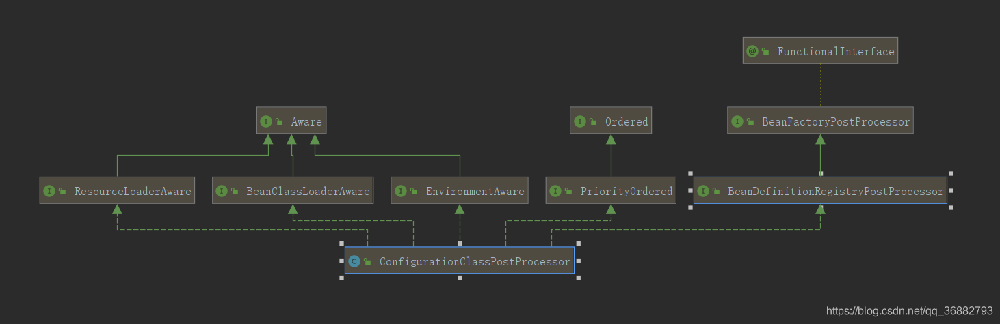

# 第12节 Spring 的ConfigurationClassPostProcessor

## 一、BeanDefinitionRegistry和BeanDefinitionRegistryPostProcessor
BeanDefinitionRegistryPostProcessor字面上的bean定义注册中心后置处理器，那么我们先来看看BeanDefinitionRegistry。
如下是BeanDefinitionRegistry源码注释翻译:
```text
/**
 * 用于【保存bean定义】的【注册中心】的接口，例如RootBeanDefinition和ChildBeanDefinition实例。
 * 通常由内部使用AbstractBeanDefinition层次结构的BeanFactories实现。
 * 这是Spring的bean工厂包中封装bean定义注册的唯一接口。标准的BeanFactory接口只覆盖对完全配置的工厂实例的访问。
 * Spring的bean定义读者期望处理这个接口的实现。
 * Spring核心中的已知实现者是DefaultListableBeanFactory和GenericApplicationContext。
 *
 * @since 26.11.2003
 * @see org.springframework.beans.factory.config.BeanDefinition
 * @see AbstractBeanDefinition
 * @see RootBeanDefinition
 * @see ChildBeanDefinition
 * @see DefaultListableBeanFactory
 * @see org.springframework.context.support.GenericApplicationContext
 * @see org.springframework.beans.factory.xml.XmlBeanDefinitionReader
 * @see PropertiesBeanDefinitionReader
 */
public interface BeanDefinitionRegistry extends AliasRegistry {

	void registerBeanDefinition(String beanName, BeanDefinition beanDefinition)
			throws BeanDefinitionStoreException;

	void removeBeanDefinition(String beanName) throws NoSuchBeanDefinitionException;

	BeanDefinition getBeanDefinition(String beanName) throws NoSuchBeanDefinitionException;

	boolean containsBeanDefinition(String beanName);

	String[] getBeanDefinitionNames();

	int getBeanDefinitionCount();

	boolean isBeanNameInUse(String beanName);

}
```
对Spring IOC容器初始化过程了解的小伙伴都知道，Spring真实的IOC容器就是DefaultListableBeanFactory，
实现了对Bean定义增删改查等功能。

接下来看看BeanDefinitionRegistryPostProcessor。

如下是BeanDefinitionRegistryPostProcessor源码以及注释:
```text
/**
 * 对标准BeanFactoryPostProcessor SPI的扩展，允许在常规BeanFactoryPostProcessor检测开始之前注册进一步的bean定义。
 * 特别地，BeanDefinitionRegistryPostProcessor可以注册更多的bean定义，这些定义反过来定义BeanFactoryPostProcessor实例。
 * 
 * @author Juergen Hoeller
 * @since 3.0.1
 * @see org.springframework.context.annotation.ConfigurationClassPostProcessor
 */
public interface BeanDefinitionRegistryPostProcessor extends BeanFactoryPostProcessor {

	/**
	 * 在标准初始化之后修改应用程序上下文的内部bean定义注册中心。
	 * 将加载所有常规bean定义，但还没有实例化任何bean。这允许在下一个后处理阶段开始之前添加【进一步的bean定义】。
     * 参数: 注册中心——应用程序上下文使用的bean定义注册中心
	 */
	void postProcessBeanDefinitionRegistry(BeanDefinitionRegistry registry) throws BeansException;

}
```
如上，BeanDefinitionRegistryPostProcessor接口实现了BeanFactoryPostProcessor接口，

BeanFactoryPostProcessor接口的作用是: 
    在bean已经【注册完成为BeanDefinition】，但是还【未实例化之前】【修改BeanDefinition属性】；

BeanDefinitionRegistryPostProcessor接口提供了一个通过【代码形式】来注册bean到IOC容器的钩子方法；

BeanDefinitionRegistryPostProcessor在Spring中仅有一个实现类， 即ConfigurationClassPostProcessor。

那么ConfigurationClassPostProcessor作为BeanDefinitionRegistryPostProcessor在Spring中目前唯一的实现类，
就完全履行BeanDefinitionRegistryPostProcessor的全部职责，即，【注册BeanDefinition到IOC容器中】。

## 二、ConfigurationClassPostProcessor

### 2.1 ConfigurationClassPostProcessor的源码注释翻译:
```text
BeanFactoryPostProcessor用于@Configuration类的引导处理。

在使用<context:annotation-config/>或<context:component-scan/>时默认注册。
否则，可以像使用任何其他BeanFactoryPostProcessor一样手动声明。

这个后处理器是按优先级排序的，因为在@Configuration类中声明的任何@Bean方法
在任何其他BeanFactoryPostProcessor执行之前都要注册相应的bean定义，这一点很重要。
```
由上可见，ConfigurationClassPostProcessor就是实现<context:annotation-config/>
或<context:component-scan/>的核心功能所在。

### 2.2 ConfigurationClassPostProcessor的层级结构

ConfigurationClassPostProcessor 的结构图如下:

可见ConfigurationClassPostProcessor接口实现了BeanDefinitionRegistryPostProcessor(BeanFactory的后处理器)
PriorityOrdered(设置自己的优先级为最高) 和各种 Aware 接口。

### 2.3 ConfigurationClassPostProcessor核心功能分析

Spring以注解驱动或者SpringBoot启动为例：
在 SpringBoot启动后，会通过SpringApplication#createApplicationContext来创建应用上下文，
默认请情况下我们一般创建AnnotationConfigServletWebServerApplicationContext作为应用上下文。
而在AnnotationConfigServletWebServerApplicationContext构造函数中会创建AnnotatedBeanDefinitionReader。
而在AnnotatedBeanDefinitionReader构造函数中会调用AnnotationConfigUtils.registerAnnotationConfigProcessors(this.registry);，
该方法将一些必要Bean(如ConfigurationClassPostProcessor、AutowiredAnnotationBeanPostProcessor、
CommonAnnotationBeanPostProcessor 等)注入到了容器中。

我们这里重点看的是BeanDefinitionRegistryPostProcessor接口的两个方法：
```text
// 完成对 @Bean 方法的代理
void postProcessBeanFactory(ConfigurableListableBeanFactory beanFactory) throws BeansException;
// 允许在Spring容器启动后，在下一个阶段开始前，添加BeanDefinition的定义
void postProcessBeanDefinitionRegistry(BeanDefinitionRegistry registry) throws Beans
```
关于这两个方法的调用时机和作用，我们在之前的文章(Spring源码分析七：BeanFactoryPostProcessor 的处理 - invokeBeanFactoryPostProcessors )已经讲过，
调用过程主要是在Spring容器刷新的过程中，其中postProcessBeanDefinitionRegistry方法先于postProcessBeanFactory方法被调用。

## 三、postProcessBeanDefinitionRegistry方法

下面来看看postProcessBeanDefinitionRegistry方法:
```text
	@Override
	public void postProcessBeanDefinitionRegistry(BeanDefinitionRegistry registry) {
		int registryId = System.identityHashCode(registry);
		if (this.registriesPostProcessed.contains(registryId)) {
			throw new IllegalStateException(
					"postProcessBeanDefinitionRegistry already called on this post-processor against " + registry);
		}
		if (this.factoriesPostProcessed.contains(registryId)) {
			throw new IllegalStateException(
					"postProcessBeanFactory already called on this post-processor against " + registry);
		}
		this.registriesPostProcessed.add(registryId);
        // 关键方法，解析 配置类的定义
		processConfigBeanDefinitions(registry);
	}
```
可以看到postProcessBeanDefinitionRegistry方法中并没有处理什么逻辑，
真正逻辑在其调用的processConfigBeanDefinitions方法中。

### 3.1 processConfigBeanDefinitions方法

processConfigBeanDefinitions 方法完成了关于配置类的所有解析。

需要注意的是，到达这一步的时候， SpringBoot启动类 已经被解析成BeanDefinition注册到容器中。
具体的注册过程请 参考 Spring 源码分析零：SpringBoot的启动流程 上下文准备工作 部分内容。

processConfigBeanDefinitions 详细代码如下：
```text
	public void processConfigBeanDefinitions(BeanDefinitionRegistry registry) {
		List<BeanDefinitionHolder> configCandidates = new ArrayList<>();
		// 获取已经解析的BeanName。
		// 这里需要注意的是，SpringBoot的话，启动类已经被注册。
		// 具体的注册时机是在SpringBoot启动时候的SpringApplication#prepareContext方法中。
		String[] candidateNames = registry.getBeanDefinitionNames();
		// 遍历BeanName
		for (String beanName : candidateNames) {
			// 获取BeanDefinition 
			BeanDefinition beanDef = registry.getBeanDefinition(beanName);
			// 如果bean被解析过(Bean 被解析后会在beanDef 中设置属性 CONFIGURATION_CLASS_ATTRIBUTE )，if 属性成立，这里是为了防止重复解析
			if (beanDef.getAttribute(ConfigurationClassUtils.CONFIGURATION_CLASS_ATTRIBUTE) != null) {
				if (logger.isDebugEnabled()) {
					logger.debug("Bean definition has already been processed as a configuration class: " + beanDef);
				}
			}
			// 1.【判断 当前beanDef是否是配置类】
			// 关于其详细内容，后面解析需要注意的是，本文所说的配置类: 满足full或lite条件的类，而不仅仅是被@Configuration修饰的类。
			else if (ConfigurationClassUtils.checkConfigurationClassCandidate(beanDef, this.metadataReaderFactory)) {
				// 【添加到配置类集合】
				configCandidates.add(new BeanDefinitionHolder(beanDef, beanName));
			}
		}

		// Return immediately if no @Configuration classes were found
		// 如果没有找到配置类，则直接返回，不需要下面的解析
		if (configCandidates.isEmpty()) {
			return;
		}

		// Sort by previously determined @Order value, if applicable
		// 按照@Order 注解进行排序(如果使用了 @Order 注解的话)
		configCandidates.sort((bd1, bd2) -> {
			int i1 = ConfigurationClassUtils.getOrder(bd1.getBeanDefinition());
			int i2 = ConfigurationClassUtils.getOrder(bd2.getBeanDefinition());
			return Integer.compare(i1, i2);
		});

		// Detect any custom bean name generation strategy supplied through the enclosing application context
		// 判断如果是registry是SingletonBeanRegistry类型，则从中获取beanName生成器(BeanNameGenerator)。
		// 实际上这里是register类型是DefaultListableBeanFactory。是SingletonBeanRegistry的子类。
		SingletonBeanRegistry sbr = null;
		if (registry instanceof SingletonBeanRegistry) {
			sbr = (SingletonBeanRegistry) registry;
			if (!this.localBeanNameGeneratorSet) {
				BeanNameGenerator generator = (BeanNameGenerator) sbr.getSingleton(
						AnnotationConfigUtils.CONFIGURATION_BEAN_NAME_GENERATOR);
				if (generator != null) {
					this.componentScanBeanNameGenerator = generator;
					this.importBeanNameGenerator = generator;
				}
			}
		}
		// 如果环境变量为空则指定一个标准环境，这里是StandardServletEnvironment类型，在前面的启动篇我们可以知道。
		if (this.environment == null) {
			this.environment = new StandardEnvironment();
		}
	
		// Parse each @Configuration class
		// 【重要: 下面开始解析每一个配置类】
		// 准备配置类的【解析类ConfigurationClassParser】 
		ConfigurationClassParser parser = new ConfigurationClassParser(
				this.metadataReaderFactory, this.problemReporter, this.environment,
				this.resourceLoader, this.componentScanBeanNameGenerator, registry);
		// 用来保存【尚未解析的配置类】集合
		Set<BeanDefinitionHolder> candidates = new LinkedHashSet<>(configCandidates);
		// 用来保存【已经解析的配置类】集合
		Set<ConfigurationClass> alreadyParsed = new HashSet<>(configCandidates.size());
		// do..while 【循环解析】。因为一个配置类可能引入另一个配置类，需要循环解析，直至没有其他需要解析的类。
		do {
			// 2. 【开始解析】。后面详细分析
			parser.parse(candidates);
			
			// 3. 这里的校验规则是如果是被@Configuration修饰且proxyBeanMethods属性为true,则类不能为final。
			// 如果@Bean修饰的方法，则必须是可覆盖的.
			// 因为@Configuration(proxyBeanMethods = true)是需要cglib代理的，所以不能为终态，
			// @Bean所修饰的方法也有一套约束规则，下面详细讲
			// 是否需要代理是根据 类或方法上的 @Scope 注解指定的，默认都是不代理
			parser.validate();
			
			// configClasses保存本次循环解析出的配置类
			// 此时这些ConfigurationClass中保存了解析出来的各种属性值，等待最后构建BeanDefinition
			Set<ConfigurationClass> configClasses = new LinkedHashSet<>(parser.getConfigurationClasses());
			// 去除已经解析过的配置类
			configClasses.removeAll(alreadyParsed);

			// Read the model and create bean definitions based on its content
			if (this.reader == null) {
				this.reader = new ConfigurationClassBeanDefinitionReader(
						registry, this.sourceExtractor, this.resourceLoader, this.environment,
						this.importBeanNameGenerator, parser.getImportRegistry());
			}
			// 4. 【注册bean】
			this.reader.loadBeanDefinitions(configClasses);
			alreadyParsed.addAll(configClasses);

			candidates.clear();
			// if 如果成立，说明有新的bean注册了，则需要解析新的bean
			if (registry.getBeanDefinitionCount() > candidateNames.length) {
				// 获取新的beanName
				String[] newCandidateNames = registry.getBeanDefinitionNames();
				Set<String> oldCandidateNames = new HashSet<>(Arrays.asList(candidateNames));
				Set<String> alreadyParsedClasses = new HashSet<>();
				for (ConfigurationClass configurationClass : alreadyParsed) {
					alreadyParsedClasses.add(configurationClass.getMetadata().getClassName());
				}
				for (String candidateName : newCandidateNames) {
					if (!oldCandidateNames.contains(candidateName)) {
						// 过滤出【未解析的bean 检测是否是 未解析过的配置类】
						BeanDefinition bd = registry.getBeanDefinition(candidateName);
						if (ConfigurationClassUtils.checkConfigurationClassCandidate(bd, this.metadataReaderFactory) &&
								!alreadyParsedClasses.contains(bd.getBeanClassName())) {
							// 如果是未解析的配置类，则保存到candidates中
							candidates.add(new BeanDefinitionHolder(bd, candidateName));
						}
					}
				}
				candidateNames = newCandidateNames;
			}
		}
		// 如果 candidates 不为空，则说明有未被解析的配置类，循环解析。
		while (!candidates.isEmpty());

		// Register the ImportRegistry as a bean in order to support ImportAware @Configuration classes
		// 到这里已经把配置类解析完毕了。
		// 将ImportRegistry注册为bean，以支持ImportAware @Configuration类
		if (sbr != null && !sbr.containsSingleton(IMPORT_REGISTRY_BEAN_NAME)) {
			sbr.registerSingleton(IMPORT_REGISTRY_BEAN_NAME, parser.getImportRegistry());
		}
		// 清除缓存
		if (this.metadataReaderFactory instanceof CachingMetadataReaderFactory) {
			// Clear cache in externally provided MetadataReaderFactory; this is a no-op
			// for a shared cache since it'll be cleared by the ApplicationContext.
			((CachingMetadataReaderFactory) this.metadataReaderFactory).clearCache();
		}
	}
```
这里简单总结一下流程;
```text
1) 获取已经注册的Bean, 并筛选出配置类，按照@Order进行排序，得到配置类集合 configCandidates;
2) 调用 parser.parse(candidates); 对配置类进行解析;
3) 调用 this.reader.loadBeanDefinitions(configClasses); 进行配置类的注册;
4) 检验 registry.getBeanDefinitionCount() > candidateNames.length 是否成立。
    这里由于第三步会将新解析出来的bean进行注册，
    如果这里成立，则说明有新的配置类完成了注册，获取到新注册的配置类candidateNames。
    【循环从第二步重新解析，直到没有新注入的配置类】。
```

上面解释的可能比较乱，因为我们下面详细去分析几个方法。

### 3.2 checkConfigurationClassCandidate方法

在processConfigBeanDefinitions方法中。
判断一个类是否是配置类就是通过ConfigurationClassUtils#checkConfigurationClassCandidate方法来判断的，那么我们需要看看这个方法中是怎么实现的。

在这个方法里，【关键的部分】是给BeanDefinition设置了CONFIGURATION_CLASS_ATTRIBUTE为full或者lite设置这两个属性标识，
如果一个类满足full或lite的条件，则会被认为是配置类。
需要注意的是，本文所说的配置类即使满足 full 或 lite 条件的类，而不仅仅是被 @Configuration 修饰的类。

首先需要注意的是，在checkConfigurationClassCandidate中，
配置类的类型分为两种，Full和Lite，即完整的配置类和精简的配置类。

**full 和 lite 设置的规则如下**：
```text
Full: 
    被@Configuration注解修饰 && proxyBeanMethods属性为true(默认为true)的类。
Lite: 
    1) 被@Component、@ComponentScan、@Import、@ImportResource修饰的类 或者 类中有被@Bean修饰方法的类。
    2) 被@Configuration注解修饰 && proxyBeanMethods属性为false的类。
```
Full配置类就是我们常规使用的配置类，Lite配置类就是一些需要其他操作引入一些bean的类。

下面我们来看具体代码：
```text
	public static boolean checkConfigurationClassCandidate(
			BeanDefinition beanDef, MetadataReaderFactory metadataReaderFactory) {
		// 【一、获取className】
		String className = beanDef.getBeanClassName();
		if (className == null || beanDef.getFactoryMethodName() != null) {
			return false;
		}

		// 【二、获取注解元数据】
		AnnotationMetadata metadata;
		// 如果当前BeanDefinition是【AnnotatedBeanDefinition】
		// (相较于一般的BeanDefinition，它多了一些注解信息的解析)类型。直接获取注解元数据即可。
		if (beanDef instanceof AnnotatedBeanDefinition &&
				className.equals(((AnnotatedBeanDefinition) beanDef).getMetadata().getClassName())) {
			// Can reuse the pre-parsed metadata from the given BeanDefinition...
			metadata = ((AnnotatedBeanDefinition) beanDef).getMetadata();
		}
		else if (beanDef instanceof AbstractBeanDefinition && ((AbstractBeanDefinition) beanDef).hasBeanClass()) {
			// Check already loaded Class if present...
			// since we possibly can't even load the class file for this Class.
			
			Class<?> beanClass = ((AbstractBeanDefinition) beanDef).getBeanClass();
			// 如果当前类是BeanFactoryPostProcessor、BeanPostProcessor、AopInfrastructureBean、EventListenerFactory类型
			// 不当做配置类处理，返回false
			if (BeanFactoryPostProcessor.class.isAssignableFrom(beanClass) ||
					BeanPostProcessor.class.isAssignableFrom(beanClass) ||
					AopInfrastructureBean.class.isAssignableFrom(beanClass) ||
					EventListenerFactory.class.isAssignableFrom(beanClass)) {
				return false;
			}
			// 获取注解元数据
			metadata = AnnotationMetadata.introspect(beanClass);
		}
		else {
		    // 按照默认规则获取注解元数据
			try {
				MetadataReader metadataReader = metadataReaderFactory.getMetadataReader(className);
				metadata = metadataReader.getAnnotationMetadata();
			}
			catch (IOException ex) {
				if (logger.isDebugEnabled()) {
					logger.debug("Could not find class file for introspecting configuration annotations: " +
							className, ex);
				}
				return false;
			}
		}

		// 【三、获取bean上的Configuration注解的属性】。如果没有被@Configuration修饰config则为null
		Map<String, Object> config = metadata.getAnnotationAttributes(Configuration.class.getName());
		
		// 【四、根据beanDef上注解元数据，设置beanDef类型】
		// 如果被 @Configuration 修饰 && proxyBeanMethods 属性为 true。 
		// @Configuration 的 proxyBeanMethods 属性默认值即为 true。
		if (config != null && !Boolean.FALSE.equals(config.get("proxyBeanMethods"))) {
			// 设置 CONFIGURATION_CLASS_ATTRIBUTE 为 full
			beanDef.setAttribute(CONFIGURATION_CLASS_ATTRIBUTE, CONFIGURATION_CLASS_FULL);
		}
		// 如果(被 @Configuration 修饰 && proxyBeanMethods 属性为 false) || isConfigurationCandidate(metadata) = true
		// 关于【isConfigurationCandidate(metadata)】的解析在下面
		else if (config != null || isConfigurationCandidate(metadata)) {
			// 设置 CONFIGURATION_CLASS_ATTRIBUTE 为 lite
			beanDef.setAttribute(CONFIGURATION_CLASS_ATTRIBUTE, CONFIGURATION_CLASS_LITE);
		} else {
			return false;
		}

		// It's a full or lite configuration candidate... Let's determine the order value, if any.
		// 按照@Order注解排序
		Integer order = getOrder(metadata);
		if (order != null) {
			beanDef.setAttribute(ORDER_ATTRIBUTE, order);
		}

		return true;
	}
```

#### 3.2.1. isConfigurationCandidate方法
在上面的代码中，我们看到 判断是否是 Lite 的关键方法是 isConfigurationCandidate。其代码如下：
```text
	// candidateIndicators 的定义
	private static final Set<String> candidateIndicators = new HashSet<>(8);

	static {
		candidateIndicators.add(Component.class.getName());
		candidateIndicators.add(ComponentScan.class.getName());
		candidateIndicators.add(Import.class.getName());
		candidateIndicators.add(ImportResource.class.getName());
	}	

	public static boolean isConfigurationCandidate(AnnotationMetadata metadata) {
		// Do not consider an interface or an annotation...
		// 不能是接口
		if (metadata.isInterface()) {
			return false;
		}

		// Any of the typical annotations found?
		// 被 candidateIndicators 中的注解修饰。其中 candidateIndicators 注解在静态代码块中加载了。
		for (String indicator : candidateIndicators) {
			if (metadata.isAnnotated(indicator)) {
				return true;
			}
		}

		// Finally, let's look for @Bean methods...
		try {
			// 类中包含被 @Bean 注解修饰的方法
			return metadata.hasAnnotatedMethods(Bean.class.getName());
		}
		catch (Throwable ex) {
			if (logger.isDebugEnabled()) {
				logger.debug("Failed to introspect @Bean methods on class [" + metadata.getClassName() + "]: " + ex);
			}
			return false;
		}
	}
```
由上代码可以得知:
```text
1) 该类不能是接口;
2) 该类需要被@Component、@ComponentScan、@Import、@ImportSource任一注解修饰;
3) 该类中有被@Bean注解修饰的方法;
```

### 3.3 parser.parse(candidates)方法

上面解析了如何判断一个类是否是配置类。也完成了配置类的筛选。
那么开始进行配置类的解析，在processConfigBeanDefinitions方法中，对配置类的解析也只是一句话完成:
```text
	parser.parse(candidates);
```

ConfigurationClassParser.parse(candidates); 的作用是：

I) 将所有的配置类保存到 ConfigurationClassParser#configurationClasses 集合中
```text
	private final Map<ConfigurationClass, ConfigurationClass> configurationClasses
	    = new LinkedHashMap<>();
```
II) 解析注解 并 赋值给每个ConfigurationClass对应的属性。
    如解析@Import注解，并通过如下语句将结果保存到ConfigurationClass.importBeanDefinitionRegistrars集合中。
```text
configClass.addImportBeanDefinitionRegistrar(registrar, currentSourceClass.getMetadata());
```
    同样的还有将@ImportResource注解保存到ConfigurationClass.importedResources中，
    将@Bean 修饰的方法 和接口静态方法保存到ConfigurationClass.beanMethods中。

而在之后的 this.reader.loadBeanDefinitions(configClasses); 中才进行了这些属性的进一步处理。

下面我们来具体看代码，其代码如下：
```text
	public void parse(Set<BeanDefinitionHolder> configCandidates) {
		for (BeanDefinitionHolder holder : configCandidates) {
			BeanDefinition bd = holder.getBeanDefinition();
			try {
				// 针对不同类型的 BeanDefinition 做一些处理
				// 1、AnnotatedBeanDefinition
				if (bd instanceof AnnotatedBeanDefinition) {
					parse(((AnnotatedBeanDefinition) bd).getMetadata(), holder.getBeanName());
				}
				// 2、AbstractBeanDefinition
				else if (bd instanceof AbstractBeanDefinition && ((AbstractBeanDefinition) bd).hasBeanClass()) {
					parse(((AbstractBeanDefinition) bd).getBeanClass(), holder.getBeanName());
				}
				// 3、其他
				else {
					parse(bd.getBeanClassName(), holder.getBeanName());
				}
			}
			catch (BeanDefinitionStoreException ex) {
				throw ex;
			}
			catch (Throwable ex) {
				throw new BeanDefinitionStoreException(
						"Failed to parse configuration class [" + bd.getBeanClassName() + "]", ex);
			}
		}
		// 【====非常重要====】在这里调用了AutoConfigurationImportSelector完成了SpringBoot的自动化装配
		this.deferredImportSelectorHandler.process();
	}
```

里面的 parse 方法殊途同归，最终都会调用processConfigurationClass方法。
我们直接进入【processConfigurationClass】方法：
```text
	protected void processConfigurationClass(ConfigurationClass configClass, Predicate<String> filter) throws IOException {
		// 判断是否应该跳过当前类的解析。这里面解析了【@Conditional注解】
		if (this.conditionEvaluator.shouldSkip(configClass.getMetadata(), ConfigurationPhase.PARSE_CONFIGURATION)) {
			return;
		}
		// 判断是否已经解析过。configurationClasses中保存着已经解析过的配置类。
		// 在下面解析过的类都会被保存到 configurationClasses 中
		// 这里应该是 注入的配置类优先级高于引入的配置类
		// 如果配置类被多次引入则合并属性
		ConfigurationClass existingClass = this.configurationClasses.get(configClass);
		if (existingClass != null) {
			// 一个类被重复解析，那么可能被重复引入了，可能是通过@Import注解或者嵌套在其他配置类中被引入。
			// 如果这两者都是通过这种方式被引入，那么则进行引入合并
			// 如果当前配置类和之前解析过的配置类都是引入的，则直接合并
			if (configClass.isImported()) {
				if (existingClass.isImported()) {
					existingClass.mergeImportedBy(configClass);
				}
				// Otherwise ignore new imported config class; existing non-imported class overrides it.
				// 否则，忽略新导入的配置类；现有的非导入类将覆盖它
				return;
			}
			else {
				// Explicit bean definition found, probably replacing an import.
				// Let's remove the old one and go with the new one.
				// 如果当前的配置类不是引入的，则移除之前的配置类，重新解析
				this.configurationClasses.remove(configClass);
				this.knownSuperclasses.values().removeIf(configClass::equals);
			}
		}

		// Recursively process the configuration class and its superclass hierarchy.
		SourceClass sourceClass = asSourceClass(configClass, filter);
		do {
		    // 【继续解析配置类，入口】
			sourceClass = doProcessConfigurationClass(configClass, sourceClass, filter);
		}
		while (sourceClass != null);
		// 保存解析过的 配置类
		this.configurationClasses.put(configClass, configClass);
	}
```
注：
```text
1) this.conditionEvaluator.shouldSkip 中对@Conditional注解 进行了处理，
    由于篇幅所限(写太长了)，这里不再展开叙述。
2) this.deferredImportSelectorHandler.process(); 通过对AutoConfigurationImportSelector的处理，
    完成了SpringBoot 的自动化装配。篇幅所限，详参：Spring源码分析十一：SpringBoot 自动化配置原理
```

这里需要注意的是【配置类的重复引入优先级】的问题：
```text
一般来说，Spring有一个自己的规则：自身注入方式 优先于 引入方式。

这里的引入方式指的是被@Import或者其他配置类引入。
当一个类被多次引入时，会使用自身注入的方式的bean 替代 被引入方式的bean。
如果二者都是引入方式，则进行合并(在ConfigurationClass类中有一个importedBy集合，将新引入的来源保存到importedBy中)。
```

看了这么久的源码，也知道了Spring的套路，方法名以do开头的才是真正做事的方法, 
所以我们来看【doProcessConfigurationClass】方法。
```text
	@Nullable
	protected final SourceClass doProcessConfigurationClass(
			ConfigurationClass configClass, SourceClass sourceClass, Predicate<String> filter)
			throws IOException {
		// 1. 处理 【@Component】 注解
		if (configClass.getMetadata().isAnnotated(Component.class.getName())) {
			// Recursively process any member (nested) classes first
			processMemberClasses(configClass, sourceClass, filter);
		}

		// Process any @PropertySource annotations
		// 2. 处理 【@PropertySource】 注解
		for (AnnotationAttributes propertySource : AnnotationConfigUtils.attributesForRepeatable(
				sourceClass.getMetadata(), PropertySources.class,
				org.springframework.context.annotation.PropertySource.class)) {
			if (this.environment instanceof ConfigurableEnvironment) {
				processPropertySource(propertySource);
			}
			else {
				logger.info("Ignoring @PropertySource annotation on [" + sourceClass.getMetadata().getClassName() +
						"]. Reason: Environment must implement ConfigurableEnvironment");
			}
		}

		// Process any @ComponentScan annotations
		// 3. 处理 【@ComponentScan、@ComponentScans】注解
		Set<AnnotationAttributes> componentScans = AnnotationConfigUtils.attributesForRepeatable(
				sourceClass.getMetadata(), ComponentScans.class, ComponentScan.class);
		if (!componentScans.isEmpty() &&
				!this.conditionEvaluator.shouldSkip(sourceClass.getMetadata(), ConfigurationPhase.REGISTER_BEAN)) {
			for (AnnotationAttributes componentScan : componentScans) {
				// The config class is annotated with @ComponentScan -> perform the scan immediately
				Set<BeanDefinitionHolder> scannedBeanDefinitions =
						this.componentScanParser.parse(componentScan, sourceClass.getMetadata().getClassName());
				// Check the set of scanned definitions for any further config classes and parse recursively if needed
				for (BeanDefinitionHolder holder : scannedBeanDefinitions) {
					BeanDefinition bdCand = holder.getBeanDefinition().getOriginatingBeanDefinition();
					if (bdCand == null) {
						bdCand = holder.getBeanDefinition();
					}
					if (ConfigurationClassUtils.checkConfigurationClassCandidate(bdCand, this.metadataReaderFactory)) {
						parse(bdCand.getBeanClassName(), holder.getBeanName());
					}
				}
			}
		}

		// Process any @Import annotations
		// 4. 处理 【@Import】 注解
		processImports(configClass, sourceClass, getImports(sourceClass), filter, true);

		// Process any @ImportResource annotations
		// 5. 处理 【@ImportResource】 注解
		AnnotationAttributes importResource =
				AnnotationConfigUtils.attributesFor(sourceClass.getMetadata(), ImportResource.class);
		if (importResource != null) {
			String[] resources = importResource.getStringArray("locations");
			Class<? extends BeanDefinitionReader> readerClass = importResource.getClass("reader");
			for (String resource : resources) {
				String resolvedResource = this.environment.resolveRequiredPlaceholders(resource);
				configClass.addImportedResource(resolvedResource, readerClass);
			}
		}

		// Process individual @Bean methods
		// 6. 处理 【@Bean】修饰的方法
		Set<MethodMetadata> beanMethods = retrieveBeanMethodMetadata(sourceClass);
		for (MethodMetadata methodMetadata : beanMethods) {
			configClass.addBeanMethod(new BeanMethod(methodMetadata, configClass));
		}

		// Process default methods on interfaces
		// 7. 处理【其他默认接口】方法
		processInterfaces(configClass, sourceClass);

		// Process superclass, if any
		// 处理父类，如果存在
		if (sourceClass.getMetadata().hasSuperClass()) {
			String superclass = sourceClass.getMetadata().getSuperClassName();
			if (superclass != null && !superclass.startsWith("java") &&
					!this.knownSuperclasses.containsKey(superclass)) {
				this.knownSuperclasses.put(superclass, configClass);
				// Superclass found, return its annotation metadata and recurse
				return sourceClass.getSuperClass();
			}
		}

		// No superclass -> processing is complete
		return null;
	}
```
doProcessConfigurationClass方法中的逻辑很清楚，因为他把大部分的逻辑直接封装成了方法。下面我们就来一个一个分析。

#### 3.3.1 处理@Component注解

这里对@Component的处理其实是处理配置类的内部类，即如果当前类是被@Component修饰，则需要判断其内部类是否需要解析。
```text
		// 首先判断如果配置类被@Component 修饰，则调用processMemberClasses 方法处理
		if (configClass.getMetadata().isAnnotated(Component.class.getName())) {
			// Recursively process any member (nested) classes first
			processMemberClasses(configClass, sourceClass, filter);
		}
```

processMemberClasses 方法的代码如下：
代码逻辑也很简单。即如果配置类中有内部类，则判断其内部类是否是配置类，如果是则递归去解析新发现的内部配置类。
```text
	private void processMemberClasses(ConfigurationClass configClass, SourceClass sourceClass,
			Predicate<String> filter) throws IOException {
		// 获取【内部类】
		Collection<SourceClass> memberClasses = sourceClass.getMemberClasses();
		if (!memberClasses.isEmpty()) {
			// 如果有内部类，则遍历内部类，判断内部类是否是配置类，如果是，则添加到candidates集合中。
			List<SourceClass> candidates = new ArrayList<>(memberClasses.size());
			for (SourceClass memberClass : memberClasses) {
				// 这里判断的是是否是【lite类型】的配置类
				if (ConfigurationClassUtils.isConfigurationCandidate(memberClass.getMetadata()) &&
						!memberClass.getMetadata().getClassName().equals(configClass.getMetadata().getClassName())) {
					candidates.add(memberClass);
				}
			}
			// 进行排序
			OrderComparator.sort(candidates);
			for (SourceClass candidate : candidates) {
				// importStack 用来缓存已经解析过的内部类，这里处理【循环引入问题】。
				if (this.importStack.contains(configClass)) {
					// 打印循环引用异常
					this.problemReporter.error(new CircularImportProblem(configClass, this.importStack));
				}
				else {
					// 解析前入栈，防止循环引入
					this.importStack.push(configClass);
					try {
						// 【非常重要】递归去【解析新发现的配置类】
						processConfigurationClass(candidate.asConfigClass(configClass), filter);
					}
					finally {
						// 解析完毕出栈
						this.importStack.pop();
					}
				}
			}
		}
	}
```
注：
```text
判断内部类是否是配置类，使用的方法是ConfigurationClassUtils.isConfigurationCandidate，
这里是检测内部类是否满足lite 的配置类规则，并未校验 full的规则。

代码中使用了this.importStack 来防止递归引入。避免了A引入B，B又引入A这种无限循环的情况。
```

#### 3.3.2 处理 @PropertySource和@PropertySources 注解

@PropertySource注解可以引入配置文件使用。
在这里进行@PropertySource注解的解析，将引入的配置文件加载到环境变量中。
```text
	// 去重后遍历 PropertySource注解 所指向的属性。
	// 注意这里有两个注解@PropertySources 和 @PropertySource。
	for (AnnotationAttributes propertySource : AnnotationConfigUtils.attributesForRepeatable(
			sourceClass.getMetadata(), PropertySources.class,
			org.springframework.context.annotation.PropertySource.class)) {
		if (this.environment instanceof ConfigurableEnvironment) {
			// 解析PropertySource  注解
			processPropertySource(propertySource);
		}
		else {
			logger.info("Ignoring @PropertySource annotation on [" + sourceClass.getMetadata().getClassName() +
					"]. Reason: Environment must implement ConfigurableEnvironment");
		}
	}
```

processPropertySource 代码如下，在这里解析每一个@PropertySource注解属性 :
```text
	private void processPropertySource(AnnotationAttributes propertySource) throws IOException {
		// 获取 @PropertySource 注解的各个属性
		String name = propertySource.getString("name");
		if (!StringUtils.hasLength(name)) {
			name = null;
		}
		String encoding = propertySource.getString("encoding");
		if (!StringUtils.hasLength(encoding)) {
			encoding = null;
		}
		// 【获取指向的文件路径】
		String[] locations = propertySource.getStringArray("value");
		Assert.isTrue(locations.length > 0, "At least one @PropertySource(value) location is required");
		boolean ignoreResourceNotFound = propertySource.getBoolean("ignoreResourceNotFound");

		Class<? extends PropertySourceFactory> factoryClass = propertySource.getClass("factory");
		PropertySourceFactory factory = (factoryClass == PropertySourceFactory.class ?
				DEFAULT_PROPERTY_SOURCE_FACTORY : BeanUtils.instantiateClass(factoryClass));
		// 遍历文件路径
		for (String location : locations) {
			try {
				// 根据 路径 获取到 资源文件 并保存到environment中
				// 解决占位符，获取真正路径
				String resolvedLocation = this.environment.resolveRequiredPlaceholders(location);
				Resource resource = this.resourceLoader.getResource(resolvedLocation);
				// 【重要】【保存 PropertySource 到 environment 中】
				addPropertySource(factory.createPropertySource(name, new EncodedResource(resource, encoding)));
			}
			catch (IllegalArgumentException | FileNotFoundException | UnknownHostException ex) {
				// Placeholders not resolvable or resource not found when trying to open it
				if (ignoreResourceNotFound) {
					if (logger.isInfoEnabled()) {
						logger.info("Properties location [" + location + "] not resolvable: " + ex.getMessage());
					}
				}
				else {
					throw ex;
				}
			}
		}
	}
```

#### 3.3.3 处理 @ComponentScan、@ComponentScans 注解

@componentScans 指定自动扫描的路径。
```text
		// 这里会将 @ComponentScans 中的多个 @ComponentScan 也解析出来封装成一个个AnnotationAttributes对象
		Set<AnnotationAttributes> componentScans = AnnotationConfigUtils.attributesForRepeatable(
				sourceClass.getMetadata(), ComponentScans.class, ComponentScan.class);
		// 如果当前配置类被 @componentScans 或 @componentScan 注解修饰 && 不应跳过(@Conditional条件注解)
		if (!componentScans.isEmpty() &&
				!this.conditionEvaluator.shouldSkip(sourceClass.getMetadata(), ConfigurationPhase.REGISTER_BEAN)) {
				// 遍历 @ComponentScans、 @ComponentScan
			for (AnnotationAttributes componentScan : componentScans) {
				// The config class is annotated with @ComponentScan -> perform the scan immediately
				// 【直接执行扫描，根据指定路径扫描出来bean】
				Set<BeanDefinitionHolder> scannedBeanDefinitions =
						this.componentScanParser.parse(componentScan, sourceClass.getMetadata().getClassName());
				// Check the set of scanned definitions for any further config classes and parse recursively if needed
				// 遍历扫描出来的bean
				for (BeanDefinitionHolder holder : scannedBeanDefinitions) {
				// 获取原始的bean的定义
					BeanDefinition bdCand = holder.getBeanDefinition().getOriginatingBeanDefinition();
					if (bdCand == null) {
						bdCand = holder.getBeanDefinition();
					}
					// 检测如果是配置类，则递归调用 parse 解析。
					if (ConfigurationClassUtils.checkConfigurationClassCandidate(bdCand, this.metadataReaderFactory)) {
						parse(bdCand.getBeanClassName(), holder.getBeanName());
					}
				}
			}
		}
```
这里需要注意 :
```text
1) this.componentScanParser.parse方法完成了指定路径下的bean的扫描，这里不再具体分析。
    详参：Spring 源码分析补充篇二 ：ClassPathBeanDefinitionScanner#doScan。

2) 这里校验是否是配置类调用的是checkConfigurationClassCandidate方法，
    即校验了 full或lite的规则，和 处理@Component中的内部类的规则并不相同。

3) 没错，又是递归，如果扫描到的bean中发现了新的配置类，则递归去解析。

4) 之前的我们提过，SpringBoot在启动过程中将 启动类 注册到了容器中，
那么在这里进行递归遍历的时候就会通过 启动类 指定的默认路径 来进行遍历，完成了SpringBoot的启动注册。
```

#### 3.3.4 处理@Import

processImports(configClass, sourceClass, getImports(sourceClass), filter, true); 
该方法处理的包括由@Import注解导入的候选配置类的处理和解析流程。
@Import注解导入的类分为三类：实现ImportSelector的类、实现ImportBeanDefinitionRegistrar的类、由@import注解到如的普通类。
```text
1) ImportSelector: Spring会将ImportSelector#selectImports方法返回的内容通过 反射 加载到容器中;
    比如：SpringBoot自动配置中的AutoConfigurationImportSelector对spring.factories文件中的自动配置类解析。
2) ImportBeanDefinitionRegistrar: 可以通过registerBeanDefinitions方法，声明BeanDefinition并自己注册到Spring容器中，
    比如：MyBatis中的AutoConfiguredMapperScannerRegistrar对@Mapper修饰类的注册过程(Spring源码分析十：SpringBoot中Mybatis的自动化配置)
    比如：AOP实现注解驱动的AspectJAutoProxyRegistrar对AOP相关的bean的后置处理器进行注册到Spring IOC容器中。
3) @Import导入的普通类: 将其当作普通类解析，并将指定的类注册到容器中;
```
需要注意的是，这里解析的ImportSelector、ImportBeanDefinitionRegistrar都是通过@Import注解引入的。
如果不是通过@Import引入(比如直接通过@Component将ImportSelector、ImportBeanDefinitionRegistrar注入)的类则不会被解析。

注意: 【getImports(sourceClass)方法】的作用是【解析@Import注解】

我们直接来看 processImports 方法，注释都比较清楚:
```text
	private void processImports(ConfigurationClass configClass, SourceClass currentSourceClass,
			Collection<SourceClass> importCandidates, Predicate<String> exclusionFilter,
			boolean checkForCircularImports) {
		// importCandidates是通过getImports()方法解析@Import注解而来，如果为空则说明没有需要引入的直接返回
		if (importCandidates.isEmpty()) {
			return;
		}
		// 检测是否是循环引用。
		if (checkForCircularImports && isChainedImportOnStack(configClass)) {
			this.problemReporter.error(new CircularImportProblem(configClass, this.importStack));
		}
		else {
			// 解析前先入栈，防止循环引用
			this.importStack.push(configClass);
			try {
				for (SourceClass candidate : importCandidates) {
					// 判断是否是【ImportSelector类型】。
					// ImportSelector则需要调用selectImports方法来获取需要注入的类。
					if (candidate.isAssignable(ImportSelector.class)) {
						// Candidate class is an ImportSelector -> delegate to it to determine imports
						Class<?> candidateClass = candidate.loadClass();
						ImportSelector selector = ParserStrategyUtils.instantiateClass(candidateClass, ImportSelector.class,
								this.environment, this.resourceLoader, this.registry);
						Predicate<String> selectorFilter = selector.getExclusionFilter();
						if (selectorFilter != null) {
							exclusionFilter = exclusionFilter.or(selectorFilter);
						}
						if (selector instanceof DeferredImportSelector) {
							this.deferredImportSelectorHandler.handle(configClass, (DeferredImportSelector) selector);
						}
						else {
						    // 调用【selectImports方法】获取需要引入的类，并递归再次处理。
							String[] importClassNames = selector.selectImports(currentSourceClass.getMetadata());
							Collection<SourceClass> importSourceClasses = asSourceClasses(importClassNames, exclusionFilter);
							// 【递归解析】
							processImports(configClass, currentSourceClass, importSourceClasses, exclusionFilter, false);
						}
					}
					// 如果是 【ImportBeanDefinitionRegistrar类型】，则委托它注册其他bean定义
					else if (candidate.isAssignable(ImportBeanDefinitionRegistrar.class)) {
						// Candidate class is an ImportBeanDefinitionRegistrar ->
						// delegate to it to register additional bean definitions
						Class<?> candidateClass = candidate.loadClass();
						ImportBeanDefinitionRegistrar registrar =
								ParserStrategyUtils.instantiateClass(candidateClass, ImportBeanDefinitionRegistrar.class,
										this.environment, this.resourceLoader, this.registry);
						configClass.addImportBeanDefinitionRegistrar(registrar, currentSourceClass.getMetadata());
					}
					else {
						// Candidate class not an ImportSelector or ImportBeanDefinitionRegistrar ->
						// process it as an @Configuration class
						this.importStack.registerImport(
								currentSourceClass.getMetadata(), candidate.getMetadata().getClassName());
						// 否则，【递归处理】需要引入的类。
						processConfigurationClass(candidate.asConfigClass(configClass), exclusionFilter);
					}
				}
			}
			catch (BeanDefinitionStoreException ex) {
				throw ex;
			}
			catch (Throwable ex) {
				throw new BeanDefinitionStoreException(
						"Failed to process import candidates for configuration class [" +
						configClass.getMetadata().getClassName() + "]", ex);
			}
			finally {
				this.importStack.pop();
			}
		}
	}
```

#### 3.3.5 处理@ImportResource注解

@ImportResource就显得很简单了，直接保存到configClass中
```text
	// Process any @ImportResource annotations
		AnnotationAttributes importResource =
				AnnotationConfigUtils.attributesFor(sourceClass.getMetadata(), ImportResource.class);
		if (importResource != null) {
			String[] resources = importResource.getStringArray("locations");
			Class<? extends BeanDefinitionReader> readerClass = importResource.getClass("reader");
			for (String resource : resources) {
				String resolvedResource = this.environment.resolveRequiredPlaceholders(resource);
				configClass.addImportedResource(resolvedResource, readerClass);
			}
		}
```

#### 3.3.6 处理@Bean注解

@Bean也很简单了，直接保存到configClass的中
```text
	    // Process individual @Bean methods
		Set<MethodMetadata> beanMethods = retrieveBeanMethodMetadata(sourceClass);
		for (MethodMetadata methodMetadata : beanMethods) {
			configClass.addBeanMethod(new BeanMethod(methodMetadata, configClass));
		}
```

#### 3.3.7 处理接口默认方法

这里是 检测 配置类实现的接口中的默认方法是否被@Bean修饰，如果被修饰则也需要保存到configClass中
```text
	/**
	 * Register default methods on interfaces implemented by the configuration class.
	 */
	private void processInterfaces(ConfigurationClass configClass, SourceClass sourceClass) throws IOException {
		for (SourceClass ifc : sourceClass.getInterfaces()) {
			Set<MethodMetadata> beanMethods = retrieveBeanMethodMetadata(ifc);
			for (MethodMetadata methodMetadata : beanMethods) {
				if (!methodMetadata.isAbstract()) {
					// A default method or other concrete method on a Java 8+ interface...
					configClass.addBeanMethod(new BeanMethod(methodMetadata, configClass));
				}
			}
			processInterfaces(configClass, ifc);
		}
	}
```

#### 3.3.8 处理父类

如果存在父类，则将父类返回，对父类进行解析。
```text
		// Process superclass, if any
		if (sourceClass.getMetadata().hasSuperClass()) {
			String superclass = sourceClass.getMetadata().getSuperClassName();
			if (superclass != null && !superclass.startsWith("java") &&
					!this.knownSuperclasses.containsKey(superclass)) {
				this.knownSuperclasses.put(superclass, configClass);
				// Superclass found, return its annotation metadata and recurse
				return sourceClass.getSuperClass();
			}
		}
```

这里这么处理是解析到最上层的父类。
这里理一下调用顺序：parse -> processConfigurationClass -> doProcessConfigurationClass。
而doProcessConfigurationClass有如下一个循环，只有sourceClass = null才会跳出循环。
当configClass没有满足上面判断条件的父类时，才会返回null。
```text
	SourceClass sourceClass = asSourceClass(configClass, filter);
		do {
			sourceClass = doProcessConfigurationClass(configClass, sourceClass, filter);
		}
		while (sourceClass != null);
	this.configurationClasses.put(configClass, configClass);
```

### 3.4 parser.validate()方法

到了这一步，是对解析出来的配置类进行进一步的校验，确保没有问题。

这里我们看看其代码如下：
```text
	public void validate() {
		for (ConfigurationClass configClass : this.configurationClasses.keySet()) {
			configClass.validate(this.problemReporter);
		}
	}
```
这里可以看到是调用每个ConfigurationClass类的 validate方法进行校验，
我们进去看看 ConfigurationClass#validate 的代码 ：
```text
	public void validate(ProblemReporter problemReporter) {
		// A configuration class may not be final (CGLIB limitation) unless it declares proxyBeanMethods=false
		// 获取 @Configuration 注解的属性
		Map<String, Object> attributes = this.metadata.getAnnotationAttributes(Configuration.class.getName());
		// 如果 @Configuration 存在(attributes != null)  && attributes.get("proxyBeanMethods") == true 才进行进一步的校验
		if (attributes != null && (Boolean) attributes.get("proxyBeanMethods")) {
			// 如果配置类 是 final 修饰，即【终态类】，则是错误，因为无法动态代理。
			if (this.metadata.isFinal()) {
				problemReporter.error(new FinalConfigurationProblem());
			}
			// 对配置类中的【@Bean注解】修饰的方法进行校验
			for (BeanMethod beanMethod : this.beanMethods) {
				beanMethod.validate(problemReporter);
			}
		}
	}
```

这里我们再来看看 @Bean方法的校验 BeanMethod#validate如下：
```text
	@Override
	public void validate(ProblemReporter problemReporter) {
		// 如果是静态方法没有约束规则，直接返回。
		if (getMetadata().isStatic()) {
			// static @Bean methods have no constraints to validate -> return immediately
			return;
		}
		// 校验该方法【所属的类】是否被@Configuration修饰。
		if (this.configurationClass.getMetadata().isAnnotated(Configuration.class.getName())) {
			// 判断是否可重写。cglib代理需要方法可重写。不可重写则错误。
			if (!getMetadata().isOverridable()) {
				// instance @Bean methods within @Configuration classes must be overridable to accommodate CGLIB
				problemReporter.error(new NonOverridableMethodError());
			}
		}
	}
```

### 3.5 this.reader.loadBeanDefinitions(configClasses);方法

上面也说了，在parser.parse(candidates); 方法中，将各种注解的属性值都解析了出来，并保存到了configClass的各种属性中。
而在this.reader.loadBeanDefinitions(configClasses);中才真正处理了这些属性。
所以我们接下来看看loadBeanDefinitions 的处理流程。

loadBeanDefinitions 遍历了每一个ConfigurationClass，通过loadBeanDefinitionsForConfigurationClass方法处理。
```text
	public void loadBeanDefinitions(Set<ConfigurationClass> configurationModel) {
		TrackedConditionEvaluator trackedConditionEvaluator = new TrackedConditionEvaluator();
		for (ConfigurationClass configClass : configurationModel) {
			loadBeanDefinitionsForConfigurationClass(configClass, trackedConditionEvaluator);
		}
	}
```
所以我们来看看 loadBeanDefinitionsForConfigurationClass的实现。
可很清楚的看到，每个部分的解析都封装到了不同的方法中。
```text
	private void loadBeanDefinitionsForConfigurationClass(
			ConfigurationClass configClass, TrackedConditionEvaluator trackedConditionEvaluator) {
		// 判断是否应该跳过【@Conditional注解逻辑判断】
		if (trackedConditionEvaluator.shouldSkip(configClass)) {
			String beanName = configClass.getBeanName();
			if (StringUtils.hasLength(beanName) && this.registry.containsBeanDefinition(beanName)) {
				this.registry.removeBeanDefinition(beanName);
			}
			this.importRegistry.removeImportingClass(configClass.getMetadata().getClassName());
			return;
		}
		// 1. 如果配置是被引入的(被 @Import 或者其他配置类内部引入)
		if (configClass.isImported()) {
			registerBeanDefinitionForImportedConfigurationClass(configClass);
		}
		// 2. 遍历配置类中的所有 BeanMethod方法
		for (BeanMethod beanMethod : configClass.getBeanMethods()) {
			loadBeanDefinitionsForBeanMethod(beanMethod);
		}
		// 3. 加载 通过 @ImportResource 的 获取的bean
		loadBeanDefinitionsFromImportedResources(configClass.getImportedResources());
		// 4. 加载 通过 @Import 的 获取的bean
		loadBeanDefinitionsFromRegistrars(configClass.getImportBeanDefinitionRegistrars());
	}
```

下面 我们来详细看看每个方法。

#### 3.5.1 registerBeanDefinitionForImportedConfigurationClass方法

这一步的工作很简单，就是将【引入的配置类】注册为BeanDefinition。
```text
	private void registerBeanDefinitionForImportedConfigurationClass(ConfigurationClass configClass) {
		AnnotationMetadata metadata = configClass.getMetadata();
		AnnotatedGenericBeanDefinition configBeanDef = new AnnotatedGenericBeanDefinition(metadata);
		
		ScopeMetadata scopeMetadata = scopeMetadataResolver.resolveScopeMetadata(configBeanDef);
		configBeanDef.setScope(scopeMetadata.getScopeName());
		String configBeanName = this.importBeanNameGenerator.generateBeanName(configBeanDef, this.registry);
		AnnotationConfigUtils.processCommonDefinitionAnnotations(configBeanDef, metadata);

		BeanDefinitionHolder definitionHolder = new BeanDefinitionHolder(configBeanDef, configBeanName);
		// 创建代理，根据 scopeMetadata 的代理模式。默认不创建代理。
		definitionHolder = AnnotationConfigUtils.applyScopedProxyMode(scopeMetadata, definitionHolder, this.registry);
		
		// 【注册了BeanBeanDefinition】。这里将BeanDefinition保存到了 DefaultListableBeanFactory#beanDefinitionMap 中
		this.registry.registerBeanDefinition(definitionHolder.getBeanName(), definitionHolder.getBeanDefinition());
		
		configClass.setBeanName(configBeanName);

		if (logger.isTraceEnabled()) {
			logger.trace("Registered bean definition for imported class '" + configBeanName + "'");
		}
	}
```
这里需要注意的是AnnotationConfigUtils.applyScopedProxyMode(scopeMetadata, definitionHolder, this.registry); 
根据scopeMetadata 的代理模式创建了代理。代理模式有四种，分别为:
```text
DEFAULT ： 默认模式。默认等同于NO
NO ： 不使用代理
INTERFACES ： Jdk 动态代理
TARGET_CLASS ： Cglib代理
```
在applyScopedProxyMode方法中 通过获取ScopeMetadata.getScopedProxyMode() 来判断使用什么代理方式。
而ScopeMetadata 的代理方式 是在创建 scopeMetadata 的过程中，获取类上面的@Scope 的 proxyMode 属性来指定的。
```text
ScopeMetadata scopeMetadata =  scopeMetadataResolver.resolveScopeMetadata(configBeanDef);
```
resolveScopeMetadata 方法如下
```text
	protected Class<? extends Annotation> scopeAnnotationType = Scope.class;
	
	@Override
	public ScopeMetadata resolveScopeMetadata(BeanDefinition definition) {
		ScopeMetadata metadata = new ScopeMetadata();
		if (definition instanceof AnnotatedBeanDefinition) {
			AnnotatedBeanDefinition annDef = (AnnotatedBeanDefinition) definition;
			// 获取 @Scope 注解
			AnnotationAttributes attributes = AnnotationConfigUtils.attributesFor(
					annDef.getMetadata(), this.scopeAnnotationType);
			if (attributes != null) {
			
				metadata.setScopeName(attributes.getString("value"));
				// 获取 @Scope 的proxyMode属性
				ScopedProxyMode proxyMode = attributes.getEnum("proxyMode");
				if (proxyMode == ScopedProxyMode.DEFAULT) {
					proxyMode = this.defaultProxyMode;
				}
				// 设置 scopedProxyMode 属性，后面根据此属性判断使用什么代理方式
				metadata.setScopedProxyMode(proxyMode);
			}
		}
		return metadata;
	}
```

#### 3.5.2 loadBeanDefinitionsForBeanMethod方法

具体代码如下，基本上就是解析各种注解，创建对应的 BeanDefinition 并注册。
```text
	private void loadBeanDefinitionsForBeanMethod(BeanMethod beanMethod) {
		ConfigurationClass configClass = beanMethod.getConfigurationClass();
		MethodMetadata metadata = beanMethod.getMetadata();
		String methodName = metadata.getMethodName();

		// Do we need to mark the bean as skipped by its condition?
		// 是否应该跳过(@Conditional注解逻辑判断)
		if (this.conditionEvaluator.shouldSkip(metadata, ConfigurationPhase.REGISTER_BEAN)) {
			configClass.skippedBeanMethods.add(methodName);
			return;
		}
		if (configClass.skippedBeanMethods.contains(methodName)) {
			return;
		}
		// 获取被【@Bean】修饰的方法
		AnnotationAttributes bean = AnnotationConfigUtils.attributesFor(metadata, Bean.class);
		Assert.state(bean != null, "No @Bean annotation attributes");

		// Consider name and any aliases
		// 获取别名
		List<String> names = new ArrayList<>(Arrays.asList(bean.getStringArray("name")));
		String beanName = (!names.isEmpty() ? names.remove(0) : methodName);

		// Register aliases even when overridden
		// 注册别名
		for (String alias : names) {
			this.registry.registerAlias(beanName, alias);
		}

		// Has this effectively been overridden before (e.g. via XML)?
		// 判断是否已经被定义过
		if (isOverriddenByExistingDefinition(beanMethod, beanName)) {
			if (beanName.equals(beanMethod.getConfigurationClass().getBeanName())) {
				throw new BeanDefinitionStoreException(beanMethod.getConfigurationClass().getResource().getDescription(),
						beanName, "Bean name derived from @Bean method '" + beanMethod.getMetadata().getMethodName() +
						"' clashes with bean name for containing configuration class; please make those names unique!");
			}
			return;
		}
		// 定义配置类的BeanDefinition
		ConfigurationClassBeanDefinition beanDef = new ConfigurationClassBeanDefinition(configClass, metadata);
		beanDef.setResource(configClass.getResource());
		beanDef.setSource(this.sourceExtractor.extractSource(metadata, configClass.getResource()));
		// 处理【静态@Bean方法】和【非静态@Bean方法】
		if (metadata.isStatic()) {
			// static @Bean method
			if (configClass.getMetadata() instanceof StandardAnnotationMetadata) {
				beanDef.setBeanClass(((StandardAnnotationMetadata) configClass.getMetadata()).getIntrospectedClass());
			}
			else {
				beanDef.setBeanClassName(configClass.getMetadata().getClassName());
			}
			// 设置唯一工厂方法名称
			beanDef.setUniqueFactoryMethodName(methodName);
		}
		else {
			// instance @Bean method
			// 指定要使用的工厂bean（如果有）。这是用于调用指定工厂方法的bean的名称
			beanDef.setFactoryBeanName(configClass.getBeanName());
			// 设置唯一工厂方法名称，内部调用了 setFactoryMethodName(name); 保存 FactoryMethodName
			beanDef.setUniqueFactoryMethodName(methodName);
		}

		if (metadata instanceof StandardMethodMetadata) {
			beanDef.setResolvedFactoryMethod(((StandardMethodMetadata) metadata).getIntrospectedMethod());
		}
		// 设置【构造模式】构造注入
		beanDef.setAutowireMode(AbstractBeanDefinition.AUTOWIRE_CONSTRUCTOR);
		// 设置跳过属性检查
		beanDef.setAttribute(org.springframework.beans.factory.annotation.RequiredAnnotationBeanPostProcessor.
				SKIP_REQUIRED_CHECK_ATTRIBUTE, Boolean.TRUE);
		// 【处理通用的注解】：@Lazy、@Primary、@DependsOn、@Role、@Description设置到BeanDefinition中
		AnnotationConfigUtils.processCommonDefinitionAnnotations(beanDef, metadata);
		// 获取注解的其他属性并设置到BeanDefinition
		Autowire autowire = bean.getEnum("autowire");
		if (autowire.isAutowire()) {
			beanDef.setAutowireMode(autowire.value());
		}

		boolean autowireCandidate = bean.getBoolean("autowireCandidate");
		if (!autowireCandidate) {
			beanDef.setAutowireCandidate(false);
		}

		String initMethodName = bean.getString("initMethod");
		if (StringUtils.hasText(initMethodName)) {
			beanDef.setInitMethodName(initMethodName);
		}

		String destroyMethodName = bean.getString("destroyMethod");
		beanDef.setDestroyMethodName(destroyMethodName);

		// Consider scoping
		ScopedProxyMode proxyMode = ScopedProxyMode.NO;
		// 处理方法上的 @Scope 注解
		AnnotationAttributes attributes = AnnotationConfigUtils.attributesFor(metadata, Scope.class);
		if (attributes != null) {
			beanDef.setScope(attributes.getString("value"));
			proxyMode = attributes.getEnum("proxyMode");
			if (proxyMode == ScopedProxyMode.DEFAULT) {
				proxyMode = ScopedProxyMode.NO;
			}
		}

		// Replace the original bean definition with the target one, if necessary
		// 如果有必要(代理模式不同)，替换掉旧的BeanDefinition
		BeanDefinition beanDefToRegister = beanDef;
		if (proxyMode != ScopedProxyMode.NO) {
			BeanDefinitionHolder proxyDef = ScopedProxyCreator.createScopedProxy(
					new BeanDefinitionHolder(beanDef, beanName), this.registry,
					proxyMode == ScopedProxyMode.TARGET_CLASS);
			beanDefToRegister = new ConfigurationClassBeanDefinition(
					(RootBeanDefinition) proxyDef.getBeanDefinition(), configClass, metadata);
		}

		if (logger.isTraceEnabled()) {
			logger.trace(String.format("Registering bean definition for @Bean method %s.%s()",
					configClass.getMetadata().getClassName(), beanName));
		}
		// 【注册BeanDefinition】
		this.registry.registerBeanDefinition(beanName, beanDefToRegister);
	}
```
这里特意提一下下面几句的功能
```text
    // 设置引入该bean 的配置类的类名
    beanDef.setFactoryBeanName(configClass.getBeanName());
    // 设置 引入bean 的类名
    beanDef.setBeanClassName(configClass.getMetadata().getClassName());
    // 设置在配置类中引入该bean 的方法名
    beanDef.setUniqueFactoryMethodName(methodName);
```

这里会为 @Bean修饰的方法创建出一个ConfigurationClassBeanDefinition注册到Spring容器中，
ConfigurationClassBeanDefinition是特指用于表示【从配置类（而不是其他任何配置源）创建的Bean定义】。
在需要确定是否在外部创建bean定义的bean覆盖情况下使用。
在后面的Bean实例化过程中，会有多次使用。
比如在 AbstractAutowireCapableBeanFactory#resolveBeforeInstantiation中。
```text
		// 在 determineTargetType 方法中根据  factoryMethodName 是否为空，判断bean注入方式，来获取注入的 Class类型
		Class<?> targetType = determineTargetType(beanName, mbd);
```
以及会在 AbstractAutowireCapableBeanFactory#createBeanInstance 方法中有如下两句。
```text
		if (mbd.getFactoryMethodName() != null) {
			return instantiateUsingFactoryMethod(beanName, mbd, args);
		}
```
而@Bean的修饰的方法会调用instantiateUsingFactoryMethod方法，
通过反射调用方法，并将反射结果注入到Spring容器中，完成@Bean注解的功能。

#### 3.5.3 loadBeanDefinitionsFromImportedResources方法

loadBeanDefinitionsFromImportedResources方法从导入的资源加载Bean定义。
即通过解析@ImportResource注解【引入的资源文件】，获取到BeanDefinition 并注册。
```text
    private void loadBeanDefinitionsFromImportedResources(
            Map<String, Class<? extends BeanDefinitionReader>> importedResources) {

		Map<Class<?>, BeanDefinitionReader> readerInstanceCache = new HashMap<>();
		// 遍历引入的资源文件
		importedResources.forEach((resource, readerClass) -> {
			// Default reader selection necessary?
			if (BeanDefinitionReader.class == readerClass) {
				// 处理 .groovy 类型文件
				if (StringUtils.endsWithIgnoreCase(resource, ".groovy")) {
					// When clearly asking for Groovy, that's what they'll get...
					readerClass = GroovyBeanDefinitionReader.class;
				}
				else {
					// Primarily ".xml" files but for any other extension as well
					// 这里使用 XmlBeanDefinitionReader 类型来解析
					readerClass = XmlBeanDefinitionReader.class;
				}
			}
			// 从缓冲中获取
			BeanDefinitionReader reader = readerInstanceCache.get(readerClass);
			// 如果缓存中没有，则创建一个 reader 用于 resource 的解析。
			if (reader == null) {
				try {
					// Instantiate the specified BeanDefinitionReader
					reader = readerClass.getConstructor(BeanDefinitionRegistry.class).newInstance(this.registry);
					// Delegate the current ResourceLoader to it if possible
					if (reader instanceof AbstractBeanDefinitionReader) {
						AbstractBeanDefinitionReader abdr = ((AbstractBeanDefinitionReader) reader);
						abdr.setResourceLoader(this.resourceLoader);
						abdr.setEnvironment(this.environment);
					}
					readerInstanceCache.put(readerClass, reader);
				}
				catch (Throwable ex) {
					throw new IllegalStateException(
							"Could not instantiate BeanDefinitionReader class [" + readerClass.getName() + "]");
				}
			}

			// TODO SPR-6310: qualify relative path locations as done in AbstractContextLoader.modifyLocations
			// 解析resource资源中的内容
			reader.loadBeanDefinitions(resource);
		});
	}
```

#### 3.5.4 loadBeanDefinitionsFromRegistrars方法

loadBeanDefinitionsFromRegistrars方法注册了@Import注解引入的内容。
这里很简单，将@Import引入的内容注入到容器中。
```text
	private void loadBeanDefinitionsFromRegistrars(Map<ImportBeanDefinitionRegistrar, AnnotationMetadata> registrars) {
		registrars.forEach((registrar, metadata) ->
				registrar.registerBeanDefinitions(metadata, this.registry, this.importBeanNameGenerator));
	}
```

## 四、postProcessBeanFactory方法
ConfigurationClassPostProcessor#postProcessBeanFactory方法通过cglib代理配置类，来拦截@Bean修饰的方法。
这么做的目的是为了在配置类中多次调用@Bean方法返回的是同一个结果。
即在下面的代码中demoController()和demoController2()方法中调用的demoService()方法返回的结果是同一个值。
避免了单例模式下的多例创建。我们可以通过下面一个例子来看一看
```text
@Configuration
public class DemoConfig {

    @Bean
    public DemoService demoService(){
        return new DemoServiceImpl();
    }
    
    @Bean
    public DemoController demoController(){
        System.out.println("demoController : " +  demoService());
        return new DemoController();
    }
    
    @Bean("demoController2")
    public DemoController demoController2(){
        System.out.println("demoController2222 : " +  demoService());
        return new DemoController();
    }
}
```
上面的代码输出结果是
```text
2023-06-07 09:43:14.393  INFO 14676 --- [           main] com.luke.MainApplication                 : Starting MainApplication using Java 11.0.1 on LPSCHN22L0411 with PID 14676 (D:\IdeaProjects\springSourceRead\target\classes started by LPSCHN22L0411 in D:\IdeaProjects\springSourceRead)
2023-06-07 09:43:14.395  INFO 14676 --- [           main] com.luke.MainApplication                 : No active profile set, falling back to default profiles: default
demoController : com.luke.service.impl.DemoServiceImpl@d59970a
demoController2222 : com.luke.service.impl.DemoServiceImpl@d59970a
2023-06-07 09:43:14.912  INFO 14676 --- [           main] com.luke.MainApplication                 : Started MainApplication in 1.127 seconds (JVM running for 2.25)
```
我们看到两个方法里调用demoService()方法返回的是同一个实例，
但是按照我们传统的逻辑，这里调用demoService()应该是重新创建了一个DemoServiceImpl实例，应该不一样的。
这里就是因为ConfigurationClassPostProcessor#postProcessBeanFactory方法通过代理实现了该效果，以保证正确语义。

```java
@Component
// @Configuration
public class DemoConfig {
    @Bean
    public DemoService demoService(){
        return new DemoServiceImpl();
    }

    @Bean
    public DemoController demoController(){
        System.out.println("demoController : " +  demoService());
        return new DemoController();
    }

    @Bean("demoController2")
    public DemoController demoController2(){
        System.out.println("demoController2222 : " +  demoService());
        return new DemoController();
    }
}
```
上面的代码输出结果是
```text
2023-06-07 09:49:55.169  INFO 18624 --- [           main] com.luke.MainApplication                 : Starting MainApplication using Java 11.0.1 on LPSCHN22L0411 with PID 18624 (D:\IdeaProjects\springSourceRead\target\classes started by LPSCHN22L0411 in D:\IdeaProjects\springSourceRead)
2023-06-07 09:49:55.171  INFO 18624 --- [           main] com.luke.MainApplication                 : No active profile set, falling back to default profiles: default
demoController : com.luke.service.impl.DemoServiceImpl@778ca8ef
demoController2222 : com.luke.service.impl.DemoServiceImpl@208e9ef6
2023-06-07 09:49:55.706  INFO 18624 --- [           main] com.luke.MainApplication                 : Started MainApplication in 0.883 seconds (JVM running for 1.205)
```
如果使用@Component注解修饰DemoConfig。则两次demoService()方法返回的结果则不相同。
因为被@Component注解修饰的bean并不会调用ConfigurationClassPostProcessor#postProcessBeanFactory方法来进行方法代理。

具体原因，即是因为在postProcessBeanFactory方法中对Full类型(即被@Configuration修饰的配置类)的配置类进行了动态代理。

### 4.1 代码分析

postProcessBeanFactory方法代码如下(相较于postProcessBeanDefinitionRegistry方法真是简单太多了)：
```text
	@Override
	public void postProcessBeanFactory(ConfigurableListableBeanFactory beanFactory) {
		int factoryId = System.identityHashCode(beanFactory);
		// 判断是否已经在处理
		if (this.factoriesPostProcessed.contains(factoryId)) {
			throw new IllegalStateException(
					"postProcessBeanFactory already called on this post-processor against " + beanFactory);
		}
		this.factoriesPostProcessed.add(factoryId);
		if (!this.registriesPostProcessed.contains(factoryId)) {
			// BeanDefinitionRegistryPostProcessor hook apparently not supported...
			// Simply call processConfigurationClasses lazily at this point then.
			processConfigBeanDefinitions((BeanDefinitionRegistry) beanFactory);
		}
        // 关键代码
		enhanceConfigurationClasses(beanFactory);
		beanFactory.addBeanPostProcessor(new ImportAwareBeanPostProcessor(beanFactory));
	}
```
可以看到关键代码为enhanceConfigurationClasses(beanFactory);。
下面开始就来看看enhanceConfigurationClasses方法

### 4.2 enhanceConfigurationClasses

enhanceConfigurationClasses方法用于增强配置类。
Spring会对Full Configuration（即被@Configuration修饰的配置类）进行代理，拦截@Bean方法，以确保正确处理@Bean语义。
这个增强的代理类就是在enhanceConfigurationClasses(beanFactory)方法中产生的。

由于篇幅所限，这里等后续有机会再详细解析。
这一部分的解析可以参考 ： https://segmentfault.com/a/1190000020633405?utm_source=tag-newest
```text
public void enhanceConfigurationClasses(ConfigurableListableBeanFactory beanFactory) {
		Map<String, AbstractBeanDefinition> configBeanDefs = new LinkedHashMap<>();
		for (String beanName : beanFactory.getBeanDefinitionNames()) {
			BeanDefinition beanDef = beanFactory.getBeanDefinition(beanName);
			// 【获取CONFIGURATION_CLASS_ATTRIBUTE属性】，如果不为null，则是配置类，在上篇中有过交代(可能是full或者lite类型)
			Object configClassAttr = beanDef.getAttribute(ConfigurationClassUtils.CONFIGURATION_CLASS_ATTRIBUTE);
			MethodMetadata methodMetadata = null;
			if (beanDef instanceof AnnotatedBeanDefinition) {
				methodMetadata = ((AnnotatedBeanDefinition) beanDef).getFactoryMethodMetadata();
			}
			// 如果是配置类(configClassAttr != null) || @Bean注解派生的方法(methodMetadata != null不为空表示 FactoryMethod不为空，则可以说明是@Bean生成的BeanDefinition)
			if ((configClassAttr != null || methodMetadata != null) && beanDef instanceof AbstractBeanDefinition) {
				// Configuration class (full or lite) or a configuration-derived @Bean method
				// -> resolve bean class at this point...
				AbstractBeanDefinition abd = (AbstractBeanDefinition) beanDef;
				// 这里判断如果指定的bean(注意并非这里的abd，而是abd所要生成的bean)，如果不是Class类型则进入 if里面
				if (!abd.hasBeanClass()) {
					try {
						// 解析 beanClass，即获取这个Bean的Class并保存到abd中
						abd.resolveBeanClass(this.beanClassLoader);
					} catch (Throwable ex) {
						throw new IllegalStateException(
								"Cannot load configuration class: " + beanDef.getBeanClassName(), ex);
					}
				}
			}
			// 【对FUll的配置类进行处理！！！】
			if (ConfigurationClassUtils.CONFIGURATION_CLASS_FULL.equals(configClassAttr)) {
				// 对非AbstractBeanDefinition子类的情况直接抛出异常
				if (!(beanDef instanceof AbstractBeanDefinition)) {
					throw new BeanDefinitionStoreException("Cannot enhance @Configuration bean definition '" +
							beanName + "' since it is not stored in an AbstractBeanDefinition subclass");
				}
				else if (logger.isInfoEnabled() && beanFactory.containsSingleton(beanName)) {
					logger.info("Cannot enhance @Configuration bean definition '" + beanName +
							"' since its singleton instance has been created too early. The typical cause " +
							"is a non-static @Bean method with a BeanDefinitionRegistryPostProcessor " +
							"return type: Consider declaring such methods as 'static'.");
				}
				// 保存下来，准备代理
				configBeanDefs.put(beanName, (AbstractBeanDefinition) beanDef);
			}
		}
		// 如果没有找到 full 配置类，则说明不需要代理增强，则直接返回。
		if (configBeanDefs.isEmpty()) {
			// nothing to enhance -> return immediately
			return;
		}
		// 【重要】【创建增强对象】
		ConfigurationClassEnhancer enhancer = new ConfigurationClassEnhancer();
		// 【进行配置类增强】。这里的增强实际上是通过cglib对配置类进行了代理。
		for (Map.Entry<String, AbstractBeanDefinition> entry : configBeanDefs.entrySet()) {
			AbstractBeanDefinition beanDef = entry.getValue();
			// If a @Configuration class gets proxied, always proxy the target class
			// 设置：如果配置类被代理，则该 bean也需要一直代理
			beanDef.setAttribute(AutoProxyUtils.PRESERVE_TARGET_CLASS_ATTRIBUTE, Boolean.TRUE);
			// Set enhanced subclass of the user-specified bean class
			// 【获取bean的Class类】
			Class<?> configClass = beanDef.getBeanClass();
			// 【生成代理类】
			Class<?> enhancedClass = enhancer.enhance(configClass, this.beanClassLoader);
			if (configClass != enhancedClass) {
				if (logger.isTraceEnabled()) {
					logger.trace(String.format("Replacing bean definition '%s' existing class '%s' with " +
							"enhanced class '%s'", entry.getKey(), configClass.getName(), enhancedClass.getName()));
				}
				// 【将BeanClass设置为增强后的类】
				beanDef.setBeanClass(enhancedClass);
			}
		}
	}
```
我们可以看到关键代码在于
```text
Class<?> enhancedClass = enhancer.enhance(configClass, this.beanClassLoader);
```
#### 4.2.1 enhancer.enhance(configClass, this.beanClassLoader)方法

首先我们来看
```text
	// 加载【指定的类】并为其生成一个【CGLIB子类】，该子类配备了能够识别 作用域 和 其他bean 语义的 容器感知 回调。
	public Class<?> enhance(Class<?> configClass, @Nullable ClassLoader classLoader) {
		// 如果是EnhancedConfiguration子类，则说明已经被增强(代理),直接返回
		if (EnhancedConfiguration.class.isAssignableFrom(configClass)) {
			... 忽略日志打印
			return configClass;
		}
		// 【重要】【创建代理类】
		Class<?> enhancedClass = createClass(newEnhancer(configClass, classLoader));
		if (logger.isTraceEnabled()) {
			logger.trace(String.format("Successfully enhanced %s; enhanced class name is: %s",
					configClass.getName(), enhancedClass.getName()));
		}
		return enhancedClass;
	}
```
接下来我们需要看 Class<?> enhancedClass = createClass(newEnhancer(configClass, classLoader));。
我们先来看其中的newEnhancer(configClass, classLoader)方法。

#### 4.2.2 newEnhancer(configClass, classLoader)方法

动态代理参考：https://segmentfault.com/a/1190000020633405?utm_source=tag-newest：
回调过滤器部分：https://blog.csdn.net/iteye_13303/article/details/82640029

这里创建了一个 Cglib 代理的实例
```text
	private static final ConditionalCallbackFilter CALLBACK_FILTER = new ConditionalCallbackFilter(CALLBACKS);
```
```text
private Enhancer newEnhancer(Class<?> configSuperClass, @Nullable ClassLoader classLoader) {
    // Spring重新打包了CGLIB（使用Spring专用补丁;仅供内部使用）
    // 这样可避免在应用程序级别或第三方库和框架上与CGLIB的依赖性发生任何潜在冲突
    // https://docs.spring.io/spring/docs/current/javadoc-api/org/springframework/cglib/package-summary.html
    Enhancer enhancer = new Enhancer();
    // 设置【cglib代理的父类，配置类】
    enhancer.setSuperclass(configSuperClass);
    // 设置【需要实现的接口】，也就是说，我们的配置类的cglib代理，还实现了EnhancedConfiguration接口
    enhancer.setInterfaces(new Class<?>[]{EnhancedConfiguration.class});
    enhancer.setUseFactory(false);
    // 设置【命名策略】
    enhancer.setNamingPolicy(SpringNamingPolicy.INSTANCE);
    // 设置【生成器创建字节码策略】
    // BeanFactoryAwareGeneratorStrategy是CGLIB的DefaultGeneratorStrategy的自定义扩展，主要为了引入BeanFactory字段
    enhancer.setStrategy(new BeanFactoryAwareGeneratorStrategy(classLoader));
    // 【设置 回调过滤器】。通过其，可以设置对 不同方法 执行不同的 回调逻辑，或者根本不执行 回调。
    enhancer.setCallbackFilter(CALLBACK_FILTER);
    enhancer.setCallbackTypes(CALLBACK_FILTER.getCallbackTypes());
    return enhancer;
}
```
这里的Enhancer对象是org.springframework.cglib.proxy.Enhancer，那它和cglib是什么关系呢？
大致就是说，Spring重新打包了CGLIB（使用Spring专用补丁，仅供内部使用），
这样可避免在应用程序级别或第三方库和框架上与CGLIB的依赖性发生任何潜在冲突。

那具体做了哪些增强呢？
```text
1) 实现EnhancedConfiguration接口。
    这是一个空的标志接口，仅由Spring框架内部使用，并且由所有@Configuration CGLIB子类实现，
    该接口继承了BeanFactoryAware接口。
2) 设置了命名策略。
3) 设置生成器创建字节码的策略。
    BeanFactoryAwareGeneratorStrategy继承了cglib的DefaultGeneratorStrategy，
    其主要作用是为了让子类引入BeanFactory字段和设置ClassLoader。
4) 设置增强Callback。
```

#### 4.2.3 createClass(newEnhancer(configClass, classLoader))方法

这里是真正创建了一个代理对象了。
```text
	private Class<?> createClass(Enhancer enhancer) {
		Class<?> subclass = enhancer.createClass();
		// Registering callbacks statically (as opposed to thread-local)
		// is critical for usage in an OSGi environment (SPR-5932)...
		// 【指定代理回调 为 CALLBACKS】
		Enhancer.registerStaticCallbacks(subclass, CALLBACKS);
		return subclass;
	}
```
Enhancer.registerStaticCallbacks(subclass, CALLBACKS); 调用了 setCallbacksHelper 方法。
```text
	private static void setCallbacksHelper(Class type, Callback[] callbacks, String methodName) {
		// TODO: optimize
		try {
			// 【反射调用方法，并将回调函数传入】。
			Method setter = getCallbacksSetter(type, methodName);
			setter.invoke(null, new Object[]{callbacks});
		}
		catch (NoSuchMethodException e) {
			throw new IllegalArgumentException(type + " is not an enhanced class");
		}
		catch (IllegalAccessException e) {
			throw new CodeGenerationException(e);
		}
		catch (InvocationTargetException e) {
			throw new CodeGenerationException(e);
		}
	}
```

这里我们可以知道，这里创建了一个@Bean生成的 对象 的增强代理，
同时通过**ConditionalCallbackFilter**的回调过滤器和指定的回调函数CALLBACKS，完成了增强的过程。

但是对于我们，我们还需要看一下回调函数CALLBACKS中完成了什么操作。

### 4.3 回调函数

CALLBACKS 定义如下。
```text
   private static final Callback[] CALLBACKS = new Callback[] {
       // 【拦截@Bean方法的调用】，以确保正确处理@Bean语义
       new BeanMethodInterceptor(),
       // 【BeanFactoryAware#setBeanFactory的调用】，用于获取BeanFactory对象
       new BeanFactoryAwareMethodInterceptor(),
       NoOp.INSTANCE
   };
```
下面我们来看看两个拦截器的拦截方法

#### 4.4 BeanMethodInterceptor#intercept方法

```text
    public Object intercept(Object enhancedConfigInstance, Method beanMethod, 
            Object[] beanMethodArgs, MethodProxy cglibMethodProxy) throws Throwable {
        // 获取beanFactory
        ConfigurableBeanFactory beanFactory = getBeanFactory(enhancedConfigInstance);
        // 根据从配置类中的方法获取beanName
        String beanName = BeanAnnotationHelper.determineBeanNameFor(beanMethod);

		// Determine whether this bean is a scoped-proxy
		// 确定此bean是否为作用域代理。即判断是否包含 @Scope注解，并且其属性proxyMode不为ScopedProxyMode.NO。
		if (BeanAnnotationHelper.isScopedProxy(beanMethod)) {
			String scopedBeanName = ScopedProxyCreator.getTargetBeanName(beanName);
			if (beanFactory.isCurrentlyInCreation(scopedBeanName)) {
				beanName = scopedBeanName;
			}
		}
		// 【官方注释】：要处理Bean间方法引用，我们必须显式检查容器中是否已缓存实例。首先，检查所请求的bean是否为FactoryBean。
		// 如果是这样，则创建一个子类代理，以拦截对getObject（）的调用并返回所有缓存的Bean实例。
		// 这样可以确保从@Bean方法中调用FactoryBean的语义与在XML中引用FactoryBean的语义相同。
		
		// 判断当前BeanFactory中是否 存在当前bean的FactoryBean实例 && 包含bean实例 。
		// 说白了就是检查容器中是否已经存在该bean 的缓存实例，如果存在需要进行代理
		if (factoryContainsBean(beanFactory, BeanFactory.FACTORY_BEAN_PREFIX + beanName) &&
				factoryContainsBean(beanFactory, beanName)) {
			// 获取bean对应 FactoryBean 实例。对FactoryBean进行代理
			Object factoryBean = beanFactory.getBean(BeanFactory.FACTORY_BEAN_PREFIX + beanName);
			if (factoryBean instanceof ScopedProxyFactoryBean) {
				// Scoped proxy factory beans are a special case and should not be further proxied
				//范围限定的代理工厂bean是一种特殊情况，不应进一步进行代理
			}
			else {
				// It is a candidate FactoryBean - go ahead with enhancement
				// 【它是候选FactoryBean-继续进行增强】
				return enhanceFactoryBean(factoryBean, beanMethod.getReturnType(), beanFactory, beanName);
			}
		}
		// 这里是我们一般的逻辑，
		// isCurrentlyInvokedFactoryMethod 判断的是，
		// 是否是 【Spring容器自己调用@Bean方法】而并非 【我们自己编写代码调用】。
		// 如果是Spring直接调用真正的@Bean方法，这时候多次调用返回的并非同一实例
		if (isCurrentlyInvokedFactoryMethod(beanMethod)) {
			// 工厂正在调用bean方法以便实例化和注册bean（即通过getBean（）调用）->调用该方法的超级实现以实际创建bean实例。
			// 这里调用的就是未被增强的 @Bean 方法
			return cglibMethodProxy.invokeSuper(enhancedConfigInstance, beanMethodArgs);
		}
		// 返回cglib 代理后的实例。如果没有创建则创建
		return resolveBeanReference(beanMethod, beanMethodArgs, beanFactory, beanName);
	}
```

#### 4.4.1 enhanceFactoryBean方法

该方法是对FactoryBean进行动态代理。

这里注意：对于FactoryBean的类型的处理，首先判断了 类或者getObject方法 是否是终态(被final 修饰)，
因为 cglib代理 是通过【继承】代理类来实现的代理，所以这里如果是终态则无法代理。
如果方法返回类型是接口，则说明是多态，可以使用实现接口的方式来进行代理。
也就说在这个方法里面 根据 【是否@Bean方法是否是接口方法】 来选择使用 【Cglib代理】 和 【Jdk动态代理】 两种方式。

关于 FactoryBean 的介绍，请移步:Spring 源码分析衍生篇一：FactoryBean介绍
```text
	private Object enhanceFactoryBean(final Object factoryBean, Class<?> exposedType,
			final ConfigurableBeanFactory beanFactory, final String beanName) {

		try {
			Class<?> clazz = factoryBean.getClass();
			boolean finalClass = Modifier.isFinal(clazz.getModifiers());
			boolean finalMethod = Modifier.isFinal(clazz.getMethod("getObject").getModifiers());
			// 判断，如果类是 final修饰 ||  getObject 方法被final 修饰
			// 因为 cglib 代理是通过创建一个类继承代理类实现，所以这里如果被final修饰就要另谋处理
			if (finalClass || finalMethod) {
				// 如果方法的返回类型是接口，则说明使用了多态
				// 则可以创建一个接口的实现类来代理FactoryBean
				if (exposedType.isInterface()) {
					return createInterfaceProxyForFactoryBean(factoryBean, exposedType, beanFactory, beanName);
				} else {
					// 如果不是，则没办法进行代理，直接返回FactoryBean。
					return factoryBean;
				}
			}
		} catch (NoSuchMethodException ex) {
			// No getObject() method -> shouldn't happen, but as long as nobody is trying to call it...
		}
		// 【直接进行代理】
		return createCglibProxyForFactoryBean(factoryBean, beanFactory, beanName);
	}

	...
	// 创建 JDK动态代理
	private Object createInterfaceProxyForFactoryBean(final Object factoryBean, Class<?> interfaceType,
			final ConfigurableBeanFactory beanFactory, final String beanName) {
		// 可以看到，实际上代理的是 FactoryBean 的 getObject 方法
		return Proxy.newProxyInstance(
				factoryBean.getClass().getClassLoader(), 
				new Class<?>[] {interfaceType},
				(proxy, method, args) -> {
					if (method.getName().equals("getObject") && args == null) {
						return beanFactory.getBean(beanName);
					}
					return ReflectionUtils.invokeMethod(method, factoryBean, args);
				});
	}
```

### 4.5 BeanFactoryAwareMethodInterceptor#intercept方法

BeanFactoryAwareMethodInterceptor#intercept 代码很简单，如下
```text
		@Override
		@Nullable
		public Object intercept(Object obj, Method method, Object[] args, MethodProxy proxy) throws Throwable {
			// 获取 obj中的 “$$beanFactory” 属性(BEAN_FACTORY_FIELD 即为 "$$beanFactory")
			Field field = ReflectionUtils.findField(obj.getClass(), BEAN_FACTORY_FIELD);
			Assert.state(field != null, "Unable to find generated BeanFactory field");
			// 将参数 arg[0] 设置给 Obj 的 "$$beanFactory" 属性
			field.set(obj, args[0]);

			// Does the actual (non-CGLIB) superclass implement BeanFactoryAware?
			// If so, call its setBeanFactory() method. If not, just exit.
			if (BeanFactoryAware.class.isAssignableFrom(ClassUtils.getUserClass(obj.getClass().getSuperclass()))) {
				return proxy.invokeSuper(obj, args);
			}
			return null;
		}
```

### 4.6 @Bean在@Component中是多例的原因？

因为ConfigurationClassPostProcessor#postProcessBeanFactory方法中只对full类型的配置类
(即被@Configuration注解修饰且属性proxyMode=true)进行了代理，保证了语义的正确性，
而被@Component修饰的类并不会被代理，自然也就不会保持单例。

## 五、总结

从目前我看到的来说(虽然也没看过几个)，有两个后处理器非常重要：
```text
1) ConfigurationClassPostProcessor： 即本文解析的这个后处理器。
    虽然仅仅是上篇，但是其作用已经非常清楚了。
    ConfigurationClassPostProcessor解析配置类
    (这里的配置类不仅仅局限于@Configuration 注解，还包括 @Import、 @ImportResource 等注解)，
    将解析到的需要注入到Spring容器中的bean的BeanDefinition保存起来。在后面的bean初始化都需要BeanDefinition。


简单来说 ConfigurationClassPostProcessor 完成了 Bean的扫描与解析。
```


