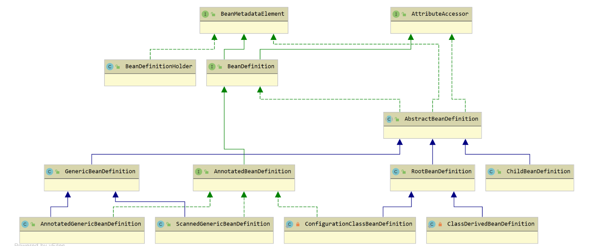

# 第13节 SpringIOC之BeanDefinition 相关类型关系

```text
RootBeanDefinition: Spring自动注册的beanDefinition
GenericBeanDefinition: Spring xml配置文件中<bean>定义的beanDefinition
ScannedGenericBeanDefinition: Spring component-scan(base-package属性)扫描出来的beanDefinition
ConfigurationClassBeanDefinition: Spring 由@Configuration配置类下的@Bean的beanDefinition
```

## 概述

我们知道Spring中Bean的配置来源很多（主要两种方式定义一个 Bean：面向资源（XML、Properties）、面向注解），
为了收集不同【配置源】，需要统一起来，所有有必要使用一个【对象存储】也就是【BeanDefinition】，
而在使用这些BeanDefinition之前，不同的BeanDefinition直接也会存在不同的依赖层级和引用关系。
遵循【单一职责、开闭原则】还需要划分增强这些BeanDefinition，最后再统一成功能增强的BeanDefinition，
就是【合并后的RootBeanDefinition】。

最后将我们的配置信息转换成【Spring Bean】，并管理着这些Bean的生命周期。

【Spring Bean的生命周期】可以看到，BeanDefinition可以说是【Bean的“前身”】，
首先进入 Bean 的元信息的配置、解析和注册阶段，然后才开始 Bean 的实例化和初始化等工作。

BeanDefinition是Spring Framework中定义 Bean的配置元信息接口，主要包含一下信息：
```text
1) Bean 的类名
2) Bean 行为配置类，如作用域、自动绑定模式（自动装配模式）、生命周期回调等
3) 其他 Bean 引用，又可称作合作者或者依赖
4) 配置设置，比如 Bean 属性
```

## 【Bean 的“前身”】
Spring中不同BeanDefinition的关系图


## 分析

BeanDefinition 继承体系结构

```text
AttributeAccessor接口：
    用于获取元数据，在实现类中通过LinkedHashMap集合保存元数据，例如通过XML的<meta />标签定义的一些元信息会保存在其中。

BeanMetadataElement接口：
    用于获取定义Bean的源对象，在实现类中通过Object对象保存，
    所谓的源对象就是定义这个Bean的资源（XML标签对象或者.class文件资源对象）。

BeanDefinition接口：定义一个Bean的元信息。

AbstractBeanDefinition抽象类：实现 BeanDefinition 接口，包含了一个 Bean 几乎所有的元信息：

GenericBeanDefinition：
    继承AbstractBeanDefinition抽象类，多了一个 parentName，表示有继承关系，是一个标准Bean元信息对象，
    通过【Spring XML文件配置使用<bean />标签】定义的Bean会解析成该对象。

AnnotatedBeanDefinition接口：
    继承BeanDefinition接口，定义注解类的元信息，
    例如通过@Component注解定义的Bean，那么注解类的元信息中会包含编译后的.class文件的所有信息。

ScannedGenericBeanDefinition：
    继承 GenericBeanDefinition，实现AnnotatedBeanDefinition接口，多了一个AnnotationMetadata注解类元信息对象，
    例如通过@Component注解定义的Bean会解析成该对象，即【@ComponentScan扫描】出来的bean定义。

AnnotatedGenericBeanDefinition：
    继承 GenericBeanDefinition，实现 AnnotatedBeanDefinition 接口，和 ScannedGenericBeanDefinition 类似，
    通过【@Import】导入的 Configuration Class配置类 会解析成该对象。

RootBeanDefinition：
    继承AbstractBeanDefinition抽象类，表示合并后的 BeanDefinition 对象。
    在Spring BeanFactory初始化Bean的前阶段，
    会根据BeanDefinition生成一个RootBeanDefinition（具有层次性则会进行合并），用于后续实例化、属性注入和初始化。
    【Spring内部机制自动注册的一些组件】通常就是RootBeanDefinition，比如BeanFactoryPostProcessor、BeanPostProcessor等。

ConfigurationClassBeanDefinition：
    私有静态类，继承RootBeanDefinition，实现了AnnotatedBeanDefinition接口，和AnnotatedGenericBeanDefinition类似，
    没有继承关系（就是没有继承GenericBeanDefinition），通过【@Bean】定义的方法会解析成该对象。

BeanDefinitionHolder： 包含 BeanDefinition、Bean 的名称以及别名（支持多个）。
```

BeanDefinition 接口的实现类主要根据 Bean 的定义方式进行区分，如下：
```text
1) XML定义Bean >>>>> GenericBeanDefinition
2) @Component以及派生注解定义 Bean >>>>> ScannedGenericBeanDefinition
3) 借助于@Import导入Bean >>>>> AnnotatedGenericBeanDefinition
4) @Bean定义的方法 >>>>> ConfigurationClassBeanDefinition
5) 在Spring BeanFactory初始化 Bean的前阶段，会根据BeanDefinition生成一个合并后的RootBeanDefinition对象
```

在解析出来 BeanDefinition 后都会转换成 BeanDefinitionHolder 对象，然后进行注册，知道为啥不直接使用BeanDefinition？
留个悬念啊下一篇会分析的

## 总结
Spring Bean 的“前身”为 BeanDefinition 对象，里面包含了 Bean 的元信息，
后续在 Bean 的生命周期中会根据BeanDefinition对象进行实例化、属性注入和初始化等工作。

BeanDefinition 接口的实现类主要根据 Bean 的定义方式进行区分，如下：
```text
1) XML 定义 Bean：GenericBeanDefinition
2) @Component 以及派生注解定义 Bean：ScannedGenericBeanDefinition
3) 借助于 @Import 导入 Bean：AnnotatedGenericBeanDefinition
4) @Bean 定义的方法：ConfigurationClassBeanDefinition 私有静态类（ConfigurationClassBeanDefinitionReader的内部类）
```

上面的 1、2、3 三种 BeanDefinition 实现类具有层次性（就是继承实现关系，来自于GenericBeanDefinition具有的功能），
在 Spring BeanFactory 初始化 Bean 的前阶段，会根据 BeanDefinition 生成一个合并后的 RootBeanDefinition 对象。
